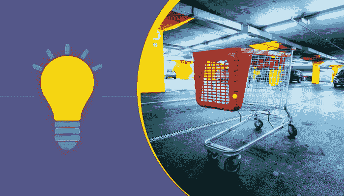

# 为什么顾客会放弃他们的购物车以及解决问题的 4 种方法

> 原文：<https://medium.com/hackernoon/why-do-customers-abandon-their-shopping-cart-and-4-ways-to-tackle-the-problem-a287d8e7c5cb>

Shopping Cart Abandonment

每个电子商务企业的噩梦——“放弃购物车”

潜在客户刚刚访问了您的网站，浏览了他们想要的类别，查看了产品页面，还有更多吗？他们还在购物车中添加了一种或多种产品。

然后，突然，顾客走了出来。

留下装满商品的购物车，没有完成订单。嗯，这是非常常见的行为。大约有 67%的网上购物者会这样做。

那么，哪里出了问题？也许你的电子商务网站有某些缺陷。因此，首要的解决方案是开发一个完美的电子商务网站。你可以通过雇佣一家[电子商务发展公司](https://www.goodfirms.co/directory/platforms/ecommerce-web-development-companies)来做到这一点，它肯定会解决你一半的苦恼。

虽然，每个顾客都是不同的，但是，总的来说，顾客的购买习惯是相似的，这就是为什么购物车放弃率如此之高。

## 那么，为什么顾客中途离开他们的购买？以下是[顾客放弃购物车](https://www.monetate.com/blog/infographic-shopping-cart-abandonment-and-tips-to-avoid-it)的三大原因:

1.  复杂导航
2.  结账过程很长
3.  缺乏行动呼吁
4.  缺乏再销售战略

虽然顾客离开还有其他几个原因，但这是三大原因。那么，如何解决这个问题呢？

这里有一些方法可以帮助你解决这个问题:

## **1。购物车和商店之间的轻松导航**

减少结账过程中的摩擦也是最难做对的事情之一。

你让消费者在购物车和商店之间移动越容易，他们逗留的可能性就越大，最终会导致他们购买和结账。

在设计结帐页面时，应用你在整个网站中使用过的相同的网络导航策略。

导航应该是这样的，客户可以更容易地保存购物车中的商品，如果他们想回来。

在结帐过程中，不要强迫用户点击后退按钮。如果你的结帐页面是这样设计的，你需要尽快改正。这就是电子商务发展的地方。

因此，在购物车和电子商务商店之间创建一个平滑的导航是降低购物车放弃率的最有效的方法。

## **2。启用客人结账选项**

当你强迫你的访问者在结帐前创建一个帐户时，它会减慢整个结帐过程。所以，不要强制用户创建一个帐户来结帐。

即使到了这一步，大多数客户还是宁愿离开或放弃他们的购物车，而不是从一开始就创建一个帐户。

但是，显然，从营销的角度来看，创建一个帐户是有益的。那么，你该如何着手呢？

你可以选择注册，但是要有一个提示，提醒用户创建账户的好处。通过这种方式，你可以满足两种类型的客户——愿意继续忠诚计划概念的客户和不愿意注册的客户。

你还可以做一件事。请客户在完成购买后创建一个帐户，列出拥有帐户的好处，如订单跟踪、服务台访问和下次购买时的折扣优惠。

## **3。在您的结账页面上加入强烈的行动号召**

行动号召按钮有一个特殊的目标——让网站访问者点击并完成转化。

但是，许多电子商务网站都有一个错误的印象，即如果客户在购物车中添加了产品，他们就不再需要在结账页面上包含行动号召。很多时候，这会导致顾客放弃购物车，转向其他东西。

然而，如果你在电子商务网站的结账页面上添加一个行动号召按钮，它实际上会促使用户完成购买，而不是中途离开。

此外，不要忘记你的主要目标是为客户提供流畅和用户友好的体验。所以，注意不要在你的结账页面上使用令人困惑和不清楚的行动号召按钮。

不要包含像“继续；或“返回”。相反，使用积极的、一致的、友好的和连接性的词语，这将有助于访问者理解并清楚地了解他们所期望的。

## **4。发送邮件提醒放弃**

如果顾客在结账时离开购物车，很有可能你有他们的电子邮件地址。不要让它白白浪费掉，好好利用它。

在他们离开后，立即通过电子邮件提醒他们。在接下来的几天里，用额外的电子邮件跟进。

发送提醒电子邮件时，附上他们留在购物车中的所有物品，以及行动号召按钮。这可能会促使客户回到您的电子商务网站并完成订单。

如果这仍然不起作用，几天后，你可以给他们发一封电子邮件，提供他们感兴趣的系列产品的折扣，以刺激销售。

有了谷歌分析，你可以轻松地缩放你的再营销电子邮件，以跟踪投资回报率。

## **尾注:**

放弃购物车是一个你无法完全摆脱的障碍。但是，这并不意味着你不应该采取任何措施来降低废弃率。即使购物车废弃率降低了很小一部分，也会大大提高你的电子商务商店的销售额。如今，许多企业正在使用人工智能来使他们的电子商务业务取得成功。

除了上面提到的所有策略之外，还有三种方法可以帮助你的生意。您可以:

1.  强调你的电子商务网站的安全性
2.  区分客户需求的优先顺序，并相应地发挥作用
3.  当用户放弃购物车时，请求用户的反馈

就像他们说的，一点点可以走很长的路！这对促进你的电子商务业务的销售也是如此。