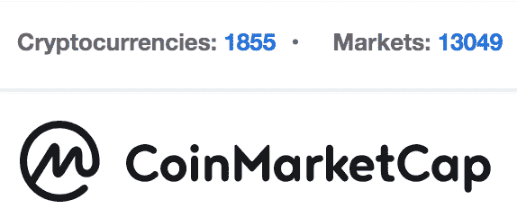
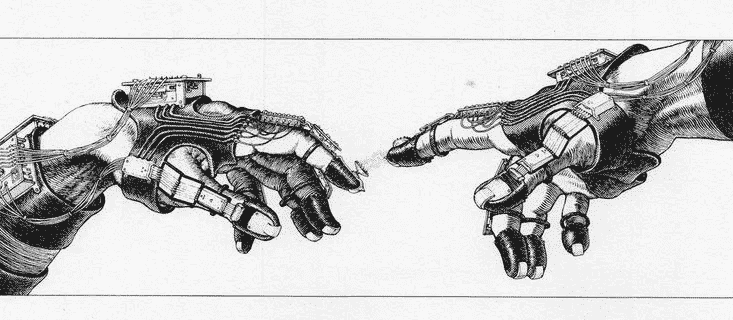

# 为什么我需要一个算法加密交易平台？

> 原文：<https://medium.com/hackernoon/why-do-i-need-an-algorithmic-crypto-trading-platform-527934581623>

# 从物理到密码。

一年多前，我获得了理论粒子物理学的博士学位，对未来没有明确的计划，但有强烈的意愿去做一些其他的事情，一些更实用的事情。在我生命的最后 4 年里，我一直在学术界周围，对他们来说，离开学术界的标准方式是安顿在一份舒适的分析工作中，朝八晚五地工作，挣一份薪水，回家睡个好觉。

虽然这一切听起来对我也很有吸引力，但我觉得自己足够年轻，可以再一次孤注一掷。所以我开始学习大量关于数据科学、自由职业、交易加密货币的课程，并最终搬到了纽约(所以生活在边缘，哇)。

在我拿到第一件东西——一张床垫——差不多一周后，在我位于曼哈顿中心的公寓里，我遇到了似乎知道该做什么的[。他有数学/计算机科学背景，我们在编码和加密货币交易方面有共同的兴趣。](/@shuvrobiswas)

虽然我们两个都有一个清晰的[理解](/@cryzen/algorithmic-trading-to-hit-cryptocurrencies-by-end-of-year-387fd4486b4e)交易的未来是算法和人工智能驱动的，但我们很快发现相关的产品和解决方案要么是部分开发，缺乏支持，要么就是市场上没有。为了解决这个问题，我们决定创建自己的交易平台。这就是[crzen](http://cryzen.com)的诞生。

那么有哪些痛点呢？有几个。

Tower 49, NYC — our main office location.

# **痛点。**

首先，有超过 500 个集中的和分散的交换，每个都有自己的 API 接口，文档质量各不相同。这意味着，每次你想在一个新的交易所部署你的机器人，你都必须手动切换设备，并找出如何连接到新交易所的 API，以下单和取消订单，查询当前价格，转移资金等。尽管有一些库试图简化这个过程，但它们只对大型交换有效。此外，不能保证交易算法所需的功能在每个交易所都能正确实现。但这还不是全部，随着大量交易所的出现，大量加密货币对可供交易。

13,049 pairs available for trading. Where will your algo perform the best?

第二，你必须选择你的算法决定所依据的标准。订单中的价格和数量都不错，但这只是原始的交易数据。加入技术指标，你会感觉到不同。此外，价格数据并不是交易算法的唯一相关输入。众所周知，加密货币市场会在多大程度上受到社交媒体的影响。在预测未来价格时，推文、谷歌趋势、reddit 帖子、加密新闻、硬币清单和 ICO 公告都非常重要。甚至可以说，新闻和社交媒体数据比其他任何东西都更能推动价格。将这些数据包含在您的输入流中是至关重要的，并且需要相当大的努力。最重要的是，分析原始文本数据需要[自然语言处理](https://hackernoon.com/sentiment-analysis-in-cryptocurrency-9abb40005d15)技能和计算能力。这是一个非常令人兴奋的话题，我计划在以后的帖子中详细阐述。

第三，你可能认为你在理论上提出了一个好的算法——但这本身并不能保证你会战胜市场——这是由市场决定的！在这种情况发生之前，您有两个选择:让您的算法实时运行，看看会发生什么，或者更好的是，检查它在历史数据上的性能。这些数据是[提供的](https://www.kaggle.com/mczielinski/bitcoin-historical-data)，但通常是 1 分钟蜡烛图水平的数据，这只是整个复杂市场生活的总结——可能不足以进行可靠的回溯测试。事实上，加密货币市场，特别是涉及替代硬币的市场，可能相当肤浅，流动性低，这意味着巨大的买卖价差，显著的价格波动和不同交易所之间最佳价格的差异。在这种情况下，下大订单会完全扭曲市场，因此，最佳价格信息对于交易机器人来说不是一个可靠的输入。不要只看到冰山一角，你应该深入订单簿，收集这些数据，并根据这些数据对你的算法进行回溯测试。虽然这听起来像是一件合理的事情，但在实践中，以超过 1 分钟的频率在足够的深度从各个市场收集订单水平的数据需要专用的服务器，大量的存储空间，对于普通的交易者来说真的很难利用。

最后但绝非最不重要的是，如今机器学习和人工智能领域正在蓬勃发展。毫无疑问，对于复杂的基于 ML 的算法来说，加密货币市场将是一个巨大的战场。虽然 Kaggle 在建立数据科学家社区方面做得很好，汇集了优秀的人才，让他们探索尖端的 ML 技术，但没有什么像这样专门针对加密空间的。这应该改变，而且会改变！

# **解决之道。**

在 Cryzen，我们仔细解决了上述所有问题，并准备在 2018 年 10 月发布我们的交易平台。敬请关注，了解更多关于算法交易和[crzen 平台](http://cryzen.com)！

**关注我们关于** [**脸书**](https://www.facebook.com/Cryzen-476609239461606/) **，** [**推特**](https://twitter.com/cryzenllc) **，** [**电报**](http://t.me/cryzen) **，** [**领英**](https://www.linkedin.com/company/cryzen/) **和** [**中**](/@cryzen) **。**

