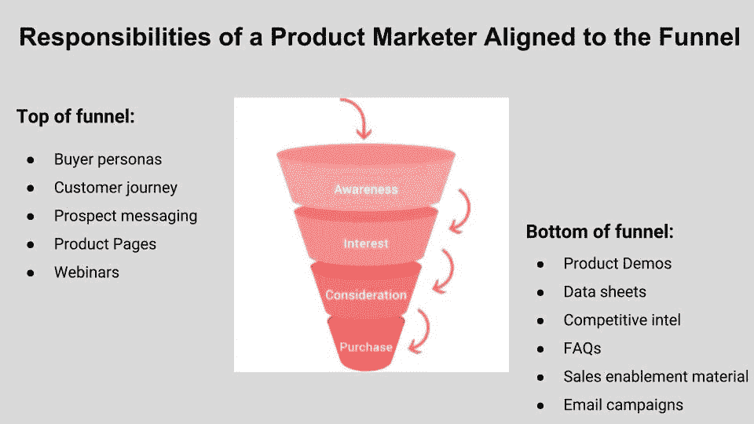
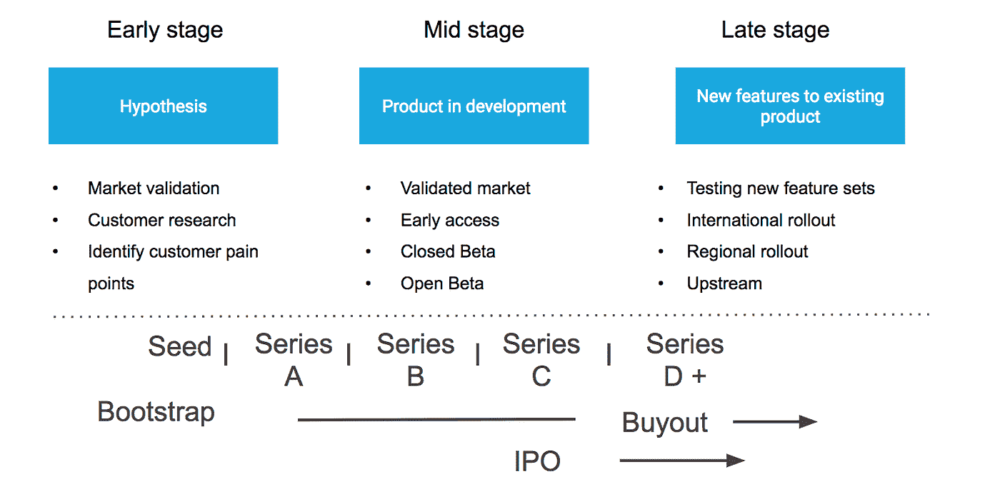
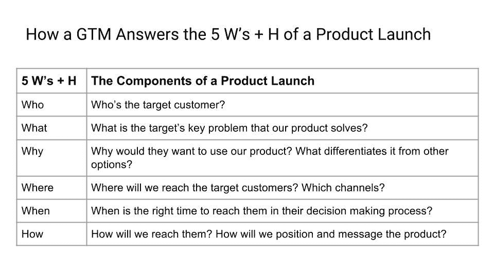
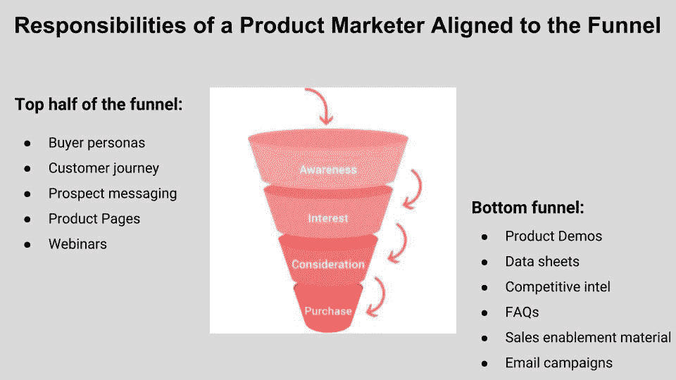

# 为什么那么多创业公司会把产品营销搞砸？

> 原文：<https://medium.com/hackernoon/why-do-so-many-startups-get-product-marketing-wrong-3197cbf690ee>

许多创业团队未能在正确的时间引入具备正确技能的产品营销人员，最终以失败的产品发布为代价。

因为产品营销是一个相对较新的角色，大多数技术公司不知道什么是产品营销，也不知道它与营销、增长营销、数字营销、品牌营销和产品管理有何不同。

出于这个原因，创始人经常会问我一些以下问题的组合:

*   产品营销人员是做什么的？
*   他们负责什么？
*   他们的目标与营销、增长和产品管理的目标有何不同？
*   我们如何知道是否以及何时需要雇佣产品营销人员？

为了解开这些问题的答案，我通常从顶部开始，目标是:

***“产品营销人员的首要目标是在正确的时间将正确的产品交付给目标客户，以确保客户采用。”***

然后，我讲述了如何分解产品营销人员的角色——他们的主要职责，这些职责如何与产品增长周期中的不同阶段保持一致，以及何时是招聘的合适时机。

在这篇文章中，我将分享我为与团队合作而开发的 3 步法，以帮助他们理解产品营销经理的角色，并从他们的产品营销工作中获得尽可能多的价值。该过程的步骤概述如下:

1.  **阐明公司的总体业务目标**、计划、产品路线图、决策结构、文化和品牌。
2.  启动新项目时要问领导的 10 个问题。
3.  **评估产品成长周期的阶段** —早期、中期或晚期。
4.  公司从事什么活动？
5.  公司处于哪一个融资阶段？
6.  **在产品营销人员关注的三个典型领域中，找出你能产生最大影响的领域**(我们将详细讨论这些领域):
7.  市场验证
8.  构建信息
9.  走向市场战略(GTM)和传递信息

然后，我将深入探讨公司在产品营销方面的问题，以及如何避免常见的陷阱。

我分享这一过程的目的是帮助团队和产品营销人员确定他们是否、何时以及如何合作，并识别可能阻止他们在正确的时间向目标客户交付正确的产品并推动客户采用的陷阱。

让我们走一遍这个过程。

# 第一步:阐明公司的总体商业目标

每当我开始开发新产品时，我都会先后退一步，然后再投入到领导团队中，回答一些指导性问题:

1.  公司更大的使命是什么？
2.  首要的商业目标是什么？
3.  为了实现这些目标，他们在下一季度和下一年将采取什么措施？
4.  从现在起 3-6-9-12 个月后，成功是什么样的？
5.  存在哪些差距可能会阻碍公司实现其目标？
6.  是否有时间、资金以及对现有产品路线图进行额外测试的开放性？
7.  我可以在运营或战略上做出哪些改变？
8.  他们希望品牌和公司如何出现在市场上？
9.  公司的核心文化是什么？是产品主导吗？营销主导？设计主导？还是受其他潜在价值体系的支配？
10.  谁是关键的决策者？

花时间关注组织的更大目标是最重要的起点。如果团队和产品营销人员不知道这些问题的答案，如果这些问题是模糊的，或者更好的是，如果领导团队认为建立或审查这些问题是浪费时间，那么每个人都会遇到很大的问题。

用约吉·贝拉的话来说，“如果你不知道你要去哪里，你会在别的地方结束。”

公司的每个团队都应该朝着一个共同的目标努力——无论是收入、用户增长、保留，还是成为行业创新者和思想领袖。

早期阶段的产品会有更多的未知，但不管处于哪个增长阶段，你都需要知道这些问题的答案，以确保你在做正确的事情。跳过这一步的风险是，你最终会变得无效，在一个筒仓里修补一些东西。这种情况经常发生。

了解现有目标和差距对于交付价值至关重要。每个项目都是不同的，每个公司和团队都选择朝着不同的目标优化，并且在他们和他们的目标之间有不同的障碍。

在现有的文化和领导结构中工作同样重要。有些公司是“产品主导型”，比如脸书，有些是“营销主导型”，比如苹果，还有一些是“设计主导型”，比如 Airbnb。了解不同公司如何决策的潜规则，以及哪些高管是关键决策者，在制定和执行战略上市计划时至关重要。

一旦我对这些更高层次的公司问题的答案有了一个清晰的了解，我就有了一个基础来进入下一步，确定产品在其成长周期中的位置。

# 第二步:评估产品成长周期的阶段

当我制定与新公司或新产品合作的策略时，我问的下一个问题是:

*公司或产品处于哪个成长阶段，如何与其产品生命周期保持一致？*

一个产品营销经理的工作范围和重点很大程度上取决于公司或产品的成长阶段，而成长阶段与产品开发生命周期高度相关。

为了帮助我确定产品处于哪个增长阶段，我将产品增长周期分为三个阶段——早期、中期和晚期——并确定了团队通常在每个阶段参与的活动。团队试图解决的问题类型，以及他们为解决这些问题而采取的措施，会告诉你很多你需要知道的事情，以确定成长阶段。此外，融资阶段通常(但不总是)是评估产品在成长阶段框架中所处位置的有用指标。

**产品营销人员的产品增长周期**

当我开始开发一个新产品时，我使用上图的框架来确定它的阶段。尽早打这个电话让我能够准确地确定我可以在哪里对总体目标产生最大的影响。

例如，我最近开始为一家处于种子到系列 A 阶段的公司工作，我花了大部分时间专注于客户研究，并与工程团队合作，以确定在进入测试程序之前要构建的正确的 MVP。

# 第三步:发现你能产生最大影响的地方

在深入了解公司的目标和领导文化，并评估产品在其增长周期中的位置后，我的下一步是定义一个假设，即我可以在哪里对确保客户采用的目标产生最大影响。这个假设帮助我决定做什么和把我的努力集中在哪里。

为了简化这个过程，我将产品营销经理的主要活动分成了三个部分:

1.  市场验证
2.  构建信息
3.  GTM &在发布前后传递信息

让我们分别深入每个领域，更清楚地了解产品营销人员的日常工作，以及它与营销、增长和产品管理的不同之处。

# 市场验证

在市场验证阶段，产品营销人员与跨职能团队合作进行客户研究和测试。他们通常还会进行市场调查，以了解竞争格局和定价考虑。

在客户研究方面，他们与各种团队合作，创建一个主要问题列表，从客户那里收集业务、运营和技术见解。产品团队通常关注技术或产品需求，业务开发和销售团队关注业务问题，用户体验团队关注可用性。

这些不同的跨职能团队专注于市场研究过程中非常不同的部分，产品营销人员的工作是集中输入信息，并使它们与公司更大的业务目标保持一致。他们也有责任汇集客户研究过程的所有组成部分，并向公司提出见解。

通过撰写和讲述故事，产品营销人员分享了领导层做出明智的战略决策所需的背景，从而平衡客户需求和企业需求。

# 构建信息

在客户和市场调查完成后，产品营销经理将在调查过程中获得的知识和见解转化为定位文档。他们与跨职能团队和领导层分享本文档，目的是:

1.  建立认同
2.  为所有团队提供一份主文档，用于创建产品资产，以确保品牌和信息的一致性。

此外，在这一阶段，产品营销人员与许多跨职能团队密切合作，如法律、财务和品牌，以减轻在构建信息、推出和包装产品时的潜在法律风险。

# GTM &在发布前后传递信息

产品营销人员最重要的角色之一是创建一个走向市场(GTM)计划。GTM 是一个蓝图或路线图，说明了公司如何将产品推向市场、建立竞争优势、产生市场需求以及确保客户采用的所有输入。它回答了产品发布的对象、内容、地点、时间、原因和方式。

产品营销人员“负责”整个运营、业务和产品路线图。他们确保创建正确的资产，从营销内容到销售宣传材料，并确保有关产品的所有内部和外部沟通都是战略性的和及时的，以实现成功的发布。

一旦产品推出，新的潜在客户会考虑该产品，客户会使用它，产品营销人员必须从里到外分析漏斗的表现。他们需要研究购买流程的每一步，弄清楚顾客在哪里、什么时候以及为什么离开或离开。一旦他们了解漏斗中的缺口，他们就可以优化交付客户停滞或离开的资产。

下面是一些产品发布前和发布后的工作，通常由产品营销人员完成，同时与创意和收购营销团队以及产品经理密切合作。

产品营销人员拥有整个漏斗，并负责创建一整套资产，推动客户通过漏斗进行购买。在漏斗顶端，他们参与的活动侧重于产生品牌和产品认知度的需求挖掘，例如创建买家角色、产品页面、网络研讨会和其他资产。在漏斗的底部，他们致力于提供更详细的产品说明以推动客户转化和购买的资产和活动，如产品演示、销售支持材料、电子邮件活动等。

例如，如果客户在转换阶段陷入困境，一个好的产品营销人员会加倍努力生产合适的材料来缓解转换。在一次特定的产品发布会上，我们看到当潜在客户了解到产品的好处时，他们开始对产品感兴趣。问题是他们陷入了设置和销售支持阶段。

为了解决这个问题，我们与产品团队合作，通过应用内用户体验的改变来改善购买流程，随后是产品演示，引导潜在客户完成设置过程。

一般来说，当产品营销人员致力于改善漏斗时，他们采用的所有战略和战术都应该与更大的公司战略保持一致，并为公司的目标服务。这种与公司目标结果的一致性促进了整个公司的认同。

在一个理想的世界里，产品营销人员被授权将这三个阶段的活动结合在一起，形成一个完整的三步产品营销之旅，包括市场调研和验证、定位和框架，以及最终的 GTM 执行。允许他们完整地开始这个 3 步之旅，增加了团队成功构建和发布正确的产品和功能并推动采用的可能性。

事实上，这是公司在产品营销方面最常出错的地方——在产品开发的开始阶段，他们没有足够早地考虑并实施产品营销。

# 来自当今顶尖从业者的成长经验

# 公司在产品营销中犯的最大错误

当出现以下一种或多种情况时，大多数公司会在错误的时间被动地雇佣产品营销人员:

*   产品发布失败
*   初始产品成功停滞不前
*   他们的产品变得更加复杂
*   他们的客户群是新的或者在变化
*   市场条件在变化
*   竞争者超越他们的产品

他们让新雇佣的产品营销人员去做定位、框架和 GTM，却不让他们从了解客户开始，这让事情变得更糟。

这是有问题的。推动成功上市的基础是深入了解客户——这发生在定位、框架和 GTM 之前。在游戏后期引入产品营销人员，跳过研究阶段，会让产品营销人员、团队的其他成员和产品面临失败。

通常，在产品开发过程中，产品经理或业务开发合作伙伴会与客户保持同步。但这不足以深入了解客户。

这些团队成员通常对理解问题感兴趣，因为这与他们自己的角色和职责有关，并且不会超出他们的直接领域来开发或交流对客户需求和心理的更深入、全面的见解。更糟糕的是，他们把收到的大部分顾客反馈储存在自己的脑子里。

产品营销人员与产品经理、成长型营销人员、业务开发人员、业务运营人员和其他合作伙伴密切合作，具体取决于公司。因为产品营销人员的主要职责是在正确的时间将正确的产品交付给目标客户，所以与许多其他团队的跨职能协作对于构建最佳产品路线图和功能集至关重要。

虽然一些团队拥有特定主题的大部分信息，但产品营销人员有责任理解关键主题，构建产品发布的故事，将其传达给广泛而多样的职能受众，并获得领导的认可。

一个有效的产品营销人员将理解这些跨职能的依赖关系，识别客户未知因素，进行研究，记录学习成果，并创建一个与产品、业务和运营职能相协调的 GTM 战略。同样重要的是，他们将带头向领导层和其他利益相关者传达战略。

产品营销人员工作的这一部分非常重要，因为除非整个公司团结起来支持产品的发布，否则不可能发布和服务产品。这种跨职能的协作和认同需要时间来建立，并且需要在产品开发过程的早期就开始。

# 雇佣产品营销人员的恰当时机

根据我推出多个产品的经验， ***招聘产品营销人员的最佳时机是公司刚招聘完产品经理的时候。***

因为产品营销是产品管理的延伸，关注于产品的市场采用，当产品营销人员能够与他们的产品经理紧密合作时，他们是成功的最佳准备。在产品开发路线图的早期阶段引入产品营销人员，使公司在客户采用方面具有战略性和主动性，而不是被动反应。

积极主动需要从第一天起就将增长和客户采用融入产品的 DNA 中，而不是试图在以后将其固定下来。雇佣一名产品营销人员来帮助弥合营销、增长和产品之间的差距，将有意义地增加任何团队在推出新产品时的成功机会。

*   原始文章于 2018 年 1 月 3 日发布在 Reforge 上

## 如果你真的对走向市场感兴趣，**我最近创建了两个新的在线课程:“** [**什么是产品营销**](https://bit.ly/2MKCFR5) **”和“** [**推出你的产品。走向市场的基本课程**](https://product-marketing-go-to-market.teachable.com/p/launch-your-product-the-essential-go-to-market-course/?preview=logged_out) **”。**

## 和我的书“[产品营销拆穿。亚马逊上有重要的上市指南"](https://www.amazon.com/dp/1718968124/ref=sr_1_44?ie=UTF8&qid=1535685326&sr=8-44&keywords=product+marketing)！

## 我最新的一本书， [***【发布:产品营销者指南***](https://amzn.to/38h8ufz)***——成功发布的 50 个关键问题和教训*** 现在已经在亚马逊上可以买到了。

