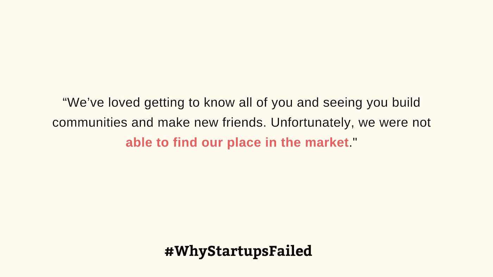
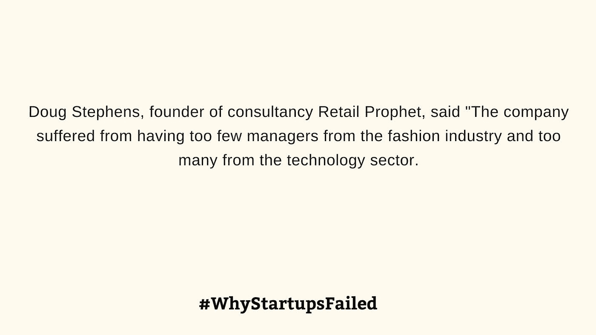
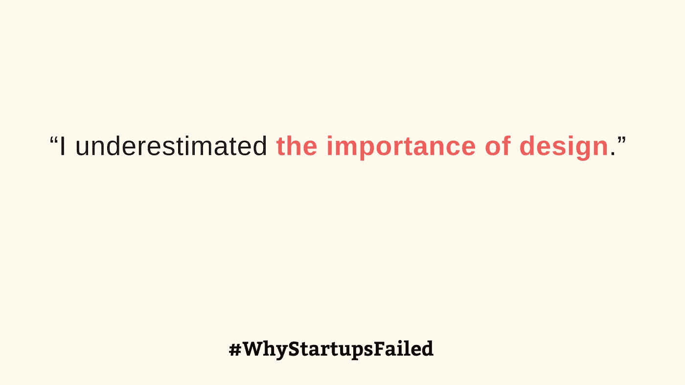

# 创业公司为什么会失败？对 256 家失败创业公司的剖析。

> 原文：<https://medium.com/hackernoon/why-do-startups-fail-a-postmortem-of-256-failed-startups-fb157a16d98b>

This morbid image has been taken from [https://unsplash.com/photos/Jv0TBnjzYNM](https://unsplash.com/photos/Jv0TBnjzYNM)

2006 年，创业大师保罗·格拉厄姆写了一篇名为[杀死创业公司的 18 个错误](http://paulgraham.com/startupmistakes.html)的文章。但这篇文章发表于 12 年前。

如今的创业公司面临的挑战是什么？由于[我们热爱初创公司](https://www.dreamtoipo.com)并与初创公司合作，我们希望找出真相。

我们坐在 [CBI Insights 发布的关于创业失败](https://www.cbinsights.com/research/startup-failure-post-mortem/)的大规模数据库前，试图找出他们失败的背后是否有任何模式。

# **理解数据**

经历 253 家初创公司的失败是一次令人心痛的经历。我们挖掘得越多，就会发现他们遇到的 5 个常见挑战。

*   财务挑战
*   产品与市场的匹配
*   增长挑战
*   监管问题
*   内部团队问题

> 那么，最大的障碍是什么？这里有一个图表来了解趋势…

让我们深入每个类别，以便有更多的了解。

# **财务挑战:**

初创企业的预算约束一直存在，并将继续存在。即使在风投和众多投资公司的时代，融资也是一个主要障碍。

CBI Insights 报告涵盖了 2014 年至 2018 年的创业公司死亡案例。屈服于现金挑战的初创公司要么前途无量，要么拥有好产品，但在金融挑战面前未能成长。

认识一下 DopplerLabs，他的目标是让计算变得更加身临其境和人性化。该公司专注于“听觉”，即用于耳朵的可穿戴技术。一家拥有可穿戴技术的有前途的初创公司，但由于现金短缺而未能兑现。以下是他们的致谢-

如果你愿意，你可以在这里阅读他们的整个故事。

尽管有一个好的产品，一个忠实的用户基础，突然停止启动操作是非常痛苦的。

看看那些不得不停止的社交电台吧，尽管他们将 Twitter 流转化为人性化音频体验的努力拥有很好的客户基础。

这就是他们所描述的，

BriefMe 面临着同样的挑战。他们有很好的用户基础，但不得不突然停止运营。

初创公司不仅需要资金来制造或维护他们的产品，而且在大多数情况下，他们需要资金来超越和取代他们的竞争对手，如亚马逊、谷歌、脸书等老牌机构和其他科技巨头。

在我们的事后分析中，我们发现许多初创公司在面临来自谷歌、脸书和其他公司的严峻挑战时无法成长。

# ***巴罗:***

# ***VidMe:***

**

*创业融资从来都不容易。但所有这些失败都凸显了创业世界的竞争有多激烈。*

# ***产品市场契合度***

*对于所有创业公司来说，为一个令人兴奋的新产品寻找潜在市场仍然是一个很大的难题。*

> *难怪， **42%的初创公司因无法为他们的产品创造需求而不得不关门大吉。多年来(从 2014 年到 2018 年)，产品市场一次又一次地迫使创业公司关闭商店。***

*让我们了解一下他们遇到了哪些具体的产品问题-*

## ***了解真正的需求:***

*IntroNet 开始通过其 Connector 产品在网络和 Gmail 上支持数字介绍。但是他们没能好好上一堂关于产品市场适应性的课-*

**

## ***没有更多的相关性:***

*饱受产品市场不适应之苦的创业公司也面临着无法跟上当前趋势的挑战。*

*了解 Raptr，这是一项电脑游戏服务，旨在优化电脑游戏性能，同时保持高质量和系统效率。*

**

## ***对顾客期望过高:***

*这是一项有趣的研究。一些失败的创业公司认为他们的产品太超前了。他们不得不关闭**，因为他们的目标受众还没有准备好适应新技术。***

*Imzy 就是这样一家初创公司，它为健康社区提供了一个平台，在这个平台上，其成员不会受到骚扰和虐待。是不是太超前了？以下是他们的实现-*

**

*Mobeam 也面临类似的挑战。Mobeam 在销售点(POS)提供通用接入，支持零售商传输优惠券、礼品卡、门票和其他条形码数据。*

*他们意识到-*

**

## ***寻求可持续的商业模式:***

> *一些产品也失败了，因为他们找不到一个可行的商业模式来继续他们的业务。*

*了解 GoZoomo，这是一个位于班加罗尔的技术二手车市场，是二手车点对点交易的先驱，提供便捷的体验。*

*他们以一份诚实的声明结束-*

**

*画布网也尝到了创业失败的苦涩。他们向用户提供分享和播放图片，探索其他用户创造的新内容，投票选择最喜欢的，以及用浏览器内的编辑器制作图片混音。*

*他们的认识令人大开眼界-*

**

*Coinprism 是另一个受害者，他开始提供世界上第一个彩色硬币网络钱包。在他们的声明中，他们揭示了为什么一个新的创业公司如此难以蓬勃发展-*

**

## ***顾客才是王道:***

*在如此多的产品-市场匹配难题中，我们从研究中获得了一个重大启示。*

> *了解受众是找到产品市场契合度的巨大突破。*

*沃特泰德遇到了同样的挑战。他们开发了一款关注政治的社交媒体监测和分析应用。认识到他们的失败，他们说-*

**

## ***你的产品有需求吗？***

*对于一项新技术，客户不知道他们会玩什么。他们甚至不知道这个产品对他们有没有帮助。这导致了使用该产品的惰性。我们从研究中了解到，创造对产品的需求是关键。*

*Kitchensurfing 面临挑战。他们主动让饭菜从创意到餐桌变得简单。一个有希望的想法没能在市场上创造足够的需求。*

**

## ***如何找到“产品市场契合度”？***

*现在的问题是什么可以帮助你提出可行的“产品-市场匹配”。*

*我们从研究中了解到，除了“了解你的受众”，别无选择*

*送货初创公司 PepperTap 强调了进行广泛研究以实现“产品市场适应性”的必要性。总部位于印度的以移动为中心的超本地杂货配送服务 PepperTap 承诺提供快速的按需杂货产品上门服务。*

*但是他们失败了，因为他们经常遇到新的挑战。让我们听听他们的意见-*

**

## ***古老的先有鸡还是先有蛋的问题:***

*每个市场初创公司都必须在更早的时候经历这个难题，我们的研究再次强调，这个问题对于市场初创公司来说仍然是显而易见的。*

*这是其中的一些-*

***为什么拥有它:**为什么拥有它使用户能够从朋友和邻居那里借用产品。*

**

*App.net 是另一个受害者。它的开发是为了让用户能够访问社交应用网络。App.net 提供了构建社交应用的基础设施。如果不能解决“鸡和蛋的问题”。*

**

*一个拥有网站和移动应用程序的在线交易平台也面临同样的问题。*

**

# ***增长挑战***

> *有很多初创公司破解了产品与市场匹配的难题，并取得了一些初步进展。尽管如此，他们还是不得不结束自己的运营，面对增长挑战或追求增长。*

*我们将从 Shyp 开始，这是一家送货初创公司，旨在减轻消费者和小企业运送日常物品的压力。*

**

*Markafoni 也因未能扩大规模而关闭。Markafoni 是土耳其消费者的网上购物目的地，专营服装和时尚配饰，但却无法发展业务。在他们的声明中，他们强调增长挑战是头号障碍*

**

*由于增长缓慢，媒体创业公司 prism 也不得不关门大吉。*

**

*随着我们继续深入调查，我们发现了更多类似的供词。*

## ***比特币初创公司 braw ker***

**

## ***加密货币技术提供商 Melotic***

**

*对于创业公司来说，增长是一个很大的 KPI。如果没有增长，获得可靠的资金是一项艰巨的任务。*

*肆意满足。作为一个在线礼物赠送服务，Wantful 为用户提供了一套基于场合的礼物。他们手头有一个很好的产品，也有很大的吸引力。但是增长并不存在-*

**

> *许多初创公司认为，如果他们在关注“产品”或技术的同时关注增长，他们将是可持续的。*

*Everpix 就是这样一家初创公司，他们未能按照自己的期望扩大规模。Everpix 提供了一个云解决方案来上传、组织和管理照片。*

**

> ***营销之痛***

*许多创业公司已经认识到营销是他们成长失败背后的核心挑战之一。*

*旅游创业公司 Travelllll.com 感受到了痛苦，他们指责缺乏营销是他们关闭的原因。*

**

> ***监管挑战***

*所有颠覆性创业公司的新威胁。*

*这是像加密货币这样的新时代创业公司面临的主要挑战之一。*

*让我们更多地了解他们-*

***Coinprism，全球首款彩色硬币网络钱包**。彩色硬币允许人们和组织安全地发行和交易现实世界的资产，如商品、股票和债券。比特币网络面临同样的问题不得不关闭。*

**

*BTCJam 是另一家面临强大监管挑战的初创公司。全球点对点比特币借贷平台-*

**

*最近，许多创业公司面临监管挑战，决定关闭。*

> *Guvera(一家音乐初创公司)、Loyal3(一个网络和社交媒体平台)、LoanBase (BitLending Club)、Bitphone(一种加密的、接受比特币的在线视频通话服务)面临监管问题不得不关闭。*

*Scarf 是一家初创公司，提供熟练的家庭厨师，将他们的厨房变成收入来源，同时增加健康实惠的当地饭菜的可用性。*

**

# ***内部团队问题***

*创业团队总是一个神话，一个值得阅读和记忆的好故事。但大多数初创公司没有 Airbnb 或苹果那样的命运，他们经常难以找到或建立良好的团队来继续他们的旅程。*

*Shoes.com 技术公司面临着同样的问题。Shoes.com 为每个加拿大人带来了最好的选择和客户服务，从优质品牌到加拿大任何地方的免费快递。但由于找不到合适的团队，他们不得不关门-*

**

*总部位于俄罗斯的电子商务平台 Wikimart 整合了支付和履行功能，其倒闭背后有一个悲惨的故事。*

**

*SideCar 是另一家面临严峻挑战的创业公司，他们需要培养一个好的团队来形成他们的想法。SideCar 是一家服务于按需经济的交付和物流公司。经过调查，SideCar 提出了一份报告*

**

# ***更多外卖***

*除了所有给出的原因，我们还发现了其他一些挑战，它们在改变初创公司的命运方面发挥着至关重要的作用。*

# ***UI-UX 掌握着成功的钥匙:***

*在当今拥挤的市场中，UI-UX 是决定者。没有好的用户界面的产品——UX 没有生命和机会。我们已经找到了承认这个事实的创业公司。*

*College Inside View 以巨大的雄心开始，帮助人们通过申请找到最好的大学。当他们失败时，创始人强调-*

**

*ComboCats Studio 是另一家创业公司，他们意识到必须让他们的 UI-UX 更好。创始人坦承-*

**

# ***社交媒体创业公司死了！***

*这是一个很大的启示。许多新的社交媒体创业公司试图成为脸书、Instagram 和 Twitter，但都悲惨地失败了。**以色列音乐科技初创公司 Serendip** 就是其中之一。Serendip 从用户在脸书和 Twitter 上的朋友那里获取音乐推荐，创建可以定制的播放列表。*

# ***分析创业是新趋势***

*在社交媒体初创公司的废墟上，分析初创公司正在崛起。但是，并不是每个人都欣然接受这种成功。谁能破解“产品市场”的契合，谁就成功了。*

*我们已经提到了 VoterTide，这是一款专注于政治的社交媒体监测和分析应用程序。但他们未能了解客户的脉搏，也无法提供他们想要的东西。*

**

*尽管失败了，围绕“数字营销分析”和“社交媒体分析”的产品创意不断涌现的创业公司在这里制造喧嚣。*

# ***对加密货币初创公司来说很艰难:***

*区块链、加密货币和比特币可能已经成为头条新闻，但都是依靠加密货币取得成功的初创公司。*

*我们有很多初创公司，即使推出了流行产品，也难以继续发展。他们面临两个主要问题-*

1.  *监管挑战*
2.  *产品与市场的匹配*

*他们的供词很少在下面给出-*

> ****“监管机构开始关注(加密货币)领域，以及围绕区块链资产(代币交易所、ICO 工具和服务等)的活动。)可能会在未来 5 年内受到严格监管。这意味着这些服务中的一些将不得不关闭或限制其活动，一些可能会进监狱，只有少数资本充足的公司将成功适应监管机构的要求。”****
> 
> *然而，关于消费者支付采用比特币的问题，Dunworth 表示，“我们在这方面下了赌注，但没有成功。*

# ***我们的理解***

*创业公司获得成功从来都不容易。*

*在科技巨头的大规模竞争和新兴竞争面前，新创公司赢得观众和统治市场变得越来越难。*

*从我们的研究中，我们了解到创业公司的世界里有大量的想法，但是由于产品市场匹配和财务挑战等原因，他们无法破解整个创业游戏。*

# *你对创业失败有什么看法？我们很想知道你的意见。与我们分享您的评论和见解。*

## *感谢 CBI Insights 对创业失败的广泛研究。没有他们的工作，我们就无法深入研究这么多创业失败案例，并写出我们的报告。*

> *我们已经与初创公司合作了十多年，这是一次很好的经历，让我们的理解变得更好、更丰富。*
> 
> *你可以在这里了解更多关于我们和我们与创业公司合作的经验[。](https://www.dreamtoipo.com/)*