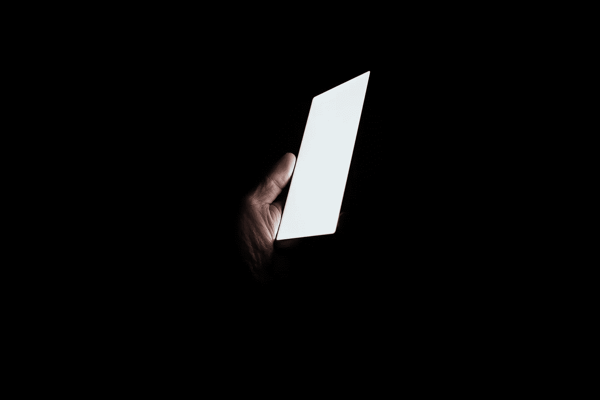
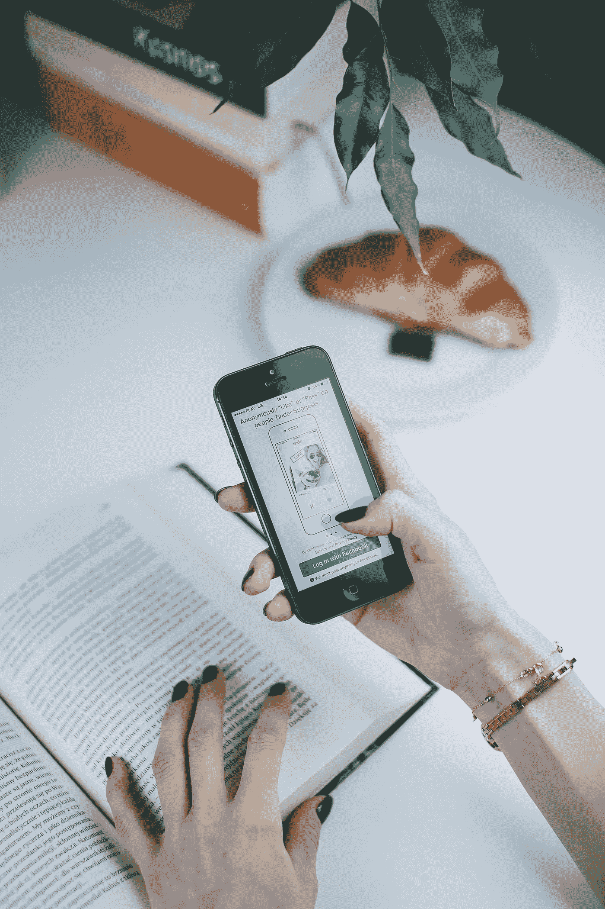
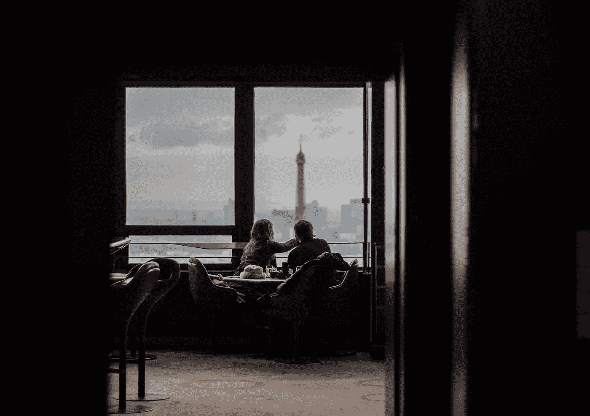

# 为什么我们实际上讨厌 Tinder？

> 原文：<https://medium.com/hackernoon/why-do-we-actually-hate-tinder-7df67485b812>

Photo by Andrew Guan on Unsplash

我们喜欢恨火绒。这是一个许多人试图避免的应用程序，在孤独的时候下载，然后很快就厌恶地删除。我们质疑为什么我们首先使用这些应用程序，为什么我们似乎不能亲自连接。但是我们有没有充分质疑我们为什么讨厌它？

几个月前，我和我的室友都坐在我们的客厅里。其中一个人已经有一段时间没有约会了，打算下载 Tinder 和千禧一代使用的一套[约会](https://hackernoon.com/tagged/dating)应用程序。我支持她的决定，但她和我的另一个室友都支支吾吾。

“我只是讨厌约会应用。”

“他们是如此多的小兵。”

“我只是希望能在现实生活中遇到人。”

这些是我记得听到的主题，不仅仅是在这次谈话中。这些主题每天都在我们许多寻找伴侣的人中出现。我们中的很多人都对约会的现状感到失望和沮丧。

Photo by freestocks.org on Unsplash

作为一名同性恋，我觉得这种幻灭感很迷人。我第一次下载 Tinder 是在我 20 岁的时候，当时我和我的朋友从阿拉巴马州的海湾海岸春假旅行开车回家。我立刻感到一阵兴奋。我就读于德克萨斯州的一所小型文科学校，所以我的选择很少。Tinder 为一种可能性打开了大门，我曾认为这种可能性只存在于我的直男朋友中。

对于 LGBTQ 社区的人来说，像 Tinder 这样的应用程序帮助我们克服了对判断某人的性取向的恐惧。当异性恋群体由于害怕被拒绝而避免在公共场合接近人们时，LGBTQ 由于害怕被拒绝和害怕受到伤害而避免在公共场合接近人们。Tinder 让我们能够在降低风险的同时保持联系。

尽管有这种能力，Tinder 和这些其他应用程序也开始让我恼火。他们的吸引力已经减弱。就像我的许多朋友和同龄人一样，他们的使用更频繁地导致空虚而不是满足。

基于这种日益增长的不满，我的室友们对 Tinder 的抱怨引起了我的共鸣。然而，我不同意质疑我们为什么使用 Tinder，也不同意哀叹面对面介绍的减少——可能是因为我自己对这些互动的期望很低。我发现我自己的不满更重要，值得调查。

我不相信 Tinder 和这些其他约会应用程序有什么固有的问题。如果有的话，它让越来越多的人联系起来。我的室友，质疑下载这些 app 的那个，目前正在和某 app 的人约会。我见过很多来自 Tinder 的美好，但是痛苦和空虚来自于高频率的拒绝。

通过屏幕互动降低了发起对话的门槛。这让每个人在与他们不敢当面交谈的人交流时都更加自在。人们变得更加大胆，开始建立更多的联系。

不幸的是，通过屏幕互动并不能同样降低被拒绝的痛苦。

在一个由社交媒体主导的世界里，我们都向世界展示最好的自己，Tinder 感觉就像是对你形象的一次公投。

不满就在这里。不管是面对面还是通过屏幕，拒绝都会让人感到刺痛。这让我们质疑自己的价值和自我价值。像 Tinder 这样的应用程序让我们更愿意发起一场对话，随着拒绝的累积，我们越来越深地陷入不满。

我们如何扭转这种颓势？简单来说:自爱。说起来容易做起来难，但是消除你对外部确认的需求将会有很大的不同。

所以下次你浏览 Tinder 的时候:

人不匹配回来？

谁在乎呢！

那个人对你有趣的搭讪没有反应？

*他们的损失！*

他们对你的草率拒绝毫无意义。你很有价值。你很可爱。你值得。

Photo by Alban Martel on Unsplash