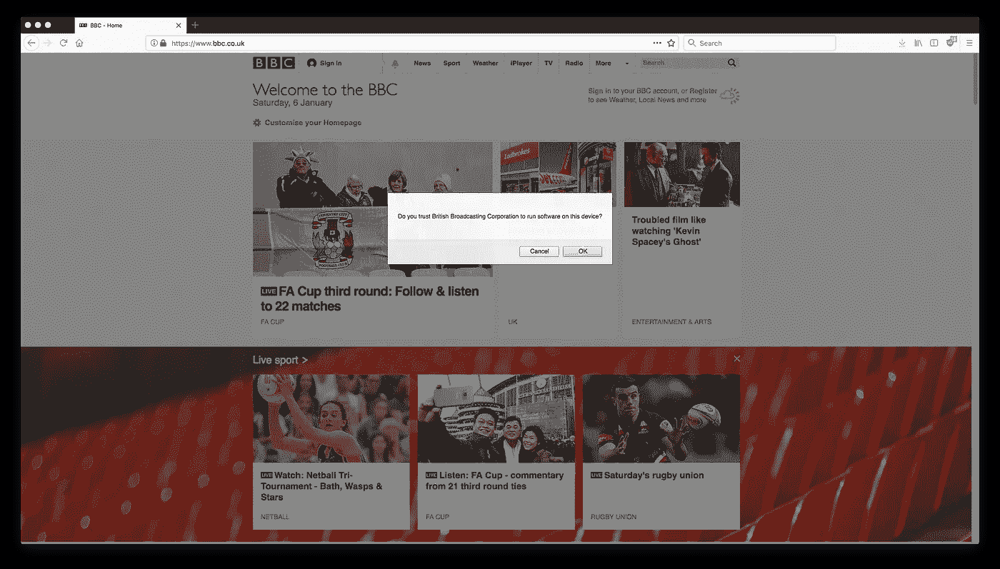

# 为什么我们运行不可信的代码，我们如何停止？

> 原文：<https://medium.com/hackernoon/why-do-we-run-un-trusted-code-and-how-do-we-stop-c0201cc48b44>

这最初是作为一个 Twitter 帖子开始的，受到了我的追随者的强烈质疑，但它可能值得更详细的探索。

在这篇博文中，我概述了一种适用于 web 的代码签名方法。它旨在解决当前 web 安全模型的问题，当前的 web 安全模型主要依赖于沙箱，随着 web 发展成为一个更丰富的平台，它在构建丰富的应用程序所必需的强大 API 和潜在的互联网敌对环境之间找到了一个艰难的平衡。在确定可行的解决方案之前，建议的方法存在一些问题，需要进一步完善。

在计算的早期，安全性是通过物理手段来实现的。你必须在一台真实的机器前，它的全部都是为你所用的。一个人使用一台机器很快就变成了浪费，多用户大型机通过限制一个程序对另一个程序的访问以及一个用户对另一个用户的数据的访问来加强安全性。远离这一点，第一台个人电脑是多任务的，但是是单用户的，信任再一次成为热门话题，通过取消安全检查来提供足够的性能。最终，这两个世界合并了，但是由于安全性从来都不是完美的，并且计算机是复杂的，特权升级和其他沙盒转义类型的攻击是现代计算世界永远存在的一部分。因此，我们开发了计算的深度防御方法，以最大限度地减少影响安全的错误的不可避免的影响，对于许多环境来说，恢复信任是另一个(不完美的)安全层，因为当沙盒破坏错误发生时，它会最大限度地减少向攻击者开放的表面积。

沙盒肯定是个好东西，但是它不能保护所有的问题。有时候，一个应用程序可能想做一些技术上允许的事情，但随后对运行它的用户表现出不道德的行为，这是沙盒无法判断的。以 Wannacry 为例。在你的机器上运行的一个程序在技术上应该能够操纵你的文件，尽管它依赖于一个安全缺陷来安装，它也可以通过社交工程进入，然后像任何其他程序一样运行。如果用户被诱骗安装了 Wannacry，那么沙盒就没有任何用处。我们也需要信任。

在台式计算机上，信任被留给了用户，通常有某种反病毒软件在他们身后监视，希望阻止任何不应该被信任的软件溜进来。在移动设备上，信任通常被完全委托给一个安装源，该安装源的维护者应该确保他们提供给你的应用程序是安全的(Linux 发行版也是如此)。台式机也采用这种策略，要求运行的代码必须由可信的开发人员签名，破坏这种信任的开发人员将被撤销信任。

网络上的信任类似于那些移动设备。我们相信我们正在访问的域名会遵守道德规范，一些人会用广告拦截软件强制执行，这些软件越来越多地扮演广告拦截和反恶意软件的混合角色，几乎成为迷你反病毒软件。这两者的关键区别在于，它涉及到信任更多的人。当你从 App Store 安装应用程序时，你相信苹果信任提交到 App Store 的人(苹果当然会验证这一点，作为他们审查过程的一部分)，但在网络上，你不仅要相信你访问的每个域名的所有者，还要相信他们已经适当地审查了他们用来制作网站的每个其他网络服务的信任度(如果该子服务由其他服务组成，那么它是完全信任的……)。这是一个更高的要求，当这种信任下降时(这种情况经常发生，主要围绕广告、行为跟踪、隐私，甚至比特币挖掘)，用户往往无从知晓，这意味着网络服务对用户的行为产生了一系列潜在的道德问题。

那么，如果我们有某种方式来签署 JavaScript，就像我们签署本地应用程序一样，会发生什么呢？如果我们有办法信任一些签名，但不信任其他的，会发生什么？一种幼稚的方法可能是为需要在网站上执行的每一个签名的代码点弹出一个窗口。

A sample popup on bbc.co.uk

但是，期望所有的 JavaScript 都被签名是不可能的。为什么有人会让任何广告运行，或者必须点击“确定”才能让简单的“DHTML”式的东西工作，这可能会完全破坏用户的网络体验。因此，未签名的代码可以访问一组有限的 JavaScript 功能(可能只是 DOM 访问，而不能访问任何允许访问传感器数据的 API，甚至任何导致[网络](https://hackernoon.com/tagged/network)访问的东西)。也许默认情况下，允许使用与你访问的域名相同的证书来签署代码，但是任何第三方代码都必须经过授权。当然，第三方代码可以捆绑到一个包中，或者由原始域签名，绕过用户对接受它的控制，也使广告拦截器更难工作，但理想情况下，开发人员应该在同意用他们的签名签名之前给第三方代码更多的审查。

## 有哪些问题？

*   **它打破了开放网络吗？**必须有人颁发证书，这样你才能相信他们声称签名的身份(我们之前已经看到过[电动车证书的问题](https://stripe.ian.sh/)
*   **它的实施会带来巨大的破坏性吗？**是的，要实现这一点，还需要大量的工程工作。
*   **用户不就是什么都点是，就让所有的烂代码运行吗？**是的，我们知道用户会用证书警告这样做。要使这个想法可行，UX 需要应对一些严峻的挑战。
*   **这个想法还没落地就死了吗？**不知道。我认为我们可以迭代解决问题，更好地探索问题空间，并建立一个更好的网络。但是这个想法确实需要改进。

让这项工作成功并不容易，但是如果它真的成功了，它会帮助我们建立一个更好的网络。我完全相信网络作为一个平台的力量。请建设性地批评这个想法，看看我们是否能使它可行。