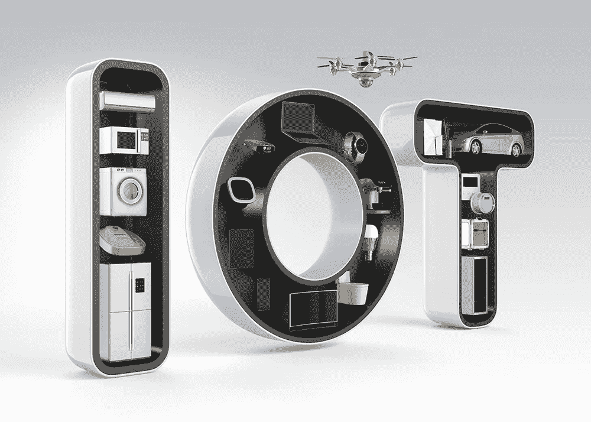

# 为什么咖啡机需要自己的账号？

> 原文：<https://medium.com/hackernoon/why-does-a-coffee-machine-need-its-own-account-be70a760a5f>

一个关于智能咖啡机被勒索软件用来污染欧洲一家石化工厂的计算机网络的故事去年登上了头条新闻。然而，这一事件并非独一无二。我们正在目睹黑客攻击的增加，涉及城市、企业和办公室中使用的家用电器、机器人设备、无人机和其他物联网实体。一些已知的事情失控的例子包括:

清洁机器人打开开关，爬到厨房的电炉上，推开一个烹饪锅，烧着了自己，差点让公寓着火。

安保机器人淹死在办公室喷泉里。

机器人割草机逃离了它的“工作场所”，并在途中切断了一根燃料软管。

机器人外科医生在手术过程中伤害病人，并用它的“手”抓住器官组织。

未经授权控制无人机。

工业暖通空调设备的关闭。

被黑的智能玩具、手表、健身追踪器和其他可穿戴个人和办公设备。

所有这些事件让我们质疑我们每天遇到的智能系统和设备的安全性。

由于物联网设备的普通故障，可能会出现这种情况，但大多数情况下都是为了追求某种利益而精心策划的干扰的结果。

在黑客入侵和其他网络威胁无处不在的时代，加强个人和企业设备的安全性势在必行。反过来，公司应该专注于保护业务流程、工业、制造业、医药等领域的智能系统。为了降低因第三方篡改而导致设备故障的风险，当然，也为了在传输和存储过程中保护专有数据。基本安全包括更改默认密码、定期软件更新，当然还包括通过 [VPN](https://www.bestvpnrating.com) 建立安全的加密连接。

智能事物已经无处不在:户外、家中、办公室、医药、运输、生产、工业、农业、物流、电力供应和其他领域。这个列表在不断扩大，我们正在快速接近一个智能但尚不安全的生态系统。

在动态的物联网市场中，这是目前最有前途和革命性的技术之一，供应商既没有花足够的时间，也没有对其设备的安全性给予足够的重视。相反，他们专注于快速生产，以便在这种环境下保持其市场优势并推动创新。

这种猖獗的开发和制造竞赛为犯罪分子提供了大量的利用机会。

我不会在这里详细讨论物联网设备的类型及其安全性。相反，我将重点讨论管理帐户和用户对这些设备的访问的问题，以及从应用程序转向事物的 IDM ( [身份管理](https://en.wikipedia.org/wiki/Identity_management))系统所需的功能。

那么，物联网背景下的 IDM 是什么？构建 IDM 系统时需要考虑什么？未来会怎样？

物联网的实施以人、物和服务之间的复杂交互为前提。因此，有必要确保对应用程序、系统和设备(事物)的帐户和访问权限进行适当的验证。

设备和传输数据之间的明确交互，以及对它们的适当控制——这些是在消费和工业领域成功实施物联网的基础。物联网解决方案应该提供一套用于管理帐户和权限的组件，这些组件可以准确定义特定用户的访问范围，并在检查授权策略和访问权限时验证用户身份。

根据全球研究和咨询公司 Gartner 的数据，到 2020 年，40%的 IDM 供应商将不得不升级其物联网解决方案，而目前这一比例不到 5%。

**真正重要的是什么？**

**向设备分配“用户”账户**

行业参与者将需要确定构成设备“身份”的属性。通过这种方式，物联网实体的制造商将能够利用通用的方案或数据模型，以便使注册、验证和认证过程简单并适用于不同的场景。当从特定设备确定和收集这些属性时，它们可用于注册该设备的帐户。对于一些智能的东西，注册可能需要某种额外的验证，例如，确认设备本身是官方认证的。

**互动**

人与人之间的互动不再足够，有必要在设备、事物、人、服务和数据之间建立其他联系。此外，多对多的关系将会脱颖而出。

其中一些联系将用于临时访问数据，而其他联系(人-智能设备，或智能设备-智能生产)将是永久性的。这些关系需要注册、验证，然后在必要时撤销。

**认证和授权**

物联网数据流的每个阶段都应该应用身份验证和授权组件。目前支持以下协议:OAuth2、OpenID Connect、UMA、ACE 和 FIDO。

**访问权限管理**

与用户访问权限相关的属性的创建和/或管理应在设备启动和初始化阶段以及用户注册期间进行。适用的标准包括 LWM2M、OpenICF 和 SCIM。

众所周知，传统的 IDM 系统旨在授权访问网络边界内的公司内部系统。蓬勃发展的物联网技术需要更加动态的 IDM 解决方案，不仅可以支持和添加内部用户、客户和合作伙伴，还可以支持和添加设备和智能系统，无论它们位于何处，从而在数字化转型的范式中扩展保护能力。