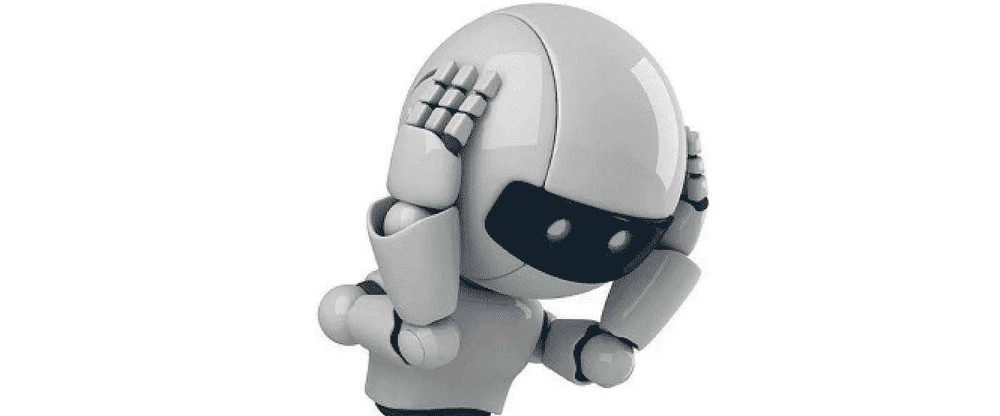
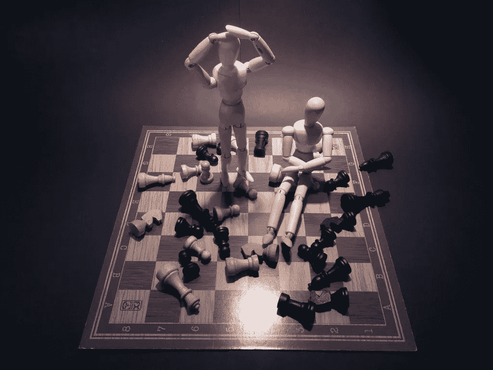
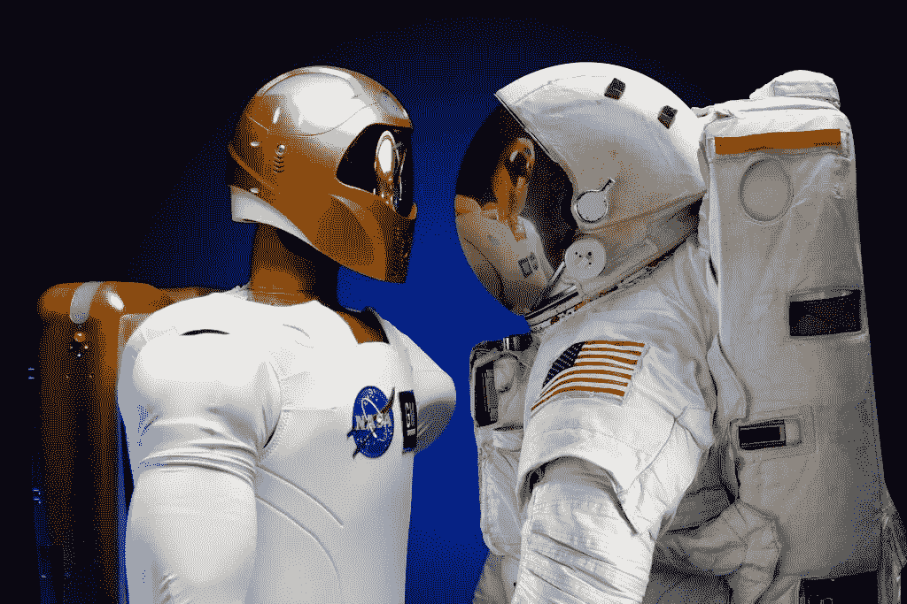
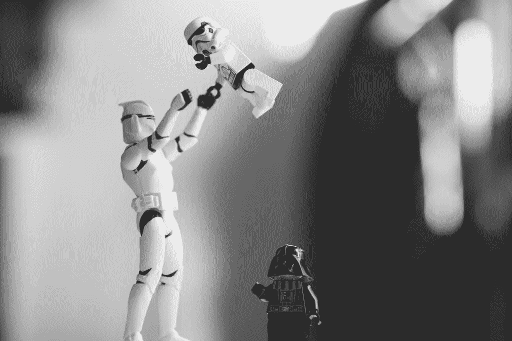

# AI 为什么会犯错？

> 原文：<https://medium.com/hackernoon/why-does-ai-make-mistakes-db6291a8cb05>

由伊琳娜·贝兹博罗代赫

在许多需要彻底性、准确性和耐心的活动中，人工智能已经超过了人类。这并不妨碍它在诸如[分辨海龟和步枪](https://labsix.org/physical-objects-that-fool-neural-nets/)这样的基本事情上积累经验。鉴于它可能造成的后果(有时已经造成了后果:从涉嫌刑事犯罪到交通死亡)，一些专家甚至怀疑我们应该更担心的是[人工智能](https://stfalcon.com/en/blog/post/artificial-intelligence-first-steps-in-implementation)还是[人工愚蠢](https://en.wikipedia.org/wiki/Artificial_stupidity)。为什么 AI 会犯这么诡异的错误，怎么修复？

最近发生的一起无人驾驶汽车撞上一名女子的事故揭示了人工智能在某些情况下变得如此无助的主要原因。这就是:无论它有多聪明，它的思维方式都与我们人类不同。这就是为什么在这种情况下，不是唯一可持续的立即决定——首先，尽一切努力防止碰撞——而是花很长时间来识别前方是什么样的物体。这就是它的工作原理。

# 这是一个疯狂、疯狂、疯狂、疯狂的世界

当做出决定时，人工智能依靠内置的算法和大量数据进行处理，以得出某些结论。 [Erik Brynjolfsson 和 Tom Mitchell](http://science.sciencemag.org/content/358/6370/1530) 提到，为了给人工智能提供正确决策的坚实基础，我们应该设置定义良好的输入和输出，明确定义目标和指标，给出简短而精确的指令，并消除依赖常识的推理链。也就是说，创建尽可能明确和可预测的环境。

但这样的理想条件在现实世界中很难找到。你不能指望所有的道路使用者都会完美无缺地遵守交通规则。或者所有的笔迹都清晰可辨。或者所有的情况都将是清楚和明确的。人类的大脑被调整为在一个不确定的、不断变化的环境中工作，这经常会导致自身的不确定性和模糊性。为了能够在这个世界上成功地行动，人工智能应该学会更像人类一样思考。

# 学习，人类的方式

我们人类如何学会做决定？我们从童年获得的大部分经验都来自尝试和错误。但是，考虑到人类后代的无助和世界各地造成的危险，仅仅依靠经验知识是太轻率的。这就是为什么除了尝试和错误之外，有针对性的训练和指导从孩子生命的第一天就开始了。我们不得不说，大自然赋予了我们一套与生俱来的本能，自己照顾我们。

今天，科学家们正试图将我们所知道的人类学习方式应用于机器学习。因此，[开放人工智能](https://openai.com/)开发了一种算法，使人工智能能够像婴儿一样从自己的错误中学习。他们的新[技术](https://hackernoon.com/tagged/technology)，被称为马后炮经验回放(或简称她)，允许人工智能在完成特定任务时回顾其之前的行动。学习的过程与人类相似，包括强化。当我们掌握了一些行动，结果很少立即与设定的目标相对应。但是我们也从那些糟糕的结果中学习，并且以后可以用它们来实现其他的目标。因此，可以说，虽然我们的尝试没有成功，但他们的结果仍然是积极的。对于我们的大脑来说，这种学习是作为一种背景潜意识过程发生的。她将其形式化为机器学习，将失败重构为成功。

# 神经网络的发展

新的人工智能算法类似于人类神经网络的发展，其中微小的神经元相互传递信号，从而创建和访问我们关于不同物体及其属性的记忆。后来，这些记忆被用作推理、预测和决策的基础。

以类似的方式，人工智能的简单计算元素(nods)通过在摄取训练数据时重复调整连接来创建更强或更弱的链接。随着时间的推移，系统定义了最佳的连接模式，并将其作为默认模式，形成了我们所说的人类行为的自动反应。之后，它可以将获得的知识应用到新的情况中，根据以前尝试的统计数据预测结果。训练数据量越大，你的神经网络就越“聪明”，预测就越精确。

当然，我们应该明白，这并不是绝对的相似。人类大脑包含大约 100 个神经元，它们形成大约 1000 万亿个连接。它的本质是不同的:它依赖于电化学信号而不是数字信号。与机器“大脑”不同，人类大脑需要少得多的数据来建立联系，并且可以无比容易和快速地将知识应用到新的情况中(这是创造力的基础)。因此，就计算机神经网络而言，它们不过是我们头脑中正在发生的事情的一个非常粗糙的复制品。

# 密封的秘密

人工智能自我教育的挑战性在于，它越像人类，其“大脑”中发生的过程就越难以理解和控制。从这个意义上说，我们更常用于人们的谚语“你不能进入别人的大脑”，对于现代自学式人工神经网络来说也是如此。就像脸书聊天机器人发生的那样，当让它们自己去做的时候，[很快就发展出了它们自己的人类无法理解的语言。](https://arxiv.org/pdf/1706.05125.pdf)

聊天机器人是相当简单的程序，实际上并不危险。然而，它给科学家上了一课，让他们在处理更复杂的解决方案时更加谨慎。并不是说你明天会在你家附近遇到一个终结者。但是想象一下那辆自动驾驶汽车，它会决定是掉头好还是轧死你。

“糟糕的推理”是艾犯愚蠢错误的最常见原因。最糟糕的是，机器无法解释它为什么做出决定，所以很难找出是什么，在哪个阶段出了问题。最近，科学家们通过创建[软件克服了这一挑战，该软件可以通过对人工智能系统的学习过程进行逆向工程来调试人工智能系统](https://arxiv.org/abs/1705.06640)。它用大量输入测试神经网络——逐个测试每个“神经元”——并告诉它哪里的响应是错误的，以便它可以自我纠正。

# 依靠人类教师

在有风险或不明确的情况下，反复试验的自学方法是最不合理的。在这种情况下，正如儿童受益于成人的指导一样，人工智能也可以受益于人类教师。已经朝着这个方向采取了一些步骤。因此，在其中一个实验中，AI 学会了按照培训师的初步指示[在照片](https://innovationtoronto.com/2016/11/new-ai-algorithm-learns-directly-from-human-instructions-through-heuristic-training/)上区分人类的头发(这对机器来说是非常困难的任务)。在另一项研究中，人工智能被教导按照简单英语的指示玩一个蒙特祖马的复仇游戏[。](https://newscientist.com/article/2128575-ai-learns-to-play-video-game-from-instructions-in-plain-english/)

这些实验的结果确实很有希望，但在顺利实现人类与 AI 交流的道路上仍然存在大量障碍。今天，AI 只能理解简单的直接命令，这与人们日常的交流方式相去甚远。Nikolaos Mavridis 指出了[人机互动交流](https://arxiv.org/pdf/1401.4994.pdf)仍有待实现的 10 个方面，包括多种言语行为、混合主动对话、非语言交流等。

还有一点就是，要解释一件事，我们自己要清楚地理解它。这对人类来说很少是真的。哲学家兼科学家迈克尔·波拉尼在 20 世纪 50 年代描述的模式表明，在做决定时，我们只是部分依赖明显的、明确的知识。我们每天接触的大部分知识都是隐性的，也就是说，我们没有意识到我们拥有并运用了这些知识。我们在与他人和周围世界的互动过程中，以一种潜意识的实践方式获得它。这就是为什么很难转移它，尤其是当它开始教一台机器的时候。

# 推理与直觉

我们的思维过程与机器思维过程的另一个区别是，在这个世界诞生之前，人类的大脑并不是一张白纸。我们有一套与生俱来的基本本能，某种核心知识帮助我们理解物体、动作、数字和空间，并发展常识。就机器而言，这种本能的作用是由激活功能来发挥的。

这种“本能”(以先天机制的形式)应该内置于人工智能中吗？一些科学家坚持认为。该列表包括因果关系、成本效益分析、翻译不变性、语境化等概念。科学家之间的争论很激烈，在人工智能中引入这种先天算法是否合适，以及可能会产生什么后果。事实上，我们的本能进化了几百万年。有没有可能有效压缩这个冗长的过程？科学家提出的方法之一是逆向分析当我们本能或直觉地行为时实际发生了什么。

这就是麻省理工学院的研究人员在解决复杂问题时理解直觉决策的[算法所做的工作。他们让一群最聪明的学生寻找优化航空网络的解决方案。然后对问题的解决方法进行分析，并以机器可读的形式进行编码。](http://news.mit.edu/2017/human-intuition-planning-algorithms-0207)

# 下一步是什么？

到目前为止，我们已经详细讨论了人工智能推理和做出逻辑决策的能力。但是逻辑数学智能只是我们日常利用的众多智能之一。心理学家统计了至少 9 种不同类型的人类智力，包括音乐、存在、人际交往、动觉等。构建这些类型的智能对于通用人工智能尤其重要，但迄今为止，这主要是在未来的领域，以及人工智能考虑环境和解决道德困境的能力。

很难预测人工智能进化到碳脑阶段需要多长时间，以及我们是否会从结果中受益，但在那之前，我们应该准备好人工智能犯更多奇怪的错误。毕竟，引用陀思妥耶夫斯基的《罪与罚》中的一句话，“需要比智力更多的东西来智能地行动”——人工智能也不例外。

*最初发表于*[T5【stfalcon.com】](https://stfalcon.com/en/blog/post/why-AI-makes-mistakes)*。*