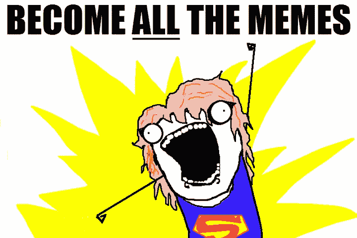
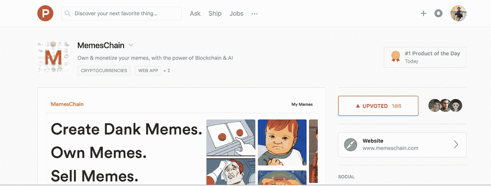
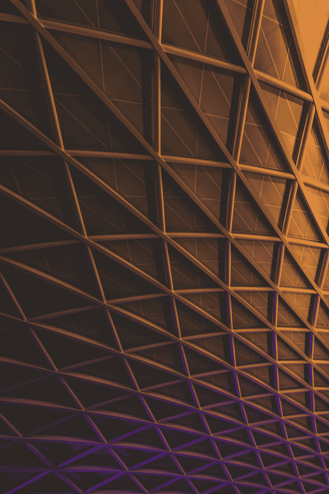

# 现在你可以向你的朋友解释为什么 ETH 物有所值了

> 原文：<https://medium.com/hackernoon/why-does-ethereum-has-its-value-dollars-own-memes-blockchain-5595b7860206>

## 以太坊，交易量和市场资本排名前三的加密货币之一，现在价值 900 美元！为什么 ETH 有这个价值是最常被问到的问题，这篇文章将会解释给你听。

Photo by [Joel Bengs](https://unsplash.com/photos/mA_lknGurfc?utm_source=unsplash&utm_medium=referral&utm_content=creditCopyText) on [Unsplash](https://unsplash.com/search/photos/friends?utm_source=unsplash&utm_medium=referral&utm_content=creditCopyText)

# 以太坊——不是一种放射性元素——但同样强大

以太坊，我一听就知道——听起来像是无线电活动元素。但是当我对它了解更多的时候，我觉得它比那更强大。因为它可以让这个世界变得更好，避免在许多有争议的领域出现中间人。这是一个运行智能合同的**去中心化平台**:完全按照编程运行的应用程序，没有任何停机、审查、欺诈或第三方干扰的可能性。这是一个**区块链，一个非常强大的共享全球基础设施，可以移动价值，并代表财产的*所有权。***

# 智能合同——它们能有什么帮助？

众所周知，对于大多数法律验证来说，为了确保在相关方采取一系列其他行动后发生一系列标准的关键事情，我们需要中间人，一个可以信任的第三方来帮助审查行动。但是这些第三方成本很高，作为人类，他们可能会有偏见，或者在各种情况下可能会有偏见。

Photo by [Andy Kelly](https://unsplash.com/photos/0E_vhMVqL9g?utm_source=unsplash&utm_medium=referral&utm_content=creditCopyText) on [Unsplash](https://unsplash.com/search/photos/robot?utm_source=unsplash&utm_medium=referral&utm_content=creditCopyText)

但是，如果一个强大的全球共享基础设施让你在没有信任的情况下做到这一点——没有人需要信任任何人，将避免可信的第三方和随之而来的费用。多酷啊！

这使得开发商能够创建市场，存储债务或承诺的登记册，根据很久以前发出的指令(如遗嘱或期货合同)转移资金，以及许多其他尚未发明的东西，所有这些都没有中间人或交易对手的风险。

# 数字艺术和所有权——信息技术的重要性

我在上一篇文章中提到了创造性的数字艺术，以及模因在日常生活中表达我们的反应以及让事情保持轻松的重要性(链接如下)

 [## 模因——简单的娱乐创意&我们生活中不可或缺的一部分

### 我们都笑过，分享过，甚至和一些最有创意但简单的被称为迷因的数字艺术有关联。

hackernoon.com](https://hackernoon.com/memes-simple-entertaining-creatives-integral-part-of-our-life-73ea72340c9a) 

这些创造者，用他们天才的大脑想出了一些有着大量创造力的潮湿的模因，他们需要被鼓励。他们帮助很多人了解情况，帮助很多人在不伤害他人的情况下表达自己的情感。

这种艺术杰作必须受到保护，他们必须获得权利和应有的荣誉，甚至为他们的工作支付报酬——但在目前的情况下，除了水印之外，没有任何方法可以识别模因的创造者，如果大的话会破坏模因，或者如果小的话可以被剪掉。

# 以太坊如何帮助保护创作者的所有权？

这就是以太坊发挥作用的地方，它可以 ***授予*** 所有者对数字商品的 ***所有权*** ，而不需要可信的第三方，如果有足够多的*技术可以协同工作，证明它是独一无二的，不被任何人声称拥有——那么它将帮助数百万创造者 ***声称所有权*** 并可以在这个星球上的任何地方证明它(在这个宇宙中的:D)这就是人工智能和以太坊可以携手并进的地方。*

# *memes chain——拥有你的创意 memes 并从中获利*

*今天在产品搜索上出现了一个有趣的项目，它允许这些了不起的创作者实际上拥有他们的模因！一切都像我们讨论的那样借助人工智能和区块链技术。*

*感谢它的制作者允许创作者拥有他们的创意数字艺术并将其货币化。它帮助许多模因创作者获得所有权，并从他们的创作中获利。*

* [## MemesChain

### 利用区块链和人工智能的力量，拥有并出售你最有创意的迷因。

memeschain.com](https://memeschain.com) 

一个人可以很容易地创建一个帐户，不需要任何用户名或密码(由于使用 Metamask+Ethereum 的高级加密签名)，然后上传你的创意(memes)。Memeschain 然后通过使用机器学习及其后台算法智能来验证图像的唯一性。一旦它被确定为独一无二的，你所要做的就是要求你的所有权！瞧——你拥有了自己创造的令人敬畏的东西，当你交易它或者授权重用它时，它可以在未来得到很多回报。

在撰写本文的时候，这个平台在@Producthunt 上以最高的投票数排名第一，这表明了对它的有效需求以及构建这样一个平台的想法是多么的棒。与它的创造者@srameshr 的快速聊天让我们对构建这个平台背后的动机，他们的愿景和平台的技术细节有了更多的见解，我会在另一篇文章中写下这些。

他们很快将推出拍卖你的迷因以及在 ETH 以固定价格出售的能力——这创造了以迷因形式拥有数字收藏品的可持续经济。期待更多这方面的更新

# 在这个宇宙的任何地方证明你的所有权

这就是以太坊的力量。以尽可能低的成本实现这样一个全球共享的基础设施，并允许某人轻松证明所有权，使其变得有价值。

向区块链写东西要花费以太网($ETH)的费用，但验证是免费的——所以这样的平台可以让创作者以象征性的费用注册并要求所有权，而不是通过各种昂贵的第三方，同时允许人们免费验证所有权的真实性！

对于要编写的每个事务，都需要 Ether($ETH)。想象一下，除了迷因之外，该平台还可以实现各种所有权使用案例，例如:数字艺术、文档、报价等，而不需要可信的第三方，这给 ETH 带来了证实其价值的巨大需求。

# 现在你可以向你的朋友解释为什么 ETH 有它的价值

现在，您已经看到了这个简单而强大的用例，即拥有一个迷因并在没有可信中间人的情况下立即验证，这可以帮助您解释以太坊到底是什么，以及它如何帮助构建一个全球共享的基础设施，以实现分散的无信任智能生态系统。

你很容易向别人解释

> 你有东西吗？你必须证明你拥有——不需要律师——只需区块链帮助你在几秒钟内确认和验证，无需第三方。*