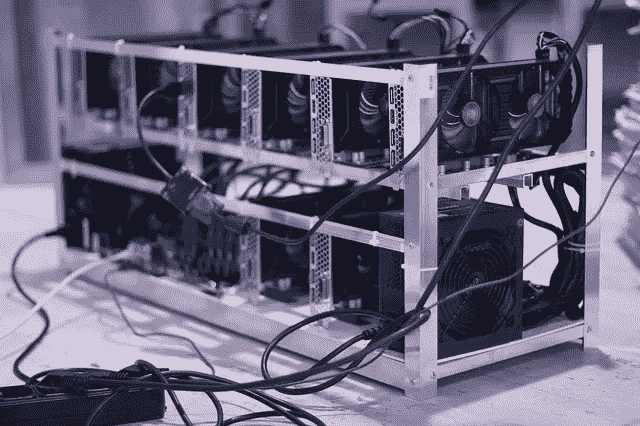

# 为什么 DPoS 不是真正的 PoS，而是 PoA 协议

> 原文：<https://medium.com/hackernoon/why-dpos-is-not-really-a-pos-but-rather-a-poa-protocol-5bb1aa305625>

如果你对这些奇怪的缩写感到困惑，让我先解释一下:

*   DPoS =委托利益证明
*   PoS =利害关系证明
*   PoA =授权证明

总的来说，我看到共识协议被分为三大类:工作证明(PoW)、利益证明和授权证明。

# 啪

工作验证依赖于**的计算能力**和消耗电力来实现共识。区块生产者(矿工)**通过计算散列来竞争**，谁先得到散列(符合特定规则)，谁就赢。他们的街区将成为下一个区块链[的街区。](https://hackernoon.com/tagged/blockchain)

*PoW mining machine (*[*image source*](https://www.maxpixel.net/Blockchain-Market-Digital-Mining-Farm-The-Ethereum-2852024)*)*

# 刷卡机

第二组 [PoS](https://hackernoon.com/tagged/pos) ，要求区块生产商在系统中拥有**股份**(以**本地加密货币**的形式)。基本上，谁拥有最多的硬币，谁就有最大的机会生产下一块。可能有许多不同的变体，例如使用**赌注年龄**(老化 PoS)或甚至**燃烧硬币**(燃烧证明)。

# 胰癌胚抗原

第三大集团是**权威证明**，依靠**身份**作为赌注。这意味着只有**可信节点**可以作为块生产者加入网络。如果他们行为不端，对他们的信任就会被打破，他们就会被禁止参与。为了有效地工作，每个块生产者的身份必须**已知**(注意 PoW 和 PoS 不要求这样)。使用这种方法的区块链被称为**许可**。

让我们**仔细看看**PoA 协议。这里有两种主要的方法:集中式和分散/分布式。

# 集中式 PoA

集中式方法意味着有一个**中央实体**，由**选择可以产生事务块的节点**。这种方法由**闭源**和/或**私有区块链**使用。你不能让任何人在这个网络中运行 block 生产软件。您可以关闭源代码，或者将允许参与的节点列入白名单(或者两者兼有)。

Ripple logo on a watch ([image source](https://www.maxpixel.net/Hand-Cryptocurrency-Watch-Ripple-Man-3085141))

使用这种集中方法的最知名的加密货币是 **Ripple** 。PoA 协议也被用于**以太坊的测试网** Kovan 和 Rinkeby。

# 分散的 PoA

另一种方法是**分散化**。这意味着**社区**被允许**选择**哪些节点具有**权限**来产生事务块。

这当然涉及到**选举**。没有**候选人**和他们的**身份**选举是不可能的。你不能投票给你不知道其身份的人(否则这只是一次抽奖)。

身份并不一定意味着知道某人的名字(尽管这通常是一个重要的特征)。它也可以涉及其他候选人的**特征**和**行为**，基本上是说服选民他们分享**共同价值观**的任何事情。

([image source](https://www.maxpixel.net/Vote-Voting-Choice-Democracy-Election-Sign-661888))

# 投票

投票可以以多种方式进行。最**幼稚的** **做法**就是说**一个节点**等于**一票**。这当然带来了“Sybil 攻击”问题，有人可以启动数千个节点并接管网络。

一个更好的方法是**根据一个节点拥有多少硬币来加权**投票:一个**股份**。这就是 DPoS 命名**误解**的来源。

DPoS 系统**中的所有**节点**投票**决定哪些节点将成为**块生产者**(例如，他们需要选举 11 个这样的节点)。**投票权**基于**股份**——拥有更多(本地)加密货币的节点拥有更多投票权。一旦选择了 11 个方块生产者，他们就按照**预定的**顺序一个接一个地创造方块(它们之间没有竞争，比如在 PoW 中)。

如你所见，股份仅用于**选举**区块生产商。但是**真正的共识**(关于事务的顺序)发生在(分布式) **PoA** 层，带有产生块的节点。

> 请注意，本文并不假设某个共识协议(组)比另一个更好，尤其是在 PoS 和(分布式)PoA 之间。我认为 DPoS 是一个非常好的共识协议，尽管它仍然需要像 PoW 那样进行大规模的测试。这篇文章更多的是关于语义，而不是不同共识协议的利弊。

附注:我要感谢 Luka Perč和 Simon Belak 阅读了这篇文章的草稿并给了我反馈。