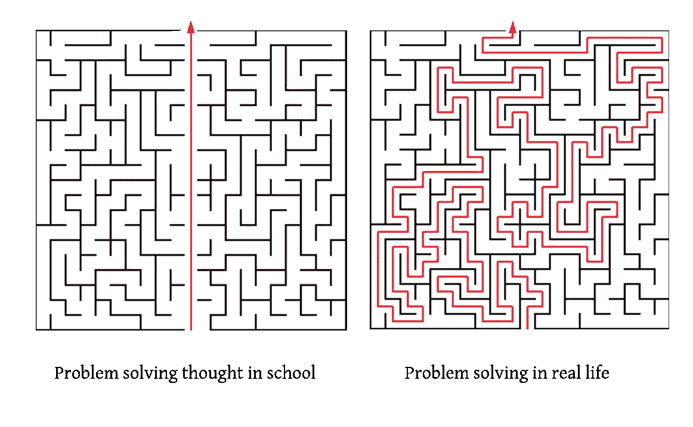
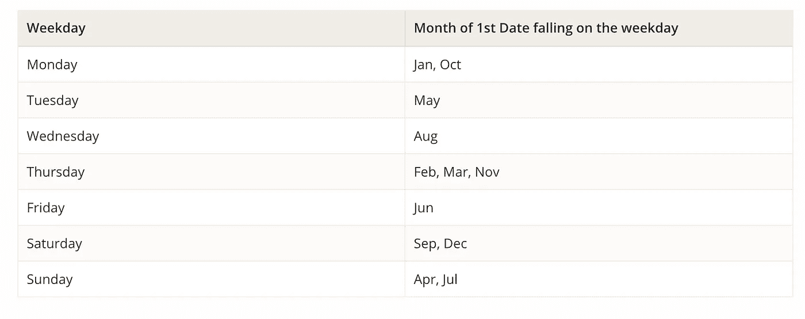
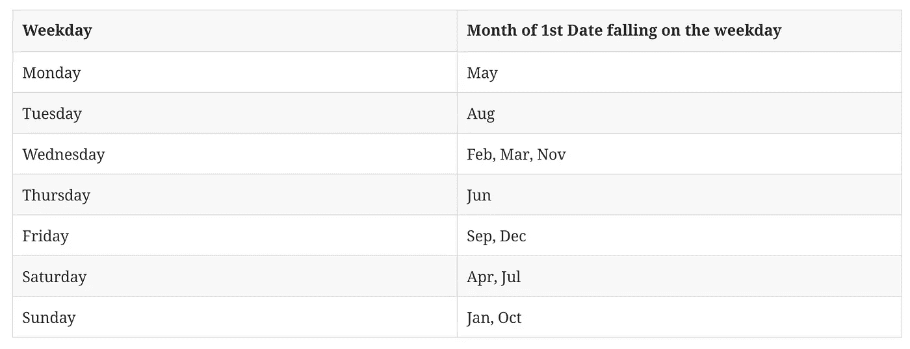
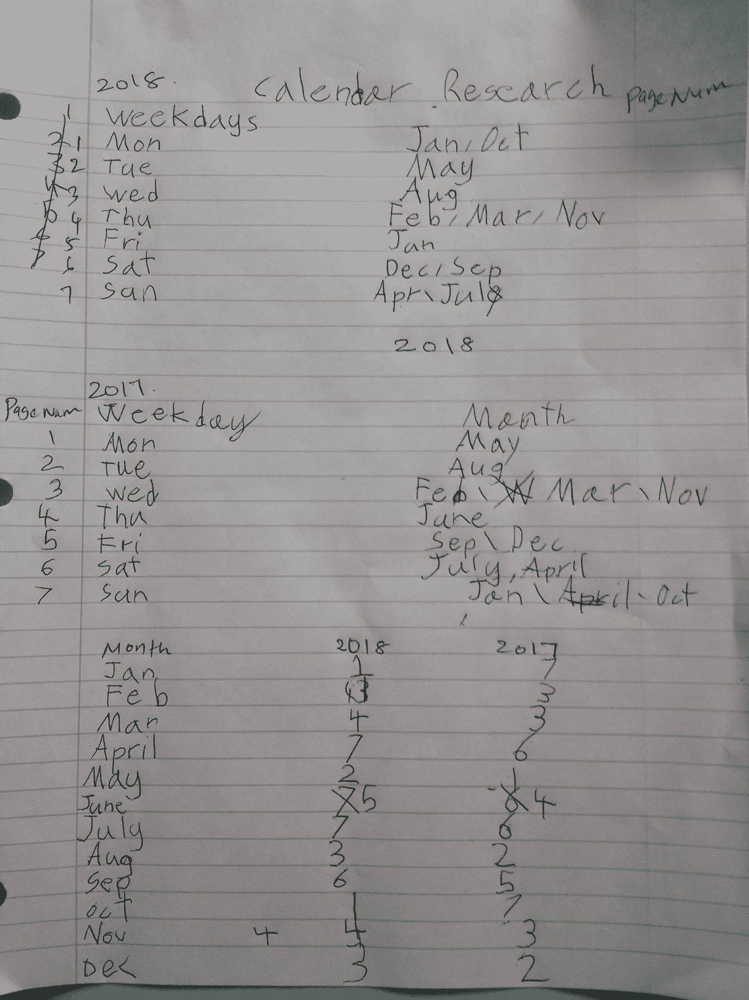
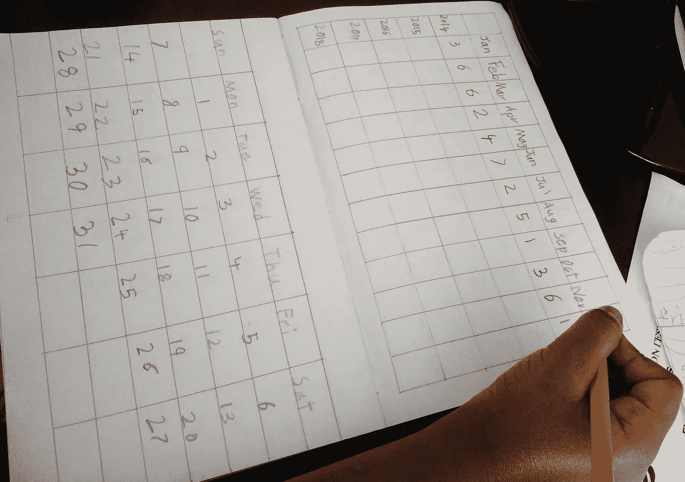
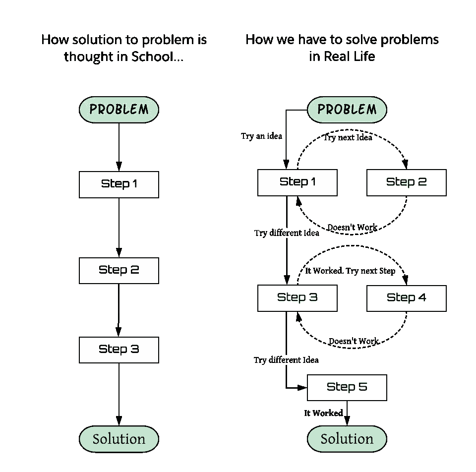
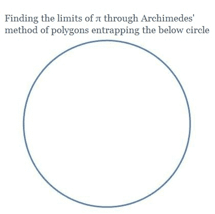

# 为什么教育系统不应该简单地教授解决方案，而应该教授解决问题的基本技能。

> 原文：<https://medium.com/hackernoon/why-education-system-should-not-simply-teach-solutions-but-the-fundamental-problem-solving-skills-53fee2af4f0a>



## 用一个我教我的孩子用不到 10 页纸做 10 年日历的故事来说明

为什么我们不应该简单地教孩子们解决问题的方法，而是教他们解决问题的基本技巧？

如何用不到 10 页纸创建 10 年日历？

想知道这两个问题有什么联系吗？

我将分享我是如何教我 7 岁的女儿用不到 10 页纸制作 10 年日历的。然后，我将通过解释我的教学方法背后的推理来回答为什么我们不应该简单地教授问题的解决方法。

我还将讨论我们的教育系统应该教授的一些基本技能，以及我们可以在数学教育中改变什么。

## 我是如何教你用不到 10 页纸制作 10 年日历的？

我和我女儿的对话。

> I:一年的日历有多长？女儿:有 12 个月了。所以会有 12 页。
> 
> I:10 年的日历有多长？女儿:嗯..那是 10 乘以 12，所以是 120 页。
> 
> I:但是，我们可以用不到 10 页纸做 10 年的日历。
> 女儿:(兴奋地)怎么了？
> 
> I:为了做到这一点，我们需要做一个日历研究来确定模式。女儿:我该怎么做呢？
> 
> I:我会告诉你怎么做

我给了她 2018 日历，让她检查两个月中是否有一个看起来完全一样。浏览完之后，她说——*“是啊，一月和十月都是从周一开始”*。我们检查了 1 月和 10 月的几个日期，看看它们是否都在同一个工作日，这是否有效。

我说——我们开始吧。在一张纸上，在左边写下星期一到星期天，在右边写下第一天是星期几的月份。这是她发现的模式:



> 我问——既然月份可以合并在一起，那么一年的日历需要多少页？
> 
> 女儿:嗯，7 页，这意味着 10 年的日历需要 70 页，还是很多。

是啊，但让我们研究一下 2017 年的日历，看看我们是否能找到更多的模式。她在 2017 年重复了这个练习，得出了这个表格。



我说——现在，我们需要找到一种方法将这两者结合起来。比方说，如果我们为一个月写一个日历，从每个工作日开始，也就是周一到周日，在一页上写 1 到 7，我在工作日的左边写数字。

她说——那好吧？

现在要创建 10 年日历，我们可以准备一个索引来查找月份和年份，以便根据月份的第一天来更正页码。这就像一本书的索引结尾。

她:哦，是的，我在书的结尾有单词索引。让我来吧。



My Daughter’s calendar research work sheet

> 我说——所以，如果我们能把 10 年的指数写在两页上(比如每页 5 年)。然后…
> 
> 她——哦，好主意！，所以这意味着 2 页的索引…加上 7 页的日历，所以只有 9 页。
> 
> 我:对！，我们可以用 9 页纸做 10 年的日历。

然后我用 A4 纸做了一个本子，画了格子让她写索引和月历。



下面是我们在填充索引时识别更多模式的练习:

我拿出一本 2009 年的日历，她看着每个月的第一天，在年份和月份交叉的位置写下相应的页码。

我们重复了 2010 年的情况，然后让她检查 2009 年和 2010 年之间是否有任何模式。她很容易地发现每个数字只增加了 1。例如，2009 年 1 月的指数是 4，2010 年 1 月的指数是 5。7 加 1 还是 1，因为没有 8。

为了填满 2011 年，她没有看 2011 年的日历，而是按照这个模式，在 2010 年的页码上加 1。然后我们都检查了 2011 年的日历，它完全匹配。

她在 2012 年日历中重复了同样的内容，在验证过程中，我们发现模式发生了变化。1 月和 2 月，模式保持不变，仅比去年高一点。但是现在 Mar 到 Dec 增加了 **2** 。例如，2011 年 3 月的指数为 2，而 2012 年 3 月的指数为 4。我向她解释说，这是因为二月在每四年一次的闰年中有 29 天。然后我们修正了 3 月到 12 月的所有指数

她填写了 2013 年(这次使用日历，因为模式改变了)，我们寻找模式。对于 1 月和 2 月，指数增加了 2，但 3 月到 12 月又回到了增加 1 的旧模式。

> 所以我们发现的一般模式是将前一年的指数增加 1，除了我们需要从闰年的 3 月到闰年的 2 月增加 2。

然后我们应用这种模式来完成到 2018 年的指数。

然后我向她展示了如何使用查找过去 10 年中任何一天的星期几。

```
The first step is to find index of page number by looking at the cell intersecting year and month. Then go that page number to find day of weekday for of date in question.
```

她喜欢玩这种把戏。为了好玩，当我们不确定答案是否正确时，我们会问语音助手，比如 Siri—*“2010 年 9 月 5 日是星期几？”*它会在工作日做出响应。

## 为什么我没有教她简单的窍门呢？

我们可以跳过研究工作，直接让她通过查看真实日历或使用语音助手来填写日历。

但是，我的目标不是教她用 9 页纸制作 10 年日历这个很酷的技巧，而是教她解决这个问题的过程，这样她就可以把它应用到其他问题上。

**我们应该教孩子们研究课题和创造理论的基本技能。**

我想教的基本技能是深入研究主题、识别模式和创建可应用于更广泛问题的一般理论的技能。这种技能如何有用的几个例子。

*   查尔斯·达尔文在五年的航行中研究了大量的植物和动物，这使他提出了进化论。
*   伊萨克·牛顿通过仔细研究物体和行星的运动，发展了三个基本运动定律。
*   周期表是根据元素中原子的排列模式发展出来的。这是一项重要的发明，它帮助我们了解了宇宙中的所有元素。
*   音乐理论是通过识别许多作曲家使用的共同模式而发明的。没有乐理，很难用规范的方式教音乐。
*   行为经济学家丹尼尔·卡内曼因通过分析人类行为模式发现人类常见的认知偏差而获得诺贝尔奖。

如果学生学会了这一基本技能，他们可以在任何领域使用它。

我们应该教孩子犯错并改正错误。

我想教的另一项重要技能是犯错误并学会改正错误。例如，在日历项目中，我知道这种模式将在闰年打破。但是我第一次就让她做错了，在验证的时候发现了问题。

因为这就是我们在现实生活中解决问题的方式，但是学校教育只教给我们找到解决方法的正确步骤。



## 数学教育我们能改变什么？

> 数学教育应该教授解决问题的艺术，而不仅仅是教授如何处理数字。

举例说明。孩子们学习数学常数圆周率

```
**π =** 3.14159...
```

他们被教导π是圆的周长与直径之比。无论圆的大小，这都是一个不变的模式。但是之后，学生们会得到一些可怕的公式来计算圆的面积，圆柱的面积，球的体积等等。但是如果他们被认为。

*   为什么我们需要那个神奇的数字π呢？
*   2000 年前阿基米德如何发现π的近似值？

阿基米德发现了一个求π近似值的绝妙主意。因为计算多边形的周长很容易，所以他在圆的内外都画了多边形。所以，

```
Perimeter of the Inner Polygon < Circumference of Circle < Perimeter of the outer Polygon
```

阿基米德意识到，通过增加多边形的边数，他可以更精确地计算π的值，如动画所示。



我希望这种创造性的想法在我上学的时候就有人教过。这是用于解决计算机科学和运筹学中难题的近似算法的基本原理。

学习阿基米德的想象技巧比学习使用π的公式和计算各种形状的面积更重要。

## 学习事实和如何应用事实没有用吗？

当前的教育体系是为工业革命而创建的。它的目标是教授事实，以创造能遵循指示的工厂工人。不幸的是，为了取得好成绩，许多学生只是简单地记忆事实。所以他们中的大多数人甚至不知道如何应用他们所学的知识。

在今天的计算和人工智能革命中，智力技能比了解事实更重要。因为一切都可以在网上查到。所以学生应该学习解决问题的基本构件。

> *为了确定教什么，问问题*——他们是否应该学习一项可以应用于不同问题或领域的基本技能？

我们应该教给他们的一些基本技能是:

*   给定一个问题，如何产生尽可能多的想法(甚至是错误的想法)。
*   如何将更大的挑战分解成更小的问题？
*   如何找出解决问题的渐进步骤？
*   如果需要，如何评估他们是否在正确的方向和路线上。
*   如何迭代，如何进步？

> 教育系统不应该评价学生的正确答案，而是他们的思考能力。衡量他们能提出的想法的数量，而不是想法的完美程度。因为，发现伟大想法的最好方法是产生更多的想法。

如果你喜欢这篇文章，请鼓掌，这样会有更多的观众看到。