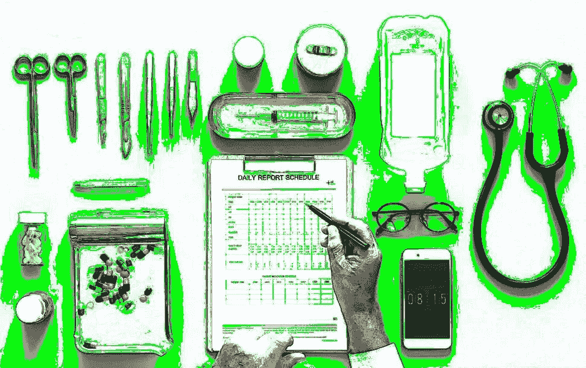

# 为什么移情+消费主义=医院病人护理的创新

> 原文：<https://medium.com/hackernoon/why-empathy-consumerism-innovation-in-hospital-patient-care-d3cdf76179a1>

> 由 [Nitin Goyal，MD](https://www.quora.com/profile/Nitin-Goyal-MD) ，Pulse Platform 的创始人& CEO。[原载](https://www.quora.com/Where-can-innovation-occur-in-hospital-patient-care/answer/Nitin-Goyal-MD)于 [Quora](http://quora.com/?ref=hackernoon) 。

当人们走进医院或医生的办公室时，他们认为自己是一个病人——一个缺乏控制的位置。

他们处在一个陌生的环境中，这让他们感到不舒服。可能出了什么问题。错到需要专业人士的帮助。

在很多方面，这种不安是由于他们缺乏知识和教育，不知道正在发生什么。疾病、费用、时间范围——这些对病人来说都是不透明的。

尽管病人是消费者，但两者之间还是有差异的。

> 为什么？

# 因为作为一名消费者和作为一名患者是完全不同的。

作为一个病人，你缺乏真正的控制，这增加了恐惧和脆弱性。

这可比得上找机械师解决汽车故障。我们大多数人在机械师的办公室里都会感到焦虑，因为我们对汽车、问题或工作的实际成本知之甚少甚至一无所知。我们感到无能为力。我们无法控制。

当我们找到一个我们信任的好技工时，我们会专门去找他们。现在，想象一下同样的情况，但问题不在于你的车，而在于你的身体。显然，那种无力的感觉被放大了。

医生不是机械师，我知道。但是进入医疗保健领域和机械商店之间有一个重要的相似之处。

人们觉得他们失去了控制，把他们当成消费者有助于建立控制。这就是移情消费主义发挥作用的地方。

# **消费者-患者关系**

病人是消费者，不管他们是否被这样对待。

他们向服务提供商寻求服务，为服务付费，并期望服务提供商解决他们的问题。

那是消费者。

这么想吧:健康的人类似于强大的消费者。他们可以去商店买一件商品，并准确地选择他们想要的。他们知道物品的价格和接下来的步骤。付钱，带回家，使用它。他们控制着局势的每一步。

另一方面，生病的人必须去看医生以获得更多的信息。突然，那个人成了病人。他们仍然是消费者，但他们已经经历了转变。他们现在处于一个新的——而且经常令人伤脑筋的——处境，这让他们感到脆弱。

几乎立刻，权力就被剥夺了。他们无法控制自己的病情，也无法控制医生决定如何治疗。他们很可能对发生在他们身上的事情以及这些事情将如何影响他们的生活一无所知。在那一刻，他们的恐惧是最高的，同时他们感到几乎完全失去了控制。我们需要改变这种情况。

# **教育作为对照**

我们可以给病人更多的控制权，帮助他们在艰难时期不那么脆弱。

我们可以帮助他们感觉更像消费者，而不是病人。

这一切都始于教育和信息，这总是给人一种更大的控制感。如果你对你的疾病有所了解，并且了解治疗方法，你更有可能处理好它。你对局势有所控制。接下来的步骤很清楚，似乎不那么令人生畏。

想象一下，当病人手术后离开医院时，他们仍然处于弱势地位。他们的下一步是什么？他们应该什么时候开始感觉好些？如果他们有问题，应该预约吗？

在这些情况下，交互式数字健康工具可以教育患者，并为他们提供必要的答案。这是一个教育病人的机会，给他们一些控制，减少恐惧和脆弱性。

# **通过移情消费主义进行创新**

一种感同身受的数字触摸正是我们在医疗保健中所需要的。

然而，我们倾向于认为数字体验与人类接触是分开的。但是，当数字工具保存和增强人类体验时，它才是最强大的。

也有很多不该发生的互动。现在，我们可以有更好的沟通、教育和对病人的同情。这是数字健康平台真正有机会改善医疗保健的地方。通过捕捉我们喜爱的人际互动，我们可以恢复患者的信心。我们可以给病人一些他们作为消费者所体验到的控制，而不会剥夺病人和医生之间有意义的关系。

数字医疗将以某种方式改变每个患者的接触点。但是，同理心与消费主义相结合，是我们应该为之奋斗的未来。尽管开车去商店可能仍会让你有些焦虑，但我希望当你走进医生办公室时，这种感觉最终会消失。

> 由 [Nitin Goyal，医学博士](https://www.quora.com/profile/Nitin-Goyal-MD)，Pulse Platform 的创始人& CEO。[最初发表于](https://www.quora.com/Where-can-innovation-occur-in-hospital-patient-care/answer/Nitin-Goyal-MD) [Quora](http://quora.com/?ref=hackernoon) 上的。
> 
> 更多来自 Quora 的趋势科技答案，请访问 HackerNoon.com/quora 的[。](https://hackernoon.com/quora/home)