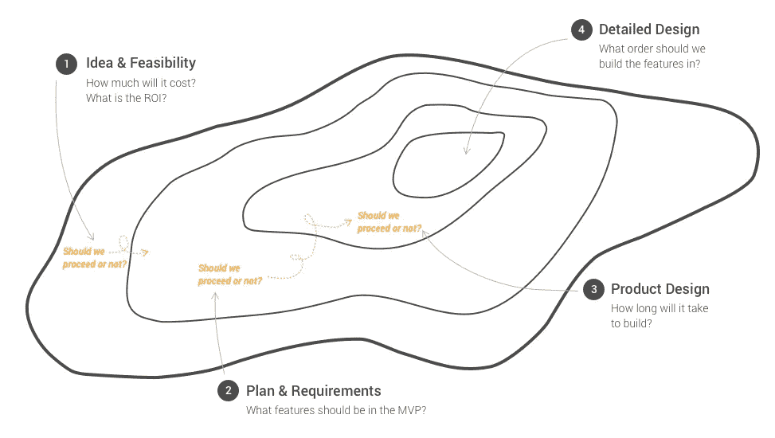
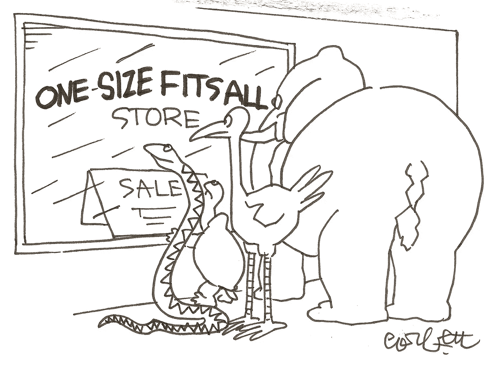

# 为什么评估如此困难

> 原文：<https://medium.com/hackernoon/why-estimating-is-so-damn-hard-d0f945f30185>

Photo by [Gabriel Matula](https://unsplash.com/photos/VnGac-kUflg?utm_source=unsplash&utm_medium=referral&utm_content=creditCopyText)

> "如果你认为教育很昂贵，试着估算一下无知的成本."— [哈沃德·加德纳](https://en.wikipedia.org/wiki/Howard_Gardner)

研究表明，人们不擅长做估算。一般来说，我们属于以下两类人:(1)在做出评估时不够自信或者(2)过于自信。正因为如此，我们往往倾向于分别低估或高估。这导致了用我们传统的评估方法，项目被延迟交付或者根本不能交付的非常普遍的情况。

评估是我们日常生活的一部分，因此在每个行业都会以这样或那样的形式产生。特别是在科技行业，你会发现评估是每周(如果不是每天)的话题。一些经理或利益相关者总是问 ***某件事要花多长时间*** 和 ***某件事要花多少钱*** 。这仅仅是因为科技企业需要与之合作的商业可行性。我们不断寻求通过增加确定性和可预测性来最小化风险，以便做出明智的决策。但是另一方面，当谈到衡量我们与最初的估计相比实际表现如何时，这似乎是一个较低的优先级。更令人吃惊的是，人们对做出糟糕估计的成本缺乏认识。这意味着我们真的不知道我们离我们的估计有多远，因此，没有学习。然而，我们继续为即将到来的项目提供估计，忽略了我们的估计实际上只是猜测的事实。

那么，为什么估算如此困难呢？ 简而言之，我们今天的[评估技术不是为“人”设计的，产生诚实、准确和可信的评估所需的技能被认为是事后的想法，而不是必要的](/critically-deciding/software-development-practices-desperately-need-real-attention-9477b4b85bd1)。如果你还有几分钟的空闲时间，我会谦虚地分享我从与不同行业的许多组织合作的经历中收集到的 3 个顶级理由，从金融和保险到房地产和酒店业。

# 非理性的力量

Photo by [Rajiv Perera](https://unsplash.com/photos/I4oipIl83BA?utm_source=unsplash&utm_medium=referral&utm_content=creditCopyText)

> “一旦在我们的脑海中建立了一个价格，我们就会将其他类似的商品与这个‘锚’价进行比较。”— [商业内幕人士 Vivian Giang](https://www.businessinsider.com.au/predictably-irrational-2012-6?r=US&IR=T#we-care-more-about-the-social-welfare-of-others-when-prices-drop-to-zero-7)

人是复杂的，尤其是在我们思考的方式上。信不信由你，我们思考和做决定的方式经常是非理性的。是的，即使是聪明的人。[丹·艾瑞里](https://www.amazon.com/gp/product/006135323X/ref=as_li_ss_tl?ie=UTF8&linkCode=as2&camp=1789&creative=390957&creativeASIN=006135323X)将其称为[可预见的非理性](https://www.amazon.com/gp/product/006135323X/ref=as_li_ss_tl?ie=UTF8&linkCode=as2&camp=1789&creative=390957&creativeASIN=006135323X)。我们人类的思维天生就有两种类型的思维:

1.  快速、频繁、自动、情绪化和无意识思维(又名[系统 1](https://en.wikipedia.org/wiki/Thinking,_Fast_and_Slow) )和
2.  缓慢、努力、不频繁、逻辑、计算和有意识的思考(又名[系统 2](https://en.wikipedia.org/wiki/Thinking,_Fast_and_Slow) )。

自然地，我们倾向于做更多的系统 1 类型的思考，尤其是在做决定的时候。因此，我们经常走“精神捷径”。虽然这是正常的，但当我们不知道我们的“心理捷径”的风险和后果时(又名[认知偏差](https://en.wikipedia.org/wiki/Cognitive_bias))，这可能是危险的。虽然我们的认知偏差[“当及时性比准确性更有价值时，能够做出更快的决定”](https://en.wikipedia.org/wiki/Cognitive_bias)，但更快并不总是更好，因为我们忽略了可以帮助我们做出更明智决定的重要事实。在快节奏的环境中，有很多不确定性和紧迫的期限，比如开发软件或与科技企业合作，这甚至更有诱惑力，因为我们觉得我们正在完成更多的事情。然而，当我们一段时间后意识到由于我们的“心理捷径”而导致的相关成本或损失是可以避免的，这就没那么大了。在我工作过的各种组织中，我每个月都会看到这样的例子。利益相关者和投资者感受到压力，不想“错过”眼前或不久的将来的机会。因此，他们根据当前的直觉做出临时和非理性的决定，冒着花更多钱的风险，而没有花时间科学地评估未来可能的结果以及相应的失败和成功概率。结果通常是一场灾难。但是如果他们幸运的话，他们会成功的。

毫无疑问，技术让许多行业、组织和个人变得更加高效，并创造了无数的创新机会。但与此同时，它降低了我们的耐心，增加了我们看到立竿见影的效果的期望。这鼓励我们变得更加短视，忽视长期发展的后果。我们似乎也忘记了现有的经过验证的科学方法，这些方法可以帮助我们在重要的地方改善我们的不合理性。或者，也许他们只是不够容易接近，太难只是“拿起和使用”？如果有一种经过科学验证的方法可以帮助你提高工作场所中(时间和金钱)估算的诚实性和准确性，你会考虑使用它吗？假设它可以与您的组织已经实现的任何框架/过程一起工作。

# 不同的问题，不同的目的

我们提出问题，因为有我们寻求的答案。这似乎很明显。但可能不那么明显的是，不同的问题有不同的目的，因为问题往往是在不同的时间点提出的。因此，很可能会有不同的上下文和约束相关联。例如，在[软件开发](https://hackernoon.com/tagged/software-development)中，询问*构建一个新的网络平台的合理投资是多少？*“与”*有不同的目的和背景。我们落后了，我们应该多花多少钱来投入更多资源？*”。此外，我们用来进行评估的技术也会有所不同，因为环境、约束和所需信息的类型都是不同的。这两个问题有不同程度的风险。

在最近的[会议演讲](https://www.gdgmelbourne.com/devfest-2018/)中，我分享了一个关于思考评估的想法，比如在一个岛上的生存:

The Isle of Estimations

我想各行各业都需要进行类似的评估。但是让我们把重点放在构建技术上，特别是软件开发。在整个软件/产品开发生命周期中，有许多问题需要进行某种形式的评估。我们得到的每个问题的答案给了我们更多的信息来决定我们是否想要继续下去。在某些情况下，它给了我们应该如何着手进行的信息。例如，我曾参与过一个项目，该项目通过注入额外的投资得到了多次延期，在下一个里程碑时，经理问团队*“我们会在赞助商退出之前交付价值吗？”*。另一方面，我还参与了一个项目，在这个项目中，需求仍在定义中，经理问“*我们能在投资耗尽之前开始产生收入吗？”*

你能回忆起最近你问或被问及的关于估计一件东西需要多长时间建造或花费多少成本建造的问题吗？你如何着手对这个问题作出估计？该方法是系统的、科学的还是仅仅基于直觉和/或经验？

# 一种技术不适合所有(估计)

你试过标有“均码”的衣服吗？如果是这样的话，你可能已经注意到它很适合你，但不完全适合你，就像它穿在模特身上一样？关键是，我们经常将一种技术应用于所有类型的评估，但就像一种尺寸适合所有的衣服一样，会有一些不准确之处。当涉及到开发软件和它的商业可行性时，有某些估计不能承受高水平的不准确性，因为风险很高。

因为评估有不同的问题和相应的目的，所以需要适当地选择用于产生评估的技术。一种技术并不适合所有类型的估计。以下是一些问题，可以帮助您确定要使用的最合适的评估技术:

*   估计是为了什么？
*   根据评估做出了哪些决策？
*   谁需要评估？
*   风险有多大？
*   为什么有人需要评估？

# 解决方案:更有用的估计

在这一点上，你可能想知道“好的，谢谢，我对为什么评估很难有了更好的理解。我如何让它变得更简单？”。好消息是，你已经迈出了第一步，那就是意识到要做出更加诚实、准确和可信的评估。虽然很诱人，但我想说现在这里有一个公式，你只需要输入一些数字(至少我今天不能给你这样的解决方案)。不幸的是，下一步并没有那么简单。它要求你理解为什么要进行评估，这样你就可以选择合适的技术来应用。有人可能会说，这将那些为自己提供竞争优势而进行评估的组织，与那些为减少不确定性而进行评估的组织区分开来。

简单的事实是，评估是我们日常生活和经历的一部分。在[商业](https://hackernoon.com/tagged/business)中，我们做出的评估是一种风险分析形式，信不信由你。因此，我们应该更加认真地对待我们如何产生评估，尤其是当涉及到软件开发的时候。当前的行业方法和技术是一个良好的开端，但它们仍然存在许多问题(例如，人为偏见和无意识地将 S、M、L 等抽象点转换为时间间隔)。你认为你所做的评估有多大用处？它们是否被组织的所有级别普遍理解，或者是否可以被解释？

人们很容易害怕进行评估的任务，因为我们已经多次失败或者不能按时交付。这并不是要把估计变成承诺。相反，当[产生更聪明的估计](https://hackernoon.com/how-to-do-smarter-estimations-7d67f27910b5)时，可能会“更快乐”。我称之为**快乐估计**:

*   ***H* 诚实，不说谎** — *我们有责任提供诚实的信息来支持决策。*
*   ***意识胜过无知*** *— *意识是作为一个专业人士的责任，也是其他人所依赖的。**
*   *选择正确的方法如果你选择了错误的方法，那么你所提供的信息很有可能是无用的。*
*   *机器人带来实用主义 — *开发软件需要一种实用主义的方法来交付成果。**
*   ****Y* (为什么)我们这样做？** — *我们需要好奇去理解目的、背景、约束和所需的可信度。**

*无法逃避评估对话。你认为如何更好地进行评估对话？你如何[改进你制作或利用评估的方式](https://hackernoon.com/how-to-do-smarter-estimations-7d67f27910b5)？*

## *学到了什么？拿着👏说“谢谢！”并帮助他人找到这篇文章。*

*你想要更多吗？ [*关注我*](/@amandakwoo) *或* [*阅读更多此处*](https://medium.com/critically-deciding) *。**

*如果您、您的团队或组织需要一些帮助来改进您的任何与开发技术产品相关的评估方法，请随时联系 amanda@criticide.com:)*

## **你可能也喜欢:**

**

*Photo by [Charles Deluvio](https://unsplash.com/photos/iuAMkSsQsIY?utm_source=unsplash&utm_medium=referral&utm_content=creditCopyText)*

# *[**如何不谎报估计**](https://hackernoon.com/how-not-to-lie-about-estimates-a5b4a03fd8e0)*

## *更负责任的评估的 5 个步骤*

*很难估计。这是毋庸置疑的。从“我们制造一个新产品需要多长时间？”到“要花多少钱？”，评估是日常工作的一部分……[阅读更多信息](https://hackernoon.com/how-not-to-lie-about-estimates-a5b4a03fd8e0)*