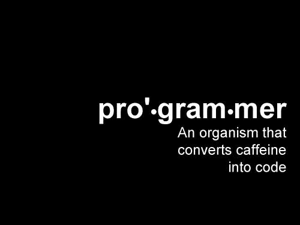

# 为什么每个程序员都需要一个导师

> 原文：<https://medium.com/hackernoon/why-every-coder-needs-a-mentor-78d59d21c7c>

Photo by [Sebastián León Prado](https://unsplash.com/@elmundoderabbit?utm_source=medium&utm_medium=referral) on [Unsplash](https://unsplash.com?utm_source=medium&utm_medium=referral)

我成长于一个印度家庭——我真的很幸运有我的父母作为我的导师和朋友在我人生的每一步指导我——贯穿我的童年甚至是我的学校生活。

在我人生的每一步，我的父母都在那里指导我，纠正我，指引我下一步的路。

总的来说，我对“编码”一直很热爱，我想把编程作为我的职业道路，我做到了。

Source: Meme Generator

# 节目编排者

“编码器”是一个非常通用的术语。任何对软件工作感兴趣的人都已经进入了软件行业。

在 2018 年，你甚至可能不需要去学校学习。只要[谷歌](https://hackernoon.com/tagged/google)你想学的任何东西。加入在线训练营或在线 MOOC。也许会跳到一个被篡改的路径上，比如纳米学位。

# 导师

去年，我决定尝试一下[深度学习纳米学位](https://hackernoon.com/a-self-driving-new-year-33284e592f35)。当时，没有任何 MOOC 公开教授深度学习，而且第二代似乎很棒。

uda city-在众多令人惊叹的产品中，它将我们与一位导师联系在一起，这位导师在我们的学习过程中帮助我们、指导我们并监督我们。然而，一旦你“毕业”，你将不得不和你的导师分道扬镳。

那么，一个“毕业生”或者不在 Udacity 学习道路上的人在做什么呢？

作为一名学习者，甚至是一名创造者，掌握或开始有多种途径，你需要有人能指导你，纠正你，并告诉你最适合你的途径:帮助增强你的信心，也让你自己保持现实检查。你需要一个导师。

计算机科学的任何领域都有巨大的深度，你很容易迷路。

# 与导师联系

与导师交流真的很难。

*   该领域的专业人士简直忙得不可开交。
*   很难找到可能有兴趣帮助你的人。
*   你不知道如何接近一个人。

## 我的 DL 导师

我的方法是用蛮力给我 Linkedin 上的每一个有着惊人个人资料并能给我指点的人发邮件。

足够幸运的是，我通过 Fast AI 社区找到了真正伟大的导师和朋友。

[Radek Osmulsk](https://twitter.com/radekosmulski) 我是这个社区中许多人灵感和帮助的惊人源泉。每当我在深度学习的道路上需要纠正或感到害怕时，Radek 总是帮助我并指导我。

图阿蒂尼·戈达尔也是一个非常好的朋友和导师。即使他真的忙于他的自由职业项目——无论何时我都会在 slack 或论坛上联系他。他总是会花时间来帮助我。

[卢卡斯·瓦兹奎](/@lgvaz)一个了不起的朋友和一个 RL 忍者，总是帮助我，也经常帮助我调试代码！

我很感激像他们这样的人，他们会花时间和精力来纠正和指导[的学习道路](https://hackernoon.com/the-only-undergrad-and-indian-to-be-invited-to-present-at-anaconda-conference-my-deep-learning-d4bde583ffa4?source=user_profile---------1----------------)，并总是帮助我纠正和完善我的[文章](https://hackernoon.com/dear-hackernoon-e53f335085eb)。

# 回馈社会

我一直是开放社区和开源本身的粉丝。以下是我努力回馈社区的方式:

人工智能星期六(AI Saturdays):我对分配给我的头衔感到非常自豪:“人工智能极客领袖”——我在论坛上和通过管理学习路径来帮助指导庞大的全球社区。

[mentor cruise](http://mentorcruise.com):mentor cruise 是一个让你与导师联系的专属平台。我是一名计算机视觉、深度学习导师，我试图分享我在自学过程中获得的一点点知识。

同时，我想把我的电子邮件留在这里，给任何想和我联系的人:sanyam.bhutani05@gmail.com

*如果你觉得这篇文章很有趣并且想保持联系，你可以在 Twitter 上找到我* [*这里*](http://twitter.com/bhutanisanyam1) *。*

[*订阅我的时事通讯，了解更多关于自动驾驶汽车、深度学习、计算机视觉和现在:飞行汽车的信息。*](http://tinyletter.com/sanyambhutani/)