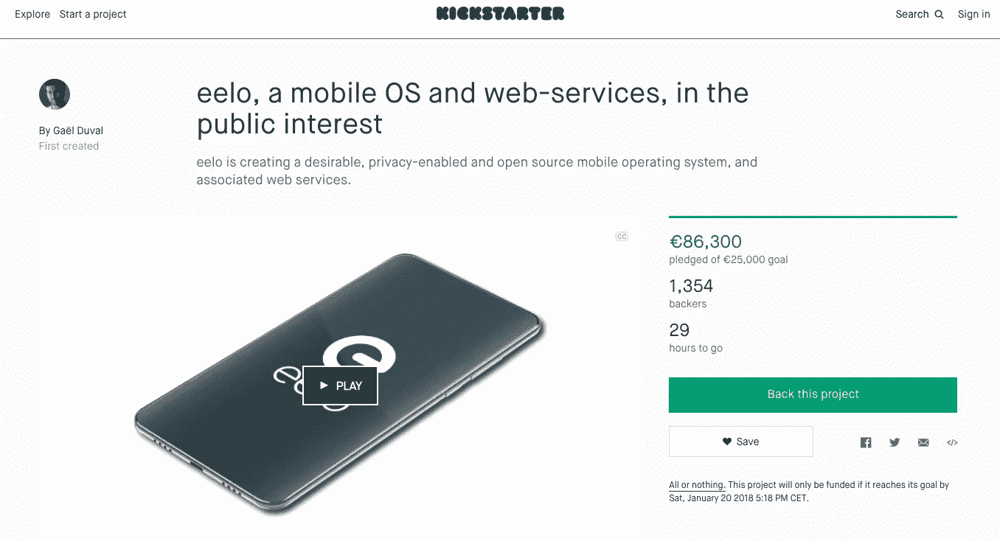
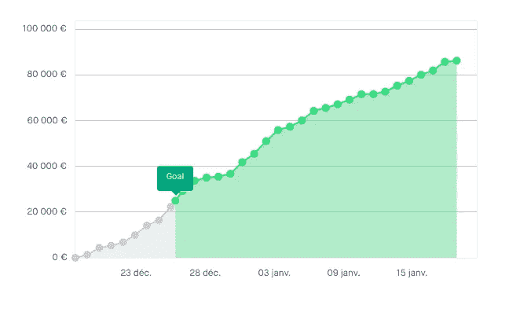

# 为什么每个企业家都应该尝试众筹活动

> 原文：<https://medium.com/hackernoon/why-every-entrepreneur-should-experiment-a-crowdfunding-campaign-bfcbe0e25166>

两个月前，当我创办 eelo . io 时，它引起了我的密友圈和职业关系的一些关注和好奇，但仅此而已。

这时我进入了双重考虑:

1-虽然我确定我会做这个项目，至少是为我自己，以一种“黑客模式”作为一个副业，但我不确定它是否会让很多人感兴趣。简而言之:我当时还不知道它所针对的“市场”。

2-我开始用我的个人资金资助这个项目，幸运或不幸的是，我不像埃隆·马斯克或理查德·布兰森那样财大气粗。所以我需要找到更多的钱来更好地完成这个项目，并在接下来的 6 到 12 个月里支持至少一个开发人员。

**以 AdWords** 开头

一个朋友建议我通过尝试一些广告词(是的，一些广告词)来评估 eelo 正在解决的“市场”。我做到了。我尝试了各种关键词，并仔细观察了促使人们访问我的两个不同登录页面的建议:一个侧重于面向隐私的移动操作系统，另一个侧重于面向隐私的网络服务。

令人惊讶的是，某些关键词的转化率非常高，几十个人开始注册这个项目。

当然，AdWords 是昂贵的，并且肯定不是获得一些真实曝光的最有效的方式。而且是谷歌:-(

**决定参加众筹活动**

在过去的几年里，我遇到了一些创业公司，他们做了一些众筹活动，结果好坏参半。我从这些经历中听到的最大错误之一是以“宗教模式”发起众筹运动，例如，认为你会把一切都放到网上，然后奇迹就会发生。事实上，许多众筹活动根本不起作用。

我开始和一个已经组织了一些活动的企业家朋友讨论做众筹活动的机会。我们一致认为 eelo 可能是一个很好的候选人来做一个(小的)竞选活动。

**这是大量的工作**

如果你有众筹专家的陪同，他们可以为你带来好的一揽子计划(并且会花你一大笔钱)，那么做一场众筹活动可能会很容易。但在我的情况下，我们只有两个人来做这件事，而且手段非常有限。甚至连配音都是自制的。

开始时最困难的部分，是问自己好的问题:

*   你的项目是什么:难点，你想如何解决它，…
*   你会如何用几句话讲述这个故事
*   你的受众是什么
*   你将如何沟通这个项目
*   定义财务目标

然后你设置一些里程碑和一个反向议程。然后也不会更好:无论你做什么或不做什么，时间都在流逝。

你必须在细节中定义一切，更糟糕的是:你必须做一个项目视频！我的竞选搭档在这方面有很好的技巧，但最终，我不得不面对镜头，这真的超出了我的适应范围:)

**开始……**

Kickstarter 需要几天时间来批准该活动。对我来说，只花了一天。然后，你必须按下“发射”按钮。

eelo on Kickstarter, 29 hours before the end of the campaign

按下启动按钮绝对没有实际效果:活动是公开的，但你可能要等几天，才会有人发现你的项目并决定支持它。

**在这一点上，你必须得到一些关注**

所以是时候接触新闻网站，接触记者，讲述你的故事了(实际上，我在竞选开始前就开始接触其中的一些了)。你必须在论坛上发布新闻，接受攻击性的评论，回答问题。最终，你会看到一些最初的贡献！

这里的关键点是**你真的必须把个人带到你的众筹活动中来。**不要指望平台会代替你去做！

就我而言，它在开始时加速相当快。但是我不确定我是否能达到最初的目标，这让我很有压力。

Eelo.io contributions history. The evolution is mostly driven by new press articles about the project.

众筹活动不仅仅是“筹集”资金

我从 eelo 众筹活动中学到的是，众筹活动最大的好处不是钱。

当然，这笔钱是强制燃料 eelo 的早期发展。但是最大的好处是:

*   我必须在开始时更好地定义 eelo 项目
*   我知道 eelo 正在解决一个真实且日益增长的问题/痛点(用户数据隐私)
*   我知道 eelo 有可能面向全球市场(进入的流量来自世界上大多数国家)
*   我比以前更清楚谁是 eelo 的支持者，以及他们的期望
*   如果我算上目前为止在网站上注册的人，eelo 有超过 3000 名支持者，这将有助于获得更多的曝光率
*   我有一个越来越多的媒体联系人名单，以后当我有关于 eelo 的重大新闻时，我会使用这些名单
*   我正在成为众筹专家；)更严重的是:我的技能在这上面提高了很多！

**创业者，去众筹吧！**

因此，我只能建议任何企业家发起一场众筹运动，如果这符合潜在市场或特定背景的话。你应该在合并之前，在进入企业家生态系统和企业家竞赛之前，在筹集资金交换股权之前就这样做。

大概 B2B 比 B2C 更难。但它会迫使你做每个企业家首先应该做的事情:找到并了解你的市场，这将更好地定义你的产品。

—盖尔·杜瓦尔(推特:[@盖尔 _ 杜瓦尔](https://twitter.com/gael_duval))

PS 本文原帖[到我个人网站](https://www.indidea.org/gael/blog/every-entrepreneur-experiment-crowdfunding-campaign/)