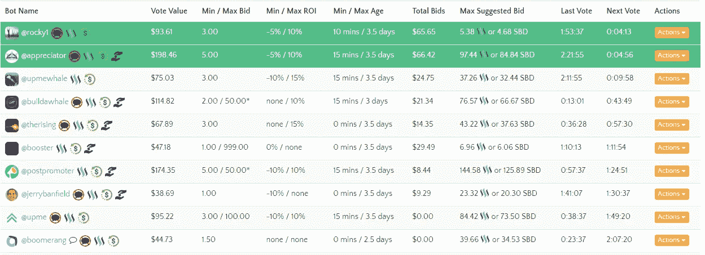

# 为什么每个 ICO 营销人员的工具包中都需要 Steemlt

> 原文：<https://medium.com/hackernoon/why-every-ico-marketer-needs-needs-steemlt-in-their-toolkit-51db2b8de057>

*在* [*Chainfuel 博客*](https://www.chainfuel.com/blog) *以及他们的免费电子书* [*上找到更多关于建立和运营一个成功的加密社区的有用资源:加密社区管理的 7 大支柱*](https://www.chainfuel.com/pillars) *。*

你们中的大多数人可能不知道 steemit.com 的存在，但是有几个理由让你一定要熟悉这个加密项目。Steemit 创建于 2016 年，是第一个加密社交网络，可以被描述为 Medium 和 Reddit 的混合。如果社区的其他人喜欢他们所写的内容，内容创作者可以赚取 Steem 和 Steem 美元。本质上，它被设计成博客的家，但是如果你成为其中的一员，你可以挖掘更多的潜力。

# 针对 audience‍

由于 Steemit 是一个基于加密的社交网络，大多数用户都是加密爱好者。有些人在那里尝试赚外快，但几乎整个社区都非常看好 crypto，喜欢了解新项目，尤其是那些可以为他们带来利润的项目。这就是你和你的 [crypto](https://hackernoon.com/tagged/crypto) 项目应该介入的地方。

在 Steemit 上创建账户是免费的，任何人都可以这样做。一旦你成为社区的一员，你将有机会写下你的项目，并以正确的类别展示给正确的观众。就像 Reddit 一样，Steemit 也有“类别”,你可以关注并发现相关内容。如果你尽可能以最好的方式展示你的项目，并确保将它发布在正确的类别中(你可以选择多达 5 个)，你可以确定你接触到了正确的受众。

# 搜索引擎优化

一个不为人知的事实是，Steemit 现在是世界上排名前 2300 的网站之一。对于 SEO 和 Google 索引来说，这是一件大事。你可以很容易地用 Alexa 或类似的网站来检查这一点。

*Source:* [*Alexa.com*](http://Alexa.com)

这可能是最大的反向链接机会，你可以找到免费的。如果你在域名权威网站上运行这些数字，Steemit 目前是 82。与成立于 2012 年的 Medium 相比，Steemit 的域名权威仅落后 10 个百分点。任何有 SEO 知识的人都会告诉你，这是一件大事。从像 Steemit 这样的网站获得反向链接会对你的网站在谷歌上的排名有很大的帮助。

Steemit 的创建者考虑到了所有这些，所以为了让你的反向链接成为 do-follow，你需要通过一个 upvote 值的最小阈值。这可以通过吸引平台上拥有大量投票权的人的注意来实现，或者通过利用向上投票机器人来实现，只需 10-20 美元即可完成这项工作。这项投资将在 7 天内返还到您在 Steem power 的账户余额中。 **‍**

# “自由”promotion‍

如上所述，该平台每天都有许多独特的观点，你可以通过在“营销”方面的少量投资来接触到这些用户中的大多数。Upvote 机器人在 Steemit 上很常见，它们被平台上最有影响力的人使用。他们帮助你的帖子出现在所选类别的前 10 名，这样你就能接触到社区中的每一个用户。如果你想被尽可能多的人注意到，一定要以最好的方式利用这些机器人。

[Bot tracker](https://steembottracker.com/) 是一个简洁的网站，可以跟踪所有的 Bot 和当前的投标规模。“投票价值”是机器人的总投票权，“总出价”是在这一轮投票中花费的 [Steem](https://coinmarketcap.com/currencies/steem/) 或 [Steem 美元](https://coinmarketcap.com/currencies/steem-dollars/)的总数。在购买 upvotes 之前，一定要熟悉所有的参数。

一旦你掌握了诀窍，你甚至可以开始为你的帖子获得不错的投资回报，同时获得完全免费的推广。花在 upvotes 上的每一分钱都会转换成 Steem 的力量，累积在你的 Steem 余额上。在几周内，你可以在任何你想要的密码上获得比你投资更多的回报，同时也可以把你的博客文章推到顶端。

# 共同利益

如果你正在运行一个加密项目，那么你肯定希望整个加密社区蓬勃发展，给这个领域带来更多的关注。通过利用 Steemit 为自己谋利，你也将帮助其他人发现这个平台，并可能开始使用它。这里有一个共同的利益，许多加密项目都被遗漏了。

除此之外，如果你使用这个平台，你有很大的机会与其他已经存在的加密项目建立伙伴关系。如果你花时间去了解这个社区和这个平台的整体，你会发现无限的可能性。

# 这并不耗费时间

我们都知道时间是每个项目和业务的一个重要因素。如果你花太多时间在没有结果的事情上，这可以被认为是浪费时间，没有人希望这样。Steemit 绝对是相反的。利用它的最有效的方法是尽可能地熟悉它，但是如果你手头没有那么多时间，你可以用它来转贴你已经在网站上使用的内容。这可以是接触你的目标受众的另一种方式，而且每天只需要你不到 10 分钟的时间。

# 在我们结束这个 up‍之前，简单回顾一下

Steemit 有利于你的项目曝光，你的网站的搜索引擎优化，它还可以帮助你接触到合适的观众和潜在的投资者。所有这些都是免费的，所以没有理由错过这个机会。更多的曝光带来更多的品牌知名度，我们都同意这是当今时代的一个非常重要的因素。

如果你不能在一个像你的竞争对手一样快速发展的空间中保持相关性。这也是为什么您应该将 Steemit 作为您的工具包的重要组成部分的原因之一。

*艾伦·万托艾是*[*chain fuel*](https://www.chainfuel.com)*的联合创始人之一，这是一家为加密初创公司提供社区管理和设计服务的机构。*

*你可以在他们的* [*博客*](https://www.chainfuel.com/blog) *以及他们的免费电子书* [*上找到更多关于建立和运营一个成功的加密社区的有用资源:加密社区管理的 7 大支柱*](https://www.chainfuel.com/pillars) *。*