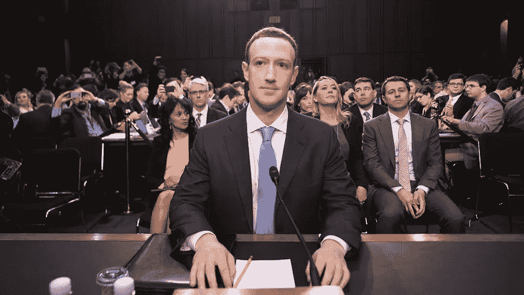
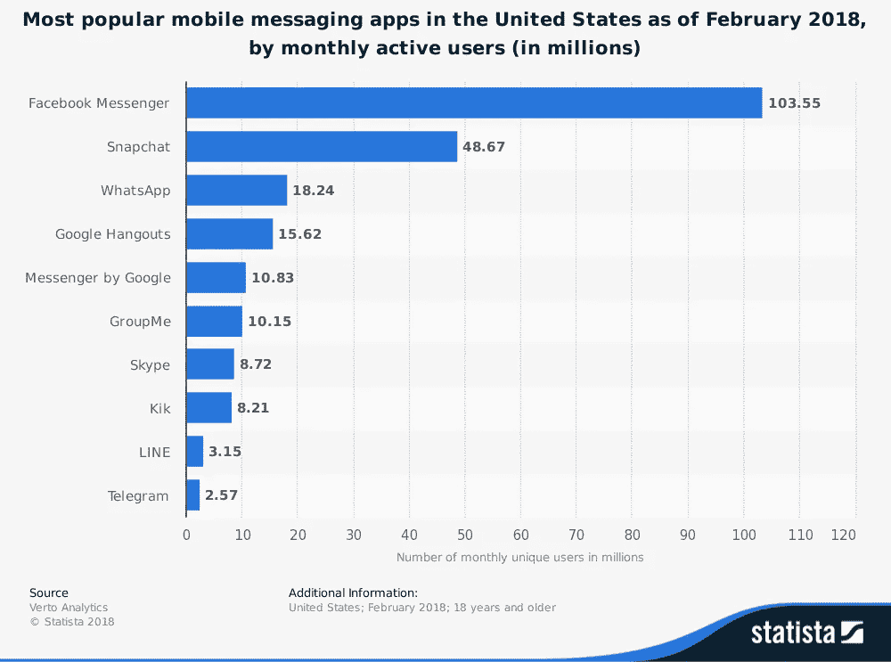

# 为什么脸书是技术隐私问题的完美代表

> 原文：<https://medium.com/hackernoon/why-facebook-is-the-perfect-representative-of-techs-privacy-problem-5e5c29063d47>

除了大规模的剑桥分析公司丑闻，是什么让 T2 脸书回答了关于大型科技公司收集数据的问题？作为[互联网的隐私恶棍](https://choosetoencrypt.com/news/facebook-is-not-internets-privacy-villain/)，脸书并不是唯一一个，其他公司可以说比脸书收集了更多的信息。让我们来看看为什么脸书在回答参议院的问题时发言。

## 人们知道马克·扎克伯格是谁

马克·扎克伯格可能是世界上最知名的首席执行官之一。感谢 [*《社交网络*](http://www.imdb.com/title/tt1285016/) 》这部讲述扎克如何创立脸书的电影，人们比其他任何一位 CEO 都更了解他的故事。

其他首席执行官:Alphabet 的拉里·佩奇、谷歌的桑德尔·皮帅、亚马逊的杰夫·贝索斯和推特的杰克·多西在科技领域都很有名。然而，大多数人不会亲自认出他们，也不知道他们职位以外的事情。扎克伯格是一个偶像，他拥抱聚光灯——即使人们批评他的真实性。

## 人们每天都在使用脸书

平均每天有 40 亿人登录脸书，被认为是每日活跃用户。互联网用户可能会对脸书的担忧产生共鸣，因为他们经常使用这项服务，并且与它有着深厚的联系。

给脸书增加隐私保护是人们可以直接联系和理解的事情。

## 人们同意脸书的隐私政策和服务条款

当用户创建账户时，脸书使用广泛的隐私政策。然而，脸书上的许多功能都是退出的，这意味着它们在默认情况下是启用的，用户必须选择关闭它们。

很少有用户真正阅读这些政策，这是一个问题。如果人们不能很容易地理解他们的数据是如何被使用的，隐私政策对用户来说就没有达到他们的目的(只是合法地保护公司)。

## 用户通常乐于分享脸书的信息

人们乐于在脸书上分享内容。无论是家人的照片还是状态更新，放在网上已经成为脸书用户的常态。因为人们将脸书视为一个社会环境，他们在分享信息时会得到强化——喜欢、分享、评论。

> 让你的在线状态为你服务，而不是与你作对。雇主和招生人员报告说，互联网可以成为申请人展示其才华、专业精神和社交能力的好地方。
> 
> ——来源:【DigitalResponsibility.org 

填写脸书的个人资料包括公开你的某些信息，至少向你的朋友公开。相比之下，人们不会把分享信息与 T4、谷歌或亚马逊联系在一起。

## 脸书的数据收集远远超出了它的核心产品

脸书表示，它已经删除了这些目标选项，但在 2015 年之前，用户可以在“艾滋病毒或艾滋病诊断”、“勃起功能障碍”和“暴食障碍意识”类别下成为目标。脸书将如何通过其核心产品收集这些数据？

> “通过使用人工智能分析你的行为，脸书几乎可以了解你的任何事情，”电子前沿基金会(一个数字权利非营利组织)的首席计算机科学家彼得·艾克斯莱说。“这些知识对广告和宣传来说都是完美的。脸书会阻止自己了解人们的政治观点或其他敏感事实吗？”

脸书使用它的许多应用程序和产品来收集用户及其关系的信息。

**脸书的产品线**

*   脸谱网
*   照片墙
*   送信人；通信员
*   WhatsApp
*   脸书的《Internet.org》
*   眼睛

## 脸书实际上没有直接竞争对手

马克·扎克伯格可能坚持认为脸书不是垄断者，但是数字不会说谎。有些公司提供了脸书的部分服务，但没有一家是真正的替代品。

甚至那些自称为脸书的 T2 替代品的公司也只提供了脸书的一部分特色。没有一个能与脸书的[22 亿用户](https://www.statista.com/statistics/264810/number-of-monthly-active-facebook-users-worldwide/)相提并论。

## 脸书的透明度很低

不幸的是，因为脸书几乎没有竞争，他们不需要提供透明度。用户已经证明，即使他们希望该平台分享更多关于它如何工作的信息，他们也不愿意删除他们的账户。

脸书在使用条款中披露了其收集的信息。然而，用户经常惊讶地得知社交网络与第三方分享其他信息，如广告商或其他公司，如[剑桥分析](https://choosetoencrypt.com/privacy/why-the-facebook-data-scandal-wont-happen-to-us/)。

Source: [Statista.com](https://www.statista.com/statistics/258749/most-popular-global-mobile-messenger-apps/)

该公司拥有 Facebook Messenger 和 WhatsApp，是目前移动通讯市场上最大的玩家。短信作为一个市场是独一无二的，因为用户依赖其他人使用与他们相同的应用程序进行交流。如果用户想要切换到不同的消息应用程序，在大多数情况下，他们需要与他们通信的人也进行切换。

## 结论

因此，脸书的名人 CEO，庞大的用户群和垄断地位，使其成为整个科技行业的典范。因为脸书在互联网和每次浏览会话中根深蒂固，人们可以清楚地看到数据收集的效果。脸书如何回应立法者的问题将影响整个互联网和科技行业隐私法规的未来。

# 阅读更多

 [## 谷歌的数据隐私问题

### 谷歌母公司 Alphabet 的市值为 7120 亿美元。在谷歌的产品范围内，有七种…

hackernoon.com](https://hackernoon.com/data-privacy-concerns-with-google-b946f2b7afea)  [## 脸书可能有同意，但没有批准-选择加密

### 在 Ars Technica 揭露脸书跟踪电话和…之后，脸书的《纸牌屋》今天又一次暴跌

choosetoencrypt.com](https://choosetoencrypt.com/privacy/facebook-may-have-consent-but-not-approval/)  [## 脸书不会解决互联网更大的隐私问题——选择加密

### 脸书刚刚修改了它的隐私设置和使用条款，主要是为了回应那些对…

choosetoencrypt.com](https://choosetoencrypt.com/privacy/facebook-wont-fix-the-internets-privacy-problem/)