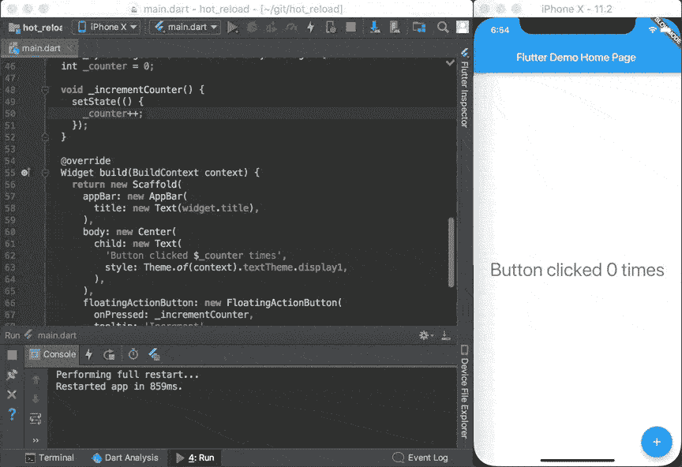
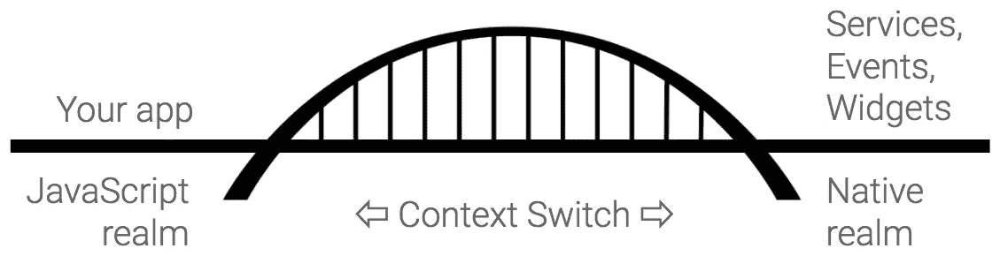

# 为什么 Flutter 使用 Dart

> 原文：<https://medium.com/hackernoon/why-flutter-uses-dart-dd635a054ebf>

任何语言学家都认为一个人说的自然语言[会影响他们的思维方式](https://en.wikipedia.org/wiki/Linguistic_relativity)。同样的概念是否适用于[计算机语言](https://en.wikipedia.org/wiki/Programming_language)？使用不同编程语言的程序员经常会提出完全不同的问题解决方案。作为一个更极端的例子，计算机科学家[删除了 *goto* 语句](https://homepages.cwi.nl/~storm/teaching/reader/Dijkstra68.pdf)以鼓励更结构化的程序(与[小说 *1984*](https://en.wikipedia.org/wiki/Nineteen_Eighty-Four) 中极权主义领导人从自然语言中删除异端词汇以消除 [*思想罪*](https://en.wikipedia.org/wiki/Thoughtcrime) 不太一样，但你明白这个意思)。

这跟[扑](https://flutter.io/)和[镖](https://www.dartlang.org/)有什么关系？实际上相当多。早期的 Flutter 团队评估了十几种语言，选择 Dart 是因为它符合他们构建用户界面的方式。

Dart 是开发者爱 Flutter 的一大原因。正如一条推文所说:

以下是 Dart 特性的快速列表，这些特性共同使其成为 Flutter 不可或缺的要素:

*   Dart 是 AOT(提前)编译成的快速、可预测的原生代码，这使得几乎所有的 Flutter 都可以用 Dart 编写。这不仅使 Flutter 速度更快，几乎所有东西(包括所有的小部件)都可以定制。
*   Dart 还可以进行 JIT (Just In Time)编译，以实现异常快速的开发周期和改变游戏规则的工作流(包括 Flutter 流行的亚秒级有状态热重装)。
*   Dart 使创建以 60fps 运行的平滑动画和过渡更加容易。Dart 可以在没有锁的情况下进行对象分配和垃圾收集。和 JavaScript 一样，Dart 避免了抢占式调度和共享内存(以及锁)。因为 Flutter 应用被编译成本机代码，所以它们不需要领域之间的慢速桥(例如，JavaScript 到本机)。他们也启动得更快。
*   Dart 允许 Flutter 避免使用独立的声明式布局语言，如 JSX 或 XML，或者独立的可视化界面构建器，因为 Dart 的声明式、编程式布局易于阅读和可视化。而且所有的布局都在一种语言和一个地方，很容易让 Flutter 提供先进的工具，使布局变得轻而易举。
*   开发人员发现 Dart 特别容易学习，因为它具有静态和动态语言用户都熟悉的特性。

并非所有这些特性都是 Dart 独有的，但它们的组合达到了一个*最佳点*，使得 Dart 在实现 Flutter 时非常强大。以至于很难想象 Flutter 在没有 Dart 的情况下还会如此强大。


Flutter loves Dart

本文的其余部分将更深入地介绍 Dart 的许多特性(包括它的标准库)，这些特性使得 Dart 成为实现 Flutter 的*最佳语言。*

# 编译和执行

*【如果你已经了解静态与动态语言、AOT 和 JIT 编译以及虚拟机等主题，你可以跳过这一部分。]*

历史上，计算机语言被分为两类: [*静态*语言](https://en.wikipedia.org/wiki/Compiled_language)(例如 Fortran 或 C，其中变量在编译时静态类型化)，以及 [*动态*语言](https://en.wikipedia.org/wiki/Interpreted_language)(例如 Smalltalk 或 JavaScript，其中变量的类型可以在运行时改变)。静态语言通常被编译以产生用于目标机器的本机代码(或*汇编代码*)程序，这些程序在运行时由硬件直接执行。动态语言由解释器执行，不产生机器语言代码。

当然，事情最终变得复杂得多。一个[虚拟机](https://en.wikipedia.org/wiki/Virtual_machine) (VM)的概念变得流行起来，它实际上只是一个在软件中模仿硬件机器的高级解释器。虚拟机使语言移植到新的硬件平台变得更加容易。在这种情况下，VM 的输入语言通常是一种[中间语言](https://en.wikipedia.org/wiki/Intermediate_representation#Intermediate_language)。比如将一种编程语言(比如 [Java](https://en.wikipedia.org/wiki/Java_(programming_language)) )编译成中间语言( [*字节码*](https://en.wikipedia.org/wiki/Java_bytecode) )，然后在 VM 上执行(即 [*JVM*](https://en.wikipedia.org/wiki/Java_virtual_machine) )。

此外，现在还有 [*实时* (JIT)编译器](https://en.wikipedia.org/wiki/Just-in-time_compilation)。JIT 编译器在程序执行期间运行，即时编译。在程序创建期间(运行时之前)执行的原始编译器现在被称为提前[*(AOT)编译器*](https://en.wikipedia.org/wiki/Ahead-of-time_compilation)*。*

*一般来说，只有静态语言才适合 AOT 编译成本机代码，因为机器语言通常需要知道数据的类型，而在动态语言中，数据的类型不是预先确定的。因此，动态语言通常被解释或 JIT 编译。*

*当 AOT 编译在开发期间完成时，它不可避免地导致更慢的开发周期(对程序进行更改和能够执行程序以查看更改结果之间的时间)。但是 AOT 编译使得程序可以更加可预测地执行，并且在运行时不需要停下来进行分析和编译。AOT 编译的程序也开始执行得更快(因为它们已经被编译过了)。*

*相反，JIT 编译提供了更快的开发周期，但是会导致更慢或更不稳定的执行。特别是，JIT 编译器有较慢的启动时间，因为当程序开始运行时，JIT 编译器必须在执行代码之前进行分析和编译。研究表明，如果开始执行的时间超过几秒钟，许多人就会放弃一个应用程序。*

*背景信息到此结束。将 AOT 和 JIT 编译的优点结合起来不是很棒吗？请继续阅读。*

## *编译和执行 Dart*

*在致力于 Dart 之前，Dart 团队成员已经在高级编译器和虚拟机方面做了开创性的工作，既包括动态语言(如 JavaScript 的 [V8 引擎](https://en.wikipedia.org/wiki/Chrome_V8)和 Smalltalk 的 [Strongtalk](https://en.wikipedia.org/wiki/Strongtalk) )也包括静态语言(如 Java 的 [Hotspot 编译器](https://en.wikipedia.org/wiki/HotSpot))。他们利用这一经验使 Dart 在编译和执行方面异常灵活。*

*Dart 是极少数同时适合 AOT 和 JIT 编译的语言之一(也许是唯一的“主流”语言)。支持这两种编译为 Dart 和(尤其是)Flutter 提供了显著的优势。*

*JIT 编译在开发过程中使用，使用特别快的编译器。然后，当一个应用程序准备发布时，它被编译成 AOT。因此，在高级工具和编译器的帮助下，Dart 可以提供两个世界中最好的东西:极快的开发周期、*和*快速的执行和启动时间。*

*Dart 在编译和执行方面的灵活性不止于此。例如，Dart 可以被[编译成 JavaScript](https://webdev.dartlang.org/tools/dart2js) ，这样它就可以被浏览器执行。这允许移动应用和 web 应用之间的代码重用。开发人员报告称，他们的移动应用和网络应用之间的代码重用率高达 70%。Dart 也可以在服务器上使用，要么编译成本机代码，要么编译成 JavaScript 并与 [node.js](https://nodejs.org/en/) 一起使用。*

*最后， [Dart 还提供了一个独立的 VM](https://www.dartlang.org/dart-vm/tools/dart-vm) ，它使用 Dart 语言本身作为它的中间语言(本质上就像一个解释器)。*

*Dart 可以被有效地编译成 AOT 或 JIT，解释或转换成其他语言。Dart 的编译和执行不仅异常灵活，尤其是*快*。*

*下一节将举例说明 Dart 的编译速度如何改变游戏规则…*

## *有状态热重装*

*Flutter 最受欢迎的特性之一是其极快的*热重装*。在开发过程中，Flutter 使用一个 JIT 编译器，它可以在一秒钟内重新加载并继续执行代码。只要有可能，应用程序状态会在重新加载时保留，因此应用程序可以从停止的地方继续运行。*

**

*Flutter’s sub-second stateful hot reload*

*除非您亲身经历过，否则很难理解快速(可靠)热重装在开发过程中有多重要。开发人员报告说，这改变了他们创建应用程序的方式，他们形容这就像[把他们的应用程序画得栩栩如生](https://github.com/zilongc/blog/issues/3)。*

*下面是一位[移动应用开发者对 Flutter 的热重装](/@lets4r/the-fluture-is-now-6040d7dcd9f3)的评价:*

> *我想测试热重装，所以我改变了一个颜色，保存了我的修改，并…爱上了❤️！*
> 
> *这个功能真的很神奇。我认为 Visual Studio 中的**编辑&继续**很好，但这只是令人震惊的**。只有这样，我认为移动开发人员的工作效率才能提高两倍。***
> 
> ***对我来说，这真的是一个游戏规则的改变者。当我部署我的代码并花费很长时间时，我失去了注意力，我做了其他事情，当我回到模拟器/设备时，我已经失去了我想要测试的东西的轨迹。比损失 5 分钟移动一个控件 2px 更让人沮丧的是什么？随着颤振，这不再存在。***

***Flutter 的 hot reload 让尝试新想法或实验替代方案变得容易得多，为创造力提供了巨大的推动力。***

***到目前为止，我们已经讨论了 Dart 如何为开发人员做得更好。下一部分是关于 Dart 如何使创建让用户满意的流畅应用变得更容易。***

# ***避开 jank***

***一个*快速的*应用程序很棒，但是一个*流畅的*应用程序更好。即使是超快的动画，如果不流畅也会很难看。然而，预防抽筋可能很困难，因为有太多不同的原因。Dart 有许多特性可以避免许多导致 jank 的常见问题。***

***当然，(像任何语言一样)用 Flutter 写一个 janky app 还是可以的；Dart 提供了更好的可预测性，让开发者能够更好地控制应用的流畅度，从而更容易提供最佳用户体验，无一例外。***

***[结果](https://code.tutsplus.com/tutorials/developing-an-android-app-with-flutter--cms-28270)？***

> ***以 60 fps 的速度运行，用 Flutter 创建的用户界面比用其他跨平台开发框架创建的用户界面性能好得多。***

***不仅比跨平台应用更好，而且和最好的本地应用一样好:***

> ***UI 黄油光滑…我从来没见过这么光滑的安卓应用。***

## ***AOT 编译与“桥”***

***我们已经讨论过一个有助于保持流畅的特性，那就是 Dart 能够被 AOT 编译为本机代码。预编译的 AOT 代码比 JIT 更可预测，因为在运行时没有暂停来执行 JIT 分析或编译。***

***然而，AOT 编译代码还有一个更大的优势，那就是避免“JavaScript 桥”。当动态语言(如 JavaScript)需要与平台上的本机代码进行互操作时，[它们必须通过桥](https://hackernoon.com/whats-revolutionary-about-flutter-946915b09514)进行通信，这[导致上下文切换](/@talkol/performance-limitations-of-react-native-and-how-to-overcome-them-947630d7f440)必须保存特别大量的状态(可能保存到辅助存储)。这些[上下文切换](https://en.wikipedia.org/wiki/Context_switch)是双重打击，因为它们不仅会减慢速度，还会导致严重的问题。***

******

***“The Bridge”***

***注意:即使是编译后的代码也可能需要一个接口来与平台代码对话，这也可以称为桥，但它通常比动态语言所需的桥快几个数量级。此外，因为 Dart 允许将小部件之类的东西移动到应用程序中，所以减少了过桥的需要。***

## ***抢先调度、时间分片和共享资源***

***大多数支持多并发执行线程的计算机语言(包括 Java、Kotlin、Objective-C 和 Swift)都是使用[抢占](https://en.wikipedia.org/wiki/Preemption_(computing))在线程间切换。每个线程都被分配了一个“时间片”来执行，如果超过了分配给它的时间，线程就会被上下文切换抢占。然而，如果抢占发生在线程间共享的资源(如内存)被更新时，那么这会导致[竞争条件](https://en.wikipedia.org/wiki/Race_condition)。***

***竞争条件是一个双重打击，因为它们会导致严重的错误，包括使你的应用崩溃和导致数据丢失，并且它们特别难以发现和修复，因为它们依赖于独立线程的[相对计时。当您在调试器中运行应用程序时，竞争条件停止显现是很常见的。](https://en.wikipedia.org/wiki/Race_condition#Software)***

***修复竞争状况的典型方法是使用[锁](https://en.wikipedia.org/wiki/Lock_(computer_science))来保护共享资源，防止其他线程执行，但锁本身会导致 jank，或[甚至更严重的问题](https://en.wikipedia.org/wiki/Dining_philosophers_problem)(包括[死锁](https://en.wikipedia.org/wiki/Deadlock)和[饥饿](https://en.wikipedia.org/wiki/Starvation_(computer_science)))。***

***Dart 采取了不同的方法来解决这个问题。Dart 中被称为*的线程隔离*，不共享内存，这避免了对大多数锁的需要。隔离通过通道传递消息进行通信，这类似于 [Erlang](https://www.erlang.org/) 中的 *actors* 或 JavaScript 中的 *web workers* 。***

***像 JavaScript 一样，Dart 是单线程的，这意味着它根本不允许抢占。相反，线程显式地让步(使用 [async/await、Futures](https://www.dartlang.org/tutorials/language/futures) 或 [Streams](https://www.dartlang.org/tutorials/language/streams) )。这给了开发人员更多的执行控制权。单线程帮助开发人员确保关键功能(包括动画和过渡)在没有抢占的情况下执行完成。这不仅对用户界面来说是一个很大的优势，对其他客户端-服务器代码也是如此。***

***当然，如果开发人员忘记让出控制权，这会延迟其他代码的执行。然而，我们发现，忘记让步通常比忘记锁定更容易发现和修复(因为竞争条件很难发现)。***

## ***分配和垃圾收集***

***jank 的另一个严重原因是垃圾收集。事实上，这只是访问共享资源(内存)的一个特例，在许多语言中，这需要使用锁。但是当空闲内存被收集时，锁可能会[阻止整个应用程序运行](https://en.wikipedia.org/wiki/Tracing_garbage_collection#Stop-the-world_vs._incremental_vs._concurrent)。然而，Dart 几乎可以在所有时间*执行垃圾收集，而不需要锁*。***

***Dart 使用高级的[分代垃圾收集和分配方案](/flutter-io/flutter-dont-fear-the-garbage-collector-d69b3ff1ca30)，这对于分配许多短期对象来说特别快(非常适合像 Flutter 这样的反应式用户界面，它为每一帧重建不可变的视图树)。Dart 可以通过一次指针碰撞来分配对象(不需要锁)。同样，这导致平滑滚动和动画，没有 jank。***

# ***统一布局***

***Dart 的另一个好处是，Flutter 不会在程序和额外的模板或布局语言(如 JSX 或 XML)之间分割布局，也不需要单独的可视化布局工具。下面是一个简单的颤振视图，用 Dart 编写:***

```
***new Center(child:
  new Column(children: [
    new Text('Hello, World!'),
    new Icon(Icons.star, color: Colors.green),
  ])
)***
```

******

***A view in Dart and what it produces***

***请注意，可视化该代码产生的输出是多么容易(即使您没有使用 Dart 的经验)。***

***请注意，现在 Flutter 使用 Dart 2，布局变得更加简单和清晰，因为`new`关键字是可选的，所以静态布局看起来更像是用声明性布局语言编写的，如下所示:***

```
***Center(child:
  Column(children: [
    Text('Hello, World!'),
    Icon(Icons.star, color: Colors.green),
  ])
)***
```

***然而，我知道你可能在想——缺乏专业布局语言的*怎么能被称为优势*呢？但它实际上是一个游戏改变者。下面是一位开发者在一篇名为“[为什么原生应用开发者应该认真看待 Flutter](https://hackernoon.com/why-native-app-developers-should-take-a-serious-look-at-flutter-e97361a1c073) ”的文章中写的内容。*****

> ***在 Flutter 中，仅使用 Dart 代码定义布局。没有 XML /模板语言。也没有视觉设计师/故事板工具。***
> 
> ***我的直觉是，听到这个，你们中的一些人甚至会有点畏缩。显然，这也是我的反应。使用可视化工具进行布局不是更容易吗？用代码写各种约束逻辑不会让事情过分复杂吗？***
> 
> ***给我的答案竟然是**不**。好家伙！真是大开眼界。***

***回答的第一部分就是上面提到的热重装。***

> ***我怎么强调都不为过，这比 Android 的 Instant Run 或任何类似的解决方案领先了好几光年。它只是工作，甚至在大型非平凡的应用程序。而且是疯狂的快。这就是 Dart 给你的力量。***
> 
> ***实际上，这使得可视化编辑器界面变得多余。我一点都没有错过 XCode 相当不错的自动布局**。*****

*****Dart 创建简洁易懂的布局，而“疯狂快速”的热重装让您可以立即看到结果。这包括布局中的非静态部分。*****

> *****因此，我用 Flutter (Dart)编写布局的效率比 Android/XCode 都高。一旦你掌握了它(对我来说，这意味着几个星期)，因为很少发生上下文切换，所以有一个实质性的开销减少。人们不必切换到设计模式，选择鼠标并开始四处点击。然后想知道某件事是否必须通过编程来完成，如何实现等等。一切都是程序化的。API 设计得非常好。它很快变得直观，并且比 auto layout / layout XMLs 提供的构造强大得多。*****

*****例如，下面是一个简单的列表布局，它在每隔一项之间添加一个分隔线(水平线)，这是以编程方式定义的:*****

```
*****return new ListView.builder(itemBuilder: (context, i) {
  if (i.isOdd) return new Divider(); 
  // rest of function
});*****
```

*****在 Flutter 中，所有布局都存在于一个地方，不管是静态布局还是程序化布局。和[新的镖工具](https://groups.google.com/forum/#!topic/flutter-dev/lKtTQ-45kc4)，包括颤振检查器和大纲视图(利用所有布局在一个地方)，使复杂，美丽的布局更加容易。*****

# *****Dart 是专有语言吗？*****

*****不，Dart(像 Flutter 一样)是完全开源的，有一个干净的许可证，也是一个 [ECMA 标准](https://www.ecma-international.org/publications/standards/Ecma-408.htm)。Dart 在谷歌内外都很受欢迎。在谷歌内部，它是发展最快的语言之一，被 Adwords、Flutter、 [Fuchsia](https://github.com/fuchsia-mirror) 等使用；在外部，Dart 存储库有 100 多个外部提交者。*****

*****Dart 开放性的一个更好的指标是谷歌之外的社区的增长。例如，我们看到来自第三方的关于 Dart(包括 Flutter 和 AngularDart)的文章和视频源源不断，我在本文中引用了其中的一些。*****

*****除了 Dart 本身的外部提交者之外，[公共 Dart 包存储库](https://pub.dartlang.org/)中还有超过 3000 个包，包括 Firebase、Redux、RxDart、国际化、加密、数据库、路由、集合等库。*****

# *****Dart 程序员会很好找吗？*****

*****如果知道 Dart 的程序员不多，会不会更难找到合格的程序员？具有讽刺意味的是，Dart 使得寻找程序员变得更加容易，因为它是一种非常容易学习的语言。已经了解 Java、JavaScript、Kotlin、C#或 Swift 等语言的程序员几乎可以立即开始用 Dart 编程。最重要的是，hot reload 鼓励用户玩 Dart 和尝试新事物，这使得学习 Dart 更快更愉快。*****

*****下面是一位程序员在一篇名为“[为什么 Flutter 将在 2018 年](https://codeburst.io/why-flutter-will-take-off-in-2018-bbd75f8741b0)起飞”的文章中所说的:*****

> *****[Dart](https://www.dartlang.org/) ，用于开发 Flutter 应用的语言**很蠢——简单易学**。例如，Google 在创建像 Go 这样简单的、文档良好的语言方面有经验。到目前为止，对我来说，Dart 让我想起了 Ruby，学习它是一种乐趣。它不仅适用于手机，也适用于网络。*****

*****来自另一篇关于旋舞和飞镖的文章，题为《[为什么旋舞？而不是 framework X？或者更好的是为什么我要全力以赴。](/@franzsilva/why-flutter-and-not-framework-x-or-better-yet-why-im-going-flutter-all-in-b484ecb25336)*****

> *****Flutter 也使用 google 开发的 Dart 语言，老实说，我并不喜欢 C#或 JAVA 这样的强类型语言，但我不知道为什么 Dart 编写代码的方式看起来不同。我觉得写它很舒服。也许是因为它学起来很简单，也很直白。*****

*****通过广泛的 UX 研究和测试，Dart 被特别设计为熟悉和易于学习。例如，在 2017 年上半年，Flutter 团队与八名开发人员进行了一项 UX 研究。我们给了他们一个简短的颤振介绍，然后让他们放松了一个小时左右，创造了一个简单的观点。所有的参与者都能够立即开始编程，尽管他们以前从未使用过 Dart。他们专注于写反应性的观点，而不是语言。[飞镖刚刚起作用](https://www.dartlang.org/guides/get-started)。*****

*****最后，一名参与者(在这项任务中进步特别大)没有提到任何关于语言的事情，所以我们问他们是否意识到他们在使用什么语言。他们不知道。语言*无关紧要*；他们在几分钟内就用 Dart 编程了。*****

*****学习一个新系统最困难的部分通常不是学习语言，而是学习所有的库、框架、工具、模式和编写好代码的最佳实践。Dart 库和工具非常好，并且有很好的文档记录。一篇文章宣称“作为奖励，他们也非常小心地维护他们的代码库，他们有我见过的最好的文档。”学习 Dart 所花费的一点点努力很容易被学习其余部分所节省的时间所弥补。*****

*****作为直接证据，谷歌内部的一个大型项目希望将他们的移动应用移植到 iOS。他们打算雇佣一些 iOS 程序员，但最终决定尝试 Flutter。他们监测了开发人员在 Flutter 上达到速度所需的时间。他们的结果显示，一名程序员可以在三周内学会飞镖*和*颤振并变得高效。相比之下，他们之前观察到仅让程序员熟悉 Android 就需要五周时间(更不用说他们还必须雇佣和培训 iOS 开发人员)。*****

*****最后，文章“[我们为什么选择 Flutter 以及它如何让我们的公司变得更好](/@matthew.smith_66715/why-we-chose-flutter-and-how-its-changed-our-company-for-the-better-271ddd25da60)”来自一家公司，该公司将其大型企业应用程序迁移到所有三个平台(iOS、Android 和 web)上的 Dart。他们的结论是:*****

> *****更容易雇佣。我们现在寻求最佳候选人，不管他们是来自网络、iOS 还是 Android。*****
> 
> *****我们现在有 3 倍的带宽，因为我们所有的团队都整合在一个代码基础上。*****
> 
> *****知识共享空前高涨*****

*****通过使用 Dart 和 Flutter，他们的生产率提高了三倍。考虑到他们之前的所作所为，这并不奇怪。像许多公司一样，他们利用*独立的语言、工具和程序员为每个平台(web、iOS 和 Android)开发独立的应用程序*。改用 Dart 意味着他们不再需要雇佣三种不同的程序员。他们很容易将现有的程序员转移到 Dart。*****

*****他们和其他人发现，一旦程序员开始使用 Flutter，他们往往会[爱上 Dart](https://traversoft.com/2017/06/07/talk-on-dart-and-flutter/) 。他们喜欢简洁的语言，不拘泥于礼节。他们喜欢[语言特性](/@lukeaf/flutter-doesnt-need-kotlin-or-anything-else-5773965d5905)，比如级联、命名参数、异步/等待和流。最重要的是，他们喜欢由 Dart 实现的 Flutter 功能(如热重装)，以及 Dart 帮助他们构建的漂亮、高性能的应用程序。*****

# *****飞镖 2*****

*****随着这篇文章的发表， [Dart 2](https://www.dartlang.org/dart-2) 正在发布。Dart 2 专注于[改进构建客户端应用](/@asandholm/announcing-dart-2-80ba01f43b6)的体验，包括开发速度、改进的开发工具和类型安全。比如 Dart 2 就有一个 [*声音类型系统*](http://papl.cs.brown.edu/2014/safety-soundness.html) 和 [*类型推理*](https://en.wikipedia.org/wiki/Type_inference) 。*****

*****Dart 2 还将`new`关键字设为可选。这意味着有可能在根本不使用任何关键字的情况下描述许多抖动视图*，使它们不那么杂乱，更容易阅读。例如:******

```
*****Widget build(BuildContext context) =>
  Center(child:
    Column(children: [
      Text('Hello, World!'),
      Icon(Icons.star, color: Colors.green),
    ])
  )*****
```

*****Dart 2 还使用类型推理，通过不要求在`const`上下文中冗余地指定`const`，使`const`关键字的许多使用成为可选的。例如，语句:*****

```
*****const breakfast = {
   const Doughnuts(): const [const Cruller(), const BostonCream()], 
};*****
```

*****现在可以替换为:*****

```
*****const breakfast = {
   Doughnuts(): [Cruller(), BostonCream()],
};*****
```

*****因为`breakfast`是`const`，所以其他一切都被推断为`const`。*****

## *****秘诀在于专注*****

*****Dart 2 中的改进集中在优化客户端开发上。但是 Dart 仍然是构建服务器端、桌面、嵌入式系统或其他程序的优秀语言。*****

*****专注是一件*好事情*。几乎所有经久不衰的流行语言都得益于非常专注。例如:*****

*   *****c 是一种用于编写操作系统和编译器的系统编程语言。它变得越来越多。*****
*   *****Java 是一种为嵌入式系统设计的语言。*****
*   *****JavaScript 是一种用于 web 浏览器的脚本语言。).*****
*   *****甚至备受指责的 PHP 也获得了成功，因为它专注于编写个人主页(这也是它得名的原因)。*****

*****另一方面，许多语言已经明确地尝试(并且失败了)成为完全通用的语言，比如 PL/1 和 Ada 等等。最常见的问题是*没有焦点*，这些语言变成了众所周知的厨房水槽。*****

*****使 Dart 成为优秀客户端语言的许多特性也使它成为更好的服务器端语言。例如，Dart 避免了抢占式多任务处理，这一事实赋予了它与服务器上的 Node 相同的优势，但打字更好、更安全。*****

*****为嵌入式系统编写软件也是如此。Dart 可靠地处理多个并发输入的能力是这里的关键。*****

*****最后，Dart 在客户机上的成功将不可避免地产生更多在服务器上使用它的兴趣——就像 JavaScript 和 Node 的情况一样。为什么要强迫人们使用两种不同的语言来构建客户机-服务器软件呢？*****

# *****结论*****

*****对于 Dart 来说，这是一个激动人心的时刻。使用 Dart 的人喜欢它，Dart 2 中的新特性使它成为您的工具库中更有价值的一部分。如果您没有使用过 Dart，我希望这篇文章为您提供了关于 Dart 的新特性或不同之处的有价值的信息，并且希望您尝试一下。*****