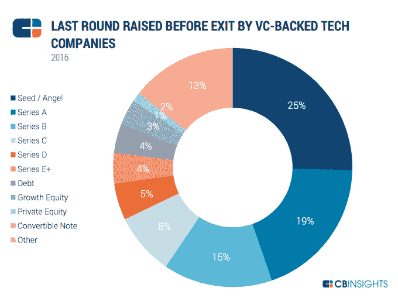
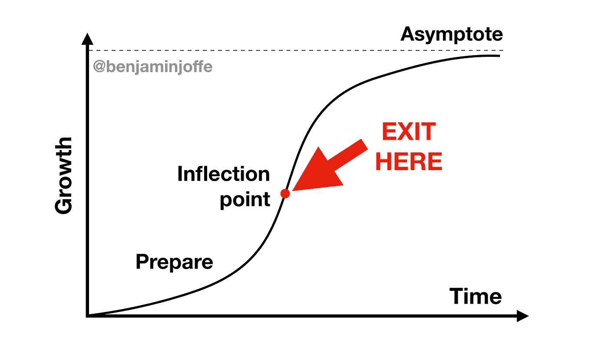

# 为什么创业公司的创始人需要提前为退出做准备

> 原文：<https://medium.com/hackernoon/why-founders-need-to-prepare-for-exits-b598d028e8b6>

*注 1:此文是鼓吹对于***(不是提前退场)。幸运偏爱有准备的人。为什么把钱留在桌子上？**

**注 2:我们正在组织有史以来第一个* [*退出大师班*](http://www.hax.co/exit-masterclass)***伦敦****【6 月 5 日】* [***巴黎***](https://exit-masterclass-paris-2018.eventbrite.com)*(6 月 12 日)*[*SF*](https://exit-masterclass-sf-2018.eventbrite.com)*向成功的首席执行官、银行家、风投和并购高管学习如何实现收益最大化。**

*在创业公司的世界里，人们谈论的话题通常集中在:*

*   *创业公司的**号***
*   *如何将**放大***
*   ***独角兽***
*   ***首次公开募股***

*然而，缺少了一个重要的主题:**退出**。尤其是 M & As，因为他们是绝大多数。*

*   *出口给生态系统施肥。创始人发财(或挽回面子)，投资人获得回报。所有这些都有助于积累专业知识、提高知名度，并鼓励更多的创始人和投资者加入这个游戏。我多次被告知，以色列令人印象深刻的创业场景就是这样逐渐建立起来的。尤其是小型收购提供了一个重要的安全网，有助于人才和资本的健康循环。*
*   *数百万在数十亿之前。对独角兽的关注使得少定目标几乎是可耻的。这不仅荒谬，而且极具破坏性:创业往往是一项事业，经验是一步一步积累的。就连埃隆·马斯克也拍了几张。此外，追求二元结果对风投来说是可以的，但对创始人来说就不那么好了，因为他们通常是全身心投入的。*
*   *创始人的工作是建立选择性。你应该寻求更多的资金/并购/ IPO(包括小型股)/股权众筹/ ICO 吗？如果你不了解你的选择，没有准备，你就没有选择。*

# *退出是创始人和投资者获得报酬的时候。*

*在我们的基金 SOSV 的生命周期中，我们有几个——最近的一个是以相当大的价格卖给优步的跳跃自行车。*

*然而，如果说如今关于如何融资的信息相当广泛，那么关于如何退出的信息就不多了，而且大多数创始人都没有足够早地明白过来。*

***创始人应该多早开始建立期权？***

*嗯，**大多数退出是 M & As** ( [CB Insights 报告 2016 年共有 3358 家科技公司退出](https://techcrunch.com/2017/01/31/cb-insights-3358-tech-exits-in-2016-unicorn-births-down-68/)–3260M&A，98 家 IPO——所以 M & As 是 30 倍更常见)**，并且发生在 b 轮之前。所以准备时间从种子期或 A 轮之后开始！***

> *退出的准备时间从种子期或首轮融资后开始。*

*这样的准备不仅会帮助你更好地退出，而且从长远来看也会建立一个更好的公司(如果你保持独立的话)。*

# *为什么要提前准备？*

*几个简单的原因:*

*   *[大多数出口都是 M & A](https://techcrunch.com/2017/01/31/cb-insights-3358-tech-exits-in-2016-unicorn-births-down-68/) ，*
*   *大多数 M&A 发生在早期(6 *0%发生在 B 系列或之前)，**

**

*   *并购是由整天做这种事情的公司发展主管完成的，*
*   *[IPO](https://hackernoon.com/tagged/ipos)都是跟整天这样的银行家做的，*
*   *大多数创始人对退出毫无经验，*
*   *最重要的是，有时为创始人提供建议的银行家/代理人就像帮你卖房子的房地产经纪人:他们更有动力卖掉房子，而且卖得更快，而不是把价格最大化。最后，你是一次性客户，而买家(企业，或者 IPO 中的银行)可能是回头客。猜猜谁是最应该保持快乐的银行家？(除非银行计划之后向你出售理财服务，但它们可能还没有那么有条理)*

*如果你不相信你最好自学，我不知道什么会。*

# *投资者控制着叙事*

*否则 IPO 就不会被称为退出，因为创始人(或后来的高管)会留下来。即使是收购，通常也有 1-2-3 年的锁定期。*

*那么谁要退出呢？一般是私人投资者。*

*语义告诉我们谁在控制对话(就像首次公开募股被认为是成功的，而这意味着公司把钱留在了桌子上)。*

# *学什么(什么时候学)？*

*如果你不想错过 M&A 的机会，或者把钱留在桌子上，有很多事情可以做:*

*   *提供优惠(定期与潜在买家接触，了解他们的战略方向，让他们了解你)*
*   *确保你的房子井然有序(流程、知识产权、执行团队、沟通、合同等)。)*
*   *谈判*
*   *相互竞争报价(或与风险投资或 IPO 期权竞争——所谓的“双轨”或“三轨”)*
*   *(以及更多)*

*为了避免在兴奋和恐慌中手忙脚乱，弄得一团糟，你应该在工作机会到来之前就这样做。*

*销售的最佳时机是当你有很多动力的时候。最大动量在“拐点”附近。*

**

*Maximize outcome near the inflection point*

> *销售的最佳时机是当你有很多动力的时候。最大动量在“拐点”附近。*

*在这一点上，增长放缓。冷静地看待这件事。你能找到改变这种状况的方法吗？否则，成为一家大公司的一部分可能会提高渐近线。合适的公司将为此支付高额溢价。*

*IPO 是少数退出方式，但可以让你继续掌舵。他们将你的股票转换成货币，并提供给不同类别的投资者。它们伴随着报告、审查以及你和你的团队情绪起伏的负面影响。*

# *并购的类型*

*技术、团队、客户……收购有各种各样的方式。不同的买家想要不同的东西。你会如何向谷歌推销你的公司？到可口可乐？根据他们的业务和战略调整宣传。*

> *你会如何向谷歌推销你的公司？到可口可乐？根据他们的业务和战略调整宣传。*

*在某些情况下，市场整合可能引发一系列收购。我听说一家公司在收益电话会议前一周被收购，这样买家就可以宣布一些新的东西。*

*还有，VC、M&A、IPO 有时候可以兼营。就在计划中的 2B IPO 之前，思科以 37 亿美元收购了 AppDynamics。和你的银行家谈谈。请注意，银行家通常只接受(1)成交几率非常高(2)超过一定金额(由于他们的成本结构)的交易*

# *关于早期销售*

*如上所述，大多数退出发生在早期(80%在 B 轮或之前)。为什么？原因可能很多:*

*   *无法再融资(市场变化等)。)*
*   *机会来了(市场整合等)。)*

*尽管人们对独角兽赞不绝口，但必须记住几件事:*

*   *在成为亿万富翁之前，别忘了成为百万富翁(就连埃隆·马斯克也差了几步)。你的经验和“融资能力”可能会帮助你以后创办一家更好的公司，*
*   *5 年的(高风险)努力比 10 年的(高风险)努力容易，*
*   *如果最后多轮融资( [Series H](https://www.quora.com/Is-there-series-H-funding-and-if-so-what-startups-received-them) )，有人吗？)将会有很多悬而未决的优先权和稀释。销售额高达数百万的初创公司给创始人带来的收益很少，有时甚至为零，这种情况并不罕见。在这种情况下，如果早几年卖出，他们的份额会大得多。*

> *1 亿美元的 50%相当于 1B 的 5%，但更容易实现。最终归结为动力、市场和风险。*

***注意，作为投资者，我们不主张过早卖出**，我们赞成*将结果最大化*。创始人过早低价出售让我们难过。*

*最终，这是一个风险和回报的平衡。虽然创始人和投资者之间有着密切的联系，但创始人比风投有更多的利益也是事实。尽管如此，在特定的*公司*之外，我们看到了*人*的长期潜力。*

# *退出大师班*

*为了帮助提高我们 700 多家创业公司的知名度，我们开始进行对话。*

*在今年早些时候成功举办了几次圆桌会议之后，我们将在 6 月份组织四场活动——分别在巴黎(6 月 5 日)、伦敦(6 月 12 日)、旧金山(6 月 19 日)和纽约市(6 月 22 日)——在这些活动中，初创公司创始人可以了解成功创始人、银行家、风投等的退出情况。*

*你可以在这里找到议程和回复。稍后我们将分享我们的新知识！*