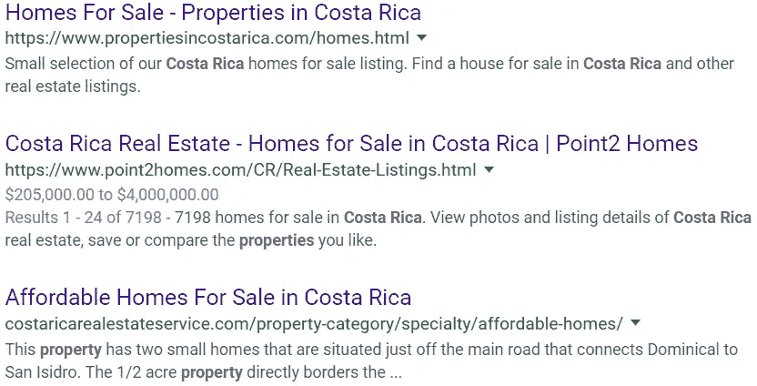
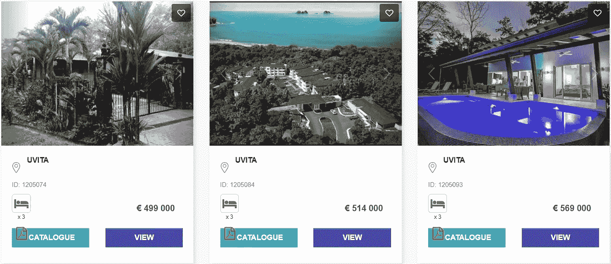
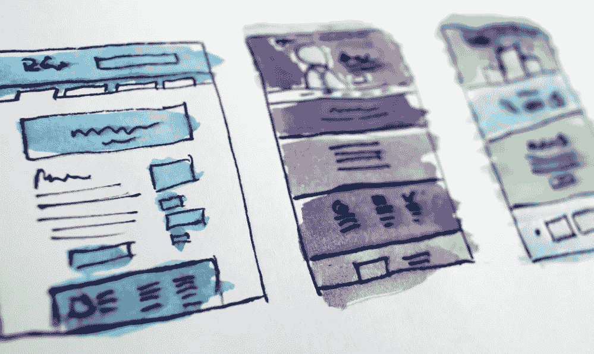

# 为什么法国和西班牙是令牌化房地产的跑牛

> 原文：<https://medium.com/hackernoon/why-france-spain-are-the-running-bulls-of-tokenized-real-estate-136e680dd309>

Tokens are Visiting Spanish Villas & French Châteaus

无休止的文书工作和收费的中介是房地产行业的坏室友。

他们喜欢在大多数日子里闲逛，不为自己或任何人做太多事情，直到他们听到你做晚饭。他们会凭空出现，除了对你的食物感兴趣之外，什么都不带。

好消息是他们混乱的日子将很快结束。区块链初创公司— [**Zillios**](https://www.zillios.io/) —想要驱逐这些小丑。在全球多个国家，除虱工作已经开始。

这个项目对地球上其他地方的策略是什么？我们就此事简单聊一聊，我会告诉你详情的。但首先，让我们弄清楚一件事…

***免责声明*** *:这不是投资或理财建议。无论如何我都不是金融专家。本文中的大部分信息都是推测性的，仅仅是个人观点。在参与任何创业项目之前，一定要进行自己的研究。*

永远记住，你如何使用你的资金是你自己的决定。如果这个决定对你一个人来说太难了，向金融专家寻求指导。

*我可能会也可能不会收到创建此内容的少量令牌分配。也就是说，我尽最大努力保持公正和公平。我尽量避免所有的 FOMO 和 FUD，不希望在我的秘密伙伴中唤起这些情绪。*

***参考消息****:Zillios 项目载有一份没有资格参与 2019 年代币销售的国家的广泛名单。*

# 50 个国家和地区

这篇文章的标题声称有超过 100 万个房产列表。我不是来让你失望的。大多数房屋位于法国和西班牙，这两个国家帮助激发了 Zillios 项目的增长。

该团队与这些地区的 1 万多家机构合作。房产的数量也在稳步上升。当我写这篇文章时，**西班牙有超过 80 万份房产清单**，而法国以超过 6.4 万份远远落后于它。

给时间传播，期望在大多数文明国家看到大量的列表。

Zillios aims to be the world’s largest geotargeted meta-search engine for international property sales and vacation rentals

# 国际房地产的 MVP——最通用的门户网站

Zillios 这个名字，尤其是如果你在美国，可能会让你想起另一个房地产搜索引擎:Zillow。巧合吗？大概不会。

虽然 Zillow 可能臭名昭著，但 Zillios——就像以太坊对比特币所做的那样——计划改进现有产品。

Zillios Beta 现已上线，并列出超过 100 万处房产。根据路线图，2021 年，房产有资格使用该项目的原生 ZLST ERC20 令牌出售或出租，这只是时间问题。

与大多数房地产门户网站不同，Zillios 引擎并不专注于单一地区或国家。相反，该平台汇集了全球各地的房源。

Zillios 网站的访问者根据他们的位置获得内容，这进一步定制了用户的搜索结果。

> Zillios 项目为房地产行业带来了地理定位和元搜索，同时增加了区块链理工大学固有的安全性、透明度和通过令牌化降低成本的品质。

现在，让我们去一个不同的地区旅行，为了便于比较，让我们在**哥斯大黎加**寻找一处可以购买的房屋。

这个中美洲的小国有很多吸引人的地方——令人惊叹的绿色植物、温暖的海水、幽静的海滩、廉价的食物、超级友好的当地人、大量的野生动物和户外活动。

一次访问——即使这不是你的蜜月——你可能会想永远留下来。这个国家保持了热带天堂的美誉。

Searching brings further searches

## 谷歌:涉水&涉水

除了大公司窃取隐私的可疑做法，包括直接窃取我们的个人数据，谷歌并不完全是坏的。

您通常可以找到您要搜索的对象。

但是在大多数情况下，数据只是通过。换句话说，你没有得到直接的信息；你会得到一个数据点列表来自己筛选。

## 齐洛:呃…错误的国家

我想我不是在这里比较苹果和苹果，因为没有国际行动。

虽然你可以在德克萨斯和佛罗里达找到哥斯达黎加大道，还有几条散布在加利福尼亚，但你不会在这个真正的中美洲国家找到列表。

Daily departures: 3-hour tours of the Chilligan Isles

## [Zillios](https://www.zillios.com/) : On 点

在 Zillios 网站的搜索栏中输入“哥斯达黎加”,会显示出 100 多处房产。

目前，大多数房源来自同一个房地产经纪人。我承认我只挖到了第三页。

但重要的是要记住，该引擎仍处于测试阶段。并非每个功能都是完全可用的。过滤器只是一个占位符。

但是，您仍然可以查看照片，通过电子邮件索取宣传册，并与代理商联系。

Enhanced control over real estate marketing campaigns

# 另一个区块链第一

购买或租赁房产意味着免费浏览房源。另一方面，出售或出租房屋通常需要支付挂牌费。

但这里的情况并非如此。

> 在 Zillios 平台上列出房产是免费的。

我相信你可以想象这对业主和代理商的吸引力。即使你拥有或管理的房产在其他地方有房源，传播你的信息也无妨。尤其是当你的广告是免费的时候。

现在，免费很好。谁不喜欢免费？然而，我相信你听说过这样一句话，“你得到你所付出的。”免费并不总是最好的。

那么，Zillios 打算如何确保房产不会在众多房源中迷失呢？有趣的是，该解决方案借鉴了电子商务行业的一些技巧…

## PPC 拍卖

谷歌上的搜索结果有两种:有机和付费。

有机，顾名思义，就是那些自然出现的。复杂的算法处理您选择的搜索词，并提供最相关的结果。

付费搜索是强有力的，不自然的。然而，这并不总是一件坏事。当你确切地知道你在找什么的时候，你的问题的答案很可能就在广告中。

想象一下，你的问题的确切解决方案就在谷歌的第 18 页。很难说你会不会去那里。

点击付费广告会根据搜索结果显示出来，但除非有人点击他们的付费广告，否则广告商不会付费。

> 竞价战的胜利者会看到他们的广告被列在最顶端的搜索结果中。

你看，有更多的竞争公司比关键字要多得多。猜猜看，每当有人在谷歌上键入“垒球棒”时，有多少体育用品经销商希望他们的页面显示出来？成吨。

广告客户必须争夺位置，他们用美元来获得杆位。

Zillios 将同样的原则应用于国际房地产市场。在 Zillios 项目中使用一些 ZLST 标记可以提升一个属性在元搜索结果中的位置。

个人卖家可能需要也可能不需要这项服务，但对于代理商来说，它改变了游戏规则。向正确的买家投放地理定位的房地产广告可能会为双方建立完美的场景。

竞价排名房地产广告创造了一个三赢的场景…

**代理商**在众目睽睽之下获取优质房源的方法。更多佣金。赢了。

**买家和度假者**会在他们的搜索结果中看到更多高度相关的房产。减少搜索时间。双赢。

最后，**Zillios 项目**创造了收入来源。不管有没有区块链，每个企业都需要付费客户。双赢啊！

# 正在打包…

削减成本和提高效率是区块链理工大学的两大优势。在全球房地产销售和租赁领域，Zillios 正在将这些技能付诸实践。

当然，也有类似的网站。但是大多数都有共同的线索——它们充斥着中间人和复杂的法律问题。更不用说隐藏或模糊的定价结构。

标记化的智能契约事务属性更加简单和透明。每个生态系统参与者都知道每笔交易的大部分细节。

另外，今天大多数房地产网站列出的不是房屋销售*就是度假租赁*。很少有网站像 Zillios 这样将两者结合起来。

区块链实时的点对点交易减少了房地产交易中的肥肉——每个人都从中受益。

不要误会我；我并不主张 100%自动化。有些人就是不能或不愿意为卖掉房子所花的时间而烦恼。

代理商佣金是生态系统繁荣的必要条件。但是我们可以用科技来大幅削减它们。从表面上看，这似乎是对代理商的打击，但我不同意。

他们的大部分时间都花在了在办公桌前推文件和在显示器前打字上。你知道，做只有管理员喜欢的日常管理工作。

智能合同赋予代理时间自由。伴随着这种自由而来的是工作中有趣的部分——走出家门，与客户聊天。

当代理人真的成交时，区块链可以记录交易的所有细节——给代理人时间去下一个开放日。

齐里奥斯有非常雄心勃勃的计划。不可否认的是，完全令牌化还需要几年的时间。但不可否认的是，他们有一个良好的开端。将一百万处房产整合到一个平台上并非易事。

如果你喜欢你的免费列表和精确的搜索结果——尤其是如果你住在欧洲——请关注 Zillios 项目。

## DYOR

Zillios 可能在我即将推出的 ico 的观察名单上，但这并不自动使它符合你的资格。

如果你认为你可能想要参与，我鼓励你更深入地挖掘这个项目。

这里有一些资源可以帮助你:

[**Zillios Token 销售**](https://www.zillios.io/)**|**[**Zillios 房地产门户**](https://www.zillios.com/)**|**[**Zillios 白皮书**](https://www.zillios.io/#docs)

👇与 Zillios 团队进行社交👇

****|**[**GitHub**](https://github.com/Zilliosproject)**|****LinkedIn****|**[**电报**](https://t.me/Zillios_io) **|** [**推特**](https://twitter.com/zillios_info)**|**[**YouTube**](https://www.youtube.com/channel/UCLv--NQ2mzaqy9andLeNAdQ)**

## **顺便说一下…**

**如果你喜欢你在这里读到的东西，并且想要帮助你把你的加密信息传递给大众，我很想听听你的创业故事。**

**即使你只是想聊聊 crypto 或者你最喜欢的区块链项目，你也可以在这里找到我:blockchainauthor at Gmail**

***bounty 0x username = block chain author***