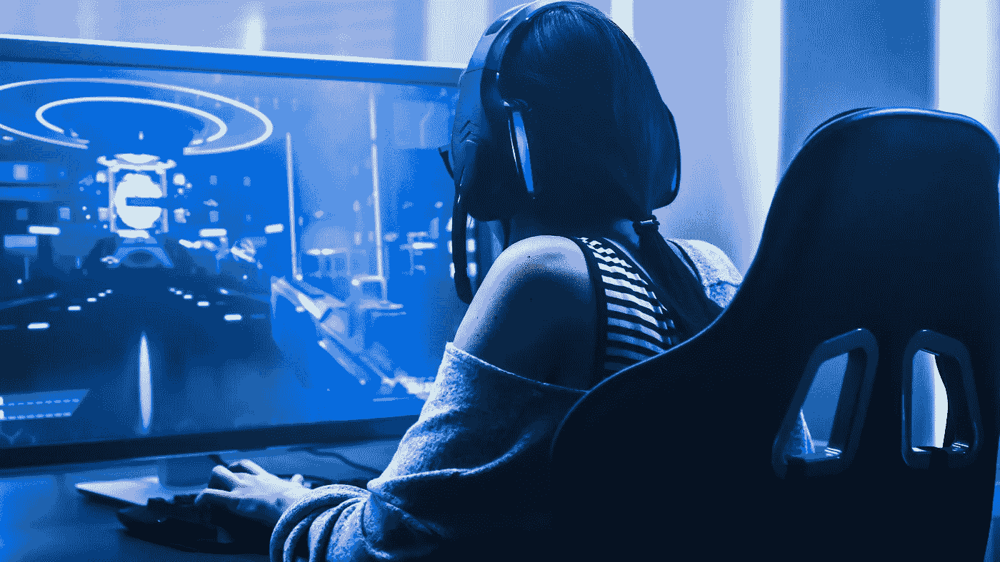

# 为什么游戏玩家(和区块链)正在创造工作和社会的未来

> 原文：<https://medium.com/hackernoon/why-gamers-and-blockchain-are-creating-the-future-of-work-and-society-38c2ae6787ee>

我是和我的兄弟们一起玩游戏长大的，这些年来，我有机会目睹了这个行业中一些最重要的演变。

起初，玩家处于独立的世界，就像马里奥或塞尔达游戏那样。对于允许你和多人一起玩的游戏，每个人都必须坐在同一个房间里，在最近的控制器的范围内。

一旦互联网将玩家连接起来，创造了多人在线世界，一切都变了。

社区开始围绕像《魔兽世界》和《第二人生》这样的游戏形成——由来自不同城市、国家和大陆的人组成的团体。

当我开始学习人类学时，我意识到这些在线社区的重要性，并着迷于了解人们如何在网上互动和生活。我注意到在某些方面，游戏玩家走在了时代的前面。他们创建并维护了复杂的在线社区和生态系统，而这些通常被非游戏玩家所忽视。

今天，游戏世界的更多方面正在进入“真实”世界，人们开始意识到这些将如何影响他们的日常数字生活。

这就是为什么工作和社会的未来会受到游戏社区的巨大影响:

# **游戏玩家正在沉浸式的分布式社区中建立和交流。**

最初围绕在线游戏平台建立的社区比你想象的要复杂。

人们创造了交换商品和服务的方式，就像任何文化一样。

当我研究这些游戏时，我看到数字货币一次又一次地出现。每个数字世界都有玩家在游戏中购买、出售和交易物品的方式。随着时间的推移，这些交流开始蔓延到现实世界。在像易贝这样的网站上，稀有的游戏物品被以数百美元的价格买卖。就连企业巨头也参与进来，开发出允许用户用法定货币购买升级和物品的游戏。

> 但是数字货币的概念并没有消失。事实上，它是当前加密货币热潮的[先驱。](/singulardtv/how-video-games-helped-pave-the-way-for-cryptocurrency-f930521eef55)

数字游戏货币和当前加密货币繁荣之间的联系已经得到了很好的证明。然而有趣的是，许多人仍然不知道他们在交易所购买的比特币与游戏内价值的概念有什么联系。

# **游戏外和游戏内的体验正在经历交叉。**

整个社会已经朝着与数字世界加强互动的方向发展。AR 和 VR 正在不断改进，我们正在瞥见在线交流和社区建设的未来。

因此，在未来几年，从游戏应用到现实生活应用的飞跃将会更加频繁。

**例如，** **游戏社区对区块链技术非常兴奋。**游戏玩家基本上测试了数字货币，现在他们正在测试[区块链](https://hackernoon.com/tagged/blockchain)的可能性。人们将很快使用它来标记游戏中和现实生活中的资产，以使它们更容易在分散的交易所中表现和销售。

第一个位于区块链的 MMORPG[霓虹区](/blockadegames/neon-district-a-tech-noir-adventure-on-the-ethereum-blockchain-d25c3b1226c7)已经在这里，使用以太坊的 ERC-721 标准来创建独特的卡片，作为游戏中的可收集物品。总部位于特拉维夫的初创公司 [Clanplay 刚刚筹集了 200 万美元](https://venturebeat.com/2018/09/27/clanplay-raises-2-million-for-blockchain-based-gamer-rewards-platform/)来开发一个平台，为完成游戏中特定动作的用户奖励加密货币。不过，这与科科斯-BCX 公司为他们位于区块链的游戏平台筹集的 4000 万美元相比还是小巫见大巫。

令人兴奋的是，该空间仍处于早期阶段。游戏玩家一直站在科技和通信的最前沿，随着每个人花更多的时间在线，他们将会有更多的贡献。

# 人们将开始更多地生活在数字社区中。

随着交流和联系的方式变得越来越容易，上网时间增加是必然的。想想短信是多么具有革命性，视频通话又是如何改变这一切的。

即使在网络游戏发展的早期，唯一可能的交流方式是通过在一个小文本框中打字。当然，现在有耳机和网络摄像头可以让玩家听到和看到他们的游戏伙伴。这为在线社区的发展和繁荣开辟了大量新的机会，甚至与我们的实体社区同步发展。

只要看看堡垒之夜游戏在年轻人和儿童中的爆发就知道了。这可能是一个电脑游戏，但在晚上大家一起玩的时候讨论学校项目也不是没有过。

> 随着人们寻找有相同兴趣或爱好的人，并找到更好的方式与他们交流，享受他们的数字陪伴，在线社区将继续增长。

毫无疑问，新技术将改变人们的互动方式。唯一的问题是它会是什么样子。如果你想第一个知道答案，关注游戏社区可能是个好主意。

**感谢阅读！关注我的** [**推特**](https://twitter.com/iamSamsterdam) **和** [**Quora**](https://www.quora.com/profile/Samantha-Radocchia) **了解更多关于区块链科技的见解。**

*本文原载于 Forbes.com。*

 [## 为什么游戏玩家(和区块链)正在创造工作和社会的未来

### 我和我的兄弟们一起在游戏中长大，这些年来，我有机会目睹了一些最重要的演变…

www.forbes.com](https://www.forbes.com/sites/samantharadocchia/2018/12/04/why-gamers-and-blockchain-are-creating-the-future-of-work-and-society/#58632a4755eb)