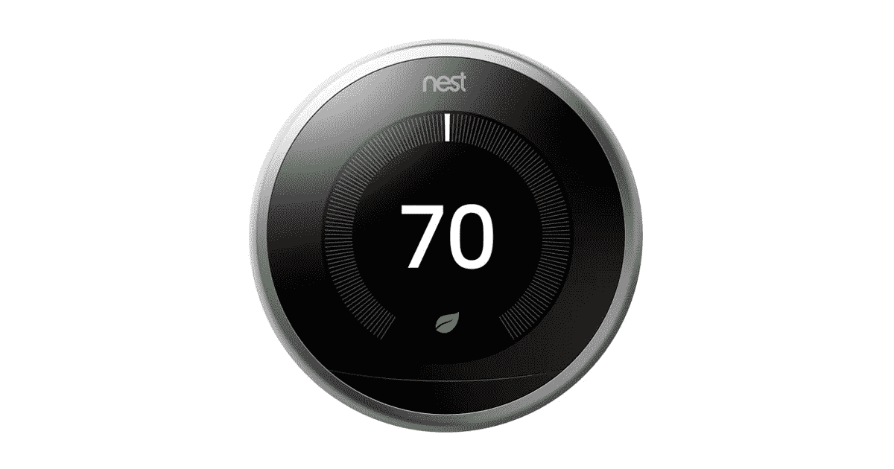
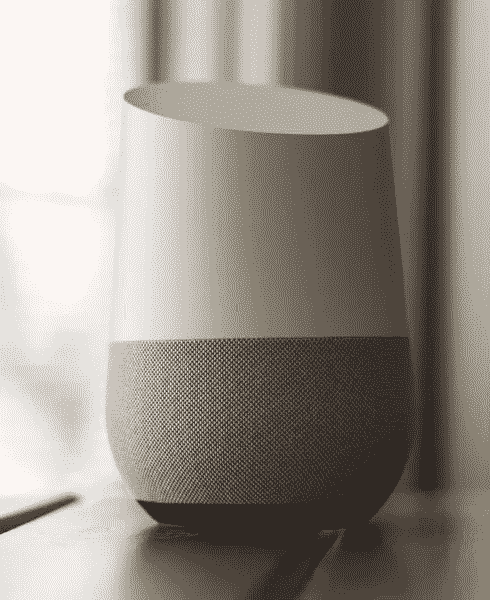

# 谷歌为什么要卖掉 Nest？

> 原文：<https://medium.com/hackernoon/why-google-should-sell-nest-e4ca4b28bdc7>

## 承诺与现实

当谷歌在 2014 年收购 Nest 时，这是能源科技公司最大的一笔收购。Nest 将低贱的恒温器变得性感诱人。这是第一款让公用事业公司认为'*客户可能真的会关心这种东西的智能家居产品！*’。Nest 的故事也成了每一家能源技术公司的筹资宣传资料中的幻灯片；在此期间，我看到了至少 50 个以 Nest 为模型，以[谷歌](https://hackernoon.com/tagged/google)为潜在收购方的推介平台。看起来棒极了！

但后来不是了。

Dropcam 被收购后，法德尔是一个暴君，这是整件事。然后 Nest 在收购后的几年里没有出货任何新产品。然后[托尼·法德尔退出](https://www.nytimes.com/2016/06/04/technology/tony-fadell-nest-google-alphabet.html)。现在， [Nest 以谷歌品牌](https://qz.com/1201600/nest-is-leaving-alphabets-other-bets-and-being-folded-back-into-google-goog/)回归。[尽管 Nest 的联合创始人马特·罗杰斯离开了公司。以 32 亿美元的收购价格和(比方说)10%的资本成本，Nest 每年应产生约 3 . 2 亿美元的额外 EBITDA，以使这笔交易达到盈亏平衡。](https://www.theverge.com/2018/2/8/16993058/nest-matt-rogers-co-founder-leaving-google-smart-home-chief-product-officer) [Alphabet 来自*其他赌注*的收入在 2017 年产生了 7.94 亿美元，主要来自 Nest、Verily 和 Fiber](https://www.forbes.com/sites/greatspeculations/2017/11/27/how-have-alphabets-other-bets-fared-in-2017/#37de7491661b) 。即使 Nest 产生了该数额的 1/3，它也没有实现谷歌在收购 Nest 时所希望的倍数增长。那么是哪里出了问题呢？

## 那么是哪里出了问题呢？

谷歌收购 Nest 的一大问题是，谷歌/Alphabet 不断以自己的品牌发布新的互联产品，并让 Nest 作为一个独立的业务运营。[谷歌和不那么重要的 Nest 一直在为智能家居发布兼容但不互补的产品](https://store.google.com/)。这是两家不同的公司各自为战。亚马逊的智能家居方法表明，带有中央家庭中心的平台方法更有可能成为智能家居的制胜策略。亚马逊正在用一个*便利*平台(Echo)拥有家庭，并且，不管你怎么说 HomePod，苹果正在试验智能家庭的娱乐用例。但是谷歌的平台方法是什么？它可能是 Nest 的 comfort ( [三个智能家居用例中的第三个](https://www.linkedin.com/pulse/unbundling-home-brought-you-amazon-tesla-andapple-seyi-fabode/))。但这种优势正在丧失，因为谷歌决定在收购 Nest 的过程中成为“接受者”，而不是“给予者”。

[https://upload.wikimedia.org/wikipedia/commons/6/6e/Google_Home_sitting_on_table.jpg](https://upload.wikimedia.org/wikipedia/commons/6/6e/Google_Home_sitting_on_table.jpg)

## M&A 交易中的给予者与接受者问题

谷歌从来都不是一家硬件公司。虽然它将成为我们这个时代最伟大的软件公司之一([拥有基本的商业模式](https://www.linkedin.com/pulse/technology-attention-merchants-snapipo-seyi-fabode/))，但收购 Nest 背后的想法是“借鉴”Nest 的专业知识。这在收购中几乎从未奏效。大多数成功的并购交易，即被收购公司与收购方的整合提供了收购的预期收益，都是在以下情况下产生的

1.  [**收购方的战略方向与被收购方的战略方向一致**](/@seyi_fab/no-your-startup-wont-be-acquired-79a0f34df989) **并且有廉价的资本使被收购公司得以成长**。考虑到谷歌/Alphabet 的智能家居愿望，Nest 是有意义的。[当公司变成 Alphabet 时，谷歌对其“其他赌注”开出的空白支票被拿走了](https://www.wired.com/2016/04/googles-parent-company-losing-even-money-moonshots/),这就是问题开始的地方…
2.  **收购方正在向被收购公司转移内部相关技能**。从这个角度来看，谷歌对 Nest 的收购注定会失败。[之后，谷歌在将其内部技能转移到安卓方面做得很好，并使其成为最受欢迎的智能手机操作系统](https://www.statista.com/statistics/266136/global-market-share-held-by-smartphone-operating-systems/)。但那是在软件领域，我们知道谷歌在这个领域拥有战略优势和专业知识，很少有其他公司(将永远)拥有。不幸的是，硬件并不是谷歌的交易。那么这次会有什么不同呢？
3.  [**收购方期望*给予*比它*拿走*** *。这是谷歌在 Nest 交易中真正失败的地方。正如《HBS》的这篇文章*](https://hbr.org/2016/06/ma-the-one-thing-you-need-to-get-right)所建议的那样，谷歌在收购 Nest 后会做上面两件事，同时提供管理监督。一旦谷歌决定开始发布自有品牌的智能家居产品，并纯粹为了其能够提供的收入价值而寻求 Nest，这种情况就不复存在了。

## 卖窝？是的。

如果估计是可信的，我们生活中的联网设备将比我们需要的多得多。Gartner 认为，到 2020 年，我们将拥有 750 亿台联网设备，普华永道认为我们将花费 2360 亿美元。谷歌正试图成为其中的一大部分，有两种方法可以做到这一点

1.  **把** [**窝卖给另一家公司**](https://www.linkedin.com/pulse/why-tesla-needs-apple-upgrade-seyi-fabode/) 。是的，我说了。一个明智的方法可能是专注于为智能/互联设备构建开源操作系统。或者收购一家专注于此的公司。这将符合 Android 收购/收购后战略。它还将利用谷歌已经拥有的深厚专业知识，这种知识已经取得了相对较好的效果，来应对该公司迫切需要找到一种竞争方式的市场。对于所有可能拥有硬件的小公司来说，利用谷歌人工智能和语音架构的开源平台并不是一个坏主意。即使谷歌决定不遵循开源方法，它也可以采用 [AWS 方法来拥有底层基础设施](https://hackernoon.com/why-companies-like-lyft-uber-postmates-instacart-etc-will-never-be-profitable-ecdfde647175)。
2.  **真正归入窝**。而不仅仅是为了挽回面子或收回沉没成本而将其归入谷歌旗下。但实际上，把目前分配给~12 硬件产品的所有资源都奉献给 Nest，把目前所有的谷歌智能家居产品都转换成 Nest 品牌的设备。这将背离 125 亿美元收购摩托罗拉的策略，那是一次彻底的失败。谷歌/Alphabet 目前拥有的一个竞争优势是，互联设备正变得更加注重底层软件而不是硬件，人工智能比以往任何时候都发挥着更大的作用。很少有人像谷歌或其子公司那样做软件。[尤其是 DeepMind](https://www.linkedin.com/pulse/artificial-intelligence-human-our-future-seyi-fabode/) 。根据我的非科学调查，没有多少人更换他们已经拥有的鸟巢，这不是 Iphone 式的产品。但是，考虑到低收入(美国)和全球消费者仍然有巨大的硬件设备市场，留在这场游戏中是值得的。

我毫不怀疑谷歌/Alphabet 会解决这个问题。他们受益于不断增长的市场，没有太多真正的竞争，也没有历史数据/专业知识来制定制胜战略。关键问题是:Alphabet 是否愿意接受软件开发的“*发布和迭代*方法——它做得很好——是它不断与硬件发生冲突的原因？该公司是否愿意改变模式，在硬件领域取得胜利？

*请喜欢，分享，评论。注册我的* [*博学月刊*](https://www.getrevue.co/profile/seyifabo?utm_campaign=Issue&utm_content=forwarded&utm_medium=email&utm_source=Seyi+Fabode)*——如果你已经读到这里，我打赌你会爱上它。*