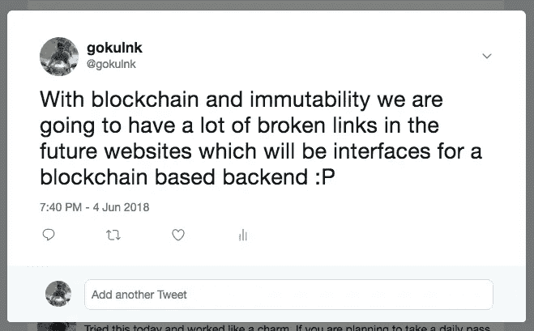

# 为什么 Hardfork20 对 Steem 区块链至关重要

> 原文：<https://medium.com/hackernoon/why-hardfork20-is-a-big-deal-for-steem-blockchain-2eb3b3f7c11>

这个故事最初是在 Hardfork20 上线之前的 9 月 25 日发布的。

再过几个小时，哈福克 20 将会出现在区块链街。前 20 名见证人正在 0.20.2 版本上运行他们的节点，这意味着他们都为 hardfork 设置了。

# 什么是 Hardfork？

对于那些不熟悉这个术语的人来说，Hardfork 意味着区块链的升级。当前的代码版本或升级可以在 [Steem Github 页面](https://github.com/steemit/steem/releases)上找到，这个版本叫做 **Velocity。**因此，如果你正在阅读任何与此次升级相关的博客，你可能会听到 **Velocity Hardfork** 这个词。

# 什么是 Steem 区块链？

Steem 是一个位于 DPOS 的区块链，为以内容为中心的网站和应用程序而建。Steem 使得内容驱动的网站在区块链上运行更加容易。Steem 有一个内置的奖励机制，根据内容创建者、内容管理者和应用开发者为整个网络增加的价值来激励他们。

常见的误解是 **Steem 区块链=**[**www.steemit.com**](http://www.steemit.com)**这是离真相最远的。Steem 区块链只是后端，可以有任何数量的界面(网站或应用程序)可以建立在 steem 区块链。**

****

**Image from steemit.com**

**正如你从这张图片中看到的，Steem 区块链形成了中心部分，其他服务和应用也使用了这个区块链，如[https://steemit.com](https://steemit.com)、[https://busy.org/](https://busy.org/)、[https://steepshot.io/](https://steepshot.io/)、[https://join.utopian.io/](https://join.utopian.io/)、[https://d.tube/](https://d.tube/)、[https://esteem.app/](https://esteem.app/)**

**只有一些应用程序已经上线并广受欢迎。还有很多，你可以在 https://steemprojects.com/查看**

# **Velocity Hardfork 中有哪些新特性？**

**速度硬分叉有许多重要的变化。这些变化中的大多数将对用户体验和交互、应用程序未来的工作方式以及 Steem 媒体令牌的最终形成产生重大影响。**

**这款 Hardfork 的主要特点是**

## **1 .无限制编辑**

**在此之前，一旦奖励被授予，hardfork 的内容就不能被编辑。这意味着你不能在七天后更新内容。虽然这对于保持平台上对新内容的高需求是有意义的，但这也意味着如果你发现一些缺失或容易出错的内容，你不能在七天后更新你的内容。大多数时候，你需要随着环境的变化来更新你的内容。**

**如果不是这样的话，随着时间的推移，我们会在区块链网站上有这么多的帖子，这些帖子会充满断开的链接。**

****

**有了 hardfork 20，这种情况将会改变。**

## **2 .资源信用实施**

**大多数区块链没有考虑到当前对区块链采取行动的未来成本。尽管区块链的各种交易看似自由，但事实并非如此。每一个行为都有代价，必须有人来承担。当时可能不是你，但代价还是要承担。对于集中式服务，成本由脸书和谷歌等公司承担，因为他们现在对你进行投资，以便以后可以向你出售广告，向第三方出售你的数据，或者利用你训练他们的大规模人工智能模型:)**

**区块链也是如此。不管你是否意识到，每一个行为都有代价，而且是由某个人来承担的。事实上，你在斯蒂姆·区块链网站上创建一个账户，并在区块链网站上发表帖子、发表评论和投票，都是要花钱的。但是你可能没有意识到这一点，因为这是由 Steem 公司支付的。目前，成本估算是不准确的，已经做了很多归纳。有了资源信用，Steem 将能够确定每项行动的成本。这也将帮助应用程序开发人员确定交易的成本，以便他们可以确保用户的 UI/UX 不会受到影响。**

**达到平衡可能需要一些时间。根据社区的反应，见证人将能够随着时间的推移进行一些调整，以便用户体验不受影响，但同时有一个更好的机制来处理平台上的垃圾邮件。EOS 也在做类似的事情。但 Steem 的结果会更有趣，因为它会影响现有社区。这个实验的结果可能会定义未来基于内容和基于社区的网站将如何定义。**

## **3.Dapps 免费创建帐户**

**目前，在[www.steemit.com](http://www.steemit.com)Post hard fork 20 上创建账户需要将近 1 周到 2 周的时间，用户将能够使用他们的资源信用(RCs)购买账户创建令牌。这些帐户创建令牌可用于为平台上的新用户创建帐户。这些帐户创建令牌的供应将由见证人决定。最初，这些帐户创建令牌的供应量会很低，因此它们的汇率会很高。这将确保新帐户不会在平台上泛滥。一旦达到平衡，应用程序将能够更好地估计帐户创建的成本，他们可以相应地购买帐户创建令牌。**

**我们正在开发一款基于斯蒂姆·区块链的产品。我们想到在与 SMTs 整合后发布一个测试版(2019 年第一或第二季度)。但经过一番考虑后，我们决定将其构建在现有的区块链 steem 上，并在 SMT 准备好部署后与其集成。因此，Hardfork 中引入的每一项变化对我们来说都很重要，因为它们将解决我们的痛点。**

# **功能愿望列表**

**我们希望 Hardfork 的一个特性是永久奖励。但是在一些帖子上发表评论后，看起来这不会很快在核心中实现。开发团队和见证人的共识似乎是，如果可以在第二层处理，那么就应该在第二层处理。这个想法似乎是，只对核心区块链进行最小的必要更改。我觉得这是有道理的。所以我们将在我们的接口上处理永久令牌。但我们不确定它会如何翻译，因为大多数用户仍然使用 www.steemit.com 的 T2，我不认为 steemit 会在这方面做任何事情。**

**然而，在这个特殊的 Hardfork 中有一些有趣的变化，我们期待着它们在下周的表现。事情不会一帆风顺。事实上，上周出现了一个问题，斯蒂姆·区块链停机了几个小时。**

# **斯蒂尔姆·区块链上周为什么被解雇了？**

**斯蒂姆·区块链上周倒下了。该问题与此硬盘相关。所有见证服务器和交换机都被要求在 0.20.0 版本上运行它们的节点，但是由于最新代码中的一个错误，区块链关闭了。内置的安全措施确保资金没有风险，并在问题解决之前关闭区块链。你可以在他们的[博客中读到更多关于错误的细节。](https://steemit.com/steem/@steemitblog/steem-status-100-operational)**

**有很多人，包括几个目击者，表达了他们的不满，他们说升级应该被进一步测试，不要把所有关键的升级都放在一个硬分叉里可能是个好主意。但是，从[https://steemd.com/witnesses](https://steemd.com/witnesses)我们可以看到，前 25 名见证人已经在 0.20.2 上运行，因此，如果没有大的中断，它将在 2018 年 9 月 25 日 15:00:00 UTC 上线。**

**让我们知道这个硬叉子将如何影响你的产品或服务。如果您是最终用户，请耐心等待下周，并提供您的反馈。社区需要:)**

# **参考**

1.  **Steemit 关于 hardfork 的最新博客—[https://Steemit . com/steem/@ Steemit blog/hard fork-20-what-to-expect-tomorrow](https://steemit.com/steem/@steemitblog/hardfork-20-what-to-expect-tomorrow)**
2.  **steemitblog 最近关于 Steem 路线图的博客—【https://steemit.com/@steemitblog **
3.  **ATS Witness 对速度的看法—[https://stee MIT . com/Witness/@ ATS-Witness/steem-hard fork-20-对速度的看法](https://steemit.com/witness/@ats-witness/steem-hardfork-20-thoughts-on-velocity)**