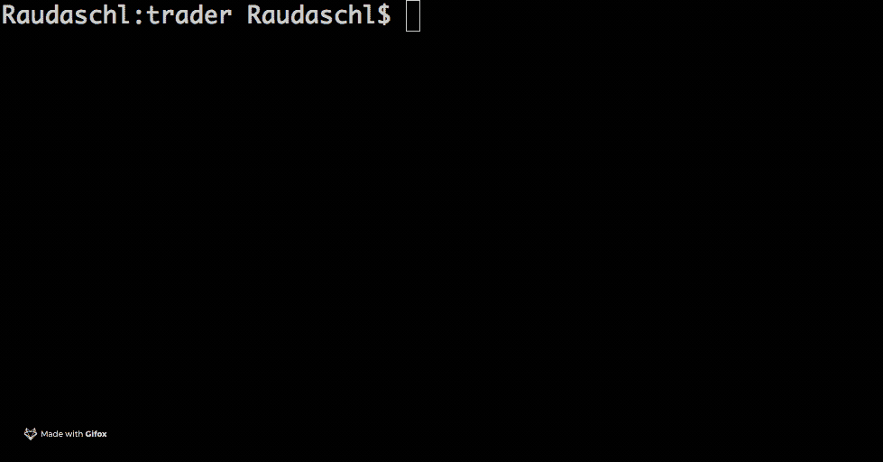
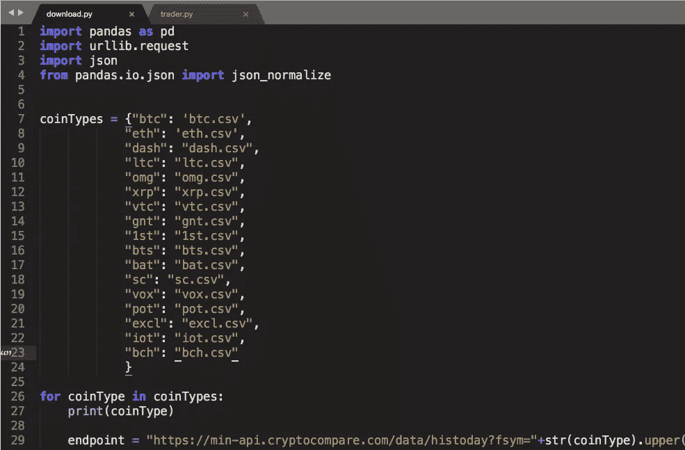
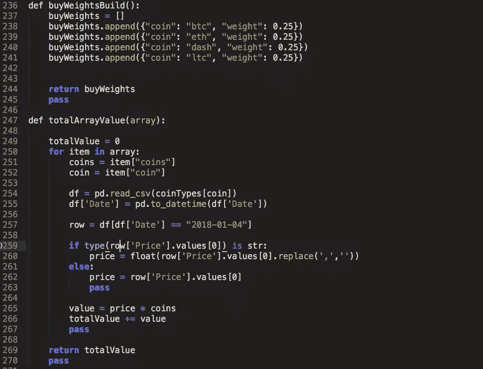

# 为什么我建立了一个历史加密货币交易模拟器(你也可以使用)

> 原文：<https://medium.com/hackernoon/why-i-built-a-historical-cryptocurrency-trade-simulator-which-you-can-use-too-45125630e139>



在大约一年的常规[投资](https://hackernoon.com/tagged/investing)一系列对等(P2P)系统、商品和股票后，我在 2017 年 5 月左右开始交易 [crypto](https://hackernoon.com/tagged/crypto) 。我的策略很简单——每个月我会将税前总收入的 20%(或我能负担的最大金额)投资于一系列投资，然后定期将利息产生的股息再投资于更多的投资。


这个策略的第一部分来自一本名为《T4 最富有的人》的书，第二部分来自一般现代经济思想。事实证明，这两者的结合非常有效，让我能够分散投资组合，降低风险。

随着人们对加密货币越来越感兴趣，我想我应该尝试一下，同时利用同样的策略。每个月，我会把我 20%的总收入中的 5%投资到一系列的加密货币中——主要是比特币、以太币、莱特币、dash 和一些替代币。总体而言，这一表现不错(尤其是在 2017 年下半年价值大幅上涨的情况下)。然而，最近我不禁认为我的简单策略并不像它应该的那样有效。

在 2018 年初，我想我会检验我的理论，并在历史加密货币数据上尝试一些不同的交易策略。我在网上找不到任何真正适合我需求的东西，或者看起来不需要订阅，所以我自己用 python 做了一些东西。

项目的成果是 git repo 你可以自己试试(python 3)-[https://github . com/raudashl/historical _ crypto _ trade _ simulator](https://github.com/Raudaschl/historical_crypto_trade_simulator)

# **步骤**

需要熊猫和 python 3

安装熊猫

```
pip install pandas
```

## **第一步**



下载历史数据 python download.py，以 cryptocompare.com API 的 csv 文件格式下载过去 300 天不同加密货币的价格。您可以在 download.py 文件中编辑硬币类型。

## **第二步**

运行脚本 python trader.py，这将产生以下输出:

**原始价值** —假设除了持有投资外，没有应用任何交易策略，您的投资的当前价值

**原始股息** —基于您的初始投资的总股息

**最终股息** —基于原始投资和新投资的总股息

**原始投资价值** —应用策略后您原始投资的总价值

**新投资价值** —基于您的战略所做的新投资的总价值

**最终总价值**——你的投资和分红的总价值

## **第 3 步—定制**

**设置订单**

**bitcoindors 数组**中填充了不同顺序的密码—例如:

```
bitCoinOrders.append({“coin”: “btc”, “buyPrice”: 2690, “coins”: 0.0782, “date”: “2017–05–27”}) 
```

**硬币**:设置货币符号(需要是之前下载的货币之一)买入价:原始买入价($)硬币:购买的硬币数日期:购买日期

**计算功能**

***功能***

calculate 函数接受一组订单，并从购买点检查它们的价值。在这个迭代中，我建立了交易策略，目标是当一个订单的价值增加了 300%时，卖出该订单中 40%的硬币。然后，这 40%被再投资于购买其他加密货币，这些货币在 **dfAdditionalOrders** 数组中。如果 40%出售的价值少于 40 美元，那么我将直接出售所有的硬币，并为自己申请这笔钱作为股息。

***变量***

**获利因素** —设置您将获利的百分比值。例如，设置 3 将自动触发 300%再投资的卖出

**百分比** —达到利润因子进行再投资时订单总价值的百分比。

**minimumSellValue** —当价值达到利润因子且再投资的价值小于该值时，卖出该特定订单的所有硬币。

**BuyWeightsBuild 函数**



***功能***

这个函数设置硬币从任何卖出的利润中买入(见上文)。他们排除了最初出售的比特币，例如，如果比特币盈利并被出售，它就不会用盈利购买更多比特币。

***变量***

```
buyWeights.append({“coin”: “btc”, “weight”: 0.25}) 
```

**硬币** —您想购买的货币的符号(必须是下载的货币之一)

**权重**——这是一个指标，表明一种货币相对于另一种货币，你想买多少。所有权重的总值应加起来为 1。

# **结论**

所以你有它。在我的实验中，我发现在过去的一年里，我的整体价值只增加了不到 1%,所以也许更简单的模型对我来说仍然是最好的。也许你会有更好的运气。💰 💸

**Git Repo**—[https://github . com/raudashl/historical _ crypto _ trade _ simulator](https://github.com/Raudaschl/historical_crypto_trade_simulator)

PS:我不是程序员，所以请在代码方面对我宽容一些😃