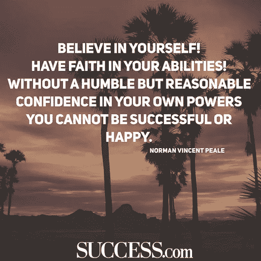

# 为什么我不喜欢励志名言？

> 原文：<https://medium.com/hackernoon/why-i-dont-like-motivational-quotes-9ff056f42345>

从 Brainyquotes.com 的**或 SUCCESS.com 的**或其他一些老套的命名网站复制来的[引用](https://hackernoon.com/tagged/quote)使它更加迷人，因为我太懒或不够聪明去写一些我自己的原创。毕竟，这比我自己想出一些东西更容易，需要的脑力也更少。此外，他们是大众的点击率很高的人。那就是你。很抱歉这么直白，但恐怕这是真的。****

一些感觉很好的药物，让你觉得你可以实现任何事情，仅仅通过阅读那些愚蠢的报价。

[励志](https://hackernoon.com/tagged/motivational)语录。

这些引语点燃了我内心的怒火。但这并不能改变我在新年前夕买了一个 6 个月的健身包，并努力去了一个星期的事实。

我在这里滚动我的社交媒体废话，阅读关于我如何改变我的废话生活并把它变成让我们说少一点废话的生活的废话引用。所有这些导致我大脑中的一些多巴胺，让我自我感觉良好一分钟。我感觉很好，我计划从现在开始我将如何生活。不同的早晨惯例。没有社交媒体。每天去健身房。多读书。自我教育。

第二天，我继续做和以前一样的事情。

在媒体上看一些 BS 帖子，比如*“如何保持动力并实现我的梦想？”被几千个随机的家伙跟踪。尽管知道它不会改变什么，还是去读它。*

每一个脸书、推特、Tumblr、Pinterest、Quora 等，每一个时髦的办公室、每一本杂志、每一种公共传播形式似乎都必须包含尽可能多的激励性图片和信息。但是这些对人有影响吗？或者它们只是离壁纸更近了一步？

真正的工作或真正的艺术并不是通过阅读社交媒体上的引用来实现的。这发生在你实际工作的时候(*要求关闭社交媒体*)。

注意:当我写这篇文章的时候，我甚至没有看社交网站上的激励性引语，否则我不会有写作的重点——但我肯定会有灵感写一篇关于这个的文章……有一天。

是的，励志名言有时很有用，比如当你跌到谷底，需要一些话来告诉你，你可以做到。是的，我不反对。我不反对。

关于激励性引语，真正让我恼火的是它对我们的短期影响。你知道你如何浏览你的 Instagram 新闻，我也知道你会关注很多励志名言页面，对吗？所以，当你看到一个引语，让我猜猜，总是觉得与你高度相关，让你觉得它只是为了告诉你，你的意思不仅仅是这样，或者你可以通过认为这是你的来改变你的生活。你猜怎么着，励志名言让我们所有人都有那种感觉。这让我们觉得自己战无不胜。

但是你会说“哇！那你为什么这么讨厌这些引用呢，Abhed。感觉无敌不好吗？”

我:是啊，感觉无敌很棒。让你觉得自己很强大。是啊，那真的很酷。但之后你会做什么呢？我是说在看到那段引文后？

你:我向下滚动。

我:这就是问题所在。励志名言只是让你产生一股多巴胺，让你觉得自己战无不胜，但只是在很短的时间内。那等于零。

我也可以把这归咎于互联网(它实际上由我们组成，像我这样的人把一些内容放在互联网上，产生观点，导致许多感觉良好的药物)，它每天产生数百万像这样的内容，指导你如何改变你的生活。我是个伪君子，但你也是。

感谢@bob 在本帖中的真知灼见。

# **你知道真正激励我的是什么吗？实际上在做工作。**

我已经在健身房呆了两个月了，这是我最多的一次，考虑到我只申请了两次健身房，包括这次。第一次(持续了一周)我所在研究所外的小吃摊似乎比健身房本身更吸引人。但是我想每天去健身房，**我已经养成习惯了。**现在，如果我一天不去健身房，我的一整天都会一团糟，这一天就是感觉不对劲。通过注意到这个和以前的一些类似场景，我认识到如果我们想尝试一些新的东西或利用一些东西，我们必须在我们的生活中根深蒂固。

如果我前一天去了健身房，那我那天也会去。是的，有时会有休息日，但我开始了解策略，例如，你已经拖延了很长时间的一些重要工作，但权力的游戏最新一季太迷人了，不能不看，所以我从 10 到 1 倒数开始。这是一种心理学的东西，就像某种压力在我体内积聚起来，让我站起来开始工作。它极大地改变了我的日常工作。

在我 17 年的生活中，我主要通过阅读詹姆斯·克利尔和 T2 的作品来观察(干杯！)电子邮件说，如果你想在生活中融入一些新的东西，你必须一点一点地开始。一个小小的工作前仪式将帮助你轻松完成整个工作。

*例如*

*   如果你想开始健身，穿上你的训练鞋。如此简单。
*   如果你想写一本书，拿起一本书和一支笔。
*   如果你想开始建立联系，就和你见到的第一个人谈谈。如此简单却又如此令人满意。

任何任务最重要的部分就是开始。如果你在开始的时候不能获得动力，那么你会发现动力往往在开始之后才会到来。

**感谢阅读！:)**

查看我的个人资料了解更多信息。[**@ abhed 447**](/@abhed447)