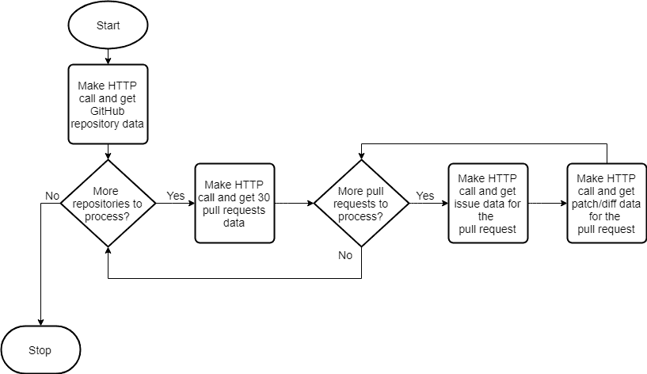

# 为什么我觉得有必要使用 GraphQL！

> 原文：<https://medium.com/hackernoon/why-i-felt-the-need-to-use-graphql-b451d16e7369>

在本文中，我们将讨论 GitHub 的 REST API 不够高效的场景，以及 GitHub 的 [GraphQL](https://hackernoon.com/tagged/graphql) [API](https://hackernoon.com/tagged/api) 如何帮助我们解决问题。

在从事 [Git Repository Analyzer](https://github.com/AmrishJhaveri/Git-Repo-Analyzer) 项目时，我们广泛使用了 Octokit 的 GitHub REST API 客户端。Node.js 异步调用的使用有助于同时进行 HTTP 调用，但是为了检索所需的数据而进行的 HTTP 调用太多了。让我们看看如何通过使用 GitHub 的 GraphQL API 来克服这些问题。

# 数据要求

1.  基于搜索参数搜索 GitHub 储存库；例如*语言:java* 。
2.  按照在存储库中找到的*星*的数量降序排列这些存储库。
3.  对于每个存储库，获取前 30 个拉请求。
4.  对于每个拉取请求，获取问题和补丁/差异数据。通过进行两次单独的 HTTP 调用，可以获得问题数据和补丁数据。*补丁是一个小文件，表示存储库中发生了什么变化。*

# 使用 GitHub REST API v3

基于上述要求，我们以下列方式检索数据。

# 问题

让我们看看上述方法面临的问题:

*   **HTTP 调用次数**

假设我想从 5 个 GitHub 存储库中获取所需的数据。

1.  获取存储库详细信息的 HTTP 调用(计数:1)
2.  对于每个存储库，我们得到 30 个拉请求数据(计数:5)
3.  对于每个 pull 请求，我们进行 1 次 HTTP 调用来获取 pull 请求的问题数据(计数:30*5 = 150)
4.  对于每个 pull 请求，我们进行 1 次 HTTP 调用来获取 pull 请求的补丁/差异数据(计数:30*5 = 150)

我们总共进行了***【306】HTTP*****调用**来获取基于搜索查询的 5 个存储库的问题和补丁数据。

*   **删除未使用的数据**

每次 HTTP 调用后，响应中只有少数字段用于后续调用。从响应中删除未使用的数据变得必要，以便减小最终输出的大小。

# GraphQL 是什么？

来自 graphql.org 的:

> GraphQL 为 API 中的数据提供了完整且易于理解的描述，使客户能够准确地要求他们需要的东西，使 API 更容易随时间发展，并支持强大的开发工具。

# 为什么要用 GitHub 的 GraphQL API？

*   **HTTP 呼叫大幅减少**

在上面的场景中，当我们使用 GitHub 的 REST API 时，我们进行了 306 次 HTTP 调用来检索数据。所有这些数据现在都可以通过很少的 HTTP 调用来接收。我们将在下一篇文章中看到 HTTP 调用的精确计数和关于实现的细节。

*   **只获取必填字段**

我们只收到我们要求的数据——不多也不少。我们不再需要删除未使用的数据。

*   **单端点**

我们不再需要使用不同的 URL(如 REST API 调用)来检索数据。GraphQL 有一个独立于所需数据的端点。

目前，GitHub 的 GraphQL API 不支持上述用例。一个[请求](https://platform.github.community/t/schema-request-get-patch-diff-file-for-the-pull-request/7035?u=amrishjhaveri)也是为了同样的目的。

 [## amrishjaveri/Git-Repo-Analyzer

### Git-Repo-Analyzer -使用它的 REST API 从 Github 获取数据，然后在补丁中查找模式…

github.com](https://github.com/AmrishJhaveri/Git-Repo-Analyzer) 

*原载于 2018 年 8 月 18 日*[*https://www.linkedin.com*](https://www.linkedin.com/pulse/why-i-felt-need-use-graphql-amrish-jhaveri/)*。*