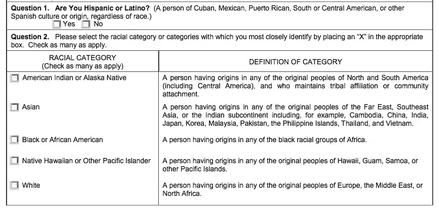
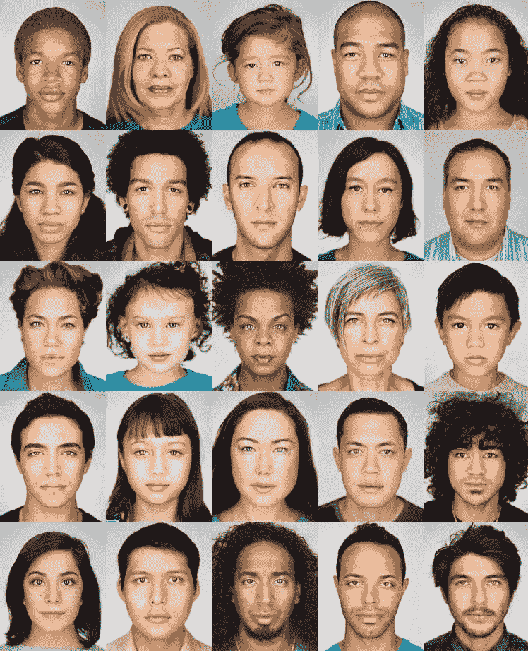

# 为什么我讨厌回答“你从哪里来？”

> 原文：<https://medium.com/hackernoon/why-i-hate-answering-where-are-you-from-1d754a87097b>

我已经意识到，作为一个“*第三种文化的成年人*”，我现在是多么厌恶回答这个问题。在攻读硕士学位期间，我就这个话题写了一整篇论文，老实说，我仍然没有一个完美的答案。

**这对每个人来说都很困惑。包括我。**

我是英国人、美国人、巴基斯坦人、印度人、亚洲人、南亚人、澳大利亚人、加利福尼亚人，希望有一天成为纽约人。是啊，这就对了。但是这告诉你的关于我的事情很少……**你脑子里闪过的假设是什么？**

想象一下我不得不做的杂耍…伙计…我感觉头疼要来了…

当我还小的时候，我的父母因为来自我们试图融入的英国社会的压力而对承认他们来自哪里感到羞耻。我父亲因为他的姓氏而受到歧视…人们认为我们的宗教信仰(*我母亲是基督徒，我们其余的人是无神论者*)…这样的例子不胜枚举。

我对自己第一次改变出生地的最早记忆，是在我计划参加一次童子军出国旅行的时候……这需要团体签证，我的童子军领队特意写下了“英国雷丁”作为我的出生地。他这样做对我来说是一个巨大的姿态，因为他知道我的出生地会引起比我 10 岁时应得的更多的问题…从那时起…我说我出生在英国

在我和我的家人带着成为双重公民的巨大优惠移居美国之后……我的生活变得更加复杂。

在整个高中和大学期间，我经历了一场相当严重的身份危机。我 20 岁出头的时候，对所有这些自我发现感到很艰难……对自己是谁、在哪里缺乏信心。

直到我到了 26 岁的黄金年龄，我才意识到这种四处奔波是扯淡。我处理了我是谁，并自豪地向自己承认，我可以成为任何我想成为的标签。我可以改变和适应成我想成为的任何人。

**我是变色龙宝宝！我有幸过着全球化的生活，这是事实。**

当我 27 岁的时候，我知道了“第三种文化的孩子”这个术语，我仍然惊讶于大多数关于这个不断增长的人口的前沿研究来自澳大利亚。在我的一堂课上，我深入研究了这个话题，我找到了我想要的所有答案。在我演讲的时候，我和我的同事分享了这个视频，它的确让我大开眼界。

我现在提出这个话题，是因为当我周游世界，聆听其他故事时…我并不孤独，我们在如何识别方面变得越来越复杂…

**你们中有多少人打开了一张身份表，苦苦回答这些问题？**

From U.S. Office of Personnel Management

你们当中那些为全球用户群设计产品的人呢……你们接触过这些不同的文化吗？你在为谁设计你的应用？

**你们中有多少人熟悉《国家地理》上发表的关于美国的 C** [**【挂脸】**](https://www.nationalgeographic.com/magazine/2013/10/changing-face-america/) **的文章？**

Photographs by Martin Schoeller (National Geographic)

时代的确在变化。人们比以往任何时候都更加频繁地四处迁移。尤其是我这一代人(惊讶吧，惊讶吧，我是千禧一代)，我们正在打破从跨种族约会到成为其他国家的数字游牧者的障碍。

我们自己对身份的概念正在发生变化，对我来说，美妙之处在于我可以选择这个世界所能提供的最好的品质，并将它们体现在我自己身上。这是人类最美好的一面吗？

我觉得最好的问题是**你现在在哪里打电话回家？那对我来说更容易回答。这是我现在住的地方。**

你不需要知道我的“父母”是哪里人，也不需要知道我的“祖先”(印度，原本是为了那些好奇的当事人……分治+战争可以跨国界的拆散家庭……)因为**他们不代表我曾经过的生活，也不代表今天的我。**

你不想知道我最喜欢的饭或者喜剧演员是什么吗？这有助于更深刻的对话。

作为一名公民黑客和黑客马拉松活动的组织者，我从各种角度看待社区建设，以及什么是建立联系的有效方式……**摆脱我们看起来如何**和**我们是谁是我想要建立的。**这不仅推动我们通过心灵联系，也有助于倡导包容性。

我不在乎你是哪里人，在哪里出生……我在乎你喜欢做什么，你在做什么，你去过哪里旅游，我们能不能一起笑。发泄完毕，感谢阅读。如果你是第三种文化，请随时评论和分享你的故事。我希望一起提高我们的声音。