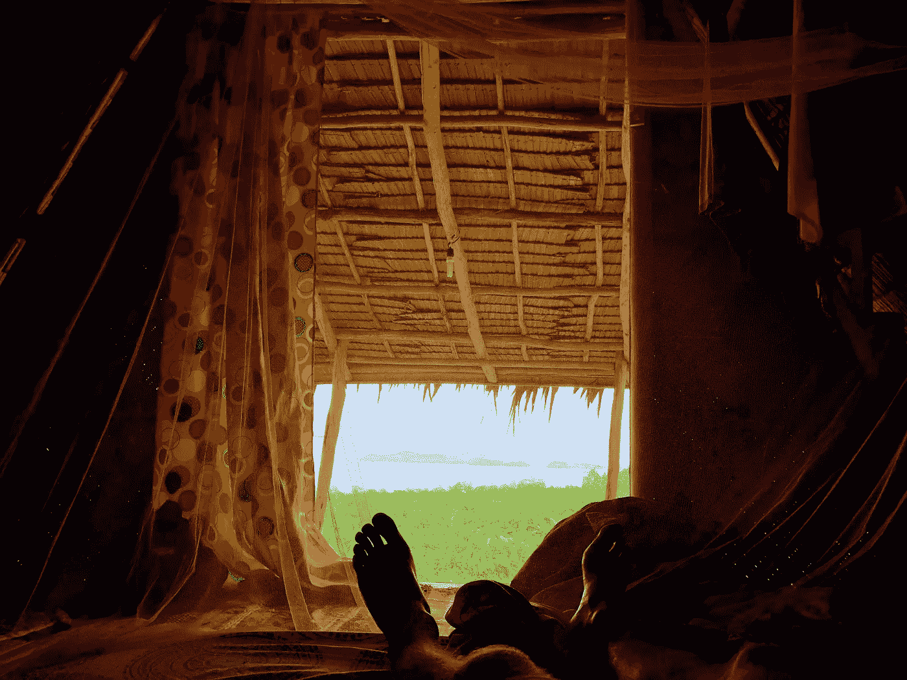
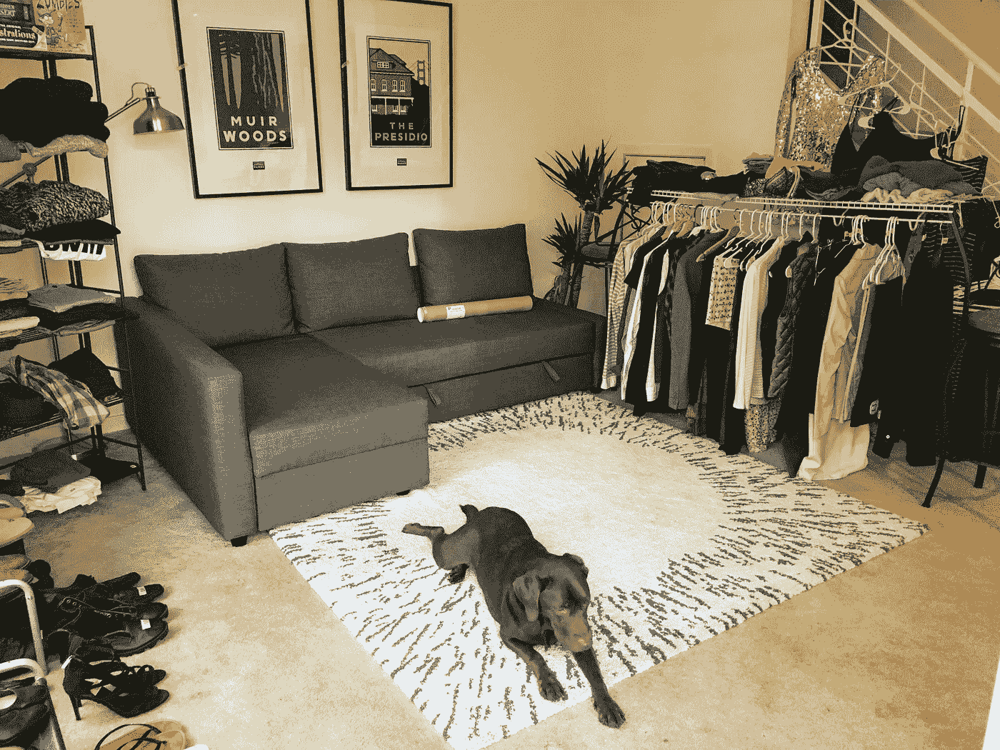
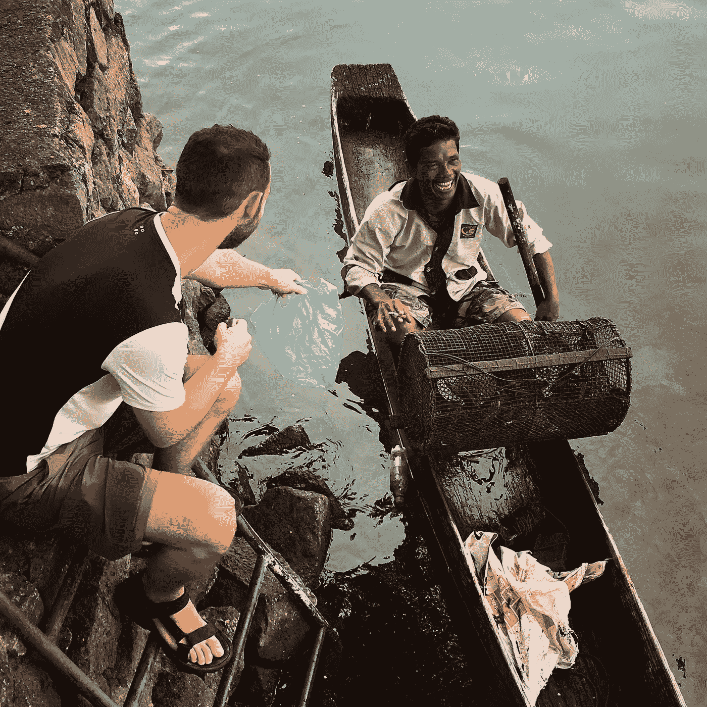
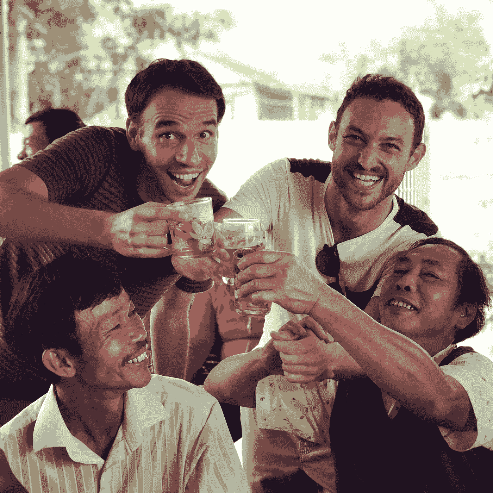
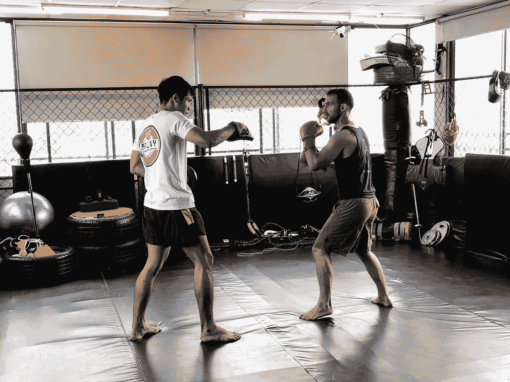
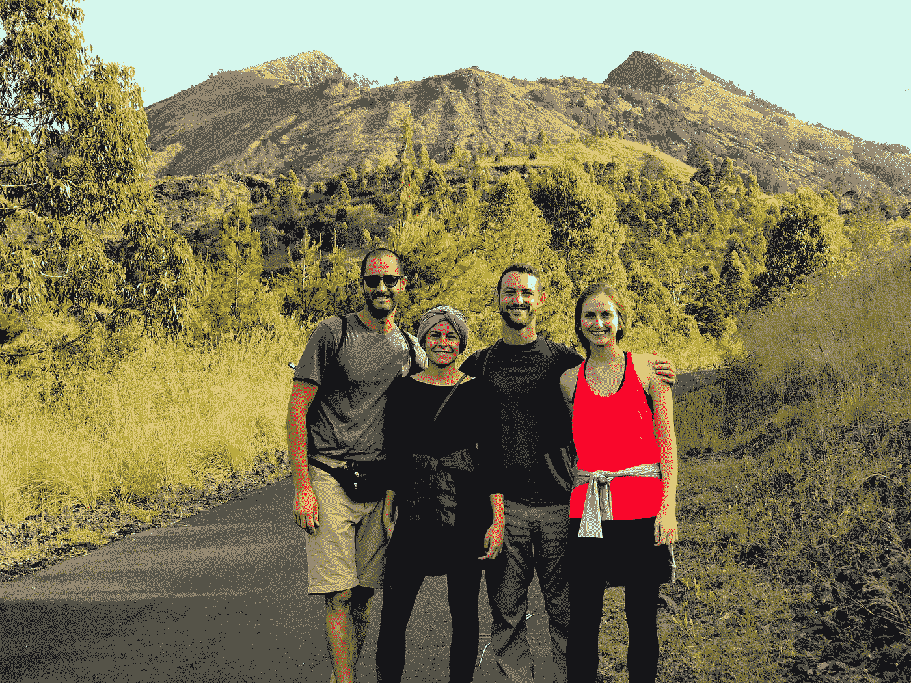

# 为什么我在周游世界的时候离开旧金山去创建我的新公司

> 原文：<https://medium.com/hackernoon/why-i-left-san-francisco-to-build-my-new-startup-while-traveling-the-world-64207fb260c2>

## 职业选择、预算、旅行建议、行程，以及所有重要的事情都有详细的解释

Sleeping in a hut in the middle of the jungle in Palawan (Philippines)

一年前，我和我的女朋友 Gaby 在旧金山 SoMa 社区和一个朋友吃饭时谈论职业选择和人生梦想。

在谈话的某个时候，我用一种趾高气扬的语气说:

> 如果我没有谈恋爱，如果我没有养狗，我明天就会辞职，离开旧金山，在东南亚旅行的时候创办我的新公司。

令我惊讶的是，我的女朋友看着我，她说:

> 我明天会辞职，我们会把我们的狗留给我妈妈。

我吓坏了。她完全是认真的！各种各样的疑问开始在我的大脑中出现:*这真的是一个好主意吗？我真的应该在一个我热爱的城市放弃一份我喜欢的工作吗？我真的想去旅行一年吗？我真的可以边旅行边创业吗？这对我们的关系会有什么影响？*

我们讨论了所有这些问题一个星期，然后我们做了一个决定:我们在圣诞节前辞掉工作，和家人一起度假，然后我们将开始为期一年的世界旅行，同时全职建设我的新公司。

2017 年 12 月，我们辞掉了工作，我们组织了一次庭院甩卖，卖掉了我们所有的东西(我们有很多东西！谢谢 Amazon Prime…)，我们离开了公寓，我们乘飞机去了萨尔瓦多，把我们的狗 Luna 留给了我女朋友的妈妈，然后我们开始了我们的旅程。正如我女朋友建议的那样！

Selling everything we had in our yard sale, and our dog Luna welcoming the shoppers

从那以后已经 7 个月了，我们在越南呆了 3 个月，在印度尼西亚呆了 3 个月，还有几个星期去了婆罗洲、科莫多岛、菲律宾和马来西亚。

Buying fresh lobster from a local fisherman in Lake Toba (Indonesia)

回到二月份，就在我们的旅行开始一个月后，我也启动了我的新公司，[微博客](https://www.microverse.org/)。从那时起，我已经帮助来自台湾、塞尔维亚、肯尼亚、西班牙、摩洛哥、墨西哥、加拿大和美国的学生成为远程软件开发人员，并获得了改变人生的职业机会。

我们现在正在进行为期一年的旅行，我只想花点时间思考一下我们决定进行这次长途旅行的原因，并回顾一下我们是如何实现这一目标的，尤其是必须平衡旅行和全职工作。

# 我们为什么这么做

我们这样做是因为我们可以。因为我们足够幸运，有足够的积蓄在没有收入的情况下旅行一年(稍后会有更多的介绍)，也因为我们的大脑习惯于从一个地方到另一个地方的想法，而不会对此感到焦虑。在这次旅行之前，我已经在阿根廷生活了 12 年，在西班牙生活了 13 年，在美国生活了 5 年。

**因为时机合适**。恋爱中的两个人同步辞掉工作，彻底改变自己的生活，却没有重大责任要承担，这种情况并不常见。如果我们当时没有这样做，我们可能再也不会有这样的机会了。

**因为三藩市很贵，亚洲不贵**。我在[工作，这家公司收购了我之前的创业公司](https://techcrunch.com/2013/11/13/lonely-planet-touristeye/)，我准备辞去那份工作，全职为我的新公司工作。然而，辞掉工作留在旧金山的费用高得令人难以置信。我每个月至少需要 4000 美元才能在旧金山生活，而不需要任何疯狂的奢侈品。在亚洲，我们以每月 900 美元的价格过得很好。

因为一开始你只需要把事情做好。尽管旧金山是世界上如果你在科技行业工作，你可以最大限度地利用机会的地方，但当你创办一家公司时，你真正需要的是专注于验证你的想法及其潜在的假设。我的新公司的客户不在旧金山，所以我没有理由去那里。

我怎么强调都不过分，不用担心钱，专注于把事情做好是多么的自由。当我在旧金山时，我知道辞职会限制我创办公司的道路。另一方面，保住那份工作给了我一种虚假的安全感，同时也阻止了我全力以赴地去创业。

# 我们是如何做到的

我们都是强迫性的计划者，所以我们从制定详细的行程开始。我们选择了世界上的一个地区，东南亚，我们投票决定我们想去的目的地和想做的事情。做出所有这些决定后，我们起草了一份行程表。这是一份随着我们调整计划而每天都在变化的文件，但它确实给了我们一些稳定感。

 [## 东南亚日历

### 旅程东南亚日历开始日期、结束日期、住宿天数、城市、国家、签证、游客、交通、住宿…

docs.google.com](https://docs.google.com/spreadsheets/d/1dj4ilB6Ufy51YMWKvbylNI9hjllGYydHPDv3-EY4POE/edit?usp=sharing) 

我们也认为这是一个回归更节俭生活方式的机会。在旧金山的几年里，我几乎对每一个晚餐和周末计划都说好，但要再次锻炼这块肌肉并不容易。

我们知道，让自己对自己的支出负责的最佳方式是制定一年的总预算，为每一类制定详细的预算，并每天跟踪我们的支出。

到目前为止，我们已经很好地将每月开支控制在预算范围内，以下是我们的做法:

1.  我们设定了一年的预算:11000 美元。相当于每月 916 美元。
2.  我们创建了一个费用类别列表(如机票、住房、食物、旅行活动等)。
3.  我们使用博客和网站，如 [Nomad List](https://nomadlist.com/) 来给每个类别分配一个合理的数量。
4.  我们在施瓦布银行开了一个[支票账户，因为他们在美国境外提供无限制的自动取款机取款服务，而且他们会退还你所有的自动取款机费用。](https://www.schwab.com/public/schwab/banking_lending/checking_account)
5.  我们在 [Ally](https://www.ally.com/) 上开了一个储蓄账户，里面有我们全年所需的所有资金(11000 美元)。
6.  我们创建了每月从储蓄账户到支票账户的自动转账，准确无误地记录了当月所需的金额。没有看到比你实际预算更多的钱是非常有效的。
7.  我们建立了一个应急基金，以支付旅行结束后 4 个月的生活费用，以及一些额外的钱，以防我们遇到某种医疗紧急情况(我们还为 [World Nomad](https://www.worldnomads.com/) 支付了一年的旅行保险)。
8.  最后，我们把其他所有东西(我们所有的储蓄)都放在指数基金中(我们是[改善](https://www.betterment.com/invite/arielcamus)的粉丝)，强迫自己围绕短期内不能指望那笔钱的想法来规划我们的生活(和预算)。在某种程度上，我们只能指望指数基金的长期表现。

Celebrating a death anniversary with a local family and a Portuguese friend in Hoi An (Vietnam)

这是我们预算的电子表格，如果你有兴趣看看我们的钱都花在哪里:

 [## 东南亚 2018 年预算

### 预算一月、二月、三月、四月、五月、六月、七月、八月、九月、十月、十一月、十二月汽车…

docs.google.com](https://docs.google.com/spreadsheets/d/1fsGlbGtFeNh_EWERcxvHVvd4B5EnhwSsL0qKfDLGl_o/edit?usp=sharing) 

最后，我们开始使用 [Mint](https://www.mint.com/) 来记录每一笔交易，即使我们用现金买了一杯 45 美分的咖啡。

在每个周末，每个月，我们现在可以看到我们是如何做我们的预算，我们可以相应地重新调整我们的计划。

然而，有一个非常重要的问题我还没有提到——如果我们一直在旅行，我怎么会有时间全职创建我的新公司呢？大家来说说吧…

# 如何在旅行中建立一家公司

简单的回答是，我们并不是一直在旅行。我们已经选择了三个大本营(越南、印度尼西亚和泰国),每次我们都要在这些地方“生活”几个星期甚至几个月。

为了在旅行和工作之间找到平衡，这里有一些我们遵循的简单规则:

1.  我们从周一到周五工作，每天至少 8 小时。
2.  我们像当地人一样生活、饮食和锻炼。这听起来可能很无聊，但是周围的一切对我们来说都是新的:人、食物、文化等等。
3.  每个周末，我们都在当地探险。这给了我们一周至少几天扮演游客的机会。
4.  每三周，我们会抽出整整一周的时间放下工作，去一些独特的地方旅行。加上之前和之后的周末，我们每个月有 9 天可以旅行。

Taking MMA classes in Ho Chi Minh City (Vietnam) three times a week with a local trainer

即使我们只是像当地人一样生活，而不是每三周旅行一次，这仍然会是一次令人惊讶和独特的经历。然而，能够每个月“休假”使这成为一种令人难以置信的平衡的生活方式。

我们没有理由一天工作 8 小时，一年休假一次或两次。这只是我们作为一个社会，基于我们想要维持的生产力水平而达成的共识。

技术正在让我们变得更有效率，这应该伴随着更灵活的日常工作和工作时间的好处。

更重要的是，作为一名企业家意味着我每天都有无限量的工作要做。这不是我花 4、6、10 或 14 个小时就能建立一个成功的公司的问题。这永远不够。事实上，每个月休假一周让我找到了空间和时间来以更具战略性的方式思考，找到前景，优先考虑我所拥有的有限时间，并得出真正重要的两个结论:

我只有建立一个伟大的团队来帮助我，我才能成就伟大的事情，而我只有一次生命。我们今年设计的一切都是为了忠实于这两个结论。

许多朋友告诉我们，他们一直想做这样的事情。我们的答案永远是一样的:为什么不做？大多数时候，他们的答案只是社会强加的一堆限制，而这些限制实际上并没有让他们更快乐或更成功。短期和长期都不会。

事实上，我们已经说服我们的许多朋友像这样度过一年，他们现在也在环游世界。甚至那些没有足够积蓄的人也决定在旅行时在当地工作或在线演出(而不是建立一家公司)来支付他们的旅行费用，这也很棒！

Our friends Agu y Gigi, who decided to leave SF to travel for a year too, climbing Mount Batur (Bali) with us

你还在等什么？

如果你想关注我们的冒险，[在 Instagram](https://www.instagram.com/arielcamus/) 上关注我，观看我们的日常故事。如果你有问题或者想了解我的新公司，[微博客](https://www.microverse.org/)，在[推特](https://twitter.com/arielcamus)上关注我。

