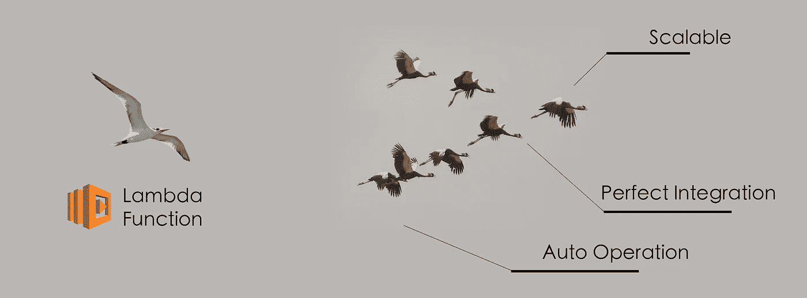

# 我为什么喜欢 AWS Lambda

> 原文：<https://medium.com/hackernoon/why-i-love-aws-lambda-reason-good-part-integration-auto-operation-scalable-nodejs-event-driven-b638b845dc84>

Lambda function: Scalable, Perfect Integration and Auto Operation

我和我的团队在不同方面研究过 Lambda，比如 CI/CD 管道(code commit/cloudfomation)、图像处理和数据库查询。Lambda 具有水的形式，可以渗透到 AWS 服务的每个角落，与其他服务很好的集成。事件源对象的事件驱动设计。我会说*是云服务的杰作。*

*L ambda 是一个轻松的操作天堂，我只关注 Nodejs 开发，不用担心部署、日志、公共 URL 配置。*

# *为什么是 Lambda*

*—与强大的 AWS 服务完美集成— ***API 网关*** 和 ***Lambda。*** 只需点击几下鼠标，就可以实现带有公共 URL 的生产 API。*

*—完全由 ***事件驱动*** ，只有被调用时才会运行。这对于在流量高峰之后有静默期的应用服务来说是完美的。这个优点也有帮助，它是 100%没有操作*

*— ***可扩展性*** ，Lambda 可以瞬间扩展到大量并行执行，其限制由*并发请求数量*控制。当 do 代码结束运行时，通过自动终止 Lambda 函数的执行，可以简单地处理缩减。*

# *参考:*

*—[https://www . contino . io/insights/5-killer-use-cases-for-AWS-lambda](https://www.contino.io/insights/5-killer-use-cases-for-aws-lambda)*