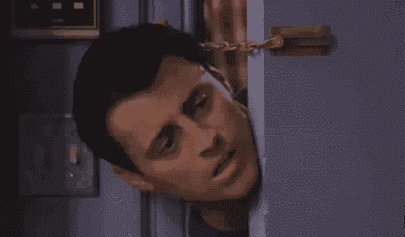
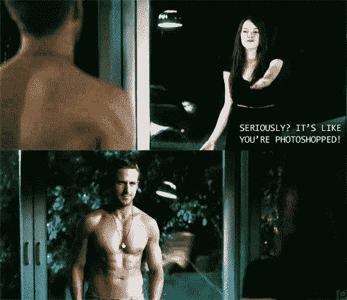

# 我为什么喜欢 SNAPCHAT

> 原文：<https://medium.com/hackernoon/why-i-love-snapchat-d9504331fb74>

这篇文章于 2016 年 5 月 26 日发表在我之前的博客上，现在已经不存在了。从那以后发生了很多变化，instagram 的故事变得更大了！回想起来很有意思。

除非你生活在岩石下，否则你会听说过 [Snapchat](https://hackernoon.com/tagged/sanapchat) 。你知道那家“小”创业公司，它捕捉那些立即消失的东西。多疯狂的想法？这是一个典型的反应，随之而来的是困惑为什么会有人用这个词。因为它是为了捕捉我们父母和祖父母的瞬间。这一切都是为了将来有所表现。

几年前，我不认为我会写这种帖子。我在捕捉永恒瞬间的营地里，向[未来](https://hackernoon.com/tagged/future)代人展示。但是玩了几个月，我就上瘾了。我看到了传统社交网络的优势。是的，脸书，我说的就是你😉

我向你展示让我爱上 Snapchat 的东西。我不知道这是不是这个应用程序背后的原始想法，但对我来说，它就是这样工作的，这就是为什么它很棒。

**亲密关系**

发送和观看快照有一种亲密感。你正在进入人们的生活，尤其是通过视频。你就在那一刻，在那 10 秒钟里，成为他们参与的事件的一部分。和 feed 是完全不同的交互。你不会滚动浏览成百上千的帖子，其中大部分是你多年前喜欢的脸书页面上的广告或新帖子。这种体验更加顺畅，你也更加投入，因为你不会觉得自己得到了所有人都得到的东西。思考技术的未来，尝试将 Snapchat VR 可视化。总的来说，它只是迎合了人类好奇的天性。

**对话开始者**

当我告诉没有账号的朋友没有喜欢的时候，他们很惊讶。你怎么知道你不会发布那些让人讨厌的垃圾信息？作为脸书和 Instagram 的用户，我发现自己有时会删除那些没有引起任何关注(比如赞)的东西。如果你不知道他们做得有多好，你就不会删除帖子。这也让你更积极，更不在乎发多少。缺少这一特性还有另一个好处。当人们在典型的社交网络上对一些事情做出回应时，他们会得到结论，他们会作为群体的一部分做出反应或评论，然后结案。想一想你在现实生活中被问及你的快照和 facebook 帖子的次数。

**纯**

不要 PS。
没有从 1000 张照片中仔细挑选。
没有特效，无数滤镜可供选择。
没有蒙太奇。

它不会显示你在其他应用程序上习惯的扭曲现实。这仍然是一个人生活的一小部分，但你不必拥有昂贵的设备，软件来成功地制作你生活的酷片段。有限的可能性突然让你更有创造力。

**享受生活**

Snapchat 鼓励你享受生活。仅仅坐在电脑或浴室镜子前很难创建好的 snapchat 帐户。你必须走出去，见见朋友，去听音乐会或参加体育活动。你必须不断寻找冒险的机会。

这是其他应用程序所没有的。他们会喜欢你在屏幕前张贴猫的照片或最新的《权力的游戏》剧透。Snapchat 并不觉得他想把你锁在手机上，让你成为甜蜜数字现实的囚犯。

Photo by [Redd Angelo](https://unsplash.com/@reddangelo?utm_source=medium&utm_medium=referral) on [Unsplash](https://unsplash.com?utm_source=medium&utm_medium=referral)

如果你喜欢这篇文章。跟我来

 [## przemysaw Mroczek(@ przemekmroczek)|推特

### przemyslaw Mroczek 的最新推文(@przemekmroczek)。人文主义者变成了开发者。创业爱好者。华沙

twitter.com](https://twitter.com/przemekmroczek)