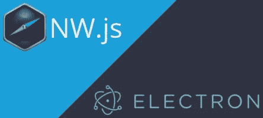

# 为什么我更喜欢 NW.js 而不是 Electron？(2018 年对比)

> 原文：<https://medium.com/hackernoon/why-i-prefer-nw-js-over-electron-2018-comparison-e60b7289752>

NW.js vs Electron (forgive the horrible design!)

在这篇文章中，我将给出一些客观的原因，为什么我更喜欢与 [NW.js](https://nwjs.io/) (以前的 node-webkit)一起工作，而不是与另一个家伙:[电子](https://electronjs.org/)。

如果你还不知道的话，这两个项目都是建立在 [Chromium](https://www.chromium.org/Home) 和 [Node.js](https://nodejs.org/) 之上的，所以你可以在系统级(文件系统访问等)使用 Node.js 编写桌面应用程序，并在 GUI 层使用 web 技术。

现在，电子有一些优点:

1.  **电子更受开发者欢迎:**几乎在我看到的每一篇帖子或文章中，人们都偏爱电子。从其他指标也可以清楚地看出这一点，比如 Github stars、npm 下载量等。
2.  **电子有更好的企业支持:** Github /微软在电子后面，而 NW.js 由 Intel 赞助。两个最流行的 ide([vs code](https://code.visualstudio.com/)和 [Atom](https://atom.io/) )都是用电子构建的。另一方面，我所知道的唯一一个使用 NW.js 构建的大项目已经停产。我指的是英特尔 XDK 公司。然而，在与 NW.js 的创建者和维护者罗杰·王(Roger Wang)交谈后，他指出，还有其他一些“大型”应用程序——规模都很大，而且拥有庞大的活跃用户群——使用 NW.js 构建，他指出，“微信小程序的官方 IDE 在 NW.js 上运行。使用它开发的小程序超过 100 万个。迷你程序运行在微信即时通讯软件上，该软件每月有超过 10 亿活跃用户。查看更多关于 [TechCrunch](https://techcrunch.com/2018/11/07/wechat-mini-apps-200-million-users/) ”的内容。
3.  电子提供开箱即用的**自动更新机制**。
4.  最后，它的**构建过程稍微简单一点**，因为你不需要构建整个 Chromium。有关这方面的更多信息，[查看此处](https://electronjs.org/docs/development/atom-shell-vs-node-webkit)和[此处](https://electronjs.org/docs/development/build-instructions-gn)。(但是，大多数用户既不需要构建 NW.js，也不需要构建 electronic)。

这就是为什么有人会选择电子的一些原因。现在，让我解释一下为什么我会走相反的方向。在我看来，NW.js 比电子更好！

## 1.传统系统支持

NW.js (LTS 版本 0.14.x)支持 Windows XP 和旧版本的 Mac OS。我知道即使是微软也已经放弃了对 XP 的支持，但是在很多领域，很多人仍然在使用它(它在一些国家拥有巨大的市场份额)。你不能只告诉你的客户升级！他们不会听的。

## 2.应用程序主条目可以是 HTML 页面或 Node.js 文件

NW.js 更面向浏览器。您可以将您的`main`条目设置为 HTML 文件或 Node.js 文件，或者两者都是(使用 package.json 中的`main`、`node-main`和`bg-script`字段)。在 Electron 中，您必须使用 Node.js 文件，并显式创建您的应用程序主窗口并打开它。

NW.js 的方法要简单和直接得多。它给你很多选择。它允许你做你在电子中能做的事，但反之则不然。

## 3.分离和混合环境

关于 JavaScript 上下文，NW.js 有一个简单而强大的机制。电子有两个独立的上下文(主进程和渲染进程)，它们是完全分离的。在 NW.js 中，您有两种选择:单独的上下文和混合的上下文。在我看来，这两种方式都比电子方式更简单直接。您可以构建整个应用程序，而无需复杂的 IPC 消息。

这里的问题是，NW.js 文档在这一点上非常非常混乱。事实上，我写了另一篇博文草稿(希望很快会发表),试图阐明 NW.js 中的上下文，以及如何在上下文和窗口之间轻松共享变量和状态，两种模式都有:分离和混合。

## 4.Chrome 扩展和。* APIs 支持

NW.js 支持 chrome。*原料药。更好的是，你可以使用 NW.js 运行 Chrome 应用/扩展，Electron 不能(并且[不会](https://github.com/electron/electron/issues/13123#issuecomment-399662730))这样做。

## 5.现成的 PDF(和 Flash)插件

NW.js 支持开箱即用的 PDF 文件，使用 Chrome PDF 原生插件。它工作起来非常流畅，你甚至可以设置`"main": "file.pdf"`，它就会工作。您可以在`<iframe>`、`<webview>`中显示 PDF 文件，或者只需将第`location`页指向 PDF 文件。

据推测，Electron 在[版本 1.6.4](https://github.com/electron/electron/releases/tag/v1.6.4) 中添加了这个特性。但是很 bug(检查: [01](https://stackoverflow.com/questions/52844135/view-pdf-in-electron-browserwindow) ， [02](https://stackoverflow.com/questions/43220321/electron-pdf-viewer) )。我尝试过很多方法(使用 Electron v3.0.8)在 Electron 内部显示一个 PDF 文件(`<iframe src='./file.pdf'>`、`<webview src='./file.pdf' plugins>`等很多)，但是 Electron 一直试图下载文件，没有按预期显示。经过一个小时的寻找解决方案，我放弃了。

## 6.源代码保护

NW.js 有一个源码保护工具。这允许您将 JavaScript 编译成 V8 字节码(以前它用于产生机器码)。另一方面，电子公司的人拒绝完全实现这个特性。

然而，我做了一个极简工具， [bytenode](https://github.com/OsamaAbbas/bytenode) ，它允许 Node.js 开发人员(甚至在 [Electron](https://github.com/OsamaAbbas/bytenode/tree/master/examples/electron-hello-world) 中)将他们的代码编译成 V8 字节码。

Bytenode 只编译 Node.js 代码，而将在浏览器中运行的 JavaScript 代码(通过`<script>`标签)无法使用它进行编译。所以，NW.js 在这里做得更好，因为他们的工具`nwjc`编译浏览器端的 JavaScript。使用这两个工具(`bytenode`和`nwjc`)你可以编译你的整个应用程序，甚至是第三方库(比如 jQuery)。

## 7.NW.js 使用最新的 Chromium 版本

NW.js 团队正在努力跟上 Chromium 版本。所以在 Chromium 新版本出来的第二天，他们将发布 NW.js 的新版本(最新版本的 Node.js 与 Chromium 具有相同的 V8 版本)。

虽然您可能不总是需要最新的 Chromium 版本，但是许多人确实需要。显然是 NW.js 的优势。

另一方面，Electron team 更愿意等待几周甚至几个月，然后再转向更新的 chromium 版本。

## 8.NW.js 有‐‐url 标志并支持 Chromium 命令行开关

你可以用`--url`标志:
`/path/to/nw --url="https://www.google.com/ncr"`启动 NW.js 来打开 URI，所以这是启动你的应用的第三种方式(除了使用 HTML 页面和 JavaScript 文件)。

NW.js 还支持所有 Chromium 命令行开关。更多信息，请查看 [NW.js 文档](http://docs.nwjs.io/en/latest/References/Command%20Line%20Options)。这些开关可用于调整和优化性能。

另一方面，电子没有对应的`--url`。你必须用一个 JavaScript 文件启动你的应用程序，创建你的应用程序窗口，然后手动导航到 URI。它也不支持所有的铬开关，[只支持其中的一部分](https://github.com/electron/electron/blob/master/docs/api/chrome-command-line-switches.md)。

## 9.NW.js 可以在没有开发工具的情况下发布

在 electronic 中，总是有 DevTools 嵌入在电子二进制文件中。可以这么简单打开:
`mainWindow.webContents.openDevTools();`。

在 NW.js 中，您将在生产中使用“普通”构建，它不包含 DevTools(只有 SDK 构建包含)。如果有人试图以编程方式打开 dev tools:
`nw.Window.get().showDevTools();`，他会发现一个空白的白色屏幕。

是的，理论上他可以使用 SDK 构建来运行您的应用程序，但是您可以在您的代码中防止这种情况(通过检查`process.version[’nw-flavor’]`是否等于`normal`，结合源代码保护，检查上面的№ 6)。你不能在电子版中这样做(如果我错了，请纠正我)。

## 10.打印 PDF 文件

如果您的应用程序需要轻松打印 PDF 文件，您应该使用 NW.js。无论您是打印网页(使用`nw.Window.get().print()`功能)，还是想要打印 PDF 文件(使用原生打印按钮，如 Chromium 所做的那样)，打印都会如预期一样工作。

另一方面，电子用户正在努力获得预期的打印功能。关于这个问题 Github 有很多开放的问题(比如# [9029](https://github.com/electron/electron/issues/9029) )。也参见这个 [StackOverflow 问题](https://stackoverflow.com/questions/49650784/printing-a-pdf-file-with-electron-js)，它有一些疯狂的变通方法，告诉你使用 PDF.js(哎哟！)将其内容呈现在画布上，然后打印出来！其他变通办法建议使用 SumatraPDF(哎哟又来了！).再说一遍，如果我错了，请纠正我，我对电子有一点经验。

## 11.更好的桌面应用安全模型

Chrome 中的安全模型(以及一般的网络浏览器)有一点限制性，这是由于你与你访问的网站的关系的性质。浏览器不允许网站访问你的文件系统，网站运行在沙盒环境中，他们受制于同源策略…等等。虽然这在 web 浏览器和网站的上下文中是有意义的，但是桌面应用程序需要更多。

NW.js 提供了另一个安全模型，它允许你“绕过所有的安全限制，比如沙箱、同源策略等等。例如，根据 [NW.js 文档](http://docs.nwjs.io/en/latest/For%20Users/Advanced/Security%20in%20NW.js/)，您可以对任何远程站点进行跨源 XHR，或者访问节点框架中`src`指向远程站点的`<iframe>`元素。罗杰·王(Roger Wang)表示:“在这种模式下，我们可以做的事情越来越多，在(你的)文章中向开发者征求建议可能会很好。欢迎像[这种](https://github.com/nwjs/nw.js/issues/6696)的问题报道”。

相比之下，electronic 禁用了嵌套的`<webview>`标签( [01](https://github.com/electron/electron/issues/1130#issuecomment-74200896) ， [02](https://github.com/electron/electron/issues/5036#issuecomment-206826729) )等特性，因为“这是一个维护负担”并且“不容易把事情做好”。(顺便说一下，你可以随心所欲的在 NW.js 中嵌套`webview`标签，但是对于[本地 HTML 文件](http://docs.nwjs.io/en/latest/References/webview%20Tag/#loading-local-files-in-webview)，你必须在`package.json`中添加一个权限)。

最后，我有点偏向 NW.js，希望这种偏向没有影响我文章的准确性。任何意见或更正都非常欢迎。