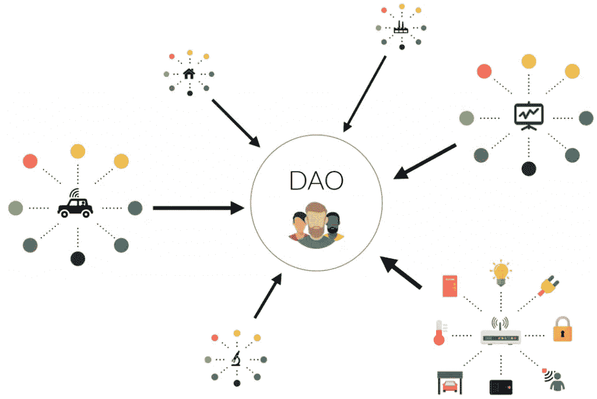

# 为什么我要辞职去道工作

> 原文：<https://medium.com/hackernoon/why-i-quit-my-job-to-work-in-a-dao-8cf222902c0c>

## 我在一家优秀的公司和优秀的员工一起工作，收入颇丰。为什么整个事情感觉如此没有意义？

每一代人大概都觉得自己是史上最拧的。然而，这种信念对千禧一代来说尤其如此。[懒惰、有权有势、自私自利](https://www.youtube.com/watch?v=hER0Qp6QJNU)是媒体在谈论 y 一代时喜欢使用的几个标签

作为一名千禧一代(和很多其他人一起玩)，我知道这些陈词滥调与事实相去甚远。

**制造危机**

作为千禧一代，我们明白我们赚的钱不能保证我们以后生活的安全。因此，我们不太愿意满足于一份不满意的工作。严酷的现实让我们变得更加灵活，更加合作，更加敢于追求我们相信的项目。

我辞职的主要原因是我感觉缺乏透明度，我觉得每个人都是为了少数人的利益而工作。我用我的时间和努力换来了固定的薪水，关于这个项目的关键决定都是由少数几个精选出来的人做出的。这让我觉得与世隔绝，很容易被取代。但是不都是这样吗？

**道与作品的未来**

> *“我们正在经历工作方式的根本转变。自动化和“思维机器”正在取代人类的任务和工作，并改变着组织对员工技能的要求。这些重大变化带来了巨大的组织、人才和人力资源挑战，而此时企业领导人已经在努力应对前所未有的风险、中断以及政治和社会动荡。”(***)**

*近年来，区块链科技的崛起为一种被称为 DAO(去中心化自治组织)的新型组织奠定了基础。它就像一个棋盘游戏，每个人都知道如何赢或输的规则。不同之处在于，规则手册不是从盒子里出来的——玩家才是为每场游戏设定规则的人。我给你举个例子。*

*每个在大富翁棋盘上掷骰子的玩家都知道，最终目标是通过购买、租赁和交易财产成为最富有的玩家。同样，每个道玩家都知道共同的目标是什么。无论是为无人驾驶汽车开发软件，还是培养跑赢股市的人工智能，或者你能想到的任何其他事情，道都将致力于同一目标的人们团结在一起。*

*一旦设定，规则是硬编码的，这意味着它们独立于它们的创造者，不能受外部力量的影响。此外，只有在本组织大多数成员同意的情况下，才能改变规则。*

**

*DAO 规则的示例可以是:*

*1)如何进行民主决策。*

*2)给人发多少工资，如何评价工作。*

*3)如何分享收益。*

*一套清晰的规则可确保参与“道”的每个人都朝着同一目标努力。好处是实际的——没有一个要求你信任并告诉你该做什么的中央法律实体。游戏的玩家有平等的投票权来决定项目的路径。玩家管理自己的资源和时间来完成任务。你的同事评价你的工作。*

*DAO 和普通公司的一个主要区别是 DAO 没有单点故障。如果一个关键人物停止向共同目标努力，团队中的其他人将能够投票决定前进的道路。如果埃隆·马斯克决定退出特斯拉(一个集权组织)，他仍将拥有该公司 27%的股份。如果一个人退出了一个道，他不会拿走股权，而只是根据他对项目的贡献获得的代币。*

*这是我们需要的透明度，就像呼吸对身体一样珍贵。现在我们有了构建未来组织的框架和工具。*

***外卖***

*从朝九晚五的工作转变为 DAO 的一部分，让我对工作有了全新的认识。*

*通过与志同道合的人一起工作，找到你所做事情的意义。决定你自己的规则，彼此合作，而不是为对方。实现目标。*

*现在，我成了自己工作的管理者。我记录我完成任务的时间。我审查我的同事的工作，我们都投票决定我们正在建设的两个大项目的下一步。这使我们能够保持一切透明，每个成员的贡献都有一部分利润作为回报。系统是公平的，我们制定的所有规则和决定都记录在区块链上。*

*如果你对这类工作感兴趣，可以看看[同志合作社](https://comradecoop.com/)和我们的项目。我们很乐意告诉你更多关于他们的事情。你也可以加入我们的不和谐社区:【https://discord.gg/3WsHKcz *

**原载于 2018 年 10 月 9 日*[*comradecoop.com*](https://comradecoop.com/why-i-quit-my-job-to-work-in-a-dao/)*。**