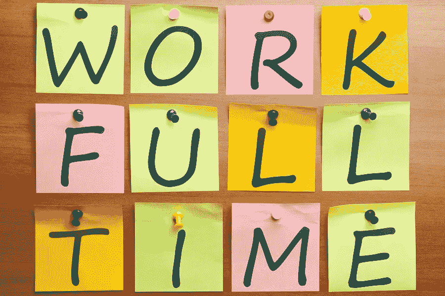

# 为什么我拒绝为我们的创业公司推出 ICO，为什么你也应该拒绝。

> 原文：<https://medium.com/hackernoon/why-i-refuse-to-launch-an-ico-for-our-startup-and-why-you-should-also-refuse-a8dedede4e34>

得了吧，很明显为什么世界上这么多的初创公司和企业家屈服于创造一个 ICO 的诱惑。基本上，答案是因为 ICO 承诺轻松赚钱。然而，推出一个 ICO 并不那么简单，让它成功也不是一件容易的事情。

在 K-chin，我们对挑战着迷，但我们对想要面对的挑战非常挑剔。我们最大的挑战是创造对人们有价值的产品。很简单，如果你创造了人们愿意使用和推荐的东西，那么围绕它开发服务就更容易了。

设计和开发产品和服务是一项全职工作，有起有落，尽管道路从来都不是笔直和容易的，但不可否认的事实是，从长远来看，情况会好得多。

ICO 的问题在于，创造具有内在价值的产品的所有环节都被遗忘了，尽管不是全部，但大多数都更关注从零开始筹集资金。

也许你会想，想赚几百万美元有什么错？显而易见，一旦有了钱，就更容易创造出你一开始就承诺的伟大的创新产品。

然而，我不知道有多少 ICO 已经是一个拥有数百万用户享受服务的功能平台。病例非常稀少。

不要误解我，我并不反对 ICO 本身，我反对滥用一个伟大的[工具](https://hackernoon.com/tagged/tool)，这个工具已经逐渐被诈骗、传销和许多空洞的承诺渗透。

首先，我们必须问自己。我们真的需要推出 ICO 吗？我们的产品本身是否足够好，足够有价值？也是最重要的。我们真的在我们的项目中以最好的方式实现了这项技术吗？

最终这是一个决定的问题。每个人都可以自由决定如何实现技术，如何到达市场。不管怎么说，看到越来越多设计和开发都很好的项目会很棒。

你怎么想呢?