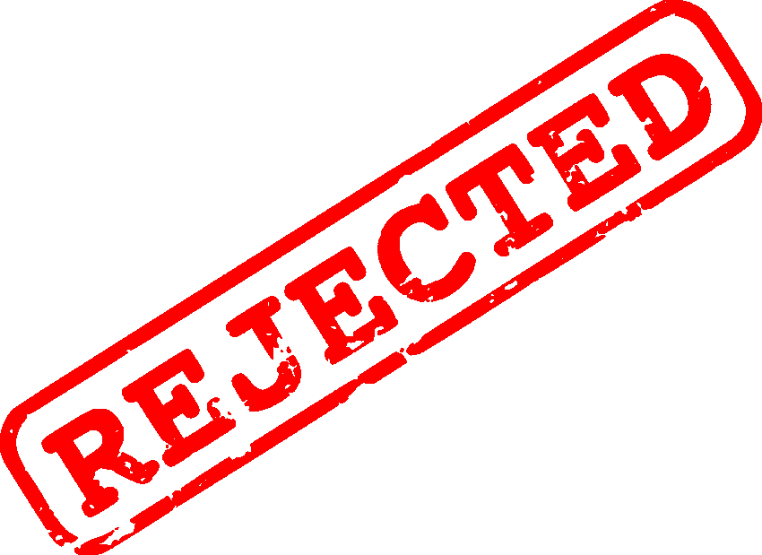

# 为什么我拒绝了 100 万欧元的投资

> 原文：<https://medium.com/hackernoon/why-i-rejected-1m-eur-investment-dca48fb46545>

## 最主要也是最老的教训:不要和你不信任和不了解的人一起创业。

> 【2014 年 11 月。在拒绝了 100 万欧元的投资后，我以 1000 欧元的价格卖掉了我在一家在线化妆品公司 50%的股份。

你为什么会问我拒绝了 100 万欧元[投资](https://hackernoon.com/tagged/investment)？请继续阅读，找出答案。

**2013 年**。我的朋友闫给我介绍了两个以色列人，他们做的化妆品很棒。他们在几个国家通过伙伴关系进行销售。他们渴望上网，但没有相关知识和专业技能来实现这一目标。

**2014 年 2 月**。我们决定联手打造一家在网上销售化妆品的全球性公司。我们对半分，同意我做主要工作。另外两个人带来了产品和钱。

4 月份，我在亚马逊英国和我们自己的网站上发布了该产品。我们马上开始获得好的销售业绩。我跟着亚马逊美国、加拿大和其他欧洲国家。

直到 2014 年 9 月，我所有的“空闲时间”都在工作。我打包箱子，联系有影响力的人和博客，改进搜索引擎优化，发送订单。通常，每天直到凌晨 1-2 点。

一直以来，我和我的合伙人一起吃午饭，通过电子邮件/电话交流。我独自工作。

**2014 年 10 月**。当我可以支付自己“还行”的薪水来生活的时候，我开始全职工作，我们发展得相当好。

然而，在同一个月底，我们的一个合作伙伴决定向该公司投资 100 万欧元。我收到了最后通牒:你无法匹配我的投资，所以你个人需要对公司负责。感觉像是被操纵了。
我很高兴我们能获得 100 万欧元的投资，但我连续几天睡不好觉。

最后，我决定退出，原因如下:
——我对我的合伙人不够了解，不能把一切都摆在桌面上，让我的家人处于危险之中；
——“接受或出卖”。如果我的合伙人在我们开始合作时提出了这样的条件。我的脑子快把我逼疯了，他们以后会做什么。

> 最主要也是最古老的教训:不要和你不信任的人以及有长期关系的人一起创业。