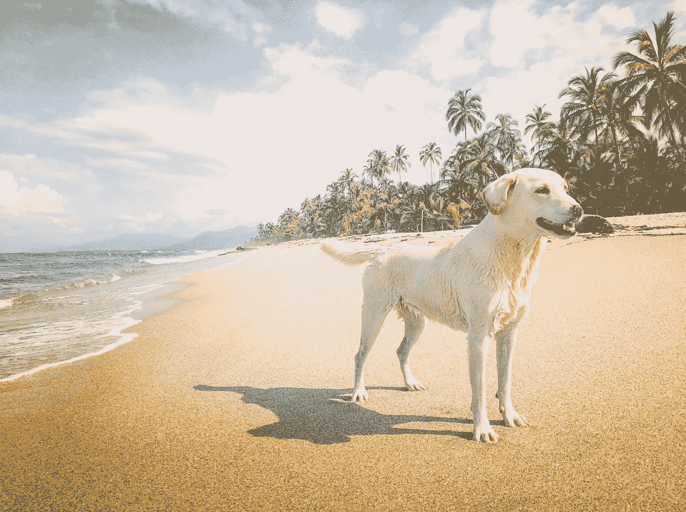
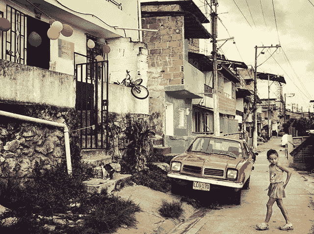
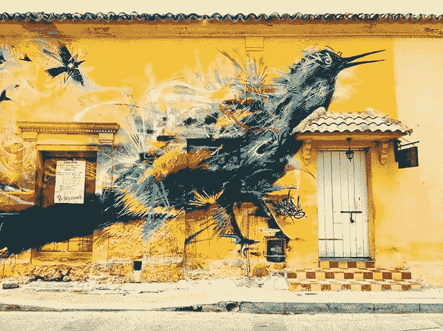
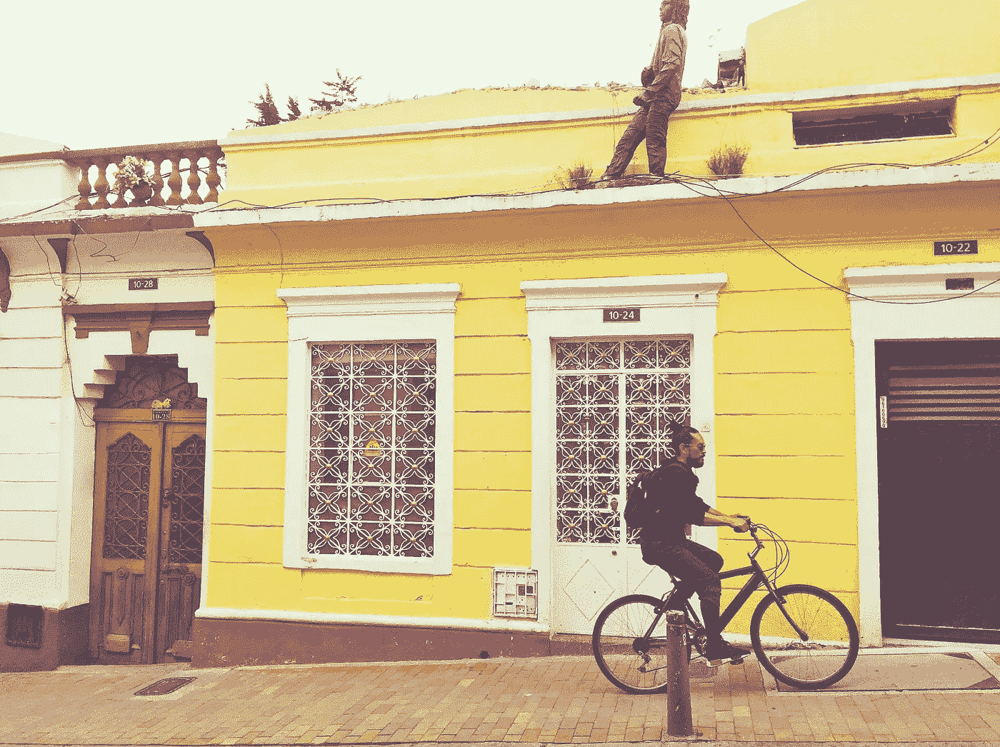

# 为什么我不再外包我的记忆

> 原文：<https://medium.com/hackernoon/why-i-stopped-outsourcing-my-memory-cecb14c51bae>

## **开始用我的照片做些事情**

> 我以拥有好的记忆力而自豪。如果我没记错的话，我的朋友经常对我记得的事情感到震惊。虽然我可能会对我所能回忆起的事实感到高兴，但大多数时候我都被嘲笑为给这种 f ***rivolous*** 东西赋予了这么多脑力。

如果我有超能力，选择对我来说会很容易。我喜欢沉浸在怀旧中，拥有一个深不见底的记忆的想法是美妙的。我知道，我可以使用[和爱因斯坦](https://www.inc.com/empact/why-the-smartest-people-are-constant-learners.html?cid=search)一起月球漫步中被证实的技巧——但是我很懒。我选择依赖我的数码档案，里面有将近 25 万张照片。不健康？当然可以。不正常？你会对普通快乐鲷鱼的习惯感到惊讶。

像大多数人一样，随着数码摄影的出现，我的指向和拍摄实践飞速发展。我被归类为轻度发烧友，每周只有 150 张照片。作为一个物种，我们在 2017 年抢购了超过 [1.2 万亿](https://mylio.com/true-stories/tech-today/how-many-digital-photos-will-be-taken-2017-repost)张照片。这些图片的绝大部分都没有被印出来。他们被困在我们的应用程序、驱动器、社交网络和云中。

# **痴迷于 Instagram-able 时刻**

千年之交，我去了科切拉。当时仅有的相机属于专业音乐摄影师。当我最近重返电影节时，令人惊讶的不是无处不在的智能手机使用，而是无尽的电池充电站。这些笨拙的固定装置，由一个像乐高积木一样的大积木组成，配备了 24 个齐胸高的插座。风格完美的青少年为他们下一次纪录片式的外出加油。

事实证明，这种对 instagram-able 时刻的迷恋不仅仅是一种痴迷。最近的一项研究声称，抓拍照片实际上有助于我们更好地享受经历。对于像我这样可能犯有这种放纵罪的人，我从经验证据中寻求安慰，即拍照也有助于我记忆。

但是仅仅拍照就足够了吗？电影制作人路易斯·布努埃尔说得好，“……没有记忆的生活根本就不是生活……我们的记忆是我们的连贯性、我们的理性、我们的感觉，甚至是我们的行动。没有它，我们什么都不是。”我们在 Instagram 上的性感叙述仍然停留在应用程序中。他们活在过去，而不是现在。将照片送给朋友，你不仅仅是短暂的“喜欢”你所给予的，是今天和明天都可以享受的记忆。

# 当这些照片从云中消失

当你像我一样拍这么多照片时，存储是个问题。我的好朋友*云*，也就这样成了值得信赖的知己。我如此信任他，以至于在过去的几年里，我把我生活中的数字故事放在了他的手掌心里。但是在短暂的失忆中，他把球弄丢了。或者用极客的话来说，他忘了同步我的资料库和保护我的照片。我难以置信，就像我之前和云的[近亲](https://www.inc.com/jonas-altman/three-steps-you-can-take-to-reduce-pain-of-technology-failure.html)在一起一样。

三个月的照片瞬间没了。这肯定是第一世界的问题，但我还是大吃一惊。这让我想起了在我的好朋友*云*出生之前我被盗的那次。我的硬盘，我过去数字化的财富，和我的笔记本电脑一起被带走了。我哀悼。几周后，令我惊讶的是，我发现我把硬盘藏得很好，不让任何潜在的窃贼发现——我也被骗了。我开始思考‘如果一个存有我的数码照片的硬盘被拿走了，那些记忆会存在谁的手里？如果我奇迹般地与这个硬盘重聚，那些记忆会回来吗？

回想起来，如果我按照自己的意愿打印并分享了这些照片，我的焦虑会大大减少。痛苦与其说是失去记忆的结果，不如说是无法与朋友和家人分享记忆的结果。

# 是时候对我们的照片做些什么了

事实是，我们大多数人都想更频繁地体验我们的照片。问题不是我们缺少时间，而是我们的照片乱七八糟。“我的照片处于完全混乱的状态。我被这种感觉所困扰，”我采访的一位快乐的笛鲷大声说道。

很多公司都在努力让你激活你的照片。至少，他们会敦促你打印一张画布、一本书、一个杯子甚至一个枕头。我的问题是:我很懒。我想到了一个未来的场景，我可能最终会创建空间来组织、打印、共享和欣赏我所有的照片。我的错觉是，每个月，我只会通过添加成千上万的图片来增加问题的复杂性。那段回忆的时光只会越来越遥远。

如果我从我的照片混乱中学到了什么，那就是:我该停止抱怨，开始用我的照片做点什么了。所以今年，每个月我都会打印一张照片，并装框送给别人。我从今天开始，鼓励你也这样做。毕竟，难道我们不应该把照片放飞吗？

Playa Azul on North Coast

我们的数字图书馆曾经在一个叫做 Everpix 的时髦服务中有一个英雄。帮助您整理照片的好处不胜枚举，其中我最喜欢的是照片重复数据删除。虽然这家初创公司减轻了组织的痛苦，并允许用户花更多时间享受——但它从未真正发挥作用。这让我越来越觉得问题在于我们，而不是技术。

如果我从我的照片混乱中学到了什么，那就是:我该停止抱怨，开始用我的照片做点什么了。所以今年，每个月我都会打印一张照片，并装框送给别人。我从今天开始，鼓励你也这样做。毕竟，难道我们不应该把照片放飞吗？