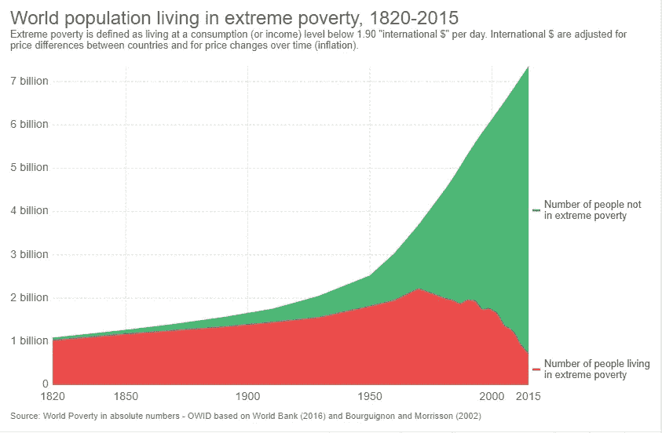

# 我为什么不再看新闻:关于新闻封锁的笔记

> 原文：<https://medium.com/hackernoon/why-i-stopped-reading-the-news-notes-on-a-news-blackout-2a45ab7e7d39>

为什么要封锁消息？

(如果你已经确信或者不关心我的具体原因，跳到方法和发现)

十年来我一直是新闻迷。我高中最后一年开始沉迷于历史研究和发现左翼新闻网站。这些年来，我的消费变化很大，我的评论试金石变成了《大西洋月刊》的 Ta-Nehisi Coates 博客，Matt Yglesias 在 Slate 的钱箱，以及 Ezra Klein 在 WashPost 的 Wonkblog。从 2008 年到现在，我一直在跟踪这些人和他们圈子里的人。

我看着科茨研究二战和内战，宣传他的教育，向部落学习，成为《我与世界之间》的作者。我看着 Matt 和 Ezra 从大学博客写手转变为创办(与 Sarah Kliff，一个令人敬畏的天才，但我在 Vox 之前不认识他)一个新的[媒体](https://hackernoon.com/tagged/media)发电站。很明显，在过去的十年里，我追随了很多其他作家，但是这些人每天都告诉我如何解读事件及其背景。我希望我的媒体消费和很多人差不多，因为这一群人已经变得很受欢迎了。从大学开始，我被训练成一名记者，并且非常认真地假装成一名记者。我是学校[报纸](https://hackernoon.com/tagged/newspaper)的编辑，在智利的一家报纸实习了一个夏天。很长一段时间，我可以假装我的媒体饮食对职业有益。

博客、Twitter 和传统媒体想出了如何向数字媒体过渡的方法，这使得每天创建的新闻内容数量呈指数级增长。我们真的生活在热拍的黄金时代。而我，在很大程度上，试图跟上。最终，即使是传统的媒体:NYT、华尔街日报、彭博、华盛顿邮报、大西洋、政治和 Vox，也变得太多了——特朗普时代的媒体可能发生了质的变化，但我认为音量本身太高了。作为回应，在 2017 年初夏，我试图通过删除 Twitter 和苹果新闻应用程序，并通过谷歌搜索“作家姓名 Twitter”，只允许自己在浏览器中的 Twitter 上看到我喜欢的作家/评论员，来拨回它。这有一段时间奏效了。但是我喜欢的作家/评论家的世界扩大了。很多时候，我会掉进黑洞。

尽管我尽了最大努力保持温和，但 2017 年夏季/秋季关于废除奥巴马医改的辩论让我崩溃了。我们都屏住呼吸看着它——废除，瘦骨嶙峋的废除，不管最后一次万福玛利亚被称为什么。数不清的肾上腺素和皮质醇激增，围绕补贴或其他政策细节的合作而发生的内讧。为什么不呢？医疗保健占 GDP 的 20%(还在上升)——弯曲成本曲线要么重要，要么真他妈的重要。你知道，生命危在旦夕。

但是，众所周知，最终，什么都没有改变。几个月的争论。推测。谣言。得分。然后。没什么。当时让我痛不欲生的是，我更广泛地意识到，大多数“新闻”本质上都是猜测性的。除此之外，大多数新闻报道的预期价值与它们的覆盖范围相比，小得可笑。如果大部分时间里什么都没发生，每天花…小时…阅读新闻和评论对我有什么真正的好处。

九月的某个时候，在这一切结束的时候，我要去法国旅行两周。里昂。驾车穿越多尔多涅和卢瓦尔河谷。在圣埃米利永停留。在波尔多住几晚。还有一些在巴黎的玛莱区。我决定在这些地方我需要做的最后一件事就是读他妈的新闻。所以我没有。但我回来后就没有了。我仍然没有。

## 以下是我所做的和我所发现的。

**方法**

*   不要上社交媒体。一点也不。(总的来说，这可能是个好建议，但为了避免最具煽动性的新闻，这是必要的。)
*   不要阅读任何可以被理解为新闻的东西，包括事件驱动的博客、观点文章或新闻特写。
*   不要看新闻(这很简单，因为我从来不看)。
*   不要和任何人谈论新闻。除非他们坚持。
*   这个明显的例外实际上是重要事件。如果一个故事的预期价值非常非常高，那么有人会坚持让你知道，尽管最初会有抗议。如果有人突破了这个门槛，我会允许自己通过谷歌搜索这个话题并阅读谷歌新闻顶部的一些故事来阅读。
*   当被要求为自己辩护时，我会问这个人他们认为世界上最重要的故事是什么。他们告诉我他们认为那是什么，并且总是反过来问我。我给他们看了这张图表。

[来源](https://ourworldindata.org/extreme-poverty/)

几乎毫无疑问，他们会承认他们错过了过去 20 年中最重要的人类发展。

**调查结果**

*   这消息真让人上瘾。我已经三年两个月十一天没抽过烟了。我可以告诉你，我们的新闻环境就像香烟一样让人上瘾。我已经间隔六个月戒了咖啡因。这个消息远比咖啡因更容易让人上瘾。很明显，接收到的少量信息会让你产生多巴胺。

大多数时候，当我醒来的时候，我都想看看新闻。我不想抽烟。

*   我没错过多少。每次发生大规模枪击事件，我都会在几个小时内知道。当哈维·韦恩斯坦事件曝光后，我第二天就发现了这件事，并被告知工作场所性骚扰的清算情况。我要说的是，我仍然不太了解最终通过的税收法案，但从我信任的人那里收集到的信息来看——它似乎是由蜘蛛网和魔法制成的，所以我预计会出现负外部性，而不管其有意的分配和扭曲效应。
*   状态信号效应是混合的。我刚认识的人似乎把我不接触新闻解释为缺乏世故或公民精神。不能坚持政策建议会降低地位。那些在昏迷事件前认识我的人似乎认为我被误导了，但尊重远离我的纪律。
*   我开始更有意识地阅读。曾经花在阅读政治或宏观经济预测上的时间，现在花在了我开始阅读的书籍上，以及我关注的少数几个作品不受新闻驱动的作家身上。
*   我觉得自己的党派意识大大降低了。我知道每个人都认为他们没有真正的党派性，我相信我也是这样。但是，我可以承认，我曾经是一个党派黑客——尽管我是一个公开宣称的独立人士。我现在发现自己对任何一方都不那么有热情了，反而更愿意批评左翼，愿意倾听右翼知识分子的声音。我发现这…最多是可疑的。

这可能是因为我可以花更多的时间思考政治问题，而不是以一种快速的方式对每天出现的 100 条新闻进行广泛的启发。

或者我读到的渠道在塑造我的信念方面比我想象的要有效得多。

*   当世界已经变得并且正在变得越来越好的时候，却有如此多的人相信世界正在变得越来越糟，这让我不断感到震惊。
*   我想重申:新闻提要比尼古丁更容易上瘾。我每天都想念饲料，就像我不想念香烟一样。

**结论**

我要继续新闻封锁。每天都要忍住查看新闻的冲动，这种感觉很怪异，也很难。但是对我的时间、注意力、政策观点和血压的更大控制是值得的。