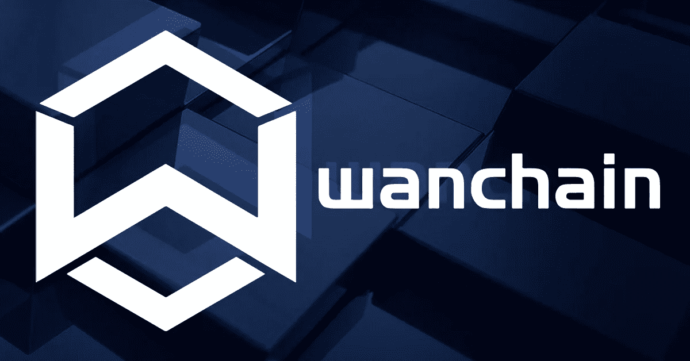

# wan chain——未来的加密资产全球金融高速公路？

> 原文：<https://medium.com/hackernoon/why-i-think-wanchain-is-an-incredible-long-term-investment-86b9d0d6eb6c>

***免责声明*** *:本人与万链团队没有任何关系。我既不是财务顾问，也不是财务建议。无论接下来发生什么，都只是反映了我对这个项目的理解，以及我对其未来前景的个人看法。*

这篇文章的目的是用简单的话来阐述 Wanchain 是什么，以及为什么我认为 Wanchain 的本地硬币 Wancoin 可能是最好的加密货币之一，不仅是在未来几个月，而是几年。

所以，让我们开始吧！

## 什么是 Wanchain？

万链的愿景是*重建金融服务*。Wanchain 是一个全球金融平台，在不同的区块链之间连接和交换价值。简单来说，万链是传统银行在当前和未来金融格局中的‘去中心化’版本。

## 我们为什么需要 Wanchain？

我们生活在一个重大数字转型的时代，在这个时代，数字资产正以前所未有的速度进入金融生态系统。随着数字资产的采用越来越多，我们见证了这些资产的价值不断升值。这就需要有一个*“数字桥梁”*在不同的区块链之间以数字货币和/或资产的形式转移价值。

## 万链是如何做到这一点的？

Wanchain 的分布式分类账允许:

**跨链资产转移:**跨主要区块链，如比特币和以太坊，以及跨基于 Wanchain 协议开发的区块链联盟的资产转移将是可能的。社区开发者可以创建独立的服务。任何区块链(私有、公共或财团链)都可以与 Wanchain 集成，以建立不同分类帐之间的连接，并执行低成本的分类帐间资产转移。该协议还确保所有跨链传输的稳定性和安全性。

**交易隐私保护:** Wanchain 协议提供了执行私密交易的选项，类似于隐私币平台上提供的，基于一次性地址和环签名。Wanchain 还允许数字资产持有者在其协议中保持匿名。

**功能扩展性:** Wanchain 协议允许为企业和个人提供不同数字货币的信贷和借贷便利。此外，一旦区块链财团被纳入万链协议，它也允许发行和交易全新的数字资产。

**复杂应用支持:**社区开发者可以基于智能合约和通用协议开发更复杂的应用。链内和跨链连接为进一步的应用程序开发提供了更多的选择。

## 万链的关键优势是什么？

1.  **万链与** [**Factom**](https://www.factom.com/) **的合作，让人们对万链在未来几年所能取得的成就充满信心**。Wanchain 是由中国公司 [**【王璐科技】**](http://wanglutech.com/) 设想的，由 [**Jack Lu**](https://www.linkedin.com/in/jack-lu-57995469/) 创立，他也是 **Factom:** 的联合创始人兼首席技术官，这是一家区块链技术公司，开发了使用区块链来保持记录和身份更加安全的方法。在撰写本文时，Factom 的估值约为 5.6 亿美元，与几家公司有合作关系，包括 *Smartrac、荣都科技、软通动力*和 *Netki* ，以及区块链的公司，如 *ShapeShift、Tether、*和 *Synero* 。Factom 的投资者包括 *Fenbushi Capital、Draper Associates、比尔盖茨、Stewart Title、Overstock、Harvest Partners、国土安全部*和*洪都拉斯政府*。Wanchain 目前的三名团队成员和一名顾问 *David A. Johnston* 之前曾与 Factom 合作过。
2.  **Wanchain =** [**以太坊**](https://www.ethereum.org/) **+** [**涟漪**](https://ripple.com/)**+**[**Monero**](https://getmonero.org/)**+**[**chain link**](https://www.smartcontract.com/)，集于一身，而且在很多方面，更好！首先，Wanchain 是以太坊的一个硬分支，但将被实现(在 mainnet 推出之后)，允许它更好地扩展。其次，Wanchain 通常被称为“中国涟漪”，然而，Wanchain 比涟漪分散得多，真正代表了“分布式”超级金融市场应该是什么样子。第三，Wanchain 具有 Monero 风格的隐私功能，允许为每笔交易生成新的一次性地址，具有环签名，保持交易私密，以及数字资产持有人匿名。最后，就像 Chainlink 使用区块链中间件允许各种网络上的智能合同与关键的外部资源和数据馈送连接一样，Wanchain 协议将区块链网络无缝连接在一起，记录跨链和链内交易。
3.  **万链拥有一个一流的** [**团队**](https://wanchain.org/about) **拥有区块链技术和密码学领域最聪明的头脑。** Wanchain 拥有 23 名团队成员和 11 名顾问，他们的业务涉及所有领域。该团队由三名拥有应用数学学位的博士、经验丰富的软件工程师、密码学家、计算机科学家、金融专家以及媒体和社区经理组成。该团队在中国、美国和新加坡等国家拥有丰富的商业专业知识和资源。要公正地评价 Wanchain 团队的经验和能力的广度和深度，这篇博文将会变成一篇冗长的文章。但底线是，**在全球区块链项目中很难找到如此强大的团队**。
4.  2017 年 11 月， **Wanchain 与** [**ICON**](https://icon.foundation/en/) **和** [**Aion**](https://aion.network/) 正式加入区块链互通联盟(IOA)，共同目标是通过联合研究和协作，促进孤立的区块链网络之间的互联互通。ICON 是一个互连的区块链网络，无需额外的中介即可连接独立的区块链。Aion 的目标是成为用于这些区块链的通用协议，使更有效和分散的系统得以建立。这种伙伴关系是巨大的，意味着 Wanchain 将能够利用其生态系统之外的协同作用来实现其全球目标。
5.  **万链正在加速其路线图！**基于一次性地址和环签名的智能合约令牌隐私保护理论证明于 2016 年完成，概念证明(PoC)于 2017 年初完成。2017 年初，万链完成了跨链交易机制和密码技术的设计。Wanchain Alpha 于 2017 年 10 月发布并测试。测试平台于 2017 年 12 月发布，截至本文撰写时仍在测试中。 **Wanchain mainnet 发布，Wanchain 1.0，计划于 2018 年 1 月**发布，这将只是后续众多开发的开始。
6.  **自 2017 年 10 月首次公开募股(ICO)以来，公众对万链的兴趣极高，这反映了投资者对该项目的信心。**2017 年 10 月 4 日的公开代币销售是历史上最快的 ICO 销售之一，不到一分钟就全部售罄。一些投资者无法参与代币销售，尽管他们在代币销售的第一分钟内就提交了交易。尽管中国、美国和韩国不被允许参与 ICO，但需求的规模仍然如此之大。因此，**对万币的未满足需求是巨大的，预计在万币交易上线时将处于等待状态。**

简而言之，**万链是一个非常雄心勃勃且具有潜在颠覆性的项目，旨在成为世界超级金融市场。**这个项目背后有一些商界最聪明的头脑在工作。 **Wanchain 正在解决一个现实世界的问题，并且有一个非常重要的使用案例。**