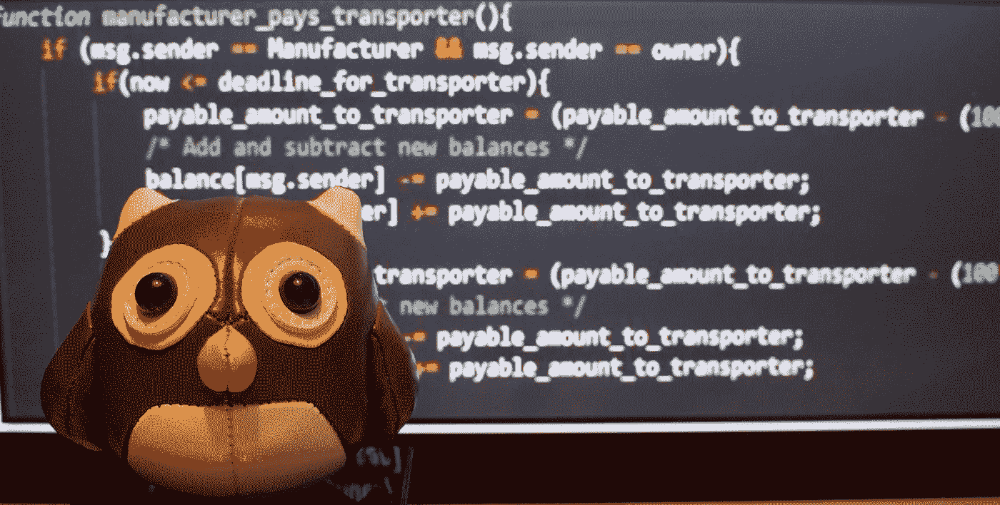

# 为什么我希望我的学生编码

> 原文：<https://medium.com/hackernoon/why-i-want-my-students-to-code-b358a2b97770>

## **编码在教育中的重要性**

> **编码不仅对程序员和软件开发人员重要。在数字时代，*非技术人员*也需要理解、研究和实验编码。**

最近，我决定在我的商业法律硕士项目中引入一门“*律师编码*”课程，相信“多学科编码”可以帮助我们解决许多当代经济、环境和社会问题。

“*律师编码*”课程在学生和其他感兴趣的团体中引起了很多好奇和兴奋。但是，也有一定程度的怀疑:

> *学习“如何编码”真的有必要吗？*
> 
> *理解代码对我们(非技术人员)有什么增值？*
> 
> 这难道不是在浪费时间吗？

毫无疑问，这些担忧是有道理的。

首先，我们不需要理解任何代码就能成功地在数字世界中导航。代码的用户不需要自己编码。

毕竟，我们无时无刻不在使用技术，却从未理解它。我可以很好地驾驶我的汽车，不需要了解太多的汽车发动机。大多数互联网用户不一定了解 TCP/IP 协议的来龙去脉。

此外，编码并不容易。获得能力需要投入大量的时间和精力。

即使我的学生确实觉得有必要学习如何编码，也有成千上万的可用资源(在线和离线)可以教他们。没有必要在课程中增加“另一门编程课程”。

 [## 如何成功地自学如何编码

### 在我发表了上一篇关于我如何成为一名 19 岁的软件开发人员的文章后，数百人来到…

medium.freecodecamp.org](https://medium.freecodecamp.org/successfully-teaching-yourself-how-to-code-f6aac23db44a) 

然而，尽管有这些疑虑，我坚信我的学生将从理解编码的力量中受益。不仅通过阅读或听说，而且通过参与和在教室环境中试验编码项目。

原因如下。

# 代码无处不在

引用马克·安德森的话，“软件正在吞噬世界”。

我们现在都生活在一个“无处不在的计算”的世界里。电脑嵌入了我们日常生活的方方面面。因此，计算机代码现在提供了构建我们整个存在的看不见、不被注意的“架构”:工作、娱乐、交流、消费、旅行或教育/研究。

> 我们生活的方方面面都是由基于代码的数字技术组织起来的。

想想我们有多少时间花在与在某种程度上运行软件代码的设备交互上。这种互动可以是直接的，比如与智能手机或电脑互动，也可以是更远距离的，以各种方式在自动化的交通系统上工作。

然而，在所有情况下，是计算机代码使体验成为可能，而代码最终提供了结构，并支配着与环境和体验相关的选择。

可以预料的是，随着物联网的兴起(以及智能设备自主性和连接性的增强)，软件代码的重要性只会增加。

# 为什么编码很重要

当然，代码无处不在的事实并不能证明在商业法律课程中开设单独的编码课程是合理的。但是，在一个越来越以代码为中心的世界里，引入这样一门课程还有另外三个原因:

## #1 —机会

你经常听说编码已经成为各行各业最重要的工作技能。

 [## 被谷歌、脸书、亚马逊等公司录用所需的技能

### LinkedIn 深入研究了它的用户数据，并制作了一份美国 40 家最能吸引和留住…

www.fastcompany.com](https://www.fastcompany.com/3061237/the-skills-it-takes-to-get-hired-at-google-facebook-amazon-and-more) 

这是有道理的。安德里森显然是对的:软件正在“吞噬世界”，并将继续这样下去。越来越多的企业和行业围绕着基于代码的产品或服务。所有的业务越来越多地由软件代码管理和运行。

但事实远不止如此。

我们现在都生活在一个更加扁平、分散和自动化的世界里。

随着软件代码使程序和任务自动化，“知识工作”的重点正从例行的“程序应用”转移到设计程序和标准化任务，然后由机器来执行。

然而，我们的教育系统却迟迟不能适应这种变化。大多数学生仍然在为一个等级森严、中央集权和“程序化”的世界做准备。

我认为这是错误的。

在当前和未来的劳动力市场上，一个人设计和交流创新解决方案的能力将受到重视，而不仅仅是遵守预先制定的程序。由于这些新的解决方案将是基于代码的，因此理解代码和编码对于有效参与我们的数字世界至关重要。

> 教授学生“如何编码”的基础知识，并鼓励他们走出舒适区，这将是帮助他们拥抱“基于软件”的环境的许多未来机会的必要的第一步。

This billboard (at Fukuoka Airport in Japan) is just an example of how digital technology has the potential to shape the future.

## # 2——信任

在 20 世纪的商业环境中，信任是由规则、条例和合同创造和维持的。对法律的一种思考方式是，当与陌生人打交道时，它是一种稳定预期和建立信任的机制。我可能不了解你，甚至不喜欢你，但我们有合同这一事实意味着我可以(在一定程度上)信任你。

然而，在数字世界中，信任可以嵌入软件代码中。最近对“智能合同”的兴趣表明，在不久的将来，这将是一个巨大的增长领域。

通过软件代码建立信任在基于机器对机器(M2M)的交易中也是至关重要的。随着 M2M 交互在物联网环境中变得正常，信任问题成为一个技术和设计问题。

> **我希望我的学生思考基于软件的解决方案，以解决当前物联网和区块链环境中存在的信任和声誉问题。**

此外，软件代码通常作为在线/基于云的服务交付。同样，这只会随着物联网的兴起而增加。

网络安全成为这里的一个重要问题。但是，我的学生应该寻找基于技术的解决方案，而不是通过引入“书本中的更多法律”来打击“网络安全”。

## #3 —道德

最后，在一个基于代码的世界里会产生许多道德问题。

考虑一下无人驾驶汽车的例子。当遇到不可避免的事故时，我们希望我们的无人驾驶汽车如何反应？它应该将生命损失最小化，即使这意味着牺牲车内乘客的生命，还是应该不惜任何代价优先考虑乘客的生命？或者，选择应该是随机的吗？

这个“电车问题”只是一个例子。在我们的社会中，软件代码的主导地位涉及许多伦理问题，从视频游戏的伦理、就业自动化问题到奇点(当机器比人更聪明时)。

培养学生思考准则的社会和道德含义的能力是必要的，也是不可避免的。

> **但是，为了对技术的伦理方面说些有意义的话，有必要理解编码和编码者。**

# “好”的编码

代码无处不在。而且，明确地说，代码赋予了我们的生活力量，增强了我们的生活，极大地改善了我们的生活。至少，大部分时候。

然而，在一个日益由软件驱动的世界里，我们需要对技术保持清醒的认识。这就是“律师编程”课程的真正内容。

这不仅是教学生“如何编码”，也是让他们意识到思考我们与技术的关系是多么重要。通过这种方式，学生可以看到技术创造的新机会，但也可以思考这些新技术创造的信任和道德问题。

根据我的经验，编码人员、程序员和其他开发人员并不总是了解他们的软件解决方案所针对的行业或商业环境。在实施新技术时，他们也不总是考虑信任或道德问题。他们没有受过这样思考的训练。大多数技术教育几乎完全专注于技术培训和技能。

 [## 每个人都应该了解的关于技术的 12 件事

### 技术比以往任何时候都更加重要，深刻地影响着文化、政治和社会。考虑到我们和我们的…

medium.com](/humane-tech/12-things-everyone-should-understand-about-tech-d158f5a26411) 

我在之前已经写过这方面的文章，但是开发者和非开发者的“共同创造”对于建设一个“更好”的数字未来至关重要。理解编码使非技术人员能够与编码人员、程序员和其他软件开发人员进行建设性的交流。

通过介绍我们与代码关系的“三大支柱”(机会、信任和道德)，本课程为编码的技术方面提供了必要的平衡。

> 理解代码创造了一种新的体验，这是学生参与软件开发的必要的第一步，这种软件具有积极的社会影响，并有助于实现更美好的数字未来。

*感谢您的阅读！请点击*👏*(想点多少次就点多少次)，或者留言评论。*

每周都有新的故事。因此，如果你关注我，你不会错过我关于数字时代如何改变我们生活和工作方式的最新见解。