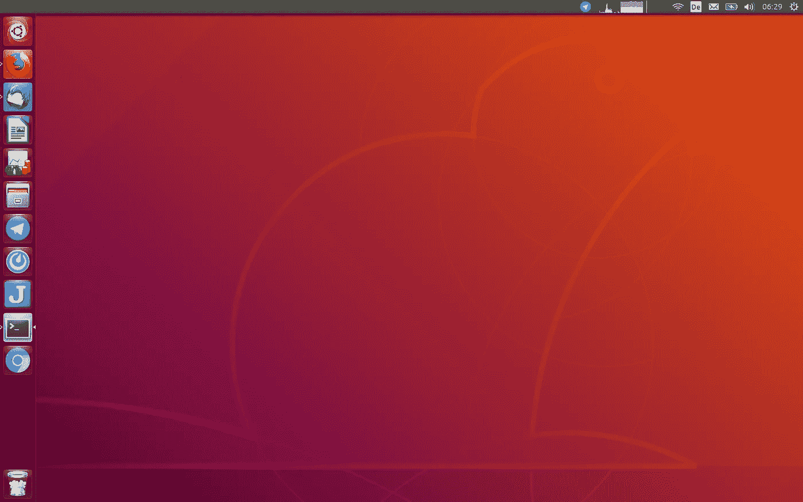

# 为什么我会在 Ubuntu 18.04 中使用 Unity

> 原文：<https://medium.com/hackernoon/why-i-will-use-unity-in-ubuntu-18-04-b3ab075e7669>



周末我利用这段时间在我的电脑上安装了 Ubuntu 18.04。目前为止我用的是 Ubuntu 16.04 和 Unity。我是一个尽可能使用标准的人，因为我不想每次都浪费时间对我的桌面进行许多调整。很多年前从 Gnome2 到 Unity 的转变是相当容易的，我很快就习惯了。说实话，在安装 Ubuntu 18.04 和新的 Gnome3 桌面时，这也是我的希望。Ubuntu 做了一些改动，让从 Unity 切换到 Gnome3 更容易。他们成功了吗？就我个人而言，我说不。两天后，我在 Ubuntu 18.04 中回到了 Unity。原因如下。

# 作为 Unity 用户，我在 Gnome3 中错过了什么

我已经表明了自己是一个团结的爱好者。我很快就习惯了它，并发现它非常人性化，在许多方面都很容易使用。在新的 Gnome3 桌面上，我很好奇，也真诚地愿意切换到它，但这并不容易。我错过了许多我在 Unity 中学会欣赏的小事，这些小事让我在电脑上的工作变得更容易。这里有几个例子。

# 外部媒体的整合

我立即安装了 Dash-to-dock，以便在定制 Dock 时有更多的选项，例如，将应用程序启动器放在 Dock 的顶部，而不是底部。在 Unity 中，USB 记忆棒等外部媒体在 dock 中显示为另一个图标——在 Gnome3 中显示为桌面上的一个图标。我发现这不切实际，尤其是在使用最大化的窗口时，因为你必须首先最小化它们才能看到和打开图标。也许这有某种扩展，但这正是问题所在。我不想用 50 个扩展来定制桌面，直到它按照我想要的方式运行，至少不是像下面的例子这样的基本东西。

# 暂停

默认情况下，Gnome3 菜单只包含系统偏好、锁屏和关机按钮。一天结束时，我会挂起我的笔记本电脑。但是我只有在 Gnome3 中同时按 ALT 键或者安装扩展才能做到这一点。在 Unity 中 2 次点击就足够了，在 Gnome3 中我需要 2 只手或者一个扩展。

# 屏幕空间的利用

我在顶栏看到了 Unity 的一大优势。有窗口菜单，还有关闭、最小化和最大化按钮。如果我将鼠标移动到左上角并单击，我知道窗口将会关闭，这将使我的工作容易得多。我不必一个像素一个像素地“瞄准”或导航鼠标。只需向左推，点击，你就完成了。此外，上方栏中菜单的集成节省了大量屏幕空间。尤其是对于较小的屏幕。默认情况下，Gnome3 不是这样的，但是你当然可以通过扩展来实现。

# 顶栏中的图标

在我看来，有些应用是针对 Unity 而不是 Gnome3 进行优化的，尤其是上方屏幕栏中的图标。我有一些应用程序(例如 Mattermost Desktop ),它们在 Unity 下集成得很好，但是我可以集成到 Gnome3 中——同样——只需要一个扩展。

# GDM 对莱特

另一件事。正是这些小事让生活变得更简单。除了我发现 LightDM 的登录界面比 GDM 的界面更好看更漂亮这一事实之外，它还提供了其他优势。默认情况下，在 GDM 和 LightDM 中，登录屏幕只在一个屏幕上可见(如果您连接了多个屏幕)。使用 LightDM，我所要做的就是将鼠标从一个屏幕移动到下一个屏幕，以将登录屏幕移动到另一个屏幕。这在 GDM 是不可能的。这是一个很大的缺点，尤其是在学校，那里的教室里经常有投影仪。如果登录屏幕出现在投影仪上，我无法简单地将其切换到连接的计算机。

# 结论

也许这些都只是小事情，你可以通过适当的扩展在很大程度上适应它们，但这正是关键所在。我想要一台可以高效使用的台式机，而不必先通过扩展来适应它。当然，我真的很喜欢 Unity，现在透过这些有色眼镜强烈地看着它，但除了其他事情之外，上面提到的事情使我在计算机上的工作更容易。

对我来说，我回到了团结。

```
$ sudo apt install ubuntu-unity-desktop
```

即使在 Ubuntu 18.04 中，包括 lightdm，这也是你必须做的。

**致所有 Unity 爱好者——你会在 Ubuntu 18.04 中切换到 Gnome3 吗？**

*原载于*[*openschoolsolutions.org*](https://openschoolsolutions.org/why-i-will-use-unity-ubuntu-18-04/)*。* ***注册*** *订阅我们的时事通讯，获取免费的 PDF 格式的开源应用程序，用于您的课堂，或者在 Twitter 上关注*[*@ OpenSchoolZ*](https://twitter.com/OpenSchoolZ)*。*