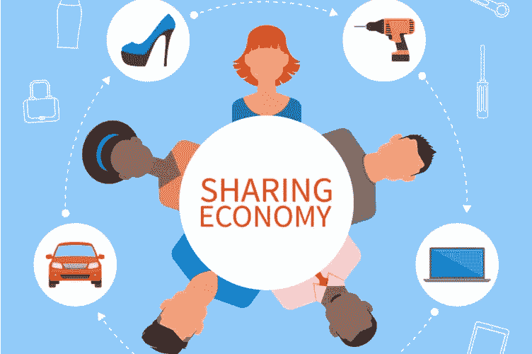
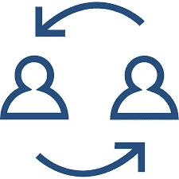

# 为什么我建议共享——共享经济未来的便携标志

> 原文：<https://medium.com/hackernoon/why-im-advising-sharering-a-portable-token-for-the-future-of-the-sharing-economy-9c2b53ca1253>

在写[这是一个可分享的生活](http://www.shareablelife.com)的时候，我下载了一个*啊哈*(一种未来的快照)。我看到了一个现实，我们不需要钱来交换。我们只是利用某种价值交换..

随着 Airbnb 和优步成为家喻户晓的名字，我不禁想知道这些平台以后会不会被愿意与提供商、参与者、成员和用户分配价值和所有权的组织所取代。像 Airbnb 和优步这样的公司的估值是基于其他人的时间、资源、资产和空间的价值，这似乎是不正确的。

后来，我首先考虑了社交网络和“平台”的价值。例如，当我旅行时，我经常使用脸书共享我的汽车或查找人们或住宿的地方。一份脸书邮报可能会这样写道，“从 2018 年 7 月 1 日开始离开两周，有人有安全的地方停车并想用我的车吗？”保险的支持或有第三方在组合中提供安全的感觉肯定是这种类型的交互不如它可能或应该的那样常见的一个原因。但是，一旦强大的点对点，按需保险成为主流，这将不会是一个绊脚石。我的问题是，为什么我们不把我们的需求发布给更广泛的、相互联系的人们，他们在我们的社交网络上与我们一样的人联系在一起？

快速进带

在过去的一年里，我深深陷入了区块链兔子洞。区块链和周边技术实现了我多年来一直在撰写和谈论的许多东西——价值分配、价值共享、共享所有权和可编程货币。通过用价值激励积极的行为，未实现的价值可以以所有新的和创造性的方式浮出水面。所有这些都为产生更像社区而不是自上而下的等级组织的公司打开了大门。

> *所以你可以想象当我看到* [*分享*](http://www.sharering.network)*——我的下巴都掉了。四年前，我曾在推特上写过这个概念。看到你的预感成真总是很有趣！如果我们有一个不同的管理和交换系统，共享就是共享经济。有了区块链，这现在成为可能。*

共享提供了一种跨越共享经济公司的全球支付方式，这意味着您可以进行有价值的交易，而不必被迫使用我们通常所知的货币(即，我让 A 使用我的汽车，同时我使用 B 在另一个位置的公寓)，并且永远不必支付任何费用！该平台还允许人们根据自己的意愿用钱来合租，因此具有灵活性。

共享也给了共享经济生态系统一个与更大运动连接的契机，不管任何给定组织的规模如何。

ShareRing 的创始人、Keaz 的前联合创始人蒂姆·博斯(Tim Bos)说，

> "[sharing](http://sharering.network/)是一个按需平台，它通过汇集所有行业和地理位置的共享服务，将高度分散的共享经济集中起来。共享经济用户可以在世界任何地方安全地访问、连接和支付这些服务。”

有了共享，有一个应用程序，你可以看到一切——有点像共享经济选项的 Kayak，在那里你可以看到给定位置的所有共享经济服务——你可以在一个仪表板上预订和支付一切，你的 SHR 令牌将计算你创造和花费的价值。

我真的很高兴能成为这个大愿景的一部分，并作为顾问支持共享。