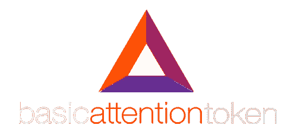
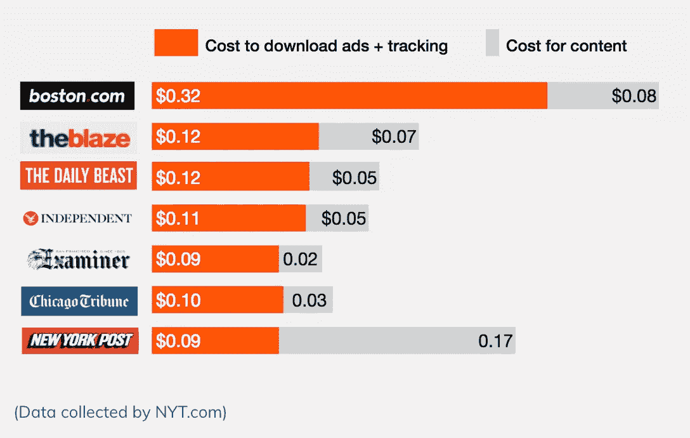
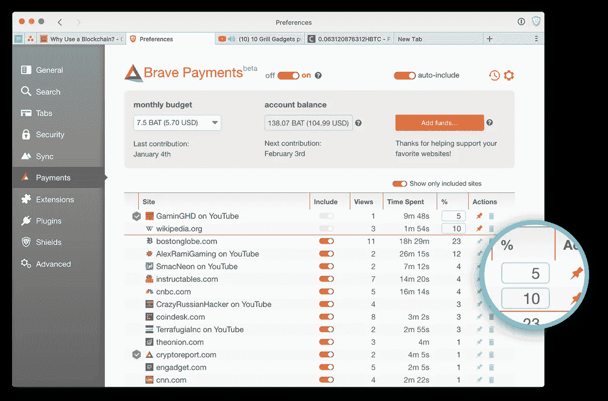

# 2018 年我为什么看好 BAT 和勇者浏览器

> 原文：<https://medium.com/hackernoon/why-im-bullish-on-bat-and-the-brave-browser-in-2018-8e2cbc0ce420>

现在，市场上有超过 1300 种加密货币。坦白说，[大部分都是狗屎](https://hackernoon.com/mastering-shitcoins-the-poor-mans-guide-to-getting-crypto-rich-2e469b762ba9)。许多硬币夸大地宣称为不存在的平台提供效用和价值，然而人们却向这些项目投入[数十亿美元。](https://hackernoon.com/trons-whitepaper-is-copied-plagiarized-cefce74335ce)

基本注意力令牌( [$BAT](https://coinmarketcap.com/currencies/basic-attention-token/) )是我最近遇到的少数几个我真正认为能提供价值的硬币之一，这篇文章解释了为什么我在 2018 年看好 BAT。

欢迎来到 2018 年，互联网网络中立性已经被废除，在谷歌和脸书等试图向广告商出售你的数据的公司眼中，你在网上冲浪的每一秒都是另一个美元符号。

数字广告已经失去了控制——至少勇敢的团队是这么认为的。

Brave browser 于 2016 年初由 Brendan Eich(JavaScript 的创始人和 Mozilla 的联合创始人)创建，它可以阻止所有困扰您日常访问的网站的广告和追踪器，从而消除了任何类型的广告阻止扩展的需要。

自 2017 年初以来，我一直是我 iPhone 的一个狂热的勇敢用户，一直享受着速度两倍的浏览器体验，同时通过不必加载讨厌的广告，平均每月为我节省 0.5GB 的移动数据。

这是一个很棒的浏览器，他们最近的桌面版本(Mac 或 PC ready)是谷歌 Chrome、苹果 Safari 和 Mozilla Firefox 的有力竞争对手。

事实上，我认为它可能比这些浏览器都要好。

According to Brave, the average mobile browser user pays as much as [$23 month](/@robleathern/carriers-are-making-more-from-mobile-ads-than-publishers-are-d5d3c0827b39) in data charges to download ads and trackers — that’s $276 a year.

**基础注意力令牌** **(BAT)** 是基于以太坊[区块链](https://hackernoon.com/tagged/blockchain)的 ERC20 令牌。它的主要目标是提供一个数字广告交易平台，让广告商能够购买广告空间和用户“注意力”——这与谷歌和脸书出售广告空间时提供的产品相同。

## Brave 希望所有的广告收入都基于 BAT。

广告商将为使用 BAT 的广告付费，用户将因在 BAT 中观看广告而获得补偿。

> 看广告赚钱？说什么？？

# BAT 与众不同的地方在哪里？

BAT 代表了对数字广告投放方式的根本性反思。目前的模式依赖于第三方跟踪(跟踪浏览历史、cookies 和搜索查询)以及连接广告商和用户的中间人。

英美烟草通过从可用广告和报价的库存目录中匹配并在本地投放广告，消除了对第三方跟踪和中间商的需求。

以这种方式投放广告有很多好处。例如:

*   ***隐私。*** 您的浏览历史可以保密，因为广告匹配所需的所有数据都不会离开您的设备。
*   ***改进了广告匹配。*** 你选择你想要的广告类型，从而使广告定位成为过去。

# 勇敢如何使用 BAT？

从网站上移除广告意味着你移除了依靠广告收入来保持内容流动的内容创作者的收入流。当我使用 Brave 或广告拦截扩展时，这一直是我的道德障碍，因为我喜欢支持我最喜欢的 YouTube 频道或 Twitch streamers。

## Brave 采取了一种不同的方式来回馈内容创作者。

在勇敢的浏览器中，内容创作者可以注册他们的网站和社交媒体帐户。Brave 的用户可以将 BAT 代币装入自己的钱包(包含在 Brave 浏览器中)，并选择每月给自己喜欢的内容创作者一定数量的 BAT。

例如，我可以选择每月捐赠 10 BAT，分散给我一个月内访问的内容创建者。如果我花 60%的浏览时间看 Linus 的技术提示，那么我 10 BAT 的 60%会给 Linus。剩下的 40%将会分给我访问的其他 YouTubers 和博客。

我不必查看任何广告，但我仍然可以支持我最喜欢的内容创作者。

Brave includes a BAT wallet that allows you to choose the sites you fund each month.

# 我最后的想法

数十亿美元的数字广告行业是不可持续的。

基本注意力令牌通过对用户注意力进行正确定价、实现隐私合规性、用户匿名以及为内容创作者、广告商和用户提供颠覆性的数字广告范式，解决了潜在的经济激励问题。

BAT 是一个系统问题的出色解决方案，JavaScript 的创造者和 Mozilla 的联合创始人领导着一个令人敬畏的团队。

随着更多的内容创作者敦促他们的粉丝使用勇敢浏览器，并与 BAT 一起提供支付，我相信勇敢和 BAT 平台在 2018 年有着强大的未来。