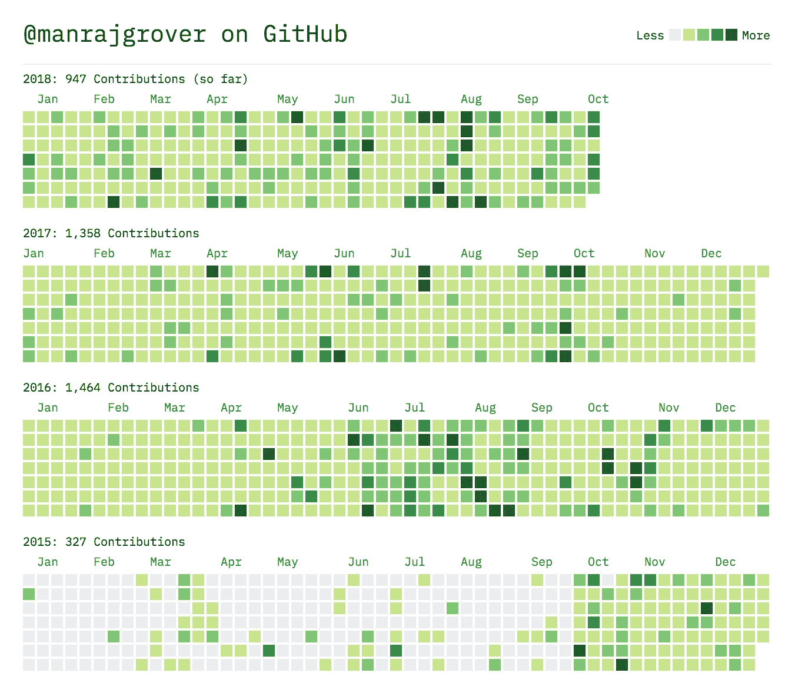

# 为什么我要结束我 3 年的开源贡献狂欢

> 原文：<https://medium.com/hackernoon/why-im-ending-my-3-year-open-source-contribution-spree-3061032f1fb>

这一天到了。我终于决定结束我三年前开始的事情。 **1097 天**连续[学习](https://hackernoon.com/tagged/learning)，发展，合作，成长。一些我将终生铭记的事情。我创作了一些很好的个人项目，并与一些组织合作并为其做出贡献，如 [DuckDuckGo](https://duckduckhack.com/u/manrajgrover/) 、 [OpenMF](http://mifos.org/) 、 [Mozilla](https://www.mozilla.org/en-US/) 以及 [TensorFlow](https://js.tensorflow.org) 。我可以告诉你，这确实需要大量的奉献和牺牲。在这篇文章中，我将分享这背后的动机，这一旅程中面临的挑战，结束这一旅程的原因以及其间的一切。我将在另一篇文章中介绍我的学习成果，这篇文章也是我的开源指南。

Generated using [https://github-contributions.now.sh/](https://github-contributions.now.sh/) by [sallar](https://github.com/sallar)

# 等等，什么？什么时候开始的？

那是 2015 年的秋天，我大学的最后一年刚刚开始。我已经在一家公司得到了一份工作机会(你知道，少了一件要担心的事情),而且我手头有一些时间，我想好好利用。我有几个很早以前就开始的项目，但是从来没有找到时间来完成和发布它们。此外，我对自己以前编写的代码质量不满意。当时没有人看着我的代码，告诉我如何提高自己。最后，我想深入了解技术，并利用它们来建造东西。

所以我决定完成我已经开始的工作，并且每天都学习新的东西。我需要一些方法来跟踪进度，而 Github 正是合适的平台。我开始做这些项目，试图每天都为它腾出时间，但正如我所想的，最初的狂欢并没有持续很久，在 2 周内就结束了。虽然我没有放弃，并计划重新启动它。这一次是为了更好的管理。

最初，我从事一些随机的项目，这些项目是我为了学习新事物而开始的，很快我就转向建造具体的东西。这些仍然是没有人会使用的项目，但他们做了一些事情，我学到了构建它们的东西。这些项目为我将来想做的事情打下了良好的基础。我吸取了这些经验，并在复兴被放弃的项目时加以应用。我用我所知道的最佳实践让他们工作。

很快，我就不再跟踪它了。思考我今天要做什么和我需要参考的资源已经成为一种习惯。我会提前计划好我的一天，并相应地安排事情的优先顺序。我学会了时间黑客的技巧，我仍然从中受益。

出于几个原因，我从未公开或告诉任何人我在做什么以及为什么。我不想在这方面有任何宣传。其次，这是一个个人实验，可能对任何人都有帮助，也可能没有帮助。我仍然没有足够的积极结果来推荐这样的人。

然而，我确实让一些看到我的 Github 简介的人嘲笑我。但我没太在意。就我所知，我不会失去任何东西，反而会得到一切。唯一的投资是我不想花在看一部著名电视剧上的时间。我喜欢[肯·惠勒](https://medium.com/u/e50c25098d37?source=post_page-----3061032f1fb--------------------------------)的说法，我[引用](/codezillas/a-bitter-guide-to-open-source-a8e3b6a3c1c4)他的话:

> **操那些人。**

当我决定编写一个探索用单个

元素能做什么的项目时，我意识到设置约束是一个强大的概念。通过这个， [SingleDivProject](https://github.com/manrajgrover/SingleDivProject) 诞生了。有一个约束使我能够学习我不知道存在的 CSS 属性，只是为了实现我想要的设计。它很受欢迎，激励我编写更多成功项目的代码。

我开始为一些项目和组织做贡献，比如 DuckDuckGo 和一些优秀的维护者，只是为了获得对我代码质量的反馈。你看到这对每个人有多有利了吗？我给他们的代码库增加了一个特性，减少了维护人员的开销。我的代码得到审查，我开始提高我的编码技能。拉请求被合并，项目用户对这个新特性很满意。双赢？

几周变成了几个月。几个月变成了几年。作为一名开发人员，我成长了，我的抱负也实现了。我开始编写包和命令行工具。我会确保做一些我以前没做过的事。如果我学到了新的东西，我会编码并将它们合并到我的项目中。

我将新发现的兴趣与开源项目结合起来，并开始为 deeplearn.js 做贡献，后来成为 [TensorFlow.js](https://js.tensorflow.org/) 。我学到了很多关于机器学习库的内部工作原理、各种算法以及如何有效实现它们的知识。我肯定会有一个单独的帖子来分享我对这个项目的贡献。

# 为什么我要结束它

是的，如果一切都很顺利，我为什么要结束它？这有几个原因:

## 1.学习

在过去的 3 年里，我真的从技术和非技术的角度学到了很多东西。我现在有足够的信心来管理我的时间，学习新技术，最佳实践，开发大型代码库，部署东西等等。但是现在，我希望学习一些只有当我摆脱每天贡献的束缚时才能实现的东西。这些事情需要一天以上的时间才能承诺，几个月才能完成。

## 2.改变目标

我已经实现了我为自己设定的疯狂捐款的目标。我已经检查了我的目标列表中的每一个方框，是时候关注其他目标了。我的兴趣更倾向于研究，特别是机器学习，并希望专注于此。谁知道我可能会启动一个开源机器学习项目？谁知道我可能会在 [Kaggle](https://www.kaggle.com/manrajsingh) 上做这样的事情？😉

# 所以，是的！

今天，也就是 2018 年 10 月 12 日，我将结束我的捐款狂欢。这是一次难忘的经历，我不认为我能再次复制它。我仍然会继续为开源做贡献，继续做我的项目，继续为各种组织做贡献，只是不用担心这个限制。我希望一切顺利。我喜欢[杰德·沃森](https://medium.com/u/25004747627f?source=post_page-----3061032f1fb--------------------------------)对[的描述](https://medium.freecodecamp.org/github-broke-my-1-000-day-streak-6ec0c4c3a7d9):

> 这是一次在公共场所进行的个人旅行，所以这似乎是一个合适的总结方式。

那么，我现在会推荐某人跟随我的脚步吗？不，绝对不是。然而，我建议进行几周的小规模冲刺，然后休息。为你希望实现的事情设定一个时间框架，并有一个严格的截止日期。别忘了在每次完成任务后，用你最喜欢的甜点来奖励自己。

像往常一样，我鼓励更多的人为开源做出贡献。相信我，你一定会学到很多！推荐阅读[肯](https://medium.com/u/e50c25098d37?source=post_page-----3061032f1fb--------------------------------)的[指南](/codezillas/a-bitter-guide-to-open-source-a8e3b6a3c1c4)开源。我能理解博客中分享的许多东西。

如果我能有所帮助，请告诉我。我在 Twitter 上是 [@manrajsgrover](https://twitter.com/manrajsgrover) ，在 Github 上是 [@manrajgrover](https://github.com/manrajgrover) 。

下次见。✌️

*这是我个人* [*博客*](https://manrajsingh.in/blog/why-im-ending-commit-a-day/) *里原帖。*