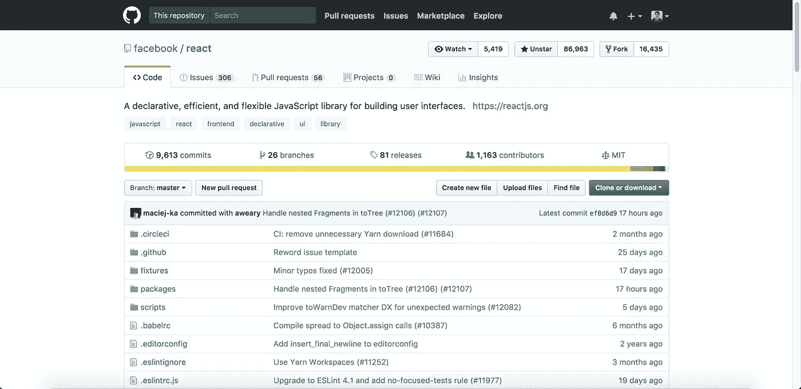

# 为什么我要在 2018 年从 Angular 转向 React 和 Redux

> 原文：<https://medium.com/hackernoon/why-im-switching-from-angular-to-react-and-redux-in-2018-cb48be00fda7>

[http://blog.workshape.io](http://blog.workshape.io)

## 提示:这不是因为炒作

我对 Angular 又爱又恨已经有一段时间了。这很有趣，因为当我正在学习和制作一个简单的应用程序时，我卡住了。好几周了。

不过我注意到，在这个过程中，即使是最简单的功能也似乎很难实现，我甚至不确定在这一点上是否值得使用 Angular。我彻底掌握了基本原理，这应该足以让小功能工作。

但是，没有，没有成功。更糟糕的是，感觉我根本没有使用 javascript。它更像是一种完全不同的语言。

我喜欢 ***typescript*** ，但不知何故我在使用它时变得焦躁不安，因为我投入了大量时间来掌握普通 javascript 的来龙去脉。感觉我还在做一些后端工作(依赖注入、服务等)。).奇怪的是，一切都很熟悉，同样令人沮丧。

然后终于有一天，我放弃了使用 Angular，转而寻找其他替代品比如 ***React*** 和 ***Vue*** 。我曾在 2015 年年中 React 发布时尝试过。我记得它还在测试阶段，很多人都在谈论它。我不明白它的整个流程，包括 ***【状态】*** 。

但在 2017 年第四季度左右，我试图重温它，并观看了与 React 和 Redux 相关的课程。我很好奇图书馆有什么大惊小怪的，它在 2017 年左右变得疯狂流行，加上对所谓的 ***不变性*** 的炒作。

我喜欢 Angular js(Angular 的第一个版本)，以至于我喜欢它的古怪之处，并对它进行了大量的研究。但是当我转移到 Angular 2+并在它身上做了一些初步投资时，我觉得有些事情不对劲，由于某种原因，它未能提供 React 中最简单的功能。

快进:最后，我很高兴我这么做了。一旦你知道了 ***反应*** 的基本原理，传递基本特性其实很容易。

我已经在我的新项目中使用 React 几个月了，我可以真诚地说，我不后悔尝试他们的生态系统。从那以后，我再也不使用 Angular 了。

所以，如果你可能会问:尽管我过去爱着 Angular，是什么让我改变了反应？为什么不仅仅是它的灵活性？

# 一点点争论:不要拿苹果和橘子比较

我的意思是对两个生态系统都没有伤害，可能我们只能说 React 比 Angular 更容易集成新功能，因为 React 是一个*库，而 Angular 是一个 ***框架。大多数人都忽略了这两者之间明显的巨大差异。****

*当你使用一个 ***库*** 时，它只是你的应用程序的一部分。所以很明显，学习曲线也很短，并且您可以融入一些您可能想要使用的其他库。*

****框架*** 反之则大。并且您要遵循他们标准的做事方式(比如 http 请求、组件绑定、事件绑定等等)。简而言之，你不得不按照他们的方式去做每一件事。在有棱角的情况下，你需要以 ***【有棱角】*** 的方式做事。一切！不管按照他们的方式弯曲有多棘手，你都必须遵循它，因为你正在使用一个框架。*

*这与 React 的情况不同，React 只负责视图部分。除此之外，您可以自己去发现您可能想要使用什么来进行 http 请求和订阅键绑定。你可能想使用 [Redux](https://redux.js.org/) 或 [Flux](https://facebook.github.io/flux/) 进行数据存储和状态管理。你有自由。*

*事不宜迟，以下是我使用 React now 的原因:*

# *这是一个图书馆。因此您可以附加任何您选择的 javascript 库作为附件*

**

*这可能是显而易见的，因为 React 只是另一个 javascript 库，而不是框架。如前所述，在 React 中，您可以轻松地附加您选择的任何库。只要你知道自己在做什么，它就不会关心你在 javascript 中的栈。React 的理念围绕着“乐高积木”的概念。这是你在图书馆可以拥有的一大优势，或者说是你可以拥有的最强大的优势之一。我们都知道技术来来去去。那么，当你仍然需要学习很多框架时，为什么要把大部分时间花在一个框架上呢？*

*这正是我转变为反应的原因:只使用我需要的东西。我可能不需要一个成熟的框架，因为我不会使用框架的大部分功能。事实是，不管你的应用程序设计得多么好，你仍然不能逃避这样的现实，你最终会引入一些错误。既然知道了这一点，为什么还要过度设计呢？*

*在 Angular 中，当我试图创建一个包含附加全局事件处理程序的特性时，我惊讶地发现，仅仅是为了让它工作，我就要做这么多的工作！*

* [## 角度中的全局事件

### Angular 中有没有相当于$scope.emit()或者$scope.broadcast()的？我知道 EventEmitter 的功能，但是…

stackoverflow.com](https://stackoverflow.com/questions/34700438/global-events-in-angular) 

我搜索了几次 StackOverflow，得到的答案都是一样的。你仍然需要经历一系列的挑战才能成功。我说的挑战是指 ***实际上是很多工作*** 。最后，我通过使用事件发射器来广播 ***多个组件中的事件，并将它们注入到每个控制器*** 中，解决了这个问题。咻！这么简单的东西要做很多工作。

我不是说它执行得不好。但很可能我仍然需要投入大量的时间，仅仅是为了让一个简单的应用程序工作。

React 通过使用另一个名为 **mousetrap** 的 js 库毫不费力地在我的整个应用程序中绑定全局键。现在我可以用我在普通 javascript 中学到的东西了。

 [## 铃铛/捕鼠器

### 这个简单的库用于处理 Javascript 中的键盘快捷键

github.com](https://github.com/ccampbell/mousetrap) 

附言:灵活性大，责任大。

# 状态管理更加灵活

[https://blog.gisspan.com](https://blog.gisspan.com)

> **单一来源的真相**

如果没有像 Flux 和 Redux 这样的库来补充 React 的生态系统，我可以说 React 可以与 Angular ***平起平坐，减去依赖注入和服务模式*** 。我不太喜欢使用这些模式，尤其是在做一些前端工作的时候。也许我只是不习惯使用它，因为在后端使用它更有意义，但在前端就不那么有意义了。

当我开始使用 React、Redux 并试用了一段时间后，我才注意到管理状态和将状态分布在组件的不同部分是多么容易和几乎毫不费力。这是惊人的，因为它更加强调了 ***【状态】*** 这是每个 React 和 Redux 组合的核心。

为什么这很重要？因为它使你的沟通在你的组件的所有部分看起来毫不费力。你只需要分派一个动作，创建一个减速器，连接并知道 ***【状态】*** 是什么，瞧！只要您修改该状态，该状态就会反映在使用它的所有组件中。这只有在你使用**通量**和**还原**时才成立。

如果您以前没有使用过 React，并且想知道什么是 ***【状态】*** ，[状态](https://reactjs.org/docs/state-and-lifecycle.html)最好描述为组件的数据在给定时间点的样子。这类似于***【Model】***在 Angular 等任何其他库中的工作方式。 ***它只是简单的保存你的数据*** 。

How Application State via “Redux” is making the state accessible globally in every component

**应用程序状态**由于 Redux 的存在，使得每个 React 组件都可以方便地全局访问每个状态。其思想是，当您分派一个动作并修改那个特定的应用程序状态时，它将反映到使用它的那些组件上。Redux 在幕后为您实现了这一神奇功能，因此您不必担心您的组件没有更新。

一个理想的用例是，当两个或更多组件依赖于相同的数据或状态时，您可以通过 Redux 简单地连接组件来轻松检索它们。例如，我需要仪表盘上的组件和模态上显示的组件有相同的数据，我可以更容易地连接它们。

为此，您需要执行以下操作:

*   将 Redux 整合到 React 应用程序中
*   创建一个由 ***调度器*** ， ***动作*** ， ***减少器*** 组成的 Redux 存储
*   将组件连接到 Redux 容器中
*   在组件中使用应用程序状态

当然，在这样做的时候你也必须小心，因为随着应用程序的增长，它可能会变得更加混乱。无论是编程语言还是库，任何东西的灵活性都有一个权衡。丹·阿布拉莫夫在他的博客文章中进一步表达了这一点:你可能不需要 Redux。

现在，让我们看看这个有多棱角:

Components with the Service as the center to communicate with one component to another

全局状态方法也可以以角度 2+方式完成。你可以说它与[的反应](https://hackernoon.com/tagged/react)完全不同，因为它使用[服务模式](https://en.wikipedia.org/wiki/Service_layer_pattern#External_links)作为 Angular 的核心模式，主要是为了迎合 API，并使单元测试更容易。

为了让您的组件相互通信，您需要执行以下操作:

*   创建一个包含事件发射器的服务，使每个组件之间的通信成为可能。
*   创建全局响应组件中用户操作的事件发射器
*   将服务注入每个将使用全局事件的组件
*   为每个将使用它们的组件创建事件发射器，并订阅在服务中创建的事件
*   确保取消订阅事件发射器，以便事件仅触发一次

您仍然需要这个冗长的设置，以便开始相互反映组件数据。

# JSX 语法与 javascript 融合得很好

我相信这是 javascript 应该走的未来。这几乎感觉像是 javascript 的自然发展，或者 javascript 应该在的地方，因为它融合得很好。

Sample JS file with JSX syntax

当时我在玩 Angular 的时候，出于某种原因，感觉 Angular 和 javascript 之间有一种抵触。可能是因为要求有 typescript。

但是有了 React，它与 javascript 完美融合，因为**你的组件直接驻留在 javascript 内**。所以不需要双向数据绑定。

起初，我有点喜欢这个想法，你的组件在 html 和另一个单独的 js 文件中被很好地分离，以使用它在你的 html 中做一些数据绑定。

但是我绝对没有想到我会爱上 JSX 语法与 javascript 的完美结合。在 JSX 内部很容易给组件添加逻辑。与 Angular 相比，这加快了我大约 4 倍的开发时间。

# 更快的学习曲线

我对学习一个特定的框架或库需要多长时间或有多困难没有问题，只要它的困难是有原因的(比如，改进的可维护性和工作流程)，那么我们就把它当作一个挑战。

我承认我很难融入 React 的生态系统(尤其是在 2015 年初)，但一旦我能够理解它的工作原理及其背后的设计理念，我的工作效率就提高了十倍。我不必到处处理类型检查。

当然，缺少类型检查也有它的缺点。但是大部分都挺琐碎的。如果您更喜欢使用 TypeScript，React 是开放的。

# 现代 web 开发充满挑战，我们现在开发 Web 应用的方式与以前不同

[https://medium.freecodecamp.org/a-roadmap-to-becoming-a-web-developer-in-2017-b6ac3dddd0cf](https://medium.freecodecamp.org/a-roadmap-to-becoming-a-web-developer-in-2017-b6ac3dddd0cf)

这也是我跳到 React 生态系统的原因之一。考虑到开发 web 应用程序的领域已经在发生变化，我需要使用一个库，或者一个学习曲线更短且易于维护的框架。这样我就有更多的时间去学习 web 开发的其他部分，并提高我作为开发人员的技能。

我想强调这一点，因为现在在现代开发你的应用程序与以前相比明显不同而且令人生畏。大多数情况下，由于 javascript 社区的进步和发展，您的 web 应用程序现在可以成为一个独立的 javascript 应用程序(可能还要感谢 **NodeJS** 的存在)。

现在网络上也有很多事情在进行，比如构建同构的网络应用程序、通用网络应用程序、本地网络应用程序，比如使用 React Native。无论哪种方式都越来越有挑战性。

现在，这对新手和已经从事 web 开发相当长时间的开发人员都是一个严峻的挑战，因为您需要知道如何捆绑您的 javascript 应用程序，使用 grunt 或 gulp、browserify、webpack 等等。

这告诉我们关于角度和反应生态系统的什么？简单。 ***学习曲线和时间。***

如果我们刚刚开始了解现代 web 开发，学习 Angular 将会消耗你的时间来真正开始构建一个真实世界的应用程序。正因为如此，你会在一年内被严重地锁定在仅仅学习 Angular 上。你可以说，由于 CLI，现代框架和库现在更容易设置，但你仍然错过了 web 应用程序实际工作的内部机制。它把你从学习它们中抽象出来。

这在现代 web 开发中是一个坏消息，尤其是如果你想成为一名全栈开发人员的话。你几乎没有时间研究现代 web 应用程序的其他设置的细节。

由于使用 React 学习和构建 web 应用程序的速度非常快，因此您也可以更高效地学习构建现代 web 应用程序的其他部分。由于这一点，我现在对 ES6 的 ***特性有了一个很好的想法，babel，webpack*** 在短短的时间内。这对我来说是一个省时的方法。总的来说，我现在能够了解现代 web 开发是如何工作的(甚至从头开始学习 NodeJS)。

# 您可以毫不费力地重用组件

使用 React，您的组件是纯粹的函数，您可以简单地将其导入并应用到其他 React 组件中。

SidebarTableSchemas component being reused in App.js

我讨厌 Angular，因为它似乎很难与你的组件交流。我必须先熟悉很多术语，才能在其他组件中重用一个角度组件。令人失望又费时。

此外，通常，您仍然需要添加一个服务来使它们相互通信(如果您像我一样来自后端开发，这不是问题)。在大多数情况下，您仍然需要手动添加一个订阅者，以便让两个或更多的组件相互通信。这是我们大部分时间面临的问题。

当我搜索 Stack Overflow 时，许多人在他们的每个组件中全局广播相同的数据时遇到了问题。

 [## 关于 Angular2 中的全局数据

### 如果我的 angular2 应用程序看起来像这样，上面的金发女郎要和右中间的金吉儿说话，他们应该…

stackoverflow.com](https://stackoverflow.com/questions/35189400/again-about-global-data-in-angular2)  [## 如何在 Angular 2 中定义全局变量，以便我可以在

### 在我的 Angular 2 (beta 14)应用程序中，我需要跟踪用户的登录状态，以便隐藏/显示某些…

stackoverflow.com](https://stackoverflow.com/questions/36715918/how-to-define-global-variables-in-angular-2-in-a-way-that-i-can-use-them-for-pro) 

说实话，和新的 Angular 一起工作很恐怖。

 [## Angular 2 组件重用策略

### Angular 2 路由器的默认行为是，如果当前和未来的路由相同，则重用组件…

medium.com](/@juliapassynkova/angular-2-component-reuse-strategy-9f3ddfab23f5)  [## 如何使用 RouteReuseStrategy 重用 Angular 2.3+中的渲染组件

### 有时我们在单页面应用程序中面临一个有趣的问题:我们需要我们的父组件在…

medium.com](/@gerasimov.pk/how-to-reuse-rendered-component-in-angular-2-3-with-routereusestrategy-64628e1ca3eb) 

当我读到允许我重用一个组件而不是另一个组件的解决方案时，我不禁摇摇头，问自己:这个解决方案值得这么麻烦吗？为什么这一开始就过于复杂了呢？

# 巨大的社区支持

Community support and users in react

Community support and users in angular

想象一个几乎没有社区支持的 javascript 库或框架。在某些情况下，您可能会陷入无法解决的技术实现中，或者您不得不自己动手。对于你和应用程序所依赖的业务来说，这通常是非常昂贵的。

最近，React 获得的社区支持比 Angular 和 AngularJS 加起来还多。或许 VueJS 现在已经赶上来了。你可以看出哪些是现在人们广泛支持的。

尽管如此，还是要对你在 Google Trends 或 Github 上找到的这些数字或统计数据有所保留。你不能仅仅通过看数字来证明它是最好的框架或库。你得先自己试一下，才能知道哪些是最好的。

# 那么，选哪个呢？

当您为应用程序选择 javascript 框架或库时，有几个因素需要考虑。以下是其中之一:

*   您团队的技能/专业知识
*   项目规模或性质(小型、中型、企业)
*   使用的资源

说到底，React 是否优于 Angular 的争论真的很主观。这实际上归结于您的团队在特定库中的适应性、您正在进行的项目的性质以及程序员的个人偏好。

如果您的团队是由新手组成的，那么很自然地会选择 React 而不是 Angular，因为它的简单性和与 javascript 的结合非常好。否则，如果你的团队由经验丰富的专业人员组成，并且已经使用 Angular 很长时间了，那么使用它可能是你最好的选择。

# 结论

库和框架的每个目标都应该是减轻开发人员的负担，使他们从长远来看更有生产力和适应变化。Javascript 已经是一种混乱的编程语言，许多人正在它的基础上创建一个库或框架来使它变得更好。

就我个人而言，我认为 Angular 在他们的新框架上走极端了。实际上弊大于利(抱歉，无意冒犯棱角分明的用户)。

最后，React 给了我一丝希望，即考虑到它仍然只是我们需要与之捆绑的许多东西(如 Babel、Webpack、electronic 等)中的一个生态系统，现代 web 开发不应该那么难驯服。开发多平台应用比以往任何时候都更加完美。

如果你是那种重视你的时间并热衷于学习其他栈以及现代 web 应用的详细情况的开发人员，考虑学习 React。我强烈推荐。否则，请坚持使用 Angular。

# 附加:React 的最佳入门课程

如果您想精通 React 生态系统的使用，您可能想看看以下几门课程:

 [## 现代反应与 Redux | Udemy

### 在使用 React Router、Webpack 和 ES6 开发应用程序时，通过本教程掌握 React 和 Redux 的基础知识

www.udemy.com](https://www.udemy.com/react-redux/)  [## 高级反应和还原| Udemy

### 关于高级 React 和 Redux 概念的详细演练——身份验证、测试、中间件、HOC 和…

www.udemy.com](https://www.udemy.com/react-redux-tutorial)  [## 带有 React 的节点:Fullstack Web 开发| Udemy

### 使用 NodeJS、React、Redux、Express 和 MongoDB 构建和部署 fullstack web 应用程序。

www.udemy.com](https://www.udemy.com/node-with-react-fullstack-web-development)  [## Redux 入门

### 在这个全面的教程，丹阿布拉莫夫 Redux 的创造者-将教你如何管理你的反应状态…

蛋头](https://egghead.io/courses/getting-started-with-redux) 

如果你喜欢我的故事，请在 Twitter 上关注我，让我知道你的想法！

 [## 桑尼·雷西奥(@YellowFlashDev) |推特

### 桑尼·r·雷西奥的最新推文(@YellowFlashDev)。10%的企业家/健身爱好者/软件工程师/…

twitter.com](https://twitter.com/YellowFlashDev) 

附加阅读:

 [## 角黑客正午

### 阅读黑客中午关于 Angular 的文章。黑客如何开始他们的下午？

hackernoon.com](https://hackernoon.com/tagged/Angular)  [## 黑客正午

### 阅读关于黑客中午反应的文章。黑客如何开始他们的下午？

hackernoon.com](https://hackernoon.com/tagged/react)*