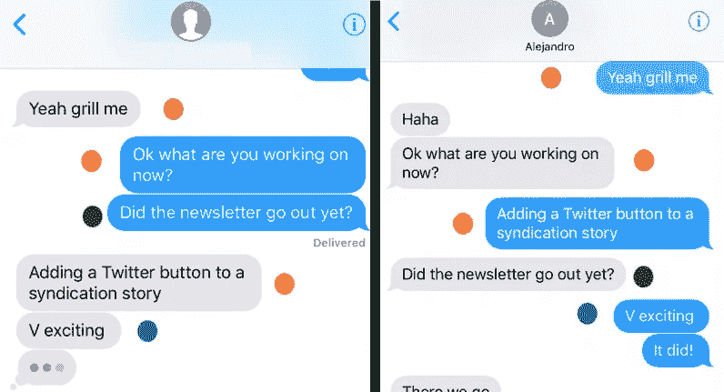
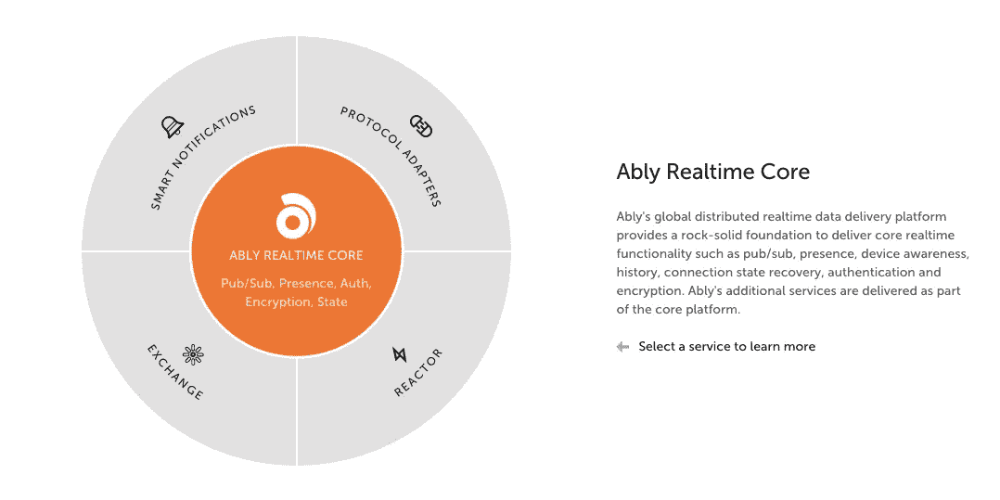

# 为什么实现消息排序是一件大事？

> 原文：<https://medium.com/hackernoon/why-implementing-message-ordering-is-kind-of-a-big-deal-f2c0436e546c>

最近， [The Next Web 发表了一篇文章](https://thenextweb.com/apps/2018/01/23/imessage-bug-order-messages/),强调了苹果公司可能会打乱通过 iMessage 应用程序交换信息的顺序。许多用户继续发现这种差异，这显然是苹果公司长期悬而未决的问题。但这有什么大不了的？消息排序不是应该超级直接地实现吗？在这篇文章中，让我们来看看幕后消息排序的真实情况。

source: The Next Web

首先，让我们明确一点，不仅仅是上面例子中的文本消息，我将把任何发送或接收的有效数据称为“消息”。通常，为了使消息有意义，它们应该按照发送者发送的顺序被接收。当这种情况没有发生时，就像你在上面的截图中看到的那样，这应该会给用户带来很多困惑和沮丧。

从技术的角度来看，当使用同步请求和响应模式时，这不是一个大问题，因为每个后续消息都是在收到前一个消息的响应后才发送的。当考虑基于异步事件的系统时，比如那些实现发布/订阅消息模式的系统，复杂性就增加了。

在这样的系统中，主要通过实时平台在订阅者和发布者之间建立双工套接字连接。发布者不再需要等待响应，而是只要连接保持打开就继续发送消息。这种不必等待响应的功能自然带来了很大的好处，但是当从发布者发送到平台的消息被排序时，这一旅程的后半部分，即从实时平台到订阅者的消息排序很少得到保证。

使用这样的平台而不是试图从头实现完整的实时架构总是更好，因为它分离了关注点，并让开发人员专注于他们的产品及其关键业务逻辑，而不必担心复杂的事情，如连续性、排序、延迟和产品内交换消息的完整性。依赖这样的服务要容易得多，这些服务已经由另一组专注于此的开发人员开发、测试和维护了。

[巧妙地](https://ably.com/)就是这样一个实时平台，它以两种方式独特地解决了这个问题:

> 一点背景知识——实际上，实时库中的消息是通过一种叫做“通道”的东西进行交换的。从概念上讲，这些可以被认为是发布和接收数据的管道。

1.  Ably 有一个有状态的系统设计，这意味着每个通道在概念上都是一个运行的进程，它维护该通道和特定区域中消息的完整性和传递。
2.  这些有状态通道为在该特定区域的通道上发送的每条消息发布一个“仅增量”序列号，从而确保所有订阅者都按照发布者最初发送消息的顺序接收消息。

A direct screenshot from Ably’s website highlighting major features

阅读更多关于[如何确保](https://knowledge.ably.com/reliable-message-ordering-for-connected-clients)你的信息以正确的顺序传递。或者，[在 Ably 上注册](https://ably.com/sign-up)，开始免费构建你自己的实时应用！

> 严肃的实时应用程序需要严肃的架构，并在架构下提供保证！

想法？拍手？