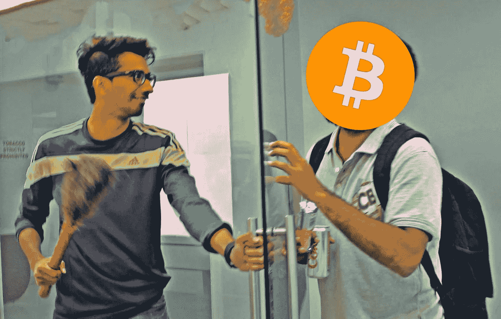

# 为什么投资比特币对我来说毫无意义😏

> 原文：<https://medium.com/hackernoon/why-investing-in-bitcoin-is-meaningless-for-me-54e1df6d7289>

2017 年下半年一直是比特币/加密货币的天下。你可能很容易注意到你的亲戚、密友、同事或互联网上任何随机的人在过去几个月里对比特币/加密货币着迷。

*Bitcoin’s graph in 2017’s 2nd half*

其中，最典型的评论来自那些热衷于买卖比特币/加密货币的人，比如:“比特币正在上涨！”，“你知道比特币刚打到 xxxxx 美元！”，“比特币是下一个大东西！我用生命打赌！”“如果你 3 个月前买了比特币，现在你的钱已经翻了三倍。”。是的，我听到和看到了发生的一切。但我也看到了你拼命想赚快钱和轻松致富。这是他妈的宣传！

让我直截了当地告诉你真相——我认识的大多数投资比特币/加密货币的人都不关心区块链或加密货币将带来的影响(+正面或-负面)。他们只关心在最短的时间内能赚多少钱。此外，你会注意到投资比特币/加密货币的人会不断鼓励或羞辱人们购买他们已经购买的加密货币，因为:

1.  这就是他们如何证明自己投资比特币/加密货币的偏见和愚蠢决定的理由
2.  这就是他们如何提高比特币/加密货币的价值。人们对某样东西越有信心和投资，它的价值就越高。这也是为了在泡沫破裂时安慰自己，受打击或破产的不仅仅是他们，还有他们的朋友和家人。那是心理安慰。

这没有错，但在短期内，随着诱导 [FOMO](https://en.wikipedia.org/wiki/Fear_of_missing_out) (害怕错过)、(害怕、不确定和怀疑)和[同伴压力](https://en.wikipedia.org/wiki/Peer_pressure)，它伤害了两个实体:

1.  大多数为了赚钱而投资比特币/加密货币的人正在影响加密货币能够尽快带来的真正影响，即一旦比特币稳定下来并为全球交易带来多重好处，就帮助个人/商家/企业采用比特币。为了更清楚地了解比特币/加密货币的好处，[观看这段视频](https://www.youtube.com/watch?v=Gc2en3nHxA4)。
2.  大多数人最终会在同伴的压力下花费大量的时间和精力来获得短期的快钱，而忽略了此时对他们来说什么才是真正重要的。(例如。我的朋友在与同事交谈、玩 TT 或国际足联游戏以及吃饭时，会多次查看手机

*Slap anyone who’s asking you to buy bitcoins*

记住这一点，让我告诉你为什么我没有投资比特币/加密货币，也不打算在不久的将来投资。原因如下:

1.  我不想让自己卷入比特币/加密货币何时上涨或下跌的争论/压力中。我想活在当下。当你投资于变化无常、瞬息万变的事物时，需要你全力以赴。这不是比特币/加密货币的错。事情就是这样，需要你的关注。所以对我来说，活在当下比把我 24×7 的注意力放在赚几个快钱上更有价值。
2.  我不在乎它能让我多赚多少钱。我不会被 FOMO/FUD/同龄人的压力所左右。我每个月都能赚到足够的钱快乐地生活，买我想要的东西(有时会等上几个月去存钱——这也很有趣+你会珍惜你用省下来的钱买的东西),每年去 1-2 个国家旅游。这里的逻辑是，如果我继续奔跑，或者对世界给我的每一个赚钱机会说是，我的目标就失去了。没有什么值得坚持的价值。没有焦点。
3.  养成赚快钱的习惯/口味的后果是非常危险的。现实世界中的投资不是这样的。你不会在短短 3 个月内让你的钱翻 100%、200%或更多。通常，整个投资行业的投资回报率在 4%到 25%之间。
4.  我是一个有创造力的人。我想把我的时间和精力投入到我正在做的创造性工作中，投入到我的个人和职业目标中，投入到我的健康中，投入到与朋友或爱人一起创造新的回忆中，或者投入到培养自己的生活中。比起在短期内将我的钱翻 1-5 倍，我有很多想法，如果我做到了，会让我更开心。

但是你可能会说“哦，但是你挣的钱还不错，也许这就是你不在乎的原因”。

*Bullshit people give for buying bitcoins are endless*

为什么这是胡说八道:你知道有多少人破产了，但开始投资比特币/加密货币？我一个也不知道。我还没见过穷人或破产的人开始投资比特币/加密货币。每个适度/大量投资比特币/加密货币的人都在赚或已经赚了一大笔钱。另外，如果你很穷/破产了，你把钱投在了比特币/加密货币上，那你就不是在投资，而是在赌博。是的，你没看错！在不知道它的作用或真正意义的情况下投资，等于赌博。

所以，在投资那些承诺在尽可能短的时间内给你带来快速/更多回报的东西之前，要三思而行。不要陷入宣传。

*Don’t listen to people and follow the propaganda. Choose wisely!*

附:这篇文章不是要剥夺你投资比特币/加密货币或其他任何东西的机会。仅仅通过写这篇文章，我，对我自己来说，确保无论我的时间和精力去了哪里，它都给了我最大的回报，让我感到快乐、满足和有价值(主要是定性的而不是定量的)。我知道不能对生活中发生的每一件事都使用相同的过滤器，但出于我上面提到的原因，当谈到成就感时，比特币/加密货币就是不在我的待办事项列表中。我希望这篇文章能帮助人们获得同样的观点，并为自己做出更好的选择，而不是投资比特币/加密货币或任何其他快速赚钱的投资机会。

情人节快乐，明智地选择！🙃

— — —

这篇文章最初发表于[themadscientistlab.com](http://experiments.themadscientistlab.com/)