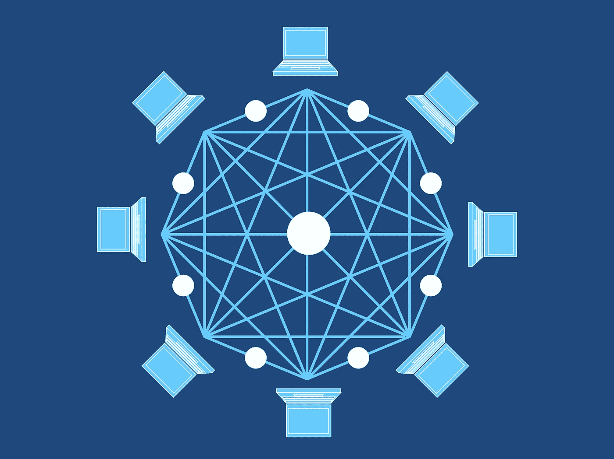

# 物联网为什么需要区块链，区块链为什么需要物联网

> 原文：<https://medium.com/hackernoon/why-iot-needs-the-blockchain-and-blockchain-needs-iot-896725b349c4>

image source: P[ixabay](https://pixabay.com/en/network-iot-internet-of-things-782707/)

物联网现在无处不在。虽然物联网已经存在了一段时间，但它的受欢迎程度和能力正在稳步增长，成为当今最普遍的技术之一。根据研究和分析公司 [Gartner](https://www.gartner.com/newsroom/id/3598917) 的数据，截至 2017 年底，约有 80 亿台联网设备在使用中。这比前一年增加了 31%,而且没有减缓。据估计，到 2020 年底，联网设备将超过 200 亿台。

在目前的状态下，这些物联网设备中的绝大多数都是消费级电子产品，包括从智能家居技术(如 Nest 恒温器)到商店中大量销售的智能扬声器在内的所有产品。我们刚刚发现物联网的真正范围，在不久的将来，我们许多最基本的任务似乎都可以通过物联网技术来简化。

当然，物联网并不是目前唯一一项大受欢迎的技术。区块链技术是推动比特币等加密货币的会计支柱，它也开始发挥作用。在对加密货币和区块链技术的研究中，[布鲁金斯学会](https://www.brookings.edu/blog/techtank/2015/01/13/the-blockchain-what-it-is-and-why-it-matters/)发现“区块链是关键的创新。”事实上，尽管与加密货币相关的价格上涨令人眼花缭乱，标题引人注目，但加密货币的最大贡献可能是为其提供动力的技术。

## 激动人心的新技术有明显的缺陷

尽管在 2017 年取得了令人难以置信的成功，但这两项技术仍处于炒作阶段。他们将会比现在好得多。对于物联网来说，人们仍然担心它是否有能力保护连接到恶意互联网的数十亿设备。尽管物联网正在蓬勃发展，但并不需要太多关于被黑的物联网婴儿监视器的[新闻报道](https://www.huffingtonpost.com/healthline-/parental-warning-your-bab_b_11668882.html)就能阻止其发展。

埃森哲[进行的一项物联网安全概述指出:“可行的物联网安全解决方案的紧迫性与日俱增。许多企业和政府领导人首先想到的是同一个恼人的问题:我们需要做些什么来保护物联网？”如果人们将继续购买物联网设备，如果企业物联网将重新定义我们的基础设施，那么这一根本缺陷必须得到修复。](https://www.accenture.com/us-en/insight-security-internet-of-things)

除了对安全性的担忧，物联网还需要扩展其功能，以确保始终快速、可靠的连接。当你的亚马逊 Echo 暂时失去连接时，这不是什么大不了的事情，但如果一队自动驾驶汽车失去信号，哪怕只是片刻，都将是一场灾难。

与此同时，区块链正在待命。它在等待时机来证明它不仅仅是技术上最令人沮丧的问题的一个假设的解决方案。

在许多方面，区块链和物联网是完美的一对。区块链目前正在保护世界上最有价值的加密货币，其嵌入式智能合同和分散式网络是物联网安全问题的重要解决方案。虽然集中式服务器最终会受到威胁是不可避免的，但区块链将这种风险分散到了世界各地的数百台服务器上。

此外，由于一个区域的中断不会影响到另一个区域，因此同样的功能可以确保持续的连接。区块链可以确保物联网设备保持其提供服务所需的连接性。

## 准备好区块链

image source: [Pixabay](https://pixabay.com/en/blockchain-block-chain-technology-3019121/)

上周，首席执行官兼摩根大通首席执行官杰米·戴蒙在接受福克斯商业采访时承认，“区块链是真实的。”戴蒙的意思是，区块链是一种可行的技术，将对整个行业产生真正的影响。虽然它肯定是真实的，但它肯定还没有准备好。

在一份关于区块链的年终报告中，研究和咨询公司[德勤](https://www2.deloitte.com/insights/us/en/focus/tech-trends/2018/blockchain-integration-smart-contracts.html)指出，“公司应该寻求标准化技术、人才和平台，这些将推动未来的计划——在此之后，寻求协调和整合多个区块链在价值链上一起工作。”

在目前的状态下，区块链被隔离在不同的公司和平台中。发展这些区块链之间的连接并允许它们利用彼此的优势是实现现实区块链集成的必要下一步——特别是为了物联网目的。

一些工作已经开始了。[总部位于新加坡的区块链公司 Qtum](https://qtum.org/en/) 正在开发一个物联网就绪平台，将以太坊智能合约与比特币丰富的区块链连接起来。像这样建立连接使区块链更适用于企业，也更适合作为物联网系统。

上周， [Qtum 宣布了与 360 区块链研究中心和 BTN 基金会的合作计划。他们一起组成了中国第一个以区块链为中心的研究中心，他们的集体努力旨在加速区块链的能力。由于 360 区块链的目标是物联网区块链倡议，因此该实验室似乎有可能对区块链积极影响物联网生态系统的能力产生有益的影响。](https://blog.qtum.org/chinas-360-finance-and-qtum-are-establishing-china-s-first-commercial-blockchain-research-center-ad7ef6cb8d88)

有这么多的利害关系，有很多人在研究如何利用物联网技术为企业使用区块链做好准备。区块链和物联网共同成长，相互依存。物联网迫切需要区块链的功能，而区块链渴望物联网所代表的重大机遇。他们一起在做一些非常特别的事情。