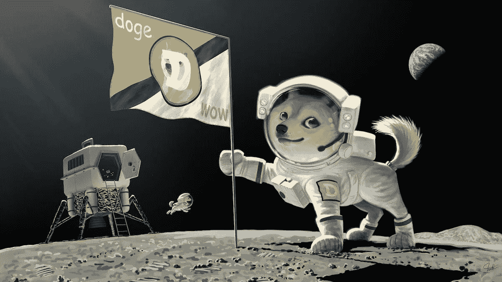
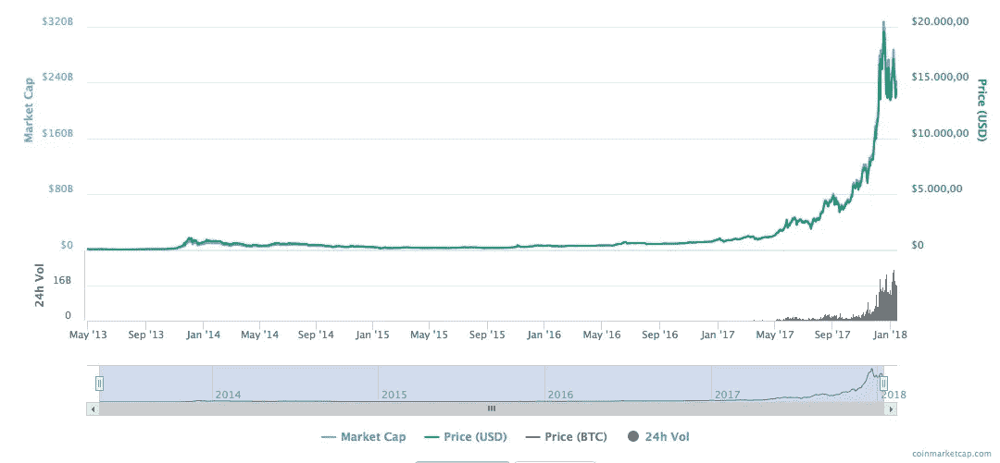

# 为什么 IOTA 不需要“不久的月亮”(向前看)

> 原文：<https://medium.com/hackernoon/why-iota-does-not-need-the-moon-soon-a-look-ahead-8a7c173cb8b>

如今，许多人将大量资金投入到他们一年前根本不会听你说话的东西上。目前，数十亿美元正在流入一个市场，其主要产品(无论是比特币还是其衍生品)无法被 97%的“投资者”从技术角度解释(这是我根据目前与我交谈过的“投资者”的估计)。仅仅这一点就足以称之为疯狂，然而，当你看到大多数“投资者”的态度时，这就变得更加疯狂了:*尽快赚大钱——*即使这涉及到传播展示一只狗登上月球的迷因。

Example of the moon soon philosophy

随着越来越多的投资者进场，达到“月亮价格”的愿望也相应增长:*去他妈的吧！什么时候月亮？为什么还没有月亮？在下文中，我将论证 IOTA 从未也永远不会需要那种先令。*

# 神秘之地的价格发展

记住这一点真的很重要:数十亿美元、欧元和韩元并不总是像这样流入加密领域。

Bitcoin price development since 2013

> 一年前，你可以花 800 美元买到一个比特币，花 9 美元买到一个 ETH。

如果你看看今天的加密货币的任何图表，你会很容易地看到，价格已经有很长一段时间没有真正移动；然而，在过去的几个月里，基本上每一枚硬币都升值了。不管你怎么看:这个市场已经花了很多钱，在交易机器人和上述“投资者”的时代，基本上失去你所获得的一切的风险仍然存在，他们对投资决策的非理性与他们对市场如何运作的理解的无知有关。

一个为了抓住潜力而如此依赖技术理解，同时又建立在非技术投资者基础上的市场，迟早会崩溃；从某种意义上说，加密货币作为一种技术将会成功，但不会达到大多数交易者希望的价格水平。

# 极微小

IOTA 开发者从第一天起就在大肆宣传。更准确地说，他们不喜欢炒作！从来没有关于产品、伙伴关系或价格的炒作——他们总是对自己的技术进步感到兴奋，但与其他项目相比，当谈到可能的炒作公告时，IOTA-hodler 很难从开发人员那里挤出信息。在某一点上，由于困难的环境和开发一些突破性的新硬件的高风险，开发甚至处于失败的边缘。然而，没有虚假的承诺或任何东西；相反，到目前为止，他们一直在交付，即使有时比预期晚一点(由于他们的投资性质，这对上述投资者来说当然是一个大问题)。

> IOTA 因发布大量新闻而闻名，这不会停止，但对我们来说至关重要的是，人们不会成为“公告恶魔”，IOTA 是一个开源的草根努力，人们需要专注于螺母和螺栓，而不是只寻找下一个公告。寻找下一个可能会抬高价格的新闻是每个加密项目都面临的当务之急，**但我们试图通过应用相当严格的政策来限制它，当涉及到投机和挖掘炒作信息时。首先是技术和愿景，如果执行得当，繁荣就会随之而来**。([大卫·松斯特博，IOTA 联合创始人](https://cointelegraph.com/news/fudsters-not-misinterpreted-microsoft-partnership-responsible-for-iota-decline-clarifies-ceo)，2018 年 1 月 13 日)

IOTA 不需要 *moon soon* 那种先令的原因是，这项技术不是为一些私人投资者赚钱而设计的；它也不是为将来可能有实际价值的更不具体的领域中的不具体的用例而设计的；它也不是为了在根本无法实现的元层面上改变世界而设计的。

**IOTA 是为一个特定的目的**而设计的:成为物联网的基础层(或者:IoT，当然主要集中在某些行业，但可以普遍实施)。

这影响了你看待它的方式:

首先，你可以冷静下来，因为 CES 的最新消息显示，如果今天的行业有一种趋势(无论是汽车、智能城市/智能家居/智能能源、健康、娱乐、机器智能……)，那肯定是物联网！**这意味着 IOTA 有一个由** [**懂行的人设计的工作产品，由大公司支持，并为一个即将改变我们世界的市场量身定制**](/@iotasuppoter/iota-the-bigger-picture-eb7092835dfc) **。**不是最差的起步条件，你得承认。

考虑到可能的市场崩溃的风险，这一点尤其重要:如果整个加密市场崩溃，可能是因为以下原因:

*   法律问题(监管，技术终结于一条死胡同)
*   交易所(Mt. Gox 2.0，很多人亏了很多钱)
*   瑕疵(道 2.0)
*   非理性投资者走向贝泽克
*   过度估价自然会出现大幅调整(每个市场都是如此)

如果这种情况发生，今天的大多数货币将被投资者冲进马桶，因为他们注意到，在一个死气沉沉的市场中，没有特定目的的压榨硬币的整个计划不再奏效。**相反，人们想要的是一种由实际工作产品和知名公司支持的技术**(这种想法似乎没有太多人注意到 1000 多枚硬币的实际用途是多么少)。到那时，即使是最大的傻瓜也会明白，IOTA 不仅有潜力，还有支持它的人、公司甚至政府。

在崩溃的可能情况下，加密市场的钱不会简单地蒸发，它只会流向那些能够经受住重大打击的少数技术；你猜到时候 IOTA 会有多吸引人！并且丝毫不依赖任何人的先令:**那么**月亮很快就会自己到来*。*

如果你想的话，我很乐意捐一点。-):

IOTA:kgozyhjryvdbsxtusecyjvebldvyfkcakawtptckxmbnownvrdhrvsjnivoqufrodfpxfwysgrokrwzwjztjohsx

