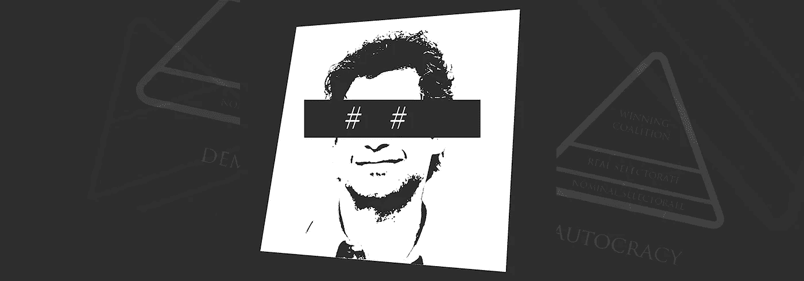
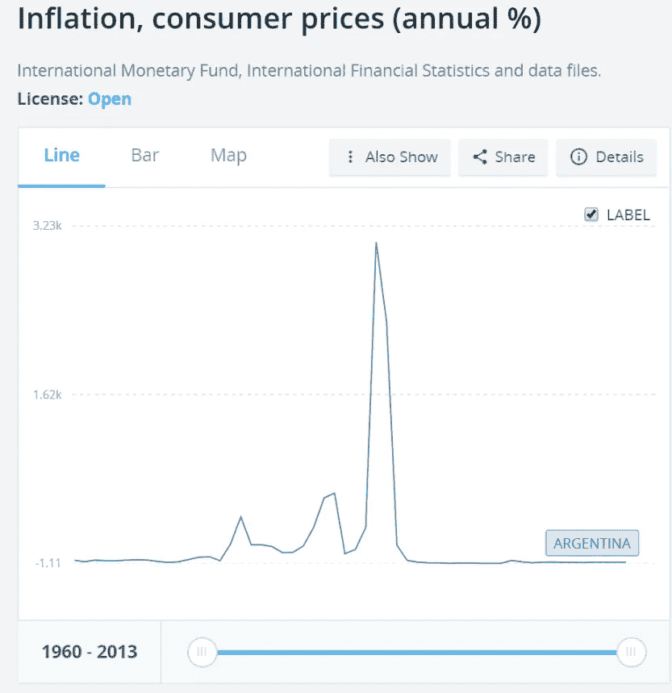
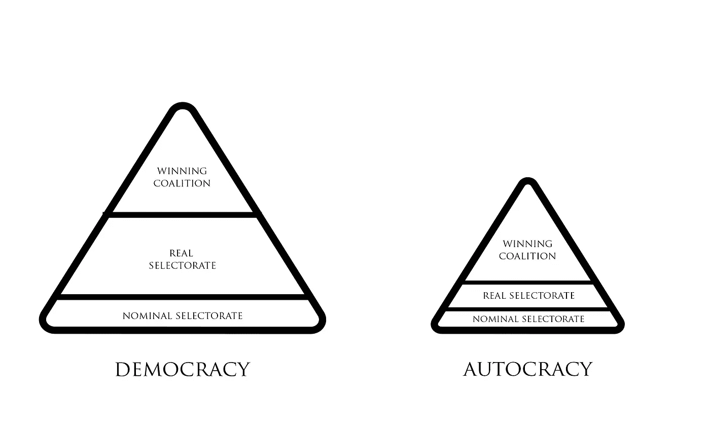
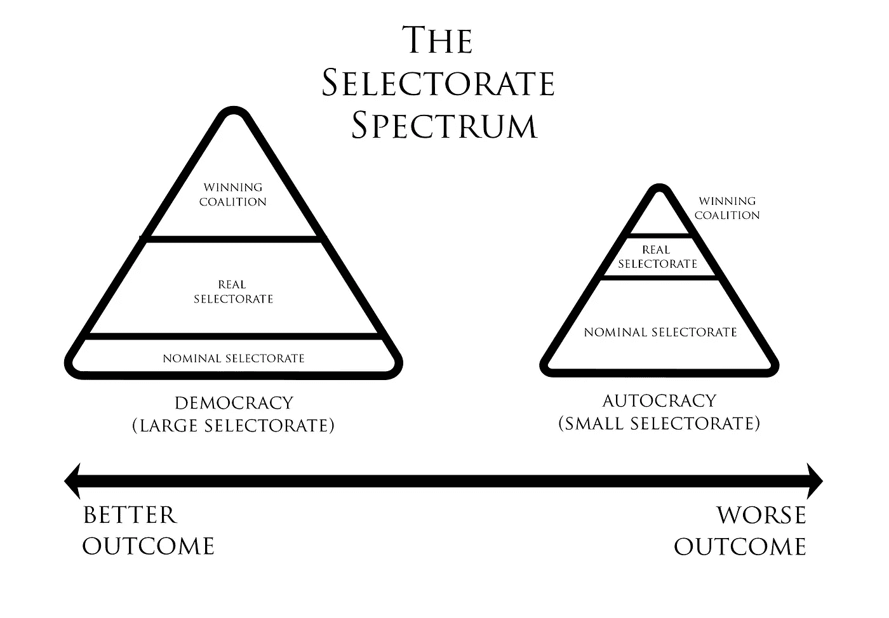
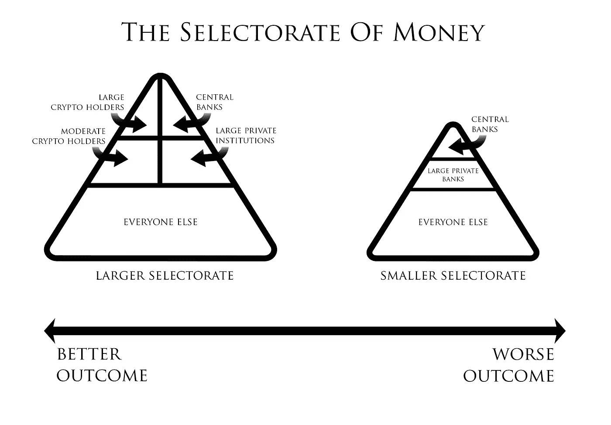

# 比特币为什么有价值？

> 原文：<https://medium.com/hackernoon/why-is-bitcoin-valuable-32c35267a585>

几乎在每一个维度上，比特币都比贝宝(Paypal)或大通(Chase)等集中化的对手更糟糕。

不仅比特币如此，几乎所有去中心化的加密货币协议都是如此。

它们更慢、更贵、更难扩展，并且提供更差的用户体验。

那么比特币为什么有价值呢？为什么其他去中心化的应用有价值？

比特币网络上的交易势不可挡。如果我有互联网连接，并同意支付网络费用，没有什么可以阻止我向任何我想要的人发送比特币。

也就是说，比特币是**抗审查的。**

# 什么是审查阻力，为什么它会让比特币变得有价值？

密码学是 21 世纪为数不多的几个领域之一[1],它继续对防御者非常有利。使用加密技术，一个普通人甚至可以保护自己免受政府和大公司的攻击。

非法丝绸之路市场的创始人罗斯·乌布里希特从未被联邦调查局用密码破解过。事实上，他们不得不等到他出现在一个公共图书馆，他的电脑开着的时候才逮捕他，在那里他们可以在他关闭电脑并用密码锁定电脑之前把电脑抢走。

这种有利于防守方的不对称有时被称为防守方的优势，是比特币等加密货币的一个关键属性。使用世界上最强大的计算机，破解一个人的私人比特币密钥需要 0.65 亿年。[2]

这使得破解一个人的私人密钥变得相当困难，但是摧毁网络又如何呢？

首先，[比特币网络是世界上最强大的计算机网络](https://news.bitcoin.com/bitcoin-hashrate-four-exahash-per-second/)。[3]2015 年，它比排名前 500 位的超级计算机加起来快 11000 倍，因此没有一个实体控制着更多的计算能力。[4]

比特币网络是世界上最强大的计算机，因为它向所谓的比特币“矿工”支付报酬，让他们提供计算能力来保护网络。随着比特币相对于法定货币的价格上涨，矿商收到更高的费用，激励他们投入更多的计算机能力，这使网络更加强大，并创造了一个正反馈循环。

截至 2017 年 11 月 16 日，建造一台强大到足以破坏比特币账本(也被称为[51%攻击](https://www.mycryptopedia.com/51-percent-attack-explained/))的超级计算机的成本将是大约 31.4 亿美元的硬件[和每天 560 万美元的电力。](https://hackernoon.com/making-sense-of-cryptoeconomics-5edea77e4e8d)【5】

这里还有一个博弈论的成分。

因为绝大多数比特币用户认为，网络只有在保持去中心化的情况下才有价值；51%的攻击可能意味着一旦攻击者获得 51%的网络控制权，它的价值就会降到零。

更重要的是，如果你有 51%的权力，你可以诚实地每天开采 1500 万到 2000 万美元。所以，即使你有不诚实的野心，遵守规则会更有利可图。

捍卫者的优势和采矿中的正反馈循环的结合创造了一种称为**审查阻力的特性。**

抵制审查意味着试图审查、窃取或以其他方式胁迫的成本是如此之高，以至于不切实际，接近(但没有达到)不可能。在比特币的例子中，任何人想通过破解你的私钥从你的比特币钱包中窃取你的比特币，或者进行 51%的攻击，都必须拥有如此巨大的计算能力，以至于窃取比特币的成本远远高于自己简单地购买比特币。

所有其他资产类别，如法定货币、贵金属和房地产，都比比特币等加密货币更容易被摧毁或没收。他们享受不到同样的不对称辩护者的优势以及由此带来的审查阻力。

为什么这很重要？

# 保护自己免受政府和公司的伤害

在比特币的背景下，讨论防御者优势的最常见方式是公民保护自己免受不负责任或恶意的政府和公司的侵害。

随着世界上所有疯狂的事情不断发生，对防审查财富存储的需求很高，而且还在增长。当前市场的存在很大程度上是因为它们的抗审查特性，包括黄金市场(est。[、6 万亿美元](https://schiffgold.com/commentaries/just-how-big-is-the-gold-market/))【6】以及离岸银行业(美国东部时间。[【20 万亿美元】](http://www.businessinsider.com/cryptocurrency-value-explained-by-crypto-hedge-fund-cio-ari-paul-2017-11))【7】。

阿根廷和委内瑞拉等国的公民迅速将比特币作为一种储蓄工具，因为他们的经济史让抵制审查的价值变得更加明显。

由于治理不善，从 1973 年到 2017 年，委内瑞拉的通货膨胀率平均为 32.42%。【8】

阿根廷甚至更糟；【1944 年至 2017 年间，那里的通胀率平均为 200.80%。【9】

这两个国家都有政客攫取私有财产(土地、公司等)的历史。)的政治对手，甚至是看似随意的目标。

如果你在一个稳定的国家长大，那么抵制审查的财富存储，尤其是比特币，听起来可能像是一种奇怪的自由主义或无政府主义观点。

自第二次世界大战以来，发达国家经历了一个非常和平稳定的时代，但情况并非总是如此，即使在今天也并非处处如此。因此，即使抵制审查的想法对你来说听起来很疯狂，但值得考虑的是，大约 26 万亿美元(以黄金和离岸银行的形式)认为抵制审查非常重要。[10]

然而，让我们避开自由主义者的末日计划场景，假设你是一个稳定国家的正直公民。在更“正常”的政治条件下，加密货币中存在的防御者优势所创造的审查阻力是否仍然重要和有价值？

为了弄清楚为什么会这样，我们需要绕道去加利福尼亚的贝尔，大约在 1993 年。

# 作为一个小镇镇长，如何每年挣 787，000 美元

罗伯特·里佐在 1993 年至 2010 年间担任加州贝尔市市长。

当他 2010 年离职时，他的年薪是 78.7 万美元。举个例子，美国总统年薪 40 万美元，加州州长年薪 20 万美元。

一个 35，000 人口的小镇的市长是如何能够每年赚近 100 万美元的？

1993 年当选后，里索举行了一次特别投票，使贝尔市成为特许市。

投票结果意味着贝尔不再受州立法者的监督(和问责)。这样做的借口是当地领导人(比如里索)比遥远的州政客更清楚什么对贝尔更好。

投票没有与州或大选同时进行，无论如何人们都会投票，而是在一次特殊的选举中。贝尔的 36000 名居民中，只有 400 人(1%的居民)在宪章通过的选举中投票。

实际上，该条款使里索成为了一个独裁者，他可以继续做假账。

里索当选是基于平衡预算的承诺，而且他做到了。他将财产税提高到 1.55%，几乎高于洛杉矶县的任何地方——包括比佛利山庄和马里布这样的富裕郊区。

这为里佐带来了巨大的预算盈余，他逐渐用这笔盈余每年给自己加薪 15%，从 1993 年上任时的 72，000 美元涨到 2010 年离职时的 787，000 美元。

里索不是军阀——他是世界上历史上最稳定、最民主的国家之一的一个城市的民选官员

# 选区理论:民主是抵制审查的

贝尔关于近乎专制统治的临时案例是一个很好的案例，可以通过[选举理论](https://en.wikipedia.org/wiki/Selectorate_theory)来理解政治和权力动态。

选区理论将政治格局分为三个等级，即那些有权“选择”特定选举最终结果的人。

选区的三个部分是:

*   名义上的选举委员会——名义上能够影响结果的所有人。在贝尔市，这是该市登记选民的总数。
*   真正的选举委员会——实际上选择领导人的团体。在贝尔的例子中，这是那些在特别选举中真正投票的人。
*   获胜的联盟——真正的选区的子集，他们的决定真正有影响力。在贝尔的案例中，这是六个市议会成员和里索本人。

在美国总统选举中，相同的类别可能如下所示:

*   名义上的选区——所有合格的注册选民。
*   真正的选举人——实际投票的人(或者，你可以说，选举团)。
*   获胜的联盟——主要媒体、有影响力的公众人物(脱口秀主持人、前任总统、名人、社交媒体影响者)和高层竞选人员。

选区理论破坏了在高中政府课堂上教授民主的方式:即每个人都有“一人一票”的平等发言权。它给出了一个更准确的框架，即在社交媒体上拥有更多关注者、你的电视节目观众或购买政治广告的资金，会让一个人比一个只能投票的人更有能力影响选举结果。

选区理论和里索案例的教训是**重要的不是谁在运行这个系统，而是选区的分配。**

*An autocrat or dictator will try to keep the selectorate as small as possible and the winning coalition and real selectorate as small a segment of the selectorate as possible so they are easy to control. In a democracy, the selectorate is much larger, making the power each individual has greater than in an autocracy.*

民主是比独裁更好的政府形式，这不是因为总统本质上是比独裁者更好的人，而仅仅是因为总统必须安抚更大的选区。

具体来说，选区越大，整个系统的代理和权力就越分散。

在专制政权中，获胜的联盟很可能是由十几个或更少的个人组成的团体，就像贝尔的市议会成员或帮助独裁者维持权力的军阀。同样，真正的选区也只占总人口的一小部分，就像贝尔案中的少数选民或军阀的高级副手。

在一个民主政权中，获胜的联盟可能会大得多:成千上万的个人。真正的选举团同样比专制政权大得多。

If you have a small selectorate and small winning coalition, it’s relatively cheap to bribe, threaten, or otherwise coerce the winning coalition to do what you want. Rizzo bribed the city council officials with huge raises, and autocrats can threaten to kill disobedient warlords.

When you have a larger selectorate and larger winning coalition, it’s more expensive to use coercion to get or maintain power. And so democratic leaders have to build consensus and make compromises which, on average, leads to a better outcome.

It’s not that you can’t buy political power in a democracy; it’s just much more expensive than buying political power in a dictatorship. Said another way, individuals in a **democracy are more censorship resistant and have a greater defender’s advantage than in an autocracy. [11]**

2017 was an interesting test of this. In the first year of his presidency, Trump attempted to make various types of sweeping reform, but in the end, he got almost nothing done. Because of how the U.S. government is organized, a president needs the cooperation of a large number of civil servants to enact meaningful change, and if they can’t build that consensus, they can’t get very much done.

Despite criticizing many parts of the press, he has not actually succeeded in censoring them. Compare this to the more autocratic regimes of Putin’s Russia and Xi Jinping’s China which have succeeded in censoring the press.

In the case of Bell, California, Rizzo was able to pull off the heist by using a special election to reduce the winning coalition to six individuals on the city council whom he could more easily coerce.

The same dynamic is true of many other ways people are organized. Just like a country, a company with a small selectorate is more likely to be corrupt than a large one. They have different size winning coalitions and selectorates, and the size of those (roughly) correlate to the quality of outcomes.

# Cryptocurrency and Democracy

The censorship resistance afforded by cryptography is a potentially significant development because it offers a mechanism to enlarge the selectorate of money. In this way, it’s not unlike democracy.

Democracy allowed individuals to vote on what they define as good government, disintermediating the King and enlarging the selectorate of government.

The promise of the censorship resistance property of Bitcoin is that it will allow individuals to define for themselves what sound money is, disintermediating the bankers and enlarging the selectorate and winning coalition of money.

What might this mean?

Also, if you’re looking for more about blockchain and cryptocurrency for business, [click here to access my personal resource lists](https://taylorpearson.me/blockchainoptin/) of where I’ve found the best and most reliable information.

# The Selectorate of Money [12]

目前，货币的选择是一个相对较小的群体。2008 年全球金融危机的教训之一是，相对少数的个人对全球金融体系具有相对较大的影响力。

2011 年的一篇名为“全球企业控制网络”的论文试图给出一些粗略的数字，说明这个群体有多小，他们的影响力有多大。他们发现，147 家公司拥有相互关联的股份，共同控制了全球金融网络中 40%的财富。共有 737 家公司控制着网络中 80%的财富。

这个集团形成了某种类似于金钱专制的东西。权力集中在相对较小的群体手中。

加密货币的审查阻力提供了一种机制，通过使夺取、贬值或以其他方式攻击货币的成本过高来扩大货币的选择范围。由于密码学提供的不对称优势，强大的实体(无论是公司、民族国家还是其他个人)无法在不付出远远超过其收益的情况下获取他人的比特币或攻击网络。

民主通过让治理更具审查抵抗力来扩大政府的选择范围，同样，比特币等加密货币提供的审查抵抗力可以扩大货币的选择范围，并将权力转向更广泛的个人基础。

*The selectorate of money. Cryptocurrency enlarges the selectorate of money in much the same way that democracy enlarges the selectorate of government. This does not make it a perfectly fair system but suggests a more equitable distribution of power than we have now.*

2015 年一篇关于阿根廷的报道描述了有多少人实际上在国家银行体系之外运作，并从比特币的审查阻力中受益:

> 一名德国客户用比特币支付给(阿根廷)音乐家一些自由创作的作品，音乐家需要将它们兑换成美元。卡斯蒂利奥内(一名货币兑换商)拿阿根廷政治的腐败开玩笑，他剥开了五张百元大钞，把它们兑换成 1.5 比特币多一点，然后交给了他的客户。音乐家没有交出任何东西作为回报；在出现之前，他已经把比特币从他的比特币地址转移到了卡斯蒂利奥内的地址，实际上，比特币是一种数字代币，只作为数字账本中的条目存在。如果德国客户将欧元汇往阿根廷的一家银行，这位音乐家将被要求填写一份表格来接收付款，由于该国的货币管制，他牺牲了大约 30%的收入来将欧元兑换成比索。[14]

银行家和政府因控制了兑换货币的唯一途径而拥有的权力已经丧失。

上世纪 90 年代，阿根廷比索与美元挂钩。这意味着阿根廷政府保证你可以用一个阿根廷比索兑换一美元。如果你的银行账户里有 1000 阿根廷比索，你可以走进银行，要 1000 美元，他们就会给你。

到 2001 年，由于一些原因，钉住汇率已经不可持续，阿根廷政府放弃了钉住汇率。结果，汇率直线下降，[15]一年之内下降了 75%。

想象一下，如果你看着你的银行账户，价值在一年内下降了 75 %,而你一毛钱也没花。这实际上就是在阿根廷发生的事情。

想象一下，如果当时阿根廷 10%的财富储存在比特币这样的抗审查加密货币中。这将使该派系(不仅仅是银行家和高级政府官员)在重大经济决策中获得一个席位，这是他们过去所没有的。

2008 年全球金融危机也是如此。如果加密货币存在，它会让更多的人在如何处理危机方面有更多的发言权。

我想澄清一点，我并不是说“所有的银行家都是邪恶的。”我是说，一个更大的获胜联盟和一个更大的选区，平均来说，会带来更好的结果，比特币的审查抵抗属性创造了更大的选区和获胜联盟。

并非所有的独裁者都是邪恶的——有些确实是仁慈的——但如果你必须选择在一个专制国家或一个民主国家度过余生，你会选择哪个？你可能会选择一个有仁慈独裁者的专制国家，这个国家比民主国家做得好得多，[16]但历史很清楚，平均而言，民主国家比专制国家为其公民带来更好的结果。

人们希望，就像在民主国家拥有一个大选区会迫使总统们为了保住权力而表现得更好一样，在金融领域拥有一个大选区会迫使银行家们为了保住权力而表现得更好。

即使在这种乐观的情况下，加密货币也不是万能的。矿工、大股东和开发商仍然是一个“胜利联盟”,他们比普通人施加更大的影响。但这是一个比我们现在更大的群体，随着生态系统从比特币扩展到其他加密货币，它有可能变得更大。[17]

但是民主也不是万灵药。正如丘吉尔所说，“除了那些已经尝试过的其他形式，这是最糟糕的政府形式。”

同理，[加密货币可能是最糟糕的货币形式](https://www.gwern.net/Bitcoin-is-Worse-is-Better)，除了所有其他已经尝试过的。[18]

# 或者不是…

一个重要而有效的观点是，加密货币财富也是一样集中的，我们只是在用旧的货币选区换一个新的，但更具包容性的选区。

对此有很好的证据。据估计，只有 1000 人拥有 40%的比特币。这个数字与当前的系统看起来没有太大的不同。

从这个角度来看，“比特币革命”就像之前的大多数革命一样，我们只是用旧的霸主换来了新的霸主。

加密货币的开源、可分支性质让我希望这不会是结果。

历史上，不同的货币可以用于不同的目的。虽然你可能被要求使用某种国家货币来纳税，但你可能会使用当地发行的银行券在你的村庄进行交易，你可能会使用硬币(黄金和白银)来储存价值，如果国王负债过多，这种价值不会贬值。换句话说，在历史上的大部分时间里，货币市场都是竞争性的。

直到 18 世纪晚期，这种竞争性的市场才使这些货币崩溃，成为由各国政府支持的单一货币，各国政府宣布其他货币为非法，以便更容易征税。

由于其开源、可伪造的性质，加密货币带来了不同货币用于不同用例的可能性，并迫使货币争夺用户。货币委员会可以通过购买、出售、囤积或倾销他们认为合适的各种硬币来表明自己的观点。

虽然比特币是迄今为止占主导地位的加密货币，但来自其他加密货币的持续竞争将迫使比特币参与竞争。

通过这种方式，加密货币的开源和可分支性质允许个人自己在竞争货币之间进行选择，真正将权力转移到用户，而不仅仅是任何特定加密货币的高净值持有者、核心开发者或矿场。

# 抵制审查会扩大一切事物的选择范围

抵制审查的性质使它扩大了选区，这不仅仅局限于金钱领域。

钱可能只是第一个应用。

抵制审查与[支持](https://www.coindesk.com/coindesk-explainer-bitcoin-cash-forking-blockchain/)加密货币协议的能力相结合，意味着通过扩大选区，权力结构的这种转变将发生在许多不同的行业和领域。

想象一下，如果脸书不是一家私人公司，而是一个任何人都可以攻击的公开的区块链，会是什么样子？

现在，用户的数据被脸书的一小群人删除或审查。对于脸书用户来说，没有审查阻力。你要么接受强加给你的规则，要么不使用这个平台。

但是，如果脸书在区块链，用户和任何能够分叉协议的人都可以成为选区的一部分，并能够施加影响。

鉴于优步对待司机的方式，区块链上的优步有着明显的吸引力。司机将成为选区的一部分，能够施加有意义的影响。

亚马逊、推特、谷歌等公司也可能以类似的方式发展这种动力。

抵制审查并不意味着仅仅阻止一些交易或消除一些参与者的声音，它意味着一个很难为小集团的目的而操纵的系统。在政治、金钱和媒体等领域都是如此。

将区块链或权力下放应用于所有领域并不是万灵药。同样，我们在早期未能预见到社交媒体和手机的许多负面影响，公共区块链无疑也会出现问题。

已经很明显的一点是，不管个人动机如何，抵制审查会给他们更多的权力。迄今为止，一些最大的受益者是恐怖分子、仇恨组织、毒贩和其他非法行为者。

但我在这里回到丘吉尔的观点:除了所有其他已经尝试过的形式，加密货币可能是最糟糕的权力分配形式。

和我所有的作品一样，这篇文章代表了一种探索，而不是一个确定的答案。欢迎反馈、想法和批评。你可以在这里的评论中找到我，也可以在 [*推特*](https://twitter.com/TaylorPearsonMe) *上找到我，或者发电子邮件到泰勒皮尔森的我的名字。*

PS。如果您正在寻找更多关于区块链和商业加密货币的信息，[点击这里访问我的个人资源列表](https://taylorpearson.me/blockchainoptin/)，在那里我找到了最好和最可靠的信息。

## 脚注

*【1】其实是我唯一能想到的领域。如果你知道任何其他人，请让我知道。*

*[2]这个计算是基于旧的数据，但我相信仍然在几个数量级内是正确的。即使它下降了三个数量级，破解一个人的钥匙仍然需要比宇宙存在更长的时间。* [*这个视频*](https://www.youtube.com/watch?v=S9JGmA5_unY) *是另一个有用的资源。如果你有更多最新的计算，我很想知道。*

*【3】*[*比特币哈希表*](https://news.bitcoin.com/bitcoin-hashrate-four-exahash-per-second) *和* [*比特币网速*](http://jasondrowley.com/2015/12/04/the-bitcoin-network-is-11000x-faster-than-the-top-500-supercomputers-combined/)

*[4]尽管“比特币网络真的真的非常强大”这一基本观点仍然成立，但一名编辑对这一点进行了更精确的技术澄清。*

*他的评论全文:*

> “当前[2018 年 1 月]比特币网络哈希值约为 16M 万亿哈希值/秒。“散列”是在挖掘中进行的逻辑操作的特定序列。超级计算机通常以每秒浮点运算次数来衡量，基本上是用实数进行算术运算(物理世界的科学建模是传统 HPC 的主要应用)。hash 和一些 flops 之间没有直接的转换——它们在 CPU 级别做着完全不同的事情。哈希运算现在也由 ASICs 来完成，这是一种专门构建的 CPU，经过严格优化，只用于哈希运算，而不是像 PC 的 mobo 中那样的通用 CPU。但是人们仍然可以进行启发式近似；假设 1 哈希= 1⁰⁵翻牌。所以目前的比特币网络 hashrate ~ 1.6 YOTTA 他妈的 FLOPS。顶级超级计算机大约是千万亿次浮点运算。所以比特币比最强大的超级计算机还要强大 1⁰⁸ (1 亿)倍。这是一个奇怪的比较，b/c FLOPS 不是散列，但它确实存在。”

*【5】**解读密码经济学*

*【6】*[*黄金市场到底有多大*](https://schiffgold.com/commentaries/just-how-big-is-the-gold-market/) *？*

*【7】*[*加密货币为什么有价值*](http://www.businessinsider.com/cryptocurrency-value-explained-by-crypto-hedge-fund-cio-ari-paul-2017-11/?r=AU&IR=T)

*[*委内瑞拉通货膨胀率*](https://tradingeconomics.com/venezuela/inflation-cpi)*

**【9】*[*国际货币基金组织*](https://data.worldbank.org/indicator/FP.CPI.TOTL.ZG?locations=AR)*[*阿根廷通货膨胀*](https://tradingeconomics.com/argentina/inflation-cpi)**

***[10]在 2017 年的一份报告中，瑞士瑞信银行估计全球财富为 280 万亿美元，这意味着抗审查的价值储存手段(黄金和离岸银行业务)占全球财富的近 10%。* [*来源*](https://www.credit-suisse.com/corporate/en/articles/news-and-expertise/global-wealth-report-2017-201711.html) *。***

***[11]我知道我在这里使用民主有点草率，但我是在民主共和国的意义上使用它，在那里有对尊重基本个人权利的明确偏见，对做潜在肮脏事情的绝对多数要求，宪法等。***

**[*参见此处*](https://www.ted.com/talks/james_b_glattfelder_who_controls_the_world) *和此处***。****

***【13】*[*来源*](https://arxiv.org/pdf/1107.5728.pdf) *。这一分析并不完美，但我认为它表明了一个中心观点，即相对少数的个人对大量的金融体系施加了巨大的影响。***

***【14】*[*来源*](https://www.nytimes.com/2015/05/03/magazine/how-bitcoin-is-disrupting-argentinas-economy.html) *—比特币是如何搅乱阿根廷经济的***

***[*Sourc*](https://en.wikipedia.org/wiki/1998%E2%80%932002_Argentine_great_depression)*e—阿根廷大萧条****

**[16]尽管有许多站得住脚的批评，李光耀担任新加坡总理三十年的工作是一个例子，说明一个仁慈而能干的专制领导人可以取得多大的进步。恶意或无能的专制领导人的反例不胜枚举。**

**有些人会认为比特币财富和其他形式的财富一样集中，有报道称 1000 个人拥有所有可用比特币的 40%。**

**在这种情况下，我们只是用我们的旧霸主换来新霸主。这可能是真的，但加密货币的开源性和可分支性让我觉得这不是可能的结果。(详见下文)**

***【18】亚当·路丁的* [*致杰米·戴蒙*](https://blog.chain.com/a-letter-to-jamie-dimon-de89d417cb80) *的公开信承认抵制审查，但对社会影响更加怀疑。我推荐它作为我在这里提出的论点的一个很好的对比。***