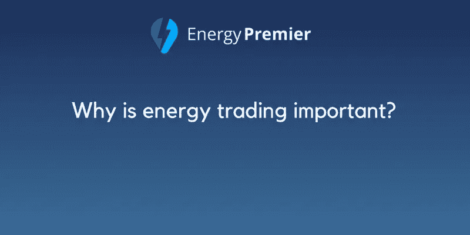
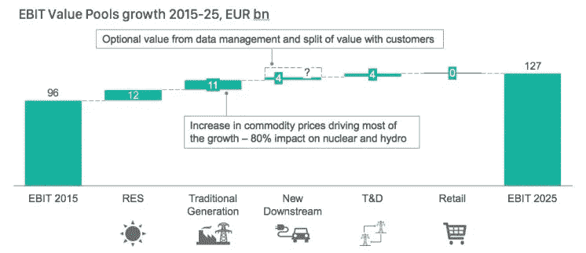

# 为什么能源交易很重要？

> 原文：<https://medium.com/hackernoon/why-is-energy-trading-important-73b62469c3d7>

> “环顾四周，我今天看到和依赖的几乎所有东西都需要能源来制造和运行，从我办公室的电话和电脑，到家里的灯和电器，再到路上的车辆。事实是，在我们生活的世界里，可靠的能源供应对我们的日常生活和整个社会经济体系至关重要。与此同时，世界各地的生活水平正在提高，越来越多的消费者正在享受经济进步的成果。所有这些都意味着对能源的需求将持续增长——我看到的最新估计表明，到 2035 年，能源需求将增长 30%以上。”—**DHL 全球能源部门主管史蒂夫·哈利**

近几年来，能源交易行业发展迅速，进步神速。公司已经将注意力集中在开发战略上，这些战略在后来被实现，以便公司达到它们的市场存在。在能源贸易领域以及能源技术平台方面存在积极的竞争和投资。

能源工业的主要因素是能源需求和供应。因此，有许多能源供应商和消费者可以买卖任何类型的能源。事实上，所有类型的能源都可以交易:电力、天然气、石油、煤炭和二氧化碳。这些所谓的“产品”可以进行实物交易，例如，当某人购买一定数量的电力时，电力会在约定的日期交付给他/她。

能源交易的过程非常透明。实现将产生公平价格的功能性和透明的能源市场有许多因素，例如:有更多的卖方和买方，有增加的交易量，有高的信息密度，在供求价格之间有值得信赖的定价，等等。

能源交易不同于金融交易，它部分发生在交易所。欧洲有许多能源交易所，其中最受欢迎的是奥斯陆的 NORDPOOL 和莱比锡的欧洲能源交易所(EEX)。能源交易是一种匿名交易，即卖方和买方不必相互认识。

今天，世界上许多地方都面临着能源供应不足的问题。能源的减少使得过程更加复杂。世界上几乎所有国家都无法用自己的能源来满足所需的能源。这就是为什么我们有能源交易，为什么它如此重要。能源交易也提供了防范风险和问题的保护。

能源在我们的生活中扮演着巨大的角色，它提供舒适，提高生产力，并帮助我们过上我们想要的生活。我们被能源包围，这就是为什么能源如此重要，为什么我们需要能源交易。供应链和物流现在比以往任何时候都更加必要。

预计未来 10 年，价值池将增长 30%:

让能源交易变得更有意义的是，转换率(消费者从一个供应商转换到另一个供应商)正在上升。在过去的 5 年中，转换率有所增长，并且减少了未转换的合格客户群。能源市场中有许多新的参与者，他们通过满足特定的客户需求来增加竞争。

我们都需要能源交易来获得成功，因为这是为了我们自己。能源交易将消除能源的缺乏，每个人都将获得适当数量的能源。

根据这些事实，我们认为，不仅能源贸易很重要，而且它在未来将增加其重要性。这就是我们加入能源市场的原因，目标是成为领先的电力供应平台。我们相信每个人都值得拥有电力，我们在这里为您和您的需求服务！

> 感谢您的阅读。
> 
> [订阅最大的电力竞价平台](/@energypremier)，随时关注我们的更新。也在我们的电报频道参与讨论:【https://t.me/joinchat/Hq0j1hDxZ3eRKFNo5f7oTw 
> 
> 在这里加入预售和众筹:【https://tokensale.energypremier.com/ 

您也可以查看一些类似的文章:

*   [关于能源行业你需要知道的一切](/@EnergyPremier/everything-you-need-to-know-about-the-energy-industry-df92e0e07ebc)
*   [2017 年最成功 ICOs】](/@EnergyPremier/the-most-successful-icos-of-2017-93b11307e1b6)

