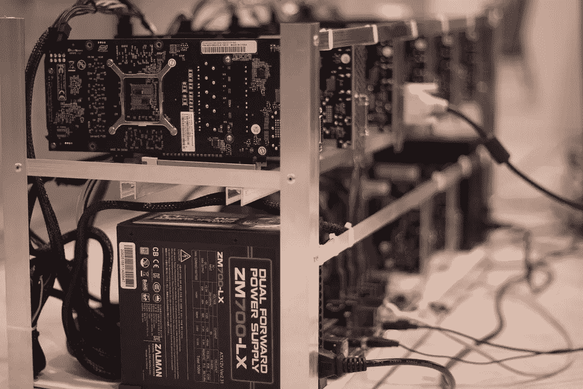

# 为什么大家突然对 ico 感兴趣了？

> 原文：<https://medium.com/hackernoon/why-is-everyone-suddenly-interested-in-icos-6c76627c73e6>

新闻、电视和报纸上都有报道。如今，几乎每个人都想加入首次公开募股(ICO)的宣传行列。

区块链投资近年来蓬勃发展。随着投资者成为即时百万富翁，没有人否认加密货币的巨大吸引力和利润丰厚的吸引力。想想看:2010 年价值 1000 美元的比特币去年价值 3500 万美元。谁不想参加呢？许多公司认识到了真正的机会——有些公司甚至认为不适应最新趋势是不可饶恕的大罪，这些“注定要失败的”组织以后会成为其他公司的前车之鉴。

# **冒险进入隐蔽处**

雅达利(Atari)和 Vapor Group 等公司正在从核心业务部门向加密货币领域拓展。[雅达利](https://arstechnica.com/gaming/2018/02/atari-stock-jumps-52-on-plans-for-nostalgia-backed-cryptocurrencies/)，以生产视频游戏“Pong”和雅达利 2600 而闻名，最近透露它正在从事基于加密货币的“雅达利令牌”平台。这一举动让不少人感到惊讶，但对于这家陷入困境的公司来说，这似乎是合乎逻辑的。

消息传出后，[雅达利股份有限公司](https://www.atari.com/) ( [EPA:ATA](https://finance.google.com/finance?q=atari&ei=BGmHWuDKMNSP0AS-gJS4Ag) )的股价飙升了 52%——这对雅达利来说是一剂急需的强心针。董事长兼首席执行官弗雷德里克·切斯奈斯认为此举是合理的。

“鉴于我们在开发工作室的技术优势，以及雅达利品牌的全球声誉，我们有机会在这个领域吸引人地定位自己，”他说。

雅达利补充说，雅达利令牌将用于其平台上的各种数字娱乐。

Large scale crypto mining requires numerous machines.

另一方面，[Vapor Group](http://www.vaporgroup.com/about-us.html)([OTC Pink:VPOR](https://finance.yahoo.com/quote/VPOR))因销售电子烟、蒸发器和电子液体而出名。现在，该公司已经冒险进入加密采矿，这是加密货币行业尚未饱和的一个领域。它大张旗鼓地宣布了这一举措，自去年 12 月以来收购了 35 台最先进的加密采矿机。

这些机器是一项重大投资，因为公司总裁 Yaniv Nahon 表示，这将使他们有能力挖掘 99%的现有加密货币。由于 Vapor Group 业务的这一新领域，该公司推出了 CryptoTechCurrency，Inc .，该公司将专注于加密挖掘，以实现不间断运营。

尽管有了新的合资企业，Vapor Group 已经凭借其两款产品 Easy Grinder 和 Royal CBD 的成功，在 2017 年[取得了 50 万美元的收入。随着加密技术货币的到位，2018 年的收益预计将好于去年。](https://born2invest.com/articles/vapor-group-inc-might-breakout-penny-stock-youve-looking-2018/)

其他进入加密货币的公司有柯达、长岛冰茶和猫头鹰餐厅。

# **持续增长**

行业内的机会似乎是无穷无尽的。[全球区块链技术公司](https://globalblockchain.io/) ( [TSXV:BLOC。V](https://finance.yahoo.com/quote/BLOC.V/) ， [OTC:BLKCF](https://finance.yahoo.com/quote/BLKCF?p=BLKCF) )最近推出，它包含了两个世界的精华:区块链和投资组合。

Steven Nerayoff 创建了 Global Blockchain，如果他的名字听起来耳熟，那是因为他负责了 1000 亿美元的以太坊项目。全球区块链的主要目标很简单——为新开采的货币提供资金，以换取股权和相当比例的创始人代币。

对于加密货币新手来说，关于全球区块链，Nerayoff 这个名字应该足够保证了。除了以太坊项目(其价值自成立以来增长了 357，000%)之外，他还担任 Lisk 加密货币项目的顾问，该项目目前的市值为 20 亿美元。

加入他的还有业界中坚力量，如 Rick Willard(硅谷区块链协会联合创始人)、Kyle Kemper(加拿大区块链协会)、Jeff Pulver(参与 350 startups)和 Michael Terpin (Marketwire)。有一点是肯定的，这些人知道他们在做什么，他们有成功的创业作为证据。

投资者将获得前 ICO 和 ICO 代币。随着越来越多的公司在自己的平台上转向 ICO 令牌和加密货币，该领域的预期增长是巨大的。投资者还将获得只有全球区块链才能提供的令牌交易的独家信息。该公司的市值为 6400 万美元，但专家认为，由于它给行业带来的创新和无与伦比的服务，这个数字可能很快就会飙升。

当另一系列机会出现时，你会选择留下吗？选择最终是你的——但就柯达、雅达利、全球区块链和 Vapor Group 而言，加密货币炒作列车是真实的，他们不想被落在后面。